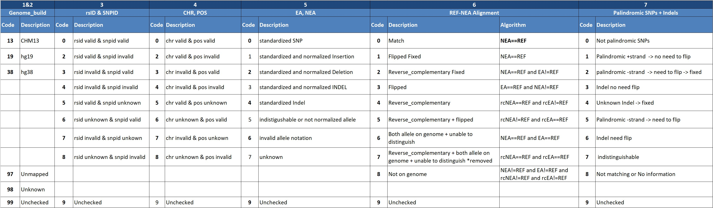

A 7-digit code:  showing the status of a variants.

Reflecting the reliability of the statistics.

Design principals:

- Tracable

- Higher value ->higer uncertainty 

| Digit | Description               |
| ----- | ------------------------- |
| 1,2   | Genome_build              |
| 3     | rsID & SNPID              |
| 4     | CHR, POS                  |
| 5     | EA, NEA                   |
| 6     | REF-NEA Alignment         |
| 7     | Palindromic SNPs + Indels |

