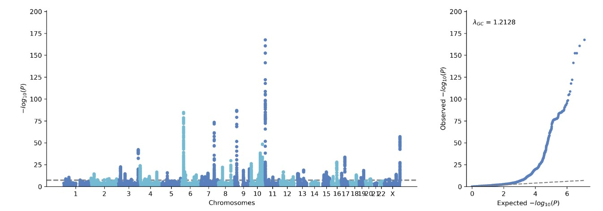

# Quick Start

## import gwaslab and load data
Using a jupyter notebook, we first import gwaslab package:

```python
import gwaslab as gl
```

The sample sumstats we use in this study: 

```bash
!wget -O t2d_bbj.txt.gz http://jenger.riken.jp/14/
```

Let's import this raw sumstats into the gwaslab Sumstats Object by specifying the necessary columns, and all data are imported as strings.
Note: you can either specify eaf (effect allele frequency) or neaf(non-effect allele frequency), if neaf is specified, it will be converted to eaf when loading sumstats.
```python
mysumstats = gl.Sumstats("t2d_bbj.txt.gz",
             snpid="SNP",
             chrom="CHR",
             pos="POS",
             ea="ALT",
             nea="REF",
             neaf="Frq",
             beta="BETA",
             se="SE",
             p="P",
             direction="Dir",
             n="N",
             build="19")
```
See details in [SumstatsObject](SumstatsObject.md).

Sumstats are loaded stored as pandas DataFrame, you can check the data by 
```
mysumstats.data

	SNPID	CHR	POS	EA	NEA	EAF	BETA	SE	P	N	DIRECTION	STATUS
0	1:725932_G_A	1	725932	G	A	0.9960	-0.0737	0.1394	0.5970	166718	-?+-	9999999
1	1:725933_A_G	1	725933	G	A	0.0040	0.0737	0.1394	0.5973	166718	+?-+	9999999
2	1:737801_T_C	1	737801	C	T	0.0051	0.0490	0.1231	0.6908	166718	+?-+	9999999
3	1:749963_T_TAA	1	749963	TAA	T	0.8374	0.0213	0.0199	0.2846	166718	-?++	9999999
4	1:751343_T_A	1	751343	T	A	0.8593	0.0172	0.0156	0.2705	166718	-?++	9999999
```

Maybe the first thing you want to check is the manhattan plot, you can do this with one line of code, gwaslab will perform a minimum QC for just the plotting. For details, please check: [https://cloufield.github.io/gwaslab/Visualization/](https://cloufield.github.io/gwaslab/Visualization/)

## quick mqq plot

```python
mysumstats.plot_mqq(skip=2)
```
`skip=2` : skip variants with -log10P<2 for plotting, which greatly improves plotting speed.



## Standardization & normalization
It is needed to check ID,CHR,POS and alleles first before any manipulations:

Simply run the following function and every thing will be checked. 

```python
mysumstats.basic_check()
```

`.basic_check()` is a wrapper of all the following basic functions, you can use these separately.

```python
mysumstats.fix_ID()
mysumstats.fix_chr()
mysumstats.fix_pos()
mysumstats.fix_allele()
mysumstats.check_sanity()
mysumstats.normalize_allele()
```
See details in [Standardization](Standardization.md).

## Fix ID

Usually we want SNPID to be in a stadardized format chr:pos:ref:alt, we can use fix_id for this:

```
mysumstats.fix_id(fixsep=True)
```

## Extract lead variants

Let's extract the lead variants in each significant loci to check our data. 

The significant loci are detected based on a sliding window (default window size: 500kb)

```python
mysumstats.get_lead(anno=True)
```

By specifying `anno=True` , gwaslab will also annotate the lead variant with its nearest gene names and distance.

**Note**: gwaslab default genome build version is `build="19"` (GRCh37/hg19), you can change it to `build="38"` (GRCh38/hg38) when needed.

```
SNPID	CHR	POS	EA	NEA	EAF	BETA	SE	P	N	DIRECTION	STATUS	LOCATION	GENE
96739	1:22068326:A:G	1	22068326	G	A	0.7550	0.0621	0.0103	1.629000e-09	191764	++++	9960099	0	USP48
213860	1:51103268:T:C	1	51103268	C	T	0.7953	-0.0802	0.0120	2.519000e-11	191764	----	9960099	0	FAF1
534095	1:154309595:TA:T	1	154309595	TA	T	0.0947	-0.0915	0.0166	3.289000e-08	191764	----	9960399	0	ATP8B2
969974	2:640986:CACAT:C	2	640986	C	CACAT	0.9006	-0.0946	0.0150	2.665000e-10	191764	----	9960399	26349	TMEM18
1091807	2:27734972:G:A	2	27734972	G	A	0.5605	0.0691	0.0088	3.897000e-15	191764	++++	9960099	0	GCKR
```

See details in [ExtractLead](https://cloufield.github.io/gwaslab/ExtractLead/).


## Customized manhattan plot

GWASlab can plot more complicated manhattan plot.

For details, please check: [https://cloufield.github.io/gwaslab/Visualization/](https://cloufield.github.io/gwaslab/Visualization/)

```python
mysumstats.plot_mqq(snpid="SNPID",mode="mqq",
                  cut=20,skip=3, eaf="EAF",
                  anno=True,anno_set=["9:22132729_A_G","6:20688121_T_A","9:22132729_A_G","15:62394264_G_C"] ,
                  pinpoint=["9:22132729_A_G","5:176513896_C_A"], 
                  highlight=["7:127253550_C_T","19:46166604_C_T"],
                  highlight_windowkb =1000,
                  stratified=True,
                  marker_size=(5,10),
                  figargs={"figsize":(15,5),"dpi":300})
```


See details in [Visualization](Visualization.md).

## Regional plot
Quick regional plot without LD-information
```
mysumstats.plot_mqq(mode="r",region=(7,156538803,157538803),region_grid=True)
```

**Note**: gwaslab default genome build version is `build="19"` (GRCh37/hg19), you can change it to `build="38"` (GRCh38/hg38) when needed.
For gene tracks, default is `gtf_path="ensembl"` , you can also use `gtf_path="refseq"` (NCBA RefSeq)


Full regional plot using a user-provided vcf 
(e.g 1000 genome, see Reference: [https://cloufield.github.io/gwaslab/Reference/)](https://cloufield.github.io/gwaslab/Reference/))

```
mysumstats.plot_mqq(mode="r",region=(7,156538803,157538803),region_grid=True,anno=True,
                    vcf_path="/Users/he/Documents/Mydata/eas_1kg_af/EAS.chr7.split_norm_af.1kgp3v5.vcf.gz")
```


## Random sampling

There are more than 10 million variants in the original sumstats and it will take long to process the entrie dataset. 
Since it might take a while to process the entire datasets, let us just random sample 1 million variants for this tutorial.

```
mysumstats.random_variants(n=100000)
```


## Harmonise the sumstats

- ref_seq : reference genome fasta file for allele alignment
- ref_rsid_tsv : tsv file for annotation of common used variants
- ref_rsid_vcf : vcf file for annotation of other variants
- ref_infer : vcf file with allele frequency information for inferring strand and comparing allele frequency 
- ref_alt_freq : field in INFO of vcf file for alternative allele frequency

For details see: [https://cloufield.github.io/gwaslab/Harmonization/](https://cloufield.github.io/gwaslab/Harmonization/)

```
mysumstats.harmonize(basic_check=False,
                    n_cores=3,
                    ref_seq="/Users/he/Documents/Mydata/human_g1k_v37.fasta",
                    ref_rsid_tsv="/Users/he/Documents/Mydata/EAS_1kg_af_dbsnp151.ALL.tsv",
                    ref_rsid_vcf="/Users/he/Documents/Mydata/All_20180423.vcf.gz",
                    ref_infer="/Users/he/Documents/Mydata/eas_1kg_af/EAS.ALL.split_norm_af.1kgp3v5.hg19.vcf.gz",ref_alt_freq="AF")
```
gwaslab will then harmonize the sumstats based on reference files. 
```
Fri Oct 21 16:05:39 2022 Start to check if NEA is aligned with reference sequence...
Fri Oct 21 16:05:39 2022  -Current Dataframe shape : 100000  x  12
Fri Oct 21 16:05:39 2022  -Reference genome fasta file: /Users/he/Documents/Mydata/human_g1k_v37.fasta
Fri Oct 21 16:05:39 2022  -Checking records: 1  2  3  4  5  6  7  8  9  10  11  12  13  14  15  16  17  18  19  20  21  22  X  Y  MT  
Fri Oct 21 16:06:11 2022  -Variants allele on given reference sequence :  41646
Fri Oct 21 16:06:11 2022  -Variants flipped :  50095
Fri Oct 21 16:06:11 2022   -Raw Matching rate :  91.74%
Fri Oct 21 16:06:11 2022  -Variants inferred reverse_complement :  0
Fri Oct 21 16:06:11 2022  -Variants inferred reverse_complement_flipped :  0
Fri Oct 21 16:06:11 2022  -Both allele on genome + unable to distinguish :  8259
Fri Oct 21 16:06:11 2022  -Variants not on given reference sequence :  0
Fri Oct 21 16:06:11 2022  -Current Dataframe shape : 100000  x  12
Fri Oct 21 16:06:12 2022 Start to flip allele-specific stats for SNPs with status xxxxx[35]x: alt->ea , ref->nea ... 
Fri Oct 21 16:06:12 2022  -Flipping 50095 variants...
Fri Oct 21 16:06:12 2022  -Swapping column: NEA <=> EA...
Fri Oct 21 16:06:12 2022  -Flipping column: BETA = - BETA...
Fri Oct 21 16:06:12 2022  -Flipping column: EAF = 1 - EAF...
Fri Oct 21 16:06:12 2022  -Flipping column: DIRECTION +-? <=> -+? ...
Fri Oct 21 16:06:13 2022  -Changed the status for flipped variants : xxxxx[35]x -> xxxxx[12]x
Fri Oct 21 16:06:13 2022 Finished converting successfully!
Fri Oct 21 16:06:13 2022 Start to infer strand for palindromic SNPs...
Fri Oct 21 16:06:13 2022  -Current Dataframe shape : 100000  x  12
Fri Oct 21 16:06:13 2022  -Reference vcf file: /Users/he/Documents/Mydata/eas_1kg_af/EAS.ALL.split_norm_af.1kgp3v5.hg19.vcf.gz
Fri Oct 21 16:06:13 2022  -Alternative allele frequency in INFO: AF
Fri Oct 21 16:06:14 2022  -Identified  14046  palindromic SNPs...
Fri Oct 21 16:06:14 2022  -After filtering by MAF<  0.4  , the strand of  12814  palindromic SNPs will be inferred...
Fri Oct 21 16:06:36 2022   -Non-palindromic :  76945
Fri Oct 21 16:06:36 2022   -Palindromic SNPs on + strand:  12456
Fri Oct 21 16:06:37 2022   -Palindromic SNPs on - strand and need to be flipped: 22
Fri Oct 21 16:06:37 2022   -Palindromic SNPs with maf not availble to infer :  1232
Fri Oct 21 16:06:37 2022   -Palindromic SNPs with no macthes or no information :  186
Fri Oct 21 16:06:38 2022  -Identified  8259  indistinguishable Indels...
Fri Oct 21 16:06:38 2022  -Indistinguishable Indels will be inferred from reference vcf ref and alt...
Fri Oct 21 16:07:11 2022   -Indels ea/nea match reference :  3520
Fri Oct 21 16:07:11 2022   -Indels ea/nea need to be flipped :  4468
Fri Oct 21 16:07:11 2022   -Indels with no macthes or no information :  271
Fri Oct 21 16:07:11 2022  -Current Dataframe shape : 100000  x  12
Fri Oct 21 16:07:12 2022 Start to flip allele-specific stats for standardized indels with status xxxx[123][67][6]: alt->ea , ref->nea ... 
Fri Oct 21 16:07:12 2022  -Flipping 4468 variants...
Fri Oct 21 16:07:13 2022  -Swapping column: NEA <=> EA...
Fri Oct 21 16:07:13 2022  -Flipping column: BETA = - BETA...
Fri Oct 21 16:07:13 2022  -Flipping column: EAF = 1 - EAF...
Fri Oct 21 16:07:13 2022  -Flipping column: DIRECTION +-? <=> -+? ...
Fri Oct 21 16:07:13 2022  -Changed the status for flipped variants xxxx[123][67]6 -> xxxx[123][67]4
Fri Oct 21 16:07:13 2022 Start to flip allele-specific stats for palindromic SNPs with status xxxxx[12]5: (-)strand <=> (+)strand ... 
Fri Oct 21 16:07:13 2022  -Flipping 22 variants...
Fri Oct 21 16:07:13 2022  -Flipping column: BETA = - BETA...
Fri Oct 21 16:07:13 2022  -Flipping column: EAF = 1 - EAF...
Fri Oct 21 16:07:13 2022  -Flipping column: DIRECTION +-? <=> -+? ...
Fri Oct 21 16:07:13 2022  -Changed the status for flipped variants:  xxxxx[012]5: ->  xxxxx[012]2
Fri Oct 21 16:07:13 2022 Finished converting successfully!
Fri Oct 21 16:07:13 2022 Start to annotate rsID based on chromosome and position information...
Fri Oct 21 16:07:13 2022  -Current Dataframe shape : 100000  x  12
Fri Oct 21 16:07:13 2022  -SNPID-rsID text file: /Users/he/Documents/Mydata/EAS_1kg_af_dbsnp151.ALL.tsv
Fri Oct 21 16:07:13 2022  -100000 rsID could be possibly fixed...
Fri Oct 21 16:07:14 2022  -Setting block size:  5000000
Fri Oct 21 16:07:14 2022  -Loading block: 0   1   2   3   4   5   6   7   8   9   10   11   12   13   14   15   16   
Fri Oct 21 16:11:57 2022  -rsID Annotation for 3250 need to be fixed!
Fri Oct 21 16:11:57 2022  -Annotated 96750 rsID successfully!
Fri Oct 21 16:11:57 2022 Start to assign rsID using vcf...
Fri Oct 21 16:11:57 2022  -Current Dataframe shape : 100000  x  13
Fri Oct 21 16:11:57 2022  -CPU Cores to use : 3
Fri Oct 21 16:11:57 2022  -Reference VCF file: /Users/he/Documents/Mydata/All_20180423.vcf.gz
Fri Oct 21 16:11:57 2022  -Assigning rsID based on chr:pos and ref:alt/alt:ref...
Fri Oct 21 16:12:18 2022  -rsID Annotation for 582 need to be fixed!
Fri Oct 21 16:12:18 2022  -Annotated 2668 rsID successfully!
Fri Oct 21 16:12:18 2022 Start to sort the genome coordinates...
Fri Oct 21 16:12:18 2022  -Current Dataframe shape : 100000  x  13
Fri Oct 21 16:12:18 2022  -Force converting POS to integers...
Fri Oct 21 16:12:18 2022  -Sorting genome coordinates...
Fri Oct 21 16:12:18 2022 Finished sorting genome coordinates successfully!
Fri Oct 21 16:12:18 2022 Start to reorder the columns...
Fri Oct 21 16:12:18 2022  -Current Dataframe shape : 100000  x  13
Fri Oct 21 16:12:18 2022  -Reordering columns to    : SNPID,rsID,CHR,POS,EA,NEA,EAF,BETA,SE,P,N,DIRECTION,STATUS
Fri Oct 21 16:12:18 2022 Finished sorting columns successfully!
```

## Sumstats summary
You can check the summary of your sumstats by:

```
mysumstats.summary()
```

## Format and Output
You can then foremat your sumstats and output.

gwaslab support commonly used formats. For details see: [https://cloufield.github.io/gwaslab/Format/](https://cloufield.github.io/gwaslab/Format/)
```
mysumstats.to_format("clean_sumstats",fmt="ldsc")
```

-------------

## Liftover

```python
mysumstats.liftover(n_cores=1,from_build="19", to_build="38")
```

Gwaslab only liftover CHR and POS, and when lifted, the last two digits status code will be rolled back to 99. Since for difference reference genome, the reference allele or strand might be reverse, so it is need to align and check agin. 

See details in [Harmonization](Harmonization.md).
