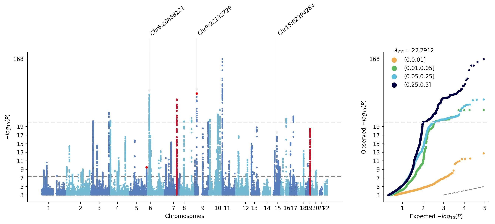
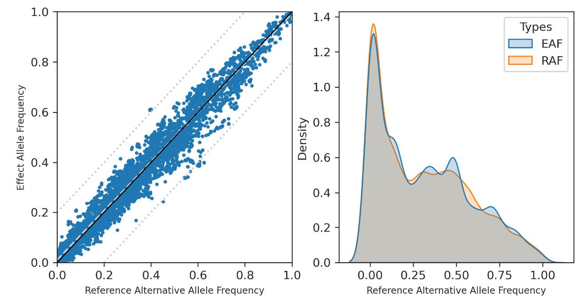

# Quick Start

Using a jupyter notebook, we first import gwaslab package:

```python
import gwaslab as gl
```

The sample sumstats we use in this study: 

```bash
!wget -O t2d_bbj.txt.gz http://jenger.riken.jp/14/
```

Let's import this raw sumstats into the gwaslab Sumstats Object by specifying the necessary columns, and all data are imported as strings.
Note: you can either specify eaf (effect allele frequency) or neaf(non-effect allele frequency), if neaf is specified, it will be converted to eaf when loading sumstats.
```python
mysumstats = gl.Sumstats("t2d_bbj.txt.gz",
             snpid="SNP",
             chrom="CHR",
             pos="POS",
             ea="ALT",
             nea="REF",
             neaf="Frq",
             beta="BETA",
             se="SE",
             p="P",
             direction="Dir",
             n="N",
             build="19")
```
See details in [SumstatsObject](SumstatsObject.md).

Maybe the first thing you want to check is the manhattan plot, you can do this with one line of code, gwaslab will perform a minimum QC for just the plotting.

```python
mysumstats.plot_mqq()
```


# Sanity check

Looks good, but we need to perform QC to make sure there are no unexpected errors, let's check the statitsics first.

```
mysumstats.check_sanity()
```

## Filtering

There are more than 10 million variants in the original sumstats and it will take long to process the entrie dataset. 

So, let's just filter-in (include) variants with P<0.00005 and filter-out (exclude) variants on ChrX.  This could also be used for filtering other columns like INFO,N and so forth if you need. 

```python
mysumstats.filter_out(gt={"P":0.005},eq={"CHR":"X"})
```

See details in [QC&Filtering](QC&Filtering.md).

## Standardization & normalization
It is also needed to check ID,CHR,POS and alleles:

simply run:

```python
mysumstats.basic_check()
```

`.basic_check()` is a wrapper of all the following basic functions, you can use these separately.

```python
mysumstats.fix_ID()
mysumstats.fix_chr()
mysumstats.fix_pos()
mysumstats.fix_allele()
mysumstats.check_sanity()
mysumstats.normalize_allele()
```
See details in [Standardization](Standardization.md).
## 


## Extract lead variants

Let's extract the lead variants in each significant loci to check our data. 

The significant loci are detected based on a sliding window (default window size: 500kb)

```python
mysumstats.get_lead()
```

See details in [ExtractLead](ExtractLead.md).


## Customized manhattan plot

GWASlab can plot more complicated manhattan plot: (not finished yet)

```python
mysumstats.plot_mqq(snpid="SNPID",mode="mqq",
                  cut=20,skip=3, eaf="EAF",
                  anno=True,anno_set=["9:22132729_A_G","6:20688121_T_A","9:22132729_A_G","15:62394264_G_C"] ,
                  pinpoint=["9:22132729_A_G","5:176513896_C_A"], 
                  highlight=["7:127253550_C_T","19:46166604_C_T"],
                  highlight_windowkb =1000,
                  stratified=True,
                  marker_size=(5,10),
                  figargs={"figsize":(15,5),"dpi":300})
```



See details in [Visualization](Visualization.md).

## 

## Harmonise the sumstats

### All-in-one function

After checking the basics of the sumstats, next we may need to harmonise the sumstats for downstream analysis. 

For harmonization, we need reference files fasta and vcf. 

We will just check chr3 to save time.
```python
mysumstats.filter_in(eq={"CHR":"3"})

mysumstats.clean( basic_check=False,
                  ref_seq="./human_g1k_v37.fasta",
                  ref_rsid="./00-All.vcf.gz",
                  ref_infer="./EAS.chr3.split_norm_af.vcf.gz",
                  ref_alt_freq="AF")
```
- `ref_seq` : reference genome sequence in fasta format for alignment
- `ref_rsid` : reference vcf for rsID annotation
- `ref_infer` : reference vcf for strand inferring (require allele frequency in INFO filed.)
- `ref_alt_freq` : key word for alternative allele frequency in the reference vcf file.
---------

Some available and reliable reference files:

1. reference genome sequence fasta file. (For example, in the tutorial, hg19 reference sequence [human_g1k_v37.fasta.gz](http://ftp.1000genomes.ebi.ac.uk/vol1/ftp/technical/reference/human_g1k_v37.fasta.gz)  from http://ftp.1000genomes.ebi.ac.uk/vol1/ftp/technical/reference/ will be used)

2. reference vcf file for rsID annotation (For example: https://ftp.ncbi.nih.gov/snp/organisms/human_9606_b151_GRCh37p13/VCF/00-All.vcf.gz )

3. reference vcf for allele frequency (can be the same as 2, for example from 1KG [Index of /vol1/ftp/release/20130502/](http://ftp.1000genomes.ebi.ac.uk/vol1/ftp/release/20130502/) (manipulation of the vcf is needed, see [Reference](Reference.md)) or gnomad).

See details in [Reference](Reference.md).

.harmonise() is basically a wrapper of the following functions.

```
mysumstats.basic_check()
mysumstats.check_ref()
mysumstats.flip_allele_stats()
mysumstats.infer_strand()
```

See details in [Harmonization](Harmonization.md).

-----

### Align with reference genome

let's then align the NEA (non-effect allele) with reference sequence from a fasta file.  

```python
mysumstats.check_ref(ref_path = "./human_g1k_v37.fasta.gz")
```

In this case,  the hg19 reference genome was downloaded from 1KG.

### Filp allele-specific statistics

Gwaslab will check the status code and flip only those needed.

```python
mysumstats.flip_allele_stats()
```

### Annotate rsID

Gwaslab can annotate the vairant with rsID using a reference vcf. 

For this purpose, we use the vcf file provided by dbsnp. (In this tutorial, b151/hg19 version was used)

```python
mmysumstats.flip_allele_stats(path="./00-All.vcf.gz")
```

### Infer strand for palindromic SNPs and check ref allele for indels

After the alignment with reference genome sequence, next we try to infer the strand of palindromic SNPs and also check the ref allele for indels.


Note: GWASLab will only infer the strand for those that are already aligned with reference genome.
```python
mysumstats.infer_strand(ref_infer="./EAS.chr3.split_norm_af.vcf.gz",
                        ref_alt_freq="AF")
```

See details in [Reference](Reference.md) on how to process the 1000 genome raw vcf.

### Filp allele-specific statistics again for palindromic SNPs and indels

Gwaslab will check the status code and flip only those needed.

```python
mysumstats.flip_allele_stats()
```

-------

## Check difference in allele frequency

After aligment and correct strands for panlindromic SNPs, you may want to double check the differences in allele frequency between the EAF from sumstats and ALT allele frequency in a reference vcf  (For example ,1000 genome) 

See details in [Reference](Reference.md) on how to process the 1000 genome raw vcf.

You can simply use .check_af() to check the difference in allele frequencies:

eaf - aaf = daf


```python

mysumstats.check_af(ref_infer="./EAS.chr3.split_norm_af.vcf.gz",ref_alt_freq="AF")
```

After checking, use plot_daf() to visualize the results. It will generate two figures: 1. a scatter plot 2. a distribution plot.
### Plot DAF

```
mysumstats.plot_daf()
```


-------------

## Liftover

```python
mysumstats.liftover(n_cores=1,from_build="19", to_build="38")
```

Gwaslab only liftover CHR and POS, and when lifted, the last two digits status code will be rolled back to 99. Since for difference reference genome, the reference allele or strand might be reverse, so it is need to align and check agin. 

See details in [Harmonization](Harmonization.md).
