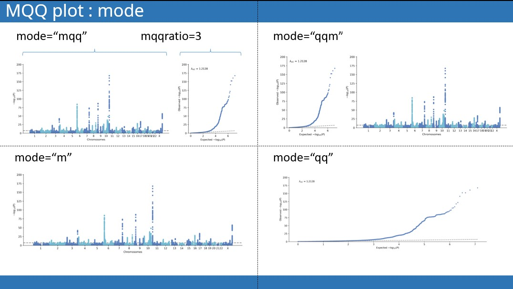
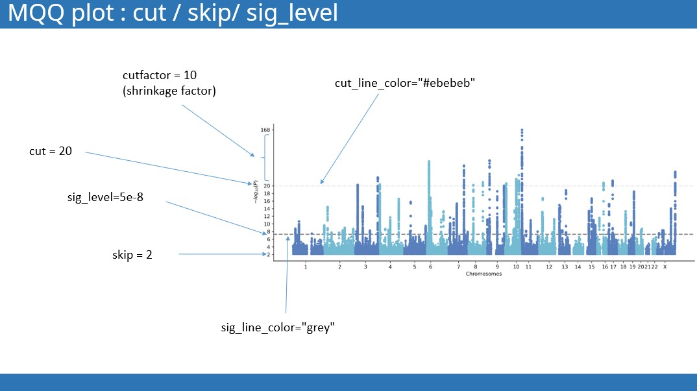

## Manhattan plot and QQ plot : plot_mqq()

```
import gwaslab as gl

mydata = gl.Sumstats(....)

mydata.plot_mqq(
          mlog10p="MLOG10P",
          scaled=False,
          mode="mqq",
          mqqratio=3,
          windowsizekb=500,
          anno=None,
          anno_set=[],
          anno_alias={},
          anno_d={},
          arm_offset=50,
          arm_scale=1,
          cut=0,
          skip=0,
          cutfactor=10,
          cut_line_color="#ebebeb",  
          sig_level=5e-8,
          sig_line_color="grey",
          suggestive_sig_level=5e-6,
          highlight = [],
          highlight_color="#CB132D",
          highlight_windowkb = 500,
          pinpoint=[],
          pinpoint_color ="red",
          stratified=False,
          maf_bins=[(0, 0.01), (0.01, 0.05), (0.05, 0.25),(0.25,0.5)],
          maf_bin_colors = ["#f0ad4e","#5cb85c", "#5bc0de","#000042"],
          gc=True,
          title =None,
          mtitle=None,
          qtitle=None,
          figargs= {"figsize":(15,5),"dpi":100},
          fontsize = 10,
          colors=["#597FBD","#74BAD3"],
          marker_size=(5,25),
          use_rank=False,
          verbose=True,
          repel_force=0.03,
          build="19",
          title_pad=1.08, 
          save=None,
          saveargs={"dpi":400,"facecolor":"white"},
          ):
```

### 

### Manhattan and QQ plot layout

`mode` : determine the layout of manhattan plot and qq plot.

`"mqq" `or `"qqm" `: side-by-side manhattan and QQ plt. 

- `mqq`: left manhatan, right QQ
- `qqm`: left QQ , right manhatan
- `"m"`: only manhattan plot
- `"qq"`: only qq plot
  
`mqqratio`: width ratio


----------------------------------------------------------------

### Skip "low" and shrink "high"

- `skip` : sometimes it is not necessary to plot all variants, we can skip the insignicant variants . For example, we can exclude varints with -log10p lower than 3 from the plot by specifying `skip=3`
- `cut` : loci with extremly large -log10(P) value are very likely to dwarf other significant loci , so we want to scale down the extrame loci from a certain threshold. 
- `cutfactor`:  shrinkage factor, default is 10 
- `cut_line_color`: the color of the line above which y axis is rescaled 



----------------------------------------------------------------

### Annotation
* `anno`: `boolean` or `string` or `"GENENAME"`   
    * `boolean`: `anno = True`,  the variants to annotate will be selected automatically using a sliding window with `windowsize=500`kb. chr:pos
    * `string`: the column name used for annotation
    * `"GENENAME"` : automatically annotate nrearest gene names, using pyensembl. (remember to specify `build`, default is `build="19"`)
* `repel_force` : when the annotation overlaps with other, try increasing the repel_force to increase the padding between annotations.
* `anno_set `: if you want to annotate only a few specific variants, you can simply provide a list of SNPIDs. 
* `anno_alias` : snpid:text dictionary for customized annotation

#### example:
`mysumstats.plot_mqq(skip=3,anno=True)`


`mysumstats.plot_mqq(skip=3,anno="GENENAME",build="19")`


`mysumstats.plot_mqq(skip=3, anno_set=["rs12509595","19:15040733:T:C"])`


`mysumstats.plot_mqq(skip=3, anno_set=["rs12509595","19:15040733:T:C"], anno_alias={"rs12509595":"anything you want here"})`


----------------------------------------------------------------

### Highlight specified loci

Highlight specified loci. 
- `highlight ` : specify the lead variants of loci for highlighting.
- `highlight_color`: specify the color ussed for highlighting.
- `highlight_windowkb` : specify the span of highlighted region (deault: `highlight_windowkb = 500` kp)

### Pinpoint specified variants

Pinpoint certain variants in the manhattan plot.
- `pinpoint` : a list of SNPIDs
- `pinpoint_color` : color for pinpoint

```
mysumstats.plot_mqq(skip=3,anno="GENENAME",build="19",
                   highlight=["rs12509595","rs7989823"],
                   pinpoint=["rs671","19:15040733:T:C"])
```

----------------------------------------------------------------

### Maf-stratified QQ plot

`stratified`: If True, plot MAF straitified QQ plot.

`maf_bins`: maf bins for straitification.

`maf_bin_colors`: colors used for each bin.
----------------------------------------------------------------

### Use rank or POS

`use_rank`: if True, use the rank instead of real base pair position.

use simply rank and basepair position to draw the x axis.

### Colors and fonts

----------------------------------------------------------------

## Quick plot

```
mysumstatsysumstats.plot_mqq()
```

## Customized plot

```
mysumstats.plot_mqq(snpid="SNPID",mode="mqq",
                  cut=20,skip=3, eaf="EAF",
                  anno=True,anno_set=["9:22132729_A_G","6:20688121_T_A","9:22132729_A_G","15:62394264_G_C"] ,
                  pinpoint=["9:22132729_A_G","5:176513896_C_A"], 
                  highlight=["7:127253550_C_T","19:46166604_C_T"],
                  highlight_windowkb =1000,
                  stratified=True,
                  marker_size=(5,10),
                  figargs={"figsize":(15,5),"dpi":300})
```
