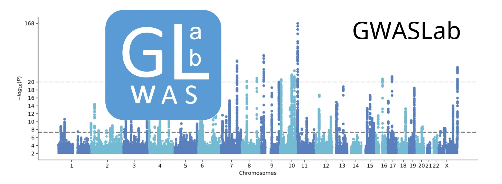

# GWASLAB

Gwaslab : a simple python package for handling GWAS sumstats.

Each process is modularized and can be customized to your needs.

Most manipulations are designed as methods of python object, `gwaslab.Sumstats`.

```python
import gwaslab as gl
mysumstats = gl.Sumstats("t2d_bbj.txt.gz",
             snpid="SNP",
             chrom="CHR",
             pos="POS",
             ea="ALT",
             nea="REF",
             neaf="Frq",
             beta="BETA",
             se="SE",
             p="P",
             direction="Dir",
             n="N",
             build="19")
mysumstats.plot_mqq()
...
```

## Functions

### Standardization, Normalization & Harmonization

- CHR and POS notation standardization

- Variant POS and allele normalization

- Genome build : Liftover

- Reference allele alignment using a reference genome sequence

- rsID assignment based on CHR, POS, REF and ALT

- CHR POS assignment based on rsID using a reference VCF

- Palindromic SNPs and indels strand inference using a reference VCF

- Check allele frequency discrepancy using a reference VCF

### Quality control, Value conversion & Filtering

- Statistics sanity check

- Equivalent statistics conversion
  
  - BETA/SE , OR/OR_95L/OR_95U
  
  - P, Z, CHISQ, MLOG10

- Extract/exclude hapmap3 variants 

- Extract/exclude MHC variants

- Filtering values.

### Visualization

- Mqq plot : Manhattan plot and QQ plot side by side

- Heatmap : ldsc-rg genetic correlation matrix

- Scatter Plot : variant effect size comparison with sumstats

- Scatter Plot : allele frequency comparison 

### Other Utilities

- Read ldsc h2 or rg outputs directly as DataFrames

- Extract lead SNPs given a window size

- Logging : keep a complete record of manipulations from raw data to munged data

- Formating GWAS sumstats in certain formats:
  - Manually curated format coversion dictionary : https://github.com/Cloufield/formatbook
  - Support (coming soon) LDSC / MAGMA / METAL / MR-MEGA / FUMA / PLINK / PLINK2 / GWAS-SSF / PGS-Catalog / GWAS-Catalog ...

## Install

Stable version:
```
pip install gwaslab==3.0.1
```
Also need to install pyvcf
```
conda install -c conda-forge pyvcf 
```

Latest beta version:
```
git clone https://github.com/Cloufield/gwaslab.git
```
when using, just insert the path to your env path:
```
import sys
gwaslab_path="xxx"
sys.path.insert(0,gwaslab_path)
import gwaslab as gl
```

### Requirements:

- Python3
- pyVCF 0.6.8
- Biopython 1.79
- liftover 1.1.13
- pandas  1.2.4
- numpy  1.21.2
- matplotlib>3.5
- seaborn 0.11.1
- scipy 1.6.2

## Reference sources

UCSC reference files: https://hgdownload.soe.ucsc.edu/downloads.html#human

1000 Genome Phase3 vcf files: http://ftp.1000genomes.ebi.ac.uk/vol1/ftp/

gnomAD vcf files:  https://gnomad.broadinstitute.org/downloads

dbSNP vcf files: https://ftp.ncbi.nih.gov/snp/

## Contacts

https://github.com/Cloufield/gwaslab

## Update log

v3.0.1 added nea, renamed clean to harmonise

v3.0.0 complete pipeline

v2.0.0 added sumstats QC pipepline.
