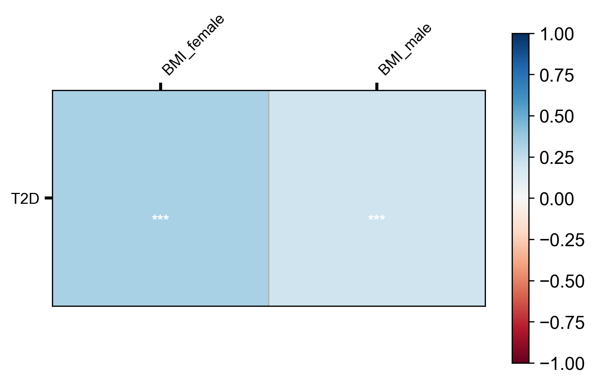

# LDSC in gwaslab

!!! example
    ```python
    import gwaslab as gl
    ```

!!! example
    ```python
    gl.show_version()
    ```

**stdout:**
```
2025/12/26 11:46:12 GWASLab v4.0.0 https://cloufield.github.io/gwaslab/
2025/12/26 11:46:12 (C) 2022-2025, Yunye He, Kamatani Lab, GPL-3.0 license, gwaslab@gmail.com
2025/12/26 11:46:12 Python version: 3.12.0 | packaged by conda-forge | (main, Oct  3 2023, 08:43:22) [GCC 12.3.0]
```

## Loading and filter in only Hapmap3 SNPs

!!! example
    ```python
    t2d = gl.Sumstats("../0_sample_data/t2d_bbj.txt.gz",
                 snpid="SNP",
                 chrom="CHR",
                 pos="POS",
                 ea="ALT",
                 nea="REF",
                 beta="BETA",
                 se="SE",
                 p="P",
                 direction="Dir",
                 build="19",             
                 n="N", verbose=False)
    t2d.basic_check(verbose=False)
    ```

| SNPID | CHR | POS | EA | NEA | STATUS | BETA | SE | P | DIRECTION | N |
| --- | --- | --- | --- | --- | --- | --- | --- | --- | --- | --- |
| 1:725932_G_A | 1 | 725932 | G | A | 1960099 | -0.0737 | 0.1394 | 0.5970 | -?+- | 166718 |
| 1:725933_A_G | 1 | 725933 | G | A | 1960099 | 0.0737 | 0.1394 | 0.5973 | +?-+ | 166718 |
| 1:737801_T_C | 1 | 737801 | C | T | 1960099 | 0.0490 | 0.1231 | 0.6908 | +?-+ | 166718 |
| 1:749963_T_TAA | 1 | 749963 | TAA | T | 1960399 | 0.0213 | 0.0199 | 0.2846 | -?++ | 166718 |
| 1:751343_T_A | 1 | 751343 | T | A | 1960099 | 0.0172 | 0.0156 | 0.2705 | -?++ | 166718 |
| ... | ... | ... | ... | ... | ... | ... | ... | ... | ... | ... |
| X:154874837_A_G | 23 | 154874837 | G | A | 1960099 | -0.0064 | 0.0117 | 0.5840 | -+-+ | 191764 |
| X:154875192_GTACTC_G | 23 | 154875192 | GTACTC | G | 1960399 | 0.0071 | 0.0122 | 0.5612 | +-+- | 191764 |
| X:154879115_A_G | 23 | 154879115 | G | A | 1960099 | -0.0070 | 0.0122 | 0.5646 | -+-+ | 191764 |
| X:154880669_T_A | 23 | 154880669 | T | A | 1960099 | 0.0071 | 0.0122 | 0.5618 | +-+- | 191764 |
| X:154880917_C_T | 23 | 154880917 | C | T | 1960099 | 0.0072 | 0.0122 | 0.5570 | +-+- | 191764 |

!!! example
    ```python
    t2d.filter_hapmap3(inplace=True)
    ```

**stdout:**
```
2025/12/26 11:47:07  -Genomic coordinates are based on GRCh37/hg19...
2025/12/26 11:47:07 Start to extract HapMap3 SNPs ...(v4.0.0)
2025/12/26 11:47:07  -Loading Hapmap3 variants from built-in datasets...
2025/12/26 11:47:08  -Since rsID not in sumstats, CHR:POS( build 19) will be used for matching...
2025/12/26 11:47:10  -Checking if alleles are same...
2025/12/26 11:47:10  -Variants with macthed alleles: 1092430
2025/12/26 11:47:10  -Raw input contains 1092430 Hapmap3 variants based on CHR:POS...
2025/12/26 11:47:10 Finished extracting HapMap3 SNPs.
```

## Heritability estimation

!!! example
    ```python
    # available since v3.4.39
    t2d.estimate_h2_by_ldsc(ref_ld_chr = "/home/yunye/tools/ldsc/ldscores/eas_ldscores/", 
                             w_ld_chr = "/home/yunye/tools/ldsc/ldscores/eas_ldscores/")
    ```

**stdout:**
```
2025/12/26 11:47:11  -Genomic coordinates are based on GRCh37/hg19...
2025/12/26 11:47:11 Start to extract HapMap3 SNPs ...(v4.0.0)
2025/12/26 11:47:11  -Current Dataframe shape : 1092430 x 12 ; Memory usage: 105.20 MB
2025/12/26 11:47:11  -Loading Hapmap3 variants from built-in datasets...
2025/12/26 11:47:11  -rsID will be used for matching...
2025/12/26 11:47:12  -Raw input contains 1213752 Hapmap3 variants based on rsID...
2025/12/26 11:47:12  -Checking if alleles are same...
2025/12/26 11:47:13  -Filtered 0 Hapmap3 variants due to unmatech alleles...
2025/12/26 11:47:13 Finished extracting HapMap3 SNPs.
2025/12/26 11:47:13 Start to run LD score regression ...(v4.0.0)
2025/12/26 11:47:13  -Current Dataframe shape : 1213752 x 13 ; Memory usage: 125.56 MB
2025/12/26 11:47:13  -Run single variate LD score regression:
2025/12/26 11:47:13   -Adopted from LDSC source code: https://github.com/bulik/ldsc
2025/12/26 11:47:13   -Please cite LDSC: Bulik-Sullivan, et al. LD Score Regression Distinguishes Confounding from Polygenicity in Genome-Wide Association Studies. Nature Genetics, 2015.
2025/12/26 11:47:13  -Arguments:
2025/12/26 11:47:13   -ref_ld_chr:/home/yunye/tools/ldsc/ldscores/eas_ldscores/
2025/12/26 11:47:13   -w_ld_chr:/home/yunye/tools/ldsc/ldscores/eas_ldscores/
2025/12/26 11:47:14  -LDSC log:
2025/12/26 11:47:14   -Reading reference panel LD Score from /home/yunye/tools/ldsc/ldscores/eas_ldscores/[1-22] ... (ldscore_fromlist)
2025/12/26 11:47:15   -Read reference panel LD Scores for 1208050 SNPs.
2025/12/26 11:47:15   -Removing partitioned LD Scores with zero variance.
2025/12/26 11:47:15   -Reading regression weight LD Score from /home/yunye/tools/ldsc/ldscores/eas_ldscores/[1-22] ... (ldscore_fromlist)
2025/12/26 11:47:16   -Read regression weight LD Scores for 1208050 SNPs.
2025/12/26 11:47:16   -After merging with reference panel LD, 1079390 SNPs remain.
2025/12/26 11:47:17   -After merging with regression SNP LD, 1079390 SNPs remain.
2025/12/26 11:47:17   -Using two-step estimator with cutoff at 30.
2025/12/26 11:47:17  -Results have been stored in .ldsc_h2
2025/12/26 11:47:17  -Current Dataframe shape : 1213752 x 14 ; Memory usage: 134.82 MB
2025/12/26 11:47:17 Finished running LD score regression.
```

!!! example
    ```python
    t2d.ldsc_h2
    ```

| h2_obs | h2_se | Lambda_gc | Mean_chi2 | Intercept | Intercept_se | Ratio | Ratio_se | Catagories |
| --- | --- | --- | --- | --- | --- | --- | --- | --- |
| 0.10394433 | 0.00650644 | 1.32982693 | 1.49125406 | 1.09147712 | 0.01056279 | 0.18621142 | 0.02150169 | NA |

## Genetic correlation

!!! example
    ```python
    bmi_female = gl.Sumstats("../0_sample_data/bbj_bmi_female.txt.gz",fmt="auto",ea="REF",nea="ALT",rsid="SNP",n=70000, sep="\t",build="19",verbose=False)
    bmi_male = gl.Sumstats("../0_sample_data/bbj_bmi_male.txt.gz",fmt="auto",ea="REF",nea="ALT",rsid="SNP",n=80000,sep="\t",build="19",verbose=False)
    ```

- other_traits : a list of gl.Sumstats object
- rg : alias for each trait including the main trait

!!! example
    ```python
    # available since v3.4.39
    t2d.estimate_rg_by_ldsc(other_traits=[bmi_female,bmi_male], 
                                   rg="T2D,BMI_female,BMI_male",
                                   ref_ld_chr = "/home/yunye/tools/ldsc/ldscores/eas_ldscores/", 
                                   w_ld_chr = "/home/yunye/tools/ldsc/ldscores/eas_ldscores/")
    ```

**stdout:**
```
2025/12/26 11:47:32  -Genomic coordinates are based on GRCh37/hg19...
2025/12/26 11:47:32 Start to extract HapMap3 SNPs ...(v4.0.0)
2025/12/26 11:47:32  -Current Dataframe shape : 1092430 x 12 ; Memory usage: 105.20 MB
2025/12/26 11:47:32  -Loading Hapmap3 variants from built-in datasets...
2025/12/26 11:47:33  -rsID will be used for matching...
2025/12/26 11:47:34  -Raw input contains 1213752 Hapmap3 variants based on rsID...
2025/12/26 11:47:34  -Checking if alleles are same...
2025/12/26 11:47:35  -Filtered 0 Hapmap3 variants due to unmatech alleles...
2025/12/26 11:47:35 Finished extracting HapMap3 SNPs.
2025/12/26 11:47:35 Start to run LD score regression for genetic correlation ...(v4.0.0)
2025/12/26 11:47:35  -Current Dataframe shape : 1213752 x 13 ; Memory usage: 125.56 MB
2025/12/26 11:47:35  -Run cross-trait LD score regression:
2025/12/26 11:47:35   -Adopted from LDSC source code: https://github.com/bulik/ldsc
2025/12/26 11:47:35   -Please cite LDSC: Bulik-Sullivan, B., et al. An Atlas of Genetic Correlations across Human Diseases and Traits. Nature Genetics, 2015.
2025/12/26 11:47:35  -Arguments:
2025/12/26 11:47:35   -rg:T2D,BMI_female,BMI_male
2025/12/26 11:47:35   -ref_ld_chr:/home/yunye/tools/ldsc/ldscores/eas_ldscores/
2025/12/26 11:47:35   -w_ld_chr:/home/yunye/tools/ldsc/ldscores/eas_ldscores/
2025/12/26 11:47:35  -Processing sumstats with alias BMI_female (Study_1)
2025/12/26 11:47:36  -Processing sumstats with alias BMI_male (Study_1)
2025/12/26 11:47:36  -LDSC log:
2025/12/26 11:47:36   -Reading reference panel LD Score from /home/yunye/tools/ldsc/ldscores/eas_ldscores/[1-22] ... (ldscore_fromlist)
2025/12/26 11:47:37   -Read reference panel LD Scores for 1208050 SNPs.
2025/12/26 11:47:37   -Removing partitioned LD Scores with zero variance.
2025/12/26 11:47:37   -Reading regression weight LD Score from /home/yunye/tools/ldsc/ldscores/eas_ldscores/[1-22] ... (ldscore_fromlist)
2025/12/26 11:47:38   -Read regression weight LD Scores for 1208050 SNPs.
2025/12/26 11:47:39   -After merging with reference panel LD, 1079390 SNPs remain.
2025/12/26 11:47:39   -After merging with regression SNP LD, 1079390 SNPs remain.
2025/12/26 11:47:39   -Computing rg for phenotype 2/3
2025/12/26 11:47:40   -Read summary statistics for 5961600 SNPs.
2025/12/26 11:47:44   -After merging with summary statistics, 1021957 SNPs remain.
2025/12/26 11:47:45   -1021957 SNPs with valid alleles.
2025/12/26 11:47:45   -Heritability of phenotype 1
2025/12/26 11:47:45   -Total Observed scale h2: 0.09687973 (0.00885768)
                       -Lambda GC: 1.34889231
                       -Mean Chi^2: 1.50928684
                       -Intercept: 1.12024032 (0.02516315)
                       -Ratio: 0.23609547 (0.04940861)
2025/12/26 11:47:45   -Heritability of phenotype 2/3
2025/12/26 11:47:45   -Total Observed scale h2: 0.19319917 (0.01213263)
                       -Lambda GC: 1.2537503
                       -Mean Chi^2: 1.31732059
                       -Intercept: 1.0306093 (0.01022627)
                       -Ratio: 0.09646175 (0.03222695)
2025/12/26 11:47:45   -Genetic Covariance
2025/12/26 11:47:45   -Total Observed scale gencov: 0.04387074 (0.00729069)
                       -Mean z1*z2: 0.12628027
                       -Intercept: 0.01918354 (0.00945413)
2025/12/26 11:47:45   -Genetic Correlation
2025/12/26 11:47:45   -Genetic Correlation: 0.32066816 (0.06227918)
                       -Z-score: 5.14888223
                       -P: 2.62043342e-07

2025/12/26 11:47:45   -Computing rg for phenotype 3/3
2025/12/26 11:47:46   -Read summary statistics for 5961600 SNPs.
2025/12/26 11:47:50   -After merging with summary statistics, 1021957 SNPs remain.
2025/12/26 11:47:51   -1021957 SNPs with valid alleles.
2025/12/26 11:47:51   -Heritability of phenotype 3/3
2025/12/26 11:47:51   -Total Observed scale h2: 0.17595184 (0.01138382)
                       -Lambda GC: 1.25741577
                       -Mean Chi^2: 1.34453038
                       -Intercept: 1.04768706 (0.01071735)
                       -Ratio: 0.13841176 (0.03110712)
2025/12/26 11:47:51   -Genetic Covariance
2025/12/26 11:47:51   -Total Observed scale gencov: 0.02739806 (0.00705736)
                       -Mean z1*z2: 0.07617508
                       -Intercept: 0.00535343 (0.0118926)
2025/12/26 11:47:51   -Genetic Correlation
2025/12/26 11:47:51   -Genetic Correlation: 0.20984874 (0.06008801)
                       -Z-score: 3.49235659
                       -P: 0.00047878

2025/12/26 11:47:51 Summary of Genetic Correlation Results
 p1         p2       rg       se        z            p   h2_obs  h2_obs_se   h2_int  h2_int_se  gcov_int  gcov_int_se
T2D BMI_female 0.320668 0.062279 5.148882 2.620433e-07 0.193199   0.012133 1.030609   0.010226  0.019184     0.009454
T2D   BMI_male 0.209849 0.060088 3.492357 4.787786e-04 0.175952   0.011384 1.047687   0.010717  0.005353     0.011893

2025/12/26 11:47:51  -Results have been stored in .ldsc_rg
2025/12/26 11:47:51 Finished running LD score regression for genetic correlation.
```

| p1 | p2 | rg | se | z | p | h2_obs | h2_obs_se | h2_int | h2_int_se | gcov_int | gcov_int_se |
| --- | --- | --- | --- | --- | --- | --- | --- | --- | --- | --- | --- |
| T2D | BMI_female | 0.320668 | 0.062279 | 5.148882 | 2.620433e-07 | 0.193199 | 0.012133 | 1.030609 | 0.010226 | 0.019184 | 0.009454 |
| T2D | BMI_male | 0.209849 | 0.060088 | 3.492357 | 4.787786e-04 | 0.175952 | 0.011384 | 1.047687 | 0.010717 | 0.005353 | 0.011893 |

!!! example
    ```python
    t2d.ldsc_rg
    ```

| p1 | p2 | rg | se | z | p | h2_obs | h2_obs_se | h2_int | h2_int_se | gcov_int | gcov_int_se |
| --- | --- | --- | --- | --- | --- | --- | --- | --- | --- | --- | --- |
| T2D | BMI_female | 0.320668 | 0.062279 | 5.148882 | 2.620433e-07 | 0.193199 | 0.012133 | 1.030609 | 0.010226 | 0.019184 | 0.009454 |
| T2D | BMI_male | 0.209849 | 0.060088 | 3.492357 | 4.787786e-04 | 0.175952 | 0.011384 | 1.047687 | 0.010717 | 0.005353 | 0.011893 |

### visualization using plot_rg

!!! example
    ```python
    fig, ax, log, df = gl.plot_rg(t2d.ldsc_rg)
    ```

**stdout:**
```
2025/12/26 11:47:51 Start to create ldsc genetic correlation heatmap...
2025/12/26 11:47:51 Configured plot style for plot_rg:None
2025/12/26 11:47:51 Raw dataset records: 2
2025/12/26 11:47:51  -Raw dataset non-NA records: 2
2025/12/26 11:47:51 Filling diagnal line and duplicated pair for plotting...
2025/12/26 11:47:51 Valid unique trait pairs: 2
2025/12/26 11:47:51  -Valid unique trait1: 1
2025/12/26 11:47:51  -Valid unique trait2: 2
2025/12/26 11:47:51  -Significant correlations with P < 0.05: 2
2025/12/26 11:47:51  -Significant correlations after Bonferroni correction: 2
2025/12/26 11:47:51  -Significant correlations with FDR <0.05: 2
2025/12/26 11:47:51 Plotting heatmap...
2025/12/26 11:47:51 Full cell : fdr-corrected P == 0.05
2025/12/26 11:47:51 P value annotation text (Order: Bon -> FDR -> Pnom): 
2025/12/26 11:47:51  -* : non-corrected P < 0.05 
2025/12/26 11:47:51  -** : fdr-corrected P < 0.05 
2025/12/26 11:47:51  -*** : bon-corrected P < 0.05 
2025/12/26 11:47:51 Finished creating ldsc genetic correlation heatmap!
```



## Partitioned h2

!!! example
    ```python
    # available since v3.4.40
    t2d.estimate_partitioned_h2_by_ldsc(       ref_ld_chr = "/home/yunye/tools/ldsc/ldscores/eas_baseline/baselineLD2_2/baselineLD.", 
                                   w_ld_chr = "/home/yunye/tools/ldsc/ldscores/eas_weights/weights.EAS.hm3_noMHC.",
                                   frqfile_chr= "/home/yunye/tools/ldsc/ldscores/eas_frq/1000G.EAS.QC.",
                                   overlap_annot = True, 
                                   print_coefficients = True, 
                                   print_delete_vals=True)
    ```

**stdout:**
```
2025/12/26 11:47:51  -Genomic coordinates are based on GRCh37/hg19...
2025/12/26 11:47:51 Start to extract HapMap3 SNPs ...(v4.0.0)
2025/12/26 11:47:51  -Current Dataframe shape : 1092430 x 12 ; Memory usage: 105.20 MB
2025/12/26 11:47:51  -Loading Hapmap3 variants from built-in datasets...
2025/12/26 11:47:52  -rsID will be used for matching...
2025/12/26 11:47:53  -Raw input contains 1213752 Hapmap3 variants based on rsID...
2025/12/26 11:47:53  -Checking if alleles are same...
2025/12/26 11:47:54  -Filtered 0 Hapmap3 variants due to unmatech alleles...
2025/12/26 11:47:54 Finished extracting HapMap3 SNPs.
2025/12/26 11:47:54 Start to run LD score regression ...(v4.0.0)
2025/12/26 11:47:54  -Run partitioned LD score regression:
2025/12/26 11:47:54   -Adopted from LDSC source code: https://github.com/bulik/ldsc
2025/12/26 11:47:54   -Please cite LDSC: Bulik-Sullivan, et al. LD Score Regression Distinguishes Confounding from Polygenicity in Genome-Wide Association Studies. Nature Genetics, 2015.
2025/12/26 11:47:54  -Arguments:
2025/12/26 11:47:54   -ref_ld_chr:/home/yunye/tools/ldsc/ldscores/eas_baseline/baselineLD2_2/baselineLD.
2025/12/26 11:47:54   -w_ld_chr:/home/yunye/tools/ldsc/ldscores/eas_weights/weights.EAS.hm3_noMHC.
2025/12/26 11:47:54   -frqfile_chr:/home/yunye/tools/ldsc/ldscores/eas_frq/1000G.EAS.QC.
2025/12/26 11:47:54   -overlap_annot:True
2025/12/26 11:47:54   -print_coefficients:True
2025/12/26 11:47:54   -print_delete_vals:True
2025/12/26 11:47:54  -LDSC log:
2025/12/26 11:47:55   -Reading reference panel LD Score from /home/yunye/tools/ldsc/ldscores/eas_baseline/baselineLD2_2/baselineLD.[1-22] ... (ldscore_fromlist)
2025/12/26 11:48:05   -Read reference panel LD Scores for 1071448 SNPs.
2025/12/26 11:48:05   -Removing partitioned LD Scores with zero variance.
2025/12/26 11:48:05   -Reading regression weight LD Score from /home/yunye/tools/ldsc/ldscores/eas_weights/weights.EAS.hm3_noMHC.[1-22] ... (ldscore_fromlist)
2025/12/26 11:48:06   -Read regression weight LD Scores for 1071448 SNPs.
2025/12/26 11:48:07   -After merging with reference panel LD, 1061153 SNPs remain.
2025/12/26 11:48:09   -After merging with regression SNP LD, 1061153 SNPs remain.
2025/12/26 11:48:09   -Removed 49 SNPs with chi^2 > 191.764 (1061104 SNPs remain)
2025/12/26 11:48:11   -Printing block jackknife delete values to ldsc.delete.
2025/12/26 11:48:11   -Printing partitioned block jackknife delete values to ldsc.part_delete.
2025/12/26 11:48:11   -Reading annot matrix from /home/yunye/tools/ldsc/ldscores/eas_baseline/baselineLD2_2/baselineLD.[1-22] ... (annot)
2025/12/26 11:49:05  -Results have been stored in .ldsc_h2
2025/12/26 11:49:05 Finished running LD score regression.
```

| Category | Prop._SNPs | Prop._h2 | Prop._h2_std_error | Enrichment | Enrichment_std_error | Enrichment_p | Coefficient | Coefficient_std_error | Coefficient_z-score |
| --- | --- | --- | --- | --- | --- | --- | --- | --- | --- |
| baseL2_0 | 1.000000 | 1.000000 | 0.000000 | 1.000000 | 0.000000 | NA | -1.927388e-08 | 1.156327e-08 | -1.666820 |
| Coding_UCSC.bedL2_0 | 0.014196 | 0.068254 | 0.034691 | 4.808050 | 2.443726 | 0.118872 | -2.544919e-08 | 9.348275e-08 | -0.272234 |
| Coding_UCSC.bed.flanking.500L2_0 | 0.049260 | 0.072198 | 0.047989 | 1.465653 | 0.974189 | 0.631156 | -9.865231e-09 | 2.466959e-08 | -0.399894 |
| Conserved_LindbladToh.bedL2_0 | 0.024551 | 0.088877 | 0.057129 | 3.620093 | 2.326953 | 0.250205 | 2.010761e-08 | 9.386840e-08 | 0.214211 |
| Conserved_LindbladToh.bed.flanking.500L2_0 | 0.305295 | 0.649833 | 0.100456 | 2.128542 | 0.329046 | 0.001299 | -5.694877e-09 | 1.189500e-08 | -0.478762 |
| ... | ... | ... | ... | ... | ... | ... | ... | ... | ... |
| Ancient_Sequence_Age_Human_EnhancerL2_0 | 0.005145 | 0.078218 | 0.024054 | 15.202940 | 4.675287 | 0.002975 | 3.149492e-07 | 1.103395e-07 | 2.854366 |
| Ancient_Sequence_Age_Human_Enhancer.flanking.5... | 0.009070 | 0.011566 | 0.026086 | 1.275182 | 2.876194 | 0.923485 | 5.790740e-09 | 6.996917e-08 | 0.082761 |
| Human_Enhancer_Villar_Species_Enhancer_CountL2_0 | 0.066854 | 0.212233 | 0.072376 | 3.174600 | 1.082602 | 0.04309 | 4.797773e-09 | 5.983189e-09 | 0.801875 |
| Human_Promoter_Villar_ExACL2_0 | 0.002439 | 0.056685 | 0.041189 | 23.242748 | 16.889064 | 0.187759 | 2.645270e-07 | 3.249973e-07 | 0.813936 |
| Human_Promoter_Villar_ExAC.flanking.500L2_0 | 0.000567 | -0.009555 | 0.017212 | -16.857889 | 30.365859 | 0.556254 | -1.734589e-08 | 6.804492e-07 | -0.025492 |

*[97 rows x 10 columns]*

!!! example
    ```python
    t2d.ldsc_partitioned_h2_summary
    ```

| h2_obs | h2_se | Lambda_gc | Mean_chi2 | Intercept | Intercept_se | Ratio | Ratio_se |
| --- | --- | --- | --- | --- | --- | --- | --- |
| 0.11773265 | 0.00727336 | 1.33210306 | 1.47668034 | 1.07649298 | 0.01228635 | 0.16047018 | 0.02577482 |

!!! example
    ```python
    t2d.ldsc_partitioned_h2_results
    ```

| Category | Prop._SNPs | Prop._h2 | Prop._h2_std_error | Enrichment | Enrichment_std_error | Enrichment_p | Coefficient | Coefficient_std_error | Coefficient_z-score |
| --- | --- | --- | --- | --- | --- | --- | --- | --- | --- |
| baseL2_0 | 1.000000 | 1.000000 | 0.000000 | 1.000000 | 0.000000 | NA | -1.927388e-08 | 1.156327e-08 | -1.666820 |
| Coding_UCSC.bedL2_0 | 0.014196 | 0.068254 | 0.034691 | 4.808050 | 2.443726 | 0.118872 | -2.544919e-08 | 9.348275e-08 | -0.272234 |
| Coding_UCSC.bed.flanking.500L2_0 | 0.049260 | 0.072198 | 0.047989 | 1.465653 | 0.974189 | 0.631156 | -9.865231e-09 | 2.466959e-08 | -0.399894 |
| Conserved_LindbladToh.bedL2_0 | 0.024551 | 0.088877 | 0.057129 | 3.620093 | 2.326953 | 0.250205 | 2.010761e-08 | 9.386840e-08 | 0.214211 |
| Conserved_LindbladToh.bed.flanking.500L2_0 | 0.305295 | 0.649833 | 0.100456 | 2.128542 | 0.329046 | 0.001299 | -5.694877e-09 | 1.189500e-08 | -0.478762 |
| ... | ... | ... | ... | ... | ... | ... | ... | ... | ... |
| Ancient_Sequence_Age_Human_EnhancerL2_0 | 0.005145 | 0.078218 | 0.024054 | 15.202940 | 4.675287 | 0.002975 | 3.149492e-07 | 1.103395e-07 | 2.854366 |
| Ancient_Sequence_Age_Human_Enhancer.flanking.5... | 0.009070 | 0.011566 | 0.026086 | 1.275182 | 2.876194 | 0.923485 | 5.790740e-09 | 6.996917e-08 | 0.082761 |
| Human_Enhancer_Villar_Species_Enhancer_CountL2_0 | 0.066854 | 0.212233 | 0.072376 | 3.174600 | 1.082602 | 0.04309 | 4.797773e-09 | 5.983189e-09 | 0.801875 |
| Human_Promoter_Villar_ExACL2_0 | 0.002439 | 0.056685 | 0.041189 | 23.242748 | 16.889064 | 0.187759 | 2.645270e-07 | 3.249973e-07 | 0.813936 |
| Human_Promoter_Villar_ExAC.flanking.500L2_0 | 0.000567 | -0.009555 | 0.017212 | -16.857889 | 30.365859 | 0.556254 | -1.734589e-08 | 6.804492e-07 | -0.025492 |

*[97 rows x 10 columns]*

## Cell type specific 

!!! example
    ```python
    # available since v3.4.40
    t2d.estimate_h2_cts_by_ldsc(ref_ld_chr = "/home/yunye/tools/ldsc/ldscores/eas_baseline/baseline1_2/baseline.", 
                                ref_ld_chr_cts = "/home/yunye/tools/ldsc/Multi_tissue_gene_expr_EAS_1000G_v3_ldscores/Multi_tissue_gene_expr.EAS.ldcts.new",
                                w_ld_chr = "/home/yunye/tools/ldsc/ldscores/eas_weights/weights.EAS.hm3_noMHC.")
    ```

**stdout:**
```
2025/12/26 11:52:41  -Genomic coordinates are based on GRCh37/hg19...
2025/12/26 11:52:41 Start to extract HapMap3 SNPs ...(v4.0.0)
2025/12/26 11:52:41  -Current Dataframe shape : 1092430 x 12 ; Memory usage: 105.20 MB
2025/12/26 11:52:41  -Loading Hapmap3 variants from built-in datasets...
2025/12/26 11:52:41  -rsID will be used for matching...
2025/12/26 11:52:42  -Raw input contains 1213752 Hapmap3 variants based on rsID...
2025/12/26 11:52:42  -Checking if alleles are same...
2025/12/26 11:52:43  -Filtered 0 Hapmap3 variants due to unmatech alleles...
2025/12/26 11:52:43 Finished extracting HapMap3 SNPs.
2025/12/26 11:52:43 Start to run LD score regression ...(v4.0.0)
2025/12/26 11:52:44  -Run cell type specific LD score regression:
2025/12/26 11:52:44   -Adopted from LDSC source code: https://github.com/bulik/ldsc
2025/12/26 11:52:44   -Please cite LDSC: Finucane, H. K., Reshef, Y. A., Anttila, V., Slowikowski, K., Gusev, A., Byrnes, A., ... & Price, A. L. (2018). Heritability enrichment of specifically expressed genes identifies disease-relevant tissues and cell types. Nature genetics, 50(4), 621-629.
2025/12/26 11:52:44  -Arguments:
2025/12/26 11:52:44   -ref_ld_chr:/home/yunye/tools/ldsc/ldscores/eas_baseline/baseline1_2/baseline.
2025/12/26 11:52:44   -ref_ld_chr_cts:/home/yunye/tools/ldsc/Multi_tissue_gene_expr_EAS_1000G_v3_ldscores/Multi_tissue_gene_expr.EAS.ldcts.new
2025/12/26 11:52:44   -w_ld_chr:/home/yunye/tools/ldsc/ldscores/eas_weights/weights.EAS.hm3_noMHC.
2025/12/26 11:52:44  -LDSC log:
2025/12/26 11:52:44   -Reading reference panel LD Score from /home/yunye/tools/ldsc/ldscores/eas_baseline/baseline1_2/baseline.[1-22] ... (ldscore_fromlist)
2025/12/26 11:52:50   -Read reference panel LD Scores for 1071448 SNPs.
2025/12/26 11:52:50   -Removing partitioned LD Scores with zero variance.
2025/12/26 11:52:50   -Reading regression weight LD Score from /home/yunye/tools/ldsc/ldscores/eas_weights/weights.EAS.hm3_noMHC.[1-22] ... (ldscore_fromlist)
2025/12/26 11:52:51   -Read regression weight LD Scores for 1071448 SNPs.
2025/12/26 11:52:52   -After merging with reference panel LD, 1061153 SNPs remain.
2025/12/26 11:52:53   -After merging with regression SNP LD, 1061153 SNPs remain.
2025/12/26 11:52:53   -Removed 49 SNPs with chi^2 > 191.764 (1061104 SNPs remain)
2025/12/26 11:52:53   -Reading cts reference panel LD Score from /home/yunye/tools/ldsc/Multi_tissue_gene_expr_EAS_1000G_v3_ldscores/GTEx.EAS.1.,/home/yunye/tools/ldsc/Multi_tissue_gene_expr_EAS_1000G_v3_ldscores/GTEx.EAS.control.[1-22] ... (ldscore_fromlist)
2025/12/26 11:52:55   -Performing regression.
2025/12/26 11:52:57   -Reading cts reference panel LD Score from /home/yunye/tools/ldsc/Multi_tissue_gene_expr_EAS_1000G_v3_ldscores/GTEx.EAS.2.,/home/yunye/tools/ldsc/Multi_tissue_gene_expr_EAS_1000G_v3_ldscores/GTEx.EAS.control.[1-22] ... (ldscore_fromlist)
2025/12/26 11:53:00   -Performing regression.
2025/12/26 11:53:02   -Reading cts reference panel LD Score from /home/yunye/tools/ldsc/Multi_tissue_gene_expr_EAS_1000G_v3_ldscores/GTEx.EAS.3.,/home/yunye/tools/ldsc/Multi_tissue_gene_expr_EAS_1000G_v3_ldscores/GTEx.EAS.control.[1-22] ... (ldscore_fromlist)
2025/12/26 11:53:04   -Performing regression.
2025/12/26 11:53:06   -Reading cts reference panel LD Score from /home/yunye/tools/ldsc/Multi_tissue_gene_expr_EAS_1000G_v3_ldscores/GTEx.EAS.4.,/home/yunye/tools/ldsc/Multi_tissue_gene_expr_EAS_1000G_v3_ldscores/GTEx.EAS.control.[1-22] ... (ldscore_fromlist)
2025/12/26 11:53:09   -Performing regression.
2025/12/26 11:53:10   -Reading cts reference panel LD Score from /home/yunye/tools/ldsc/Multi_tissue_gene_expr_EAS_1000G_v3_ldscores/GTEx.EAS.5.,/home/yunye/tools/ldsc/Multi_tissue_gene_expr_EAS_1000G_v3_ldscores/GTEx.EAS.control.[1-22] ... (ldscore_fromlist)
2025/12/26 11:53:13   -Performing regression.
2025/12/26 11:53:15   -Reading cts reference panel LD Score from /home/yunye/tools/ldsc/Multi_tissue_gene_expr_EAS_1000G_v3_ldscores/GTEx.EAS.6.,/home/yunye/tools/ldsc/Multi_tissue_gene_expr_EAS_1000G_v3_ldscores/GTEx.EAS.control.[1-22] ... (ldscore_fromlist)
2025/12/26 11:53:17   -Performing regression.
2025/12/26 11:53:19   -Reading cts reference panel LD Score from /home/yunye/tools/ldsc/Multi_tissue_gene_expr_EAS_1000G_v3_ldscores/GTEx.EAS.7.,/home/yunye/tools/ldsc/Multi_tissue_gene_expr_EAS_1000G_v3_ldscores/GTEx.EAS.control.[1-22] ... (ldscore_fromlist)
2025/12/26 11:53:22   -Performing regression.
2025/12/26 11:53:24   -Reading cts reference panel LD Score from /home/yunye/tools/ldsc/Multi_tissue_gene_expr_EAS_1000G_v3_ldscores/GTEx.EAS.8.,/home/yunye/tools/ldsc/Multi_tissue_gene_expr_EAS_1000G_v3_ldscores/GTEx.EAS.control.[1-22] ... (ldscore_fromlist)
2025/12/26 11:53:26   -Performing regression.
2025/12/26 11:53:28   -Reading cts reference panel LD Score from /home/yunye/tools/ldsc/Multi_tissue_gene_expr_EAS_1000G_v3_ldscores/GTEx.EAS.9.,/home/yunye/tools/ldsc/Multi_tissue_gene_expr_EAS_1000G_v3_ldscores/GTEx.EAS.control.[1-22] ... (ldscore_fromlist)
2025/12/26 11:53:30   -Performing regression.
2025/12/26 11:53:32   -Reading cts reference panel LD Score from /home/yunye/tools/ldsc/Multi_tissue_gene_expr_EAS_1000G_v3_ldscores/GTEx.EAS.10.,/home/yunye/tools/ldsc/Multi_tissue_gene_expr_EAS_1000G_v3_ldscores/GTEx.EAS.control.[1-22] ... (ldscore_fromlist)
2025/12/26 11:53:34   -Performing regression.
2025/12/26 11:53:36   -Reading cts reference panel LD Score from /home/yunye/tools/ldsc/Multi_tissue_gene_expr_EAS_1000G_v3_ldscores/GTEx.EAS.11.,/home/yunye/tools/ldsc/Multi_tissue_gene_expr_EAS_1000G_v3_ldscores/GTEx.EAS.control.[1-22] ... (ldscore_fromlist)
2025/12/26 11:53:38   -Performing regression.
2025/12/26 11:53:40   -Reading cts reference panel LD Score from /home/yunye/tools/ldsc/Multi_tissue_gene_expr_EAS_1000G_v3_ldscores/GTEx.EAS.12.,/home/yunye/tools/ldsc/Multi_tissue_gene_expr_EAS_1000G_v3_ldscores/GTEx.EAS.control.[1-22] ... (ldscore_fromlist)
2025/12/26 11:53:42   -Performing regression.
2025/12/26 11:53:44   -Reading cts reference panel LD Score from /home/yunye/tools/ldsc/Multi_tissue_gene_expr_EAS_1000G_v3_ldscores/GTEx.EAS.13.,/home/yunye/tools/ldsc/Multi_tissue_gene_expr_EAS_1000G_v3_ldscores/GTEx.EAS.control.[1-22] ... (ldscore_fromlist)
2025/12/26 11:53:47   -Performing regression.
2025/12/26 11:53:49   -Reading cts reference panel LD Score from /home/yunye/tools/ldsc/Multi_tissue_gene_expr_EAS_1000G_v3_ldscores/GTEx.EAS.14.,/home/yunye/tools/ldsc/Multi_tissue_gene_expr_EAS_1000G_v3_ldscores/GTEx.EAS.control.[1-22] ... (ldscore_fromlist)
2025/12/26 11:53:51   -Performing regression.
2025/12/26 11:53:53   -Reading cts reference panel LD Score from /home/yunye/tools/ldsc/Multi_tissue_gene_expr_EAS_1000G_v3_ldscores/GTEx.EAS.15.,/home/yunye/tools/ldsc/Multi_tissue_gene_expr_EAS_1000G_v3_ldscores/GTEx.EAS.control.[1-22] ... (ldscore_fromlist)
2025/12/26 11:53:55   -Performing regression.
2025/12/26 11:53:57   -Reading cts reference panel LD Score from /home/yunye/tools/ldsc/Multi_tissue_gene_expr_EAS_1000G_v3_ldscores/GTEx.EAS.16.,/home/yunye/tools/ldsc/Multi_tissue_gene_expr_EAS_1000G_v3_ldscores/GTEx.EAS.control.[1-22] ... (ldscore_fromlist)
2025/12/26 11:53:59   -Performing regression.
2025/12/26 11:54:01   -Reading cts reference panel LD Score from /home/yunye/tools/ldsc/Multi_tissue_gene_expr_EAS_1000G_v3_ldscores/GTEx.EAS.17.,/home/yunye/tools/ldsc/Multi_tissue_gene_expr_EAS_1000G_v3_ldscores/GTEx.EAS.control.[1-22] ... (ldscore_fromlist)
2025/12/26 11:54:04   -Performing regression.
2025/12/26 11:54:06   -Reading cts reference panel LD Score from /home/yunye/tools/ldsc/Multi_tissue_gene_expr_EAS_1000G_v3_ldscores/GTEx.EAS.18.,/home/yunye/tools/ldsc/Multi_tissue_gene_expr_EAS_1000G_v3_ldscores/GTEx.EAS.control.[1-22] ... (ldscore_fromlist)
2025/12/26 11:54:08   -Performing regression.
2025/12/26 11:54:10   -Reading cts reference panel LD Score from /home/yunye/tools/ldsc/Multi_tissue_gene_expr_EAS_1000G_v3_ldscores/GTEx.EAS.19.,/home/yunye/tools/ldsc/Multi_tissue_gene_expr_EAS_1000G_v3_ldscores/GTEx.EAS.control.[1-22] ... (ldscore_fromlist)
2025/12/26 11:54:12   -Performing regression.
2025/12/26 11:54:14   -Reading cts reference panel LD Score from /home/yunye/tools/ldsc/Multi_tissue_gene_expr_EAS_1000G_v3_ldscores/GTEx.EAS.20.,/home/yunye/tools/ldsc/Multi_tissue_gene_expr_EAS_1000G_v3_ldscores/GTEx.EAS.control.[1-22] ... (ldscore_fromlist)
```

**stdout:**
```
2025/12/26 11:54:17   -Performing regression.
2025/12/26 11:54:18   -Reading cts reference panel LD Score from /home/yunye/tools/ldsc/Multi_tissue_gene_expr_EAS_1000G_v3_ldscores/GTEx.EAS.21.,/home/yunye/tools/ldsc/Multi_tissue_gene_expr_EAS_1000G_v3_ldscores/GTEx.EAS.control.[1-22] ... (ldscore_fromlist)
2025/12/26 11:54:21   -Performing regression.
2025/12/26 11:54:23   -Reading cts reference panel LD Score from /home/yunye/tools/ldsc/Multi_tissue_gene_expr_EAS_1000G_v3_ldscores/GTEx.EAS.22.,/home/yunye/tools/ldsc/Multi_tissue_gene_expr_EAS_1000G_v3_ldscores/GTEx.EAS.control.[1-22] ... (ldscore_fromlist)
2025/12/26 11:54:25   -Performing regression.
2025/12/26 11:54:27   -Reading cts reference panel LD Score from /home/yunye/tools/ldsc/Multi_tissue_gene_expr_EAS_1000G_v3_ldscores/GTEx.EAS.23.,/home/yunye/tools/ldsc/Multi_tissue_gene_expr_EAS_1000G_v3_ldscores/GTEx.EAS.control.[1-22] ... (ldscore_fromlist)
2025/12/26 11:54:29   -Performing regression.
2025/12/26 11:54:31   -Reading cts reference panel LD Score from /home/yunye/tools/ldsc/Multi_tissue_gene_expr_EAS_1000G_v3_ldscores/GTEx.EAS.24.,/home/yunye/tools/ldsc/Multi_tissue_gene_expr_EAS_1000G_v3_ldscores/GTEx.EAS.control.[1-22] ... (ldscore_fromlist)
2025/12/26 11:54:33   -Performing regression.
2025/12/26 11:54:35   -Reading cts reference panel LD Score from /home/yunye/tools/ldsc/Multi_tissue_gene_expr_EAS_1000G_v3_ldscores/GTEx.EAS.25.,/home/yunye/tools/ldsc/Multi_tissue_gene_expr_EAS_1000G_v3_ldscores/GTEx.EAS.control.[1-22] ... (ldscore_fromlist)
2025/12/26 11:54:37   -Performing regression.
2025/12/26 11:54:40   -Reading cts reference panel LD Score from /home/yunye/tools/ldsc/Multi_tissue_gene_expr_EAS_1000G_v3_ldscores/GTEx.EAS.26.,/home/yunye/tools/ldsc/Multi_tissue_gene_expr_EAS_1000G_v3_ldscores/GTEx.EAS.control.[1-22] ... (ldscore_fromlist)
2025/12/26 11:54:42   -Performing regression.
2025/12/26 11:54:44   -Reading cts reference panel LD Score from /home/yunye/tools/ldsc/Multi_tissue_gene_expr_EAS_1000G_v3_ldscores/GTEx.EAS.27.,/home/yunye/tools/ldsc/Multi_tissue_gene_expr_EAS_1000G_v3_ldscores/GTEx.EAS.control.[1-22] ... (ldscore_fromlist)
2025/12/26 11:54:46   -Performing regression.
2025/12/26 11:54:48   -Reading cts reference panel LD Score from /home/yunye/tools/ldsc/Multi_tissue_gene_expr_EAS_1000G_v3_ldscores/GTEx.EAS.28.,/home/yunye/tools/ldsc/Multi_tissue_gene_expr_EAS_1000G_v3_ldscores/GTEx.EAS.control.[1-22] ... (ldscore_fromlist)
2025/12/26 11:54:50   -Performing regression.
2025/12/26 11:54:52   -Reading cts reference panel LD Score from /home/yunye/tools/ldsc/Multi_tissue_gene_expr_EAS_1000G_v3_ldscores/GTEx.EAS.29.,/home/yunye/tools/ldsc/Multi_tissue_gene_expr_EAS_1000G_v3_ldscores/GTEx.EAS.control.[1-22] ... (ldscore_fromlist)
2025/12/26 11:54:54   -Performing regression.
2025/12/26 11:54:56   -Reading cts reference panel LD Score from /home/yunye/tools/ldsc/Multi_tissue_gene_expr_EAS_1000G_v3_ldscores/GTEx.EAS.30.,/home/yunye/tools/ldsc/Multi_tissue_gene_expr_EAS_1000G_v3_ldscores/GTEx.EAS.control.[1-22] ... (ldscore_fromlist)
2025/12/26 11:54:58   -Performing regression.
2025/12/26 11:55:00   -Reading cts reference panel LD Score from /home/yunye/tools/ldsc/Multi_tissue_gene_expr_EAS_1000G_v3_ldscores/GTEx.EAS.31.,/home/yunye/tools/ldsc/Multi_tissue_gene_expr_EAS_1000G_v3_ldscores/GTEx.EAS.control.[1-22] ... (ldscore_fromlist)
2025/12/26 11:55:03   -Performing regression.
2025/12/26 11:55:05   -Reading cts reference panel LD Score from /home/yunye/tools/ldsc/Multi_tissue_gene_expr_EAS_1000G_v3_ldscores/GTEx.EAS.32.,/home/yunye/tools/ldsc/Multi_tissue_gene_expr_EAS_1000G_v3_ldscores/GTEx.EAS.control.[1-22] ... (ldscore_fromlist)
2025/12/26 11:55:07   -Performing regression.
2025/12/26 11:55:09   -Reading cts reference panel LD Score from /home/yunye/tools/ldsc/Multi_tissue_gene_expr_EAS_1000G_v3_ldscores/GTEx.EAS.33.,/home/yunye/tools/ldsc/Multi_tissue_gene_expr_EAS_1000G_v3_ldscores/GTEx.EAS.control.[1-22] ... (ldscore_fromlist)
2025/12/26 11:55:11   -Performing regression.
2025/12/26 11:55:14   -Reading cts reference panel LD Score from /home/yunye/tools/ldsc/Multi_tissue_gene_expr_EAS_1000G_v3_ldscores/GTEx.EAS.34.,/home/yunye/tools/ldsc/Multi_tissue_gene_expr_EAS_1000G_v3_ldscores/GTEx.EAS.control.[1-22] ... (ldscore_fromlist)
2025/12/26 11:55:16   -Performing regression.
2025/12/26 11:55:19   -Reading cts reference panel LD Score from /home/yunye/tools/ldsc/Multi_tissue_gene_expr_EAS_1000G_v3_ldscores/GTEx.EAS.35.,/home/yunye/tools/ldsc/Multi_tissue_gene_expr_EAS_1000G_v3_ldscores/GTEx.EAS.control.[1-22] ... (ldscore_fromlist)
2025/12/26 11:55:21   -Performing regression.
2025/12/26 11:55:23   -Reading cts reference panel LD Score from /home/yunye/tools/ldsc/Multi_tissue_gene_expr_EAS_1000G_v3_ldscores/GTEx.EAS.36.,/home/yunye/tools/ldsc/Multi_tissue_gene_expr_EAS_1000G_v3_ldscores/GTEx.EAS.control.[1-22] ... (ldscore_fromlist)
2025/12/26 11:55:25   -Performing regression.
2025/12/26 11:55:27   -Reading cts reference panel LD Score from /home/yunye/tools/ldsc/Multi_tissue_gene_expr_EAS_1000G_v3_ldscores/GTEx.EAS.37.,/home/yunye/tools/ldsc/Multi_tissue_gene_expr_EAS_1000G_v3_ldscores/GTEx.EAS.control.[1-22] ... (ldscore_fromlist)
2025/12/26 11:55:29   -Performing regression.
2025/12/26 11:55:31   -Reading cts reference panel LD Score from /home/yunye/tools/ldsc/Multi_tissue_gene_expr_EAS_1000G_v3_ldscores/GTEx.EAS.38.,/home/yunye/tools/ldsc/Multi_tissue_gene_expr_EAS_1000G_v3_ldscores/GTEx.EAS.control.[1-22] ... (ldscore_fromlist)
2025/12/26 11:55:34   -Performing regression.
2025/12/26 11:55:36   -Reading cts reference panel LD Score from /home/yunye/tools/ldsc/Multi_tissue_gene_expr_EAS_1000G_v3_ldscores/GTEx.EAS.39.,/home/yunye/tools/ldsc/Multi_tissue_gene_expr_EAS_1000G_v3_ldscores/GTEx.EAS.control.[1-22] ... (ldscore_fromlist)
2025/12/26 11:55:38   -Performing regression.
2025/12/26 11:55:40   -Reading cts reference panel LD Score from /home/yunye/tools/ldsc/Multi_tissue_gene_expr_EAS_1000G_v3_ldscores/GTEx.EAS.40.,/home/yunye/tools/ldsc/Multi_tissue_gene_expr_EAS_1000G_v3_ldscores/GTEx.EAS.control.[1-22] ... (ldscore_fromlist)
2025/12/26 11:55:42   -Performing regression.
2025/12/26 11:55:44   -Reading cts reference panel LD Score from /home/yunye/tools/ldsc/Multi_tissue_gene_expr_EAS_1000G_v3_ldscores/GTEx.EAS.41.,/home/yunye/tools/ldsc/Multi_tissue_gene_expr_EAS_1000G_v3_ldscores/GTEx.EAS.control.[1-22] ... (ldscore_fromlist)
2025/12/26 11:55:47   -Performing regression.
2025/12/26 11:55:49   -Reading cts reference panel LD Score from /home/yunye/tools/ldsc/Multi_tissue_gene_expr_EAS_1000G_v3_ldscores/GTEx.EAS.42.,/home/yunye/tools/ldsc/Multi_tissue_gene_expr_EAS_1000G_v3_ldscores/GTEx.EAS.control.[1-22] ... (ldscore_fromlist)
2025/12/26 11:55:51   -Performing regression.
2025/12/26 11:55:53   -Reading cts reference panel LD Score from /home/yunye/tools/ldsc/Multi_tissue_gene_expr_EAS_1000G_v3_ldscores/GTEx.EAS.43.,/home/yunye/tools/ldsc/Multi_tissue_gene_expr_EAS_1000G_v3_ldscores/GTEx.EAS.control.[1-22] ... (ldscore_fromlist)
2025/12/26 11:55:55   -Performing regression.
2025/12/26 11:55:57   -Reading cts reference panel LD Score from /home/yunye/tools/ldsc/Multi_tissue_gene_expr_EAS_1000G_v3_ldscores/GTEx.EAS.44.,/home/yunye/tools/ldsc/Multi_tissue_gene_expr_EAS_1000G_v3_ldscores/GTEx.EAS.control.[1-22] ... (ldscore_fromlist)
2025/12/26 11:56:00   -Performing regression.
2025/12/26 11:56:02   -Reading cts reference panel LD Score from /home/yunye/tools/ldsc/Multi_tissue_gene_expr_EAS_1000G_v3_ldscores/GTEx.EAS.45.,/home/yunye/tools/ldsc/Multi_tissue_gene_expr_EAS_1000G_v3_ldscores/GTEx.EAS.control.[1-22] ... (ldscore_fromlist)
2025/12/26 11:56:04   -Performing regression.
2025/12/26 11:56:07   -Reading cts reference panel LD Score from /home/yunye/tools/ldsc/Multi_tissue_gene_expr_EAS_1000G_v3_ldscores/GTEx.EAS.46.,/home/yunye/tools/ldsc/Multi_tissue_gene_expr_EAS_1000G_v3_ldscores/GTEx.EAS.control.[1-22] ... (ldscore_fromlist)
2025/12/26 11:56:09   -Performing regression.
2025/12/26 11:56:11   -Reading cts reference panel LD Score from /home/yunye/tools/ldsc/Multi_tissue_gene_expr_EAS_1000G_v3_ldscores/GTEx.EAS.47.,/home/yunye/tools/ldsc/Multi_tissue_gene_expr_EAS_1000G_v3_ldscores/GTEx.EAS.control.[1-22] ... (ldscore_fromlist)
```

**stdout:**
```
2025/12/26 11:56:13   -Performing regression.
2025/12/26 11:56:15   -Reading cts reference panel LD Score from /home/yunye/tools/ldsc/Multi_tissue_gene_expr_EAS_1000G_v3_ldscores/GTEx.EAS.48.,/home/yunye/tools/ldsc/Multi_tissue_gene_expr_EAS_1000G_v3_ldscores/GTEx.EAS.control.[1-22] ... (ldscore_fromlist)
2025/12/26 11:56:18   -Performing regression.
2025/12/26 11:56:20   -Reading cts reference panel LD Score from /home/yunye/tools/ldsc/Multi_tissue_gene_expr_EAS_1000G_v3_ldscores/GTEx.EAS.49.,/home/yunye/tools/ldsc/Multi_tissue_gene_expr_EAS_1000G_v3_ldscores/GTEx.EAS.control.[1-22] ... (ldscore_fromlist)
2025/12/26 11:56:22   -Performing regression.
2025/12/26 11:56:24   -Reading cts reference panel LD Score from /home/yunye/tools/ldsc/Multi_tissue_gene_expr_EAS_1000G_v3_ldscores/GTEx.EAS.50.,/home/yunye/tools/ldsc/Multi_tissue_gene_expr_EAS_1000G_v3_ldscores/GTEx.EAS.control.[1-22] ... (ldscore_fromlist)
2025/12/26 11:56:26   -Performing regression.
2025/12/26 11:56:28   -Reading cts reference panel LD Score from /home/yunye/tools/ldsc/Multi_tissue_gene_expr_EAS_1000G_v3_ldscores/GTEx.EAS.51.,/home/yunye/tools/ldsc/Multi_tissue_gene_expr_EAS_1000G_v3_ldscores/GTEx.EAS.control.[1-22] ... (ldscore_fromlist)
2025/12/26 11:56:30   -Performing regression.
2025/12/26 11:56:32   -Reading cts reference panel LD Score from /home/yunye/tools/ldsc/Multi_tissue_gene_expr_EAS_1000G_v3_ldscores/GTEx.EAS.52.,/home/yunye/tools/ldsc/Multi_tissue_gene_expr_EAS_1000G_v3_ldscores/GTEx.EAS.control.[1-22] ... (ldscore_fromlist)
2025/12/26 11:56:35   -Performing regression.
2025/12/26 11:56:37   -Reading cts reference panel LD Score from /home/yunye/tools/ldsc/Multi_tissue_gene_expr_EAS_1000G_v3_ldscores/GTEx.EAS.53.,/home/yunye/tools/ldsc/Multi_tissue_gene_expr_EAS_1000G_v3_ldscores/GTEx.EAS.control.[1-22] ... (ldscore_fromlist)
2025/12/26 11:56:39   -Performing regression.
2025/12/26 11:56:41   -Reading cts reference panel LD Score from /home/yunye/tools/ldsc/Multi_tissue_gene_expr_EAS_1000G_v3_ldscores/Franke.EAS.1.,/home/yunye/tools/ldsc/Multi_tissue_gene_expr_EAS_1000G_v3_ldscores/Franke.EAS.control.[1-22] ... (ldscore_fromlist)
2025/12/26 11:56:43   -Performing regression.
2025/12/26 11:56:45   -Reading cts reference panel LD Score from /home/yunye/tools/ldsc/Multi_tissue_gene_expr_EAS_1000G_v3_ldscores/Franke.EAS.2.,/home/yunye/tools/ldsc/Multi_tissue_gene_expr_EAS_1000G_v3_ldscores/Franke.EAS.control.[1-22] ... (ldscore_fromlist)
2025/12/26 11:56:47   -Performing regression.
2025/12/26 11:56:49   -Reading cts reference panel LD Score from /home/yunye/tools/ldsc/Multi_tissue_gene_expr_EAS_1000G_v3_ldscores/Franke.EAS.3.,/home/yunye/tools/ldsc/Multi_tissue_gene_expr_EAS_1000G_v3_ldscores/Franke.EAS.control.[1-22] ... (ldscore_fromlist)
2025/12/26 11:56:52   -Performing regression.
2025/12/26 11:56:53   -Reading cts reference panel LD Score from /home/yunye/tools/ldsc/Multi_tissue_gene_expr_EAS_1000G_v3_ldscores/Franke.EAS.4.,/home/yunye/tools/ldsc/Multi_tissue_gene_expr_EAS_1000G_v3_ldscores/Franke.EAS.control.[1-22] ... (ldscore_fromlist)
2025/12/26 11:56:56   -Performing regression.
2025/12/26 11:56:57   -Reading cts reference panel LD Score from /home/yunye/tools/ldsc/Multi_tissue_gene_expr_EAS_1000G_v3_ldscores/Franke.EAS.5.,/home/yunye/tools/ldsc/Multi_tissue_gene_expr_EAS_1000G_v3_ldscores/Franke.EAS.control.[1-22] ... (ldscore_fromlist)
2025/12/26 11:57:00   -Performing regression.
2025/12/26 11:57:01   -Reading cts reference panel LD Score from /home/yunye/tools/ldsc/Multi_tissue_gene_expr_EAS_1000G_v3_ldscores/Franke.EAS.6.,/home/yunye/tools/ldsc/Multi_tissue_gene_expr_EAS_1000G_v3_ldscores/Franke.EAS.control.[1-22] ... (ldscore_fromlist)
2025/12/26 11:57:04   -Performing regression.
2025/12/26 11:57:06   -Reading cts reference panel LD Score from /home/yunye/tools/ldsc/Multi_tissue_gene_expr_EAS_1000G_v3_ldscores/Franke.EAS.7.,/home/yunye/tools/ldsc/Multi_tissue_gene_expr_EAS_1000G_v3_ldscores/Franke.EAS.control.[1-22] ... (ldscore_fromlist)
2025/12/26 11:57:08   -Performing regression.
2025/12/26 11:57:10   -Reading cts reference panel LD Score from /home/yunye/tools/ldsc/Multi_tissue_gene_expr_EAS_1000G_v3_ldscores/Franke.EAS.8.,/home/yunye/tools/ldsc/Multi_tissue_gene_expr_EAS_1000G_v3_ldscores/Franke.EAS.control.[1-22] ... (ldscore_fromlist)
2025/12/26 11:57:12   -Performing regression.
2025/12/26 11:57:14   -Reading cts reference panel LD Score from /home/yunye/tools/ldsc/Multi_tissue_gene_expr_EAS_1000G_v3_ldscores/Franke.EAS.9.,/home/yunye/tools/ldsc/Multi_tissue_gene_expr_EAS_1000G_v3_ldscores/Franke.EAS.control.[1-22] ... (ldscore_fromlist)
2025/12/26 11:57:16   -Performing regression.
2025/12/26 11:57:18   -Reading cts reference panel LD Score from /home/yunye/tools/ldsc/Multi_tissue_gene_expr_EAS_1000G_v3_ldscores/Franke.EAS.10.,/home/yunye/tools/ldsc/Multi_tissue_gene_expr_EAS_1000G_v3_ldscores/Franke.EAS.control.[1-22] ... (ldscore_fromlist)
2025/12/26 11:57:21   -Performing regression.
2025/12/26 11:57:22   -Reading cts reference panel LD Score from /home/yunye/tools/ldsc/Multi_tissue_gene_expr_EAS_1000G_v3_ldscores/Franke.EAS.11.,/home/yunye/tools/ldsc/Multi_tissue_gene_expr_EAS_1000G_v3_ldscores/Franke.EAS.control.[1-22] ... (ldscore_fromlist)
2025/12/26 11:57:25   -Performing regression.
2025/12/26 11:57:27   -Reading cts reference panel LD Score from /home/yunye/tools/ldsc/Multi_tissue_gene_expr_EAS_1000G_v3_ldscores/Franke.EAS.12.,/home/yunye/tools/ldsc/Multi_tissue_gene_expr_EAS_1000G_v3_ldscores/Franke.EAS.control.[1-22] ... (ldscore_fromlist)
2025/12/26 11:57:29   -Performing regression.
2025/12/26 11:57:31   -Reading cts reference panel LD Score from /home/yunye/tools/ldsc/Multi_tissue_gene_expr_EAS_1000G_v3_ldscores/Franke.EAS.13.,/home/yunye/tools/ldsc/Multi_tissue_gene_expr_EAS_1000G_v3_ldscores/Franke.EAS.control.[1-22] ... (ldscore_fromlist)
2025/12/26 11:57:33   -Performing regression.
2025/12/26 11:57:35   -Reading cts reference panel LD Score from /home/yunye/tools/ldsc/Multi_tissue_gene_expr_EAS_1000G_v3_ldscores/Franke.EAS.14.,/home/yunye/tools/ldsc/Multi_tissue_gene_expr_EAS_1000G_v3_ldscores/Franke.EAS.control.[1-22] ... (ldscore_fromlist)
2025/12/26 11:57:37   -Performing regression.
2025/12/26 11:57:39   -Reading cts reference panel LD Score from /home/yunye/tools/ldsc/Multi_tissue_gene_expr_EAS_1000G_v3_ldscores/Franke.EAS.15.,/home/yunye/tools/ldsc/Multi_tissue_gene_expr_EAS_1000G_v3_ldscores/Franke.EAS.control.[1-22] ... (ldscore_fromlist)
2025/12/26 11:57:42   -Performing regression.
2025/12/26 11:57:44   -Reading cts reference panel LD Score from /home/yunye/tools/ldsc/Multi_tissue_gene_expr_EAS_1000G_v3_ldscores/Franke.EAS.16.,/home/yunye/tools/ldsc/Multi_tissue_gene_expr_EAS_1000G_v3_ldscores/Franke.EAS.control.[1-22] ... (ldscore_fromlist)
2025/12/26 11:57:46   -Performing regression.
2025/12/26 11:57:48   -Reading cts reference panel LD Score from /home/yunye/tools/ldsc/Multi_tissue_gene_expr_EAS_1000G_v3_ldscores/Franke.EAS.17.,/home/yunye/tools/ldsc/Multi_tissue_gene_expr_EAS_1000G_v3_ldscores/Franke.EAS.control.[1-22] ... (ldscore_fromlist)
2025/12/26 11:57:50   -Performing regression.
2025/12/26 11:57:52   -Reading cts reference panel LD Score from /home/yunye/tools/ldsc/Multi_tissue_gene_expr_EAS_1000G_v3_ldscores/Franke.EAS.18.,/home/yunye/tools/ldsc/Multi_tissue_gene_expr_EAS_1000G_v3_ldscores/Franke.EAS.control.[1-22] ... (ldscore_fromlist)
2025/12/26 11:57:55   -Performing regression.
2025/12/26 11:57:57   -Reading cts reference panel LD Score from /home/yunye/tools/ldsc/Multi_tissue_gene_expr_EAS_1000G_v3_ldscores/Franke.EAS.19.,/home/yunye/tools/ldsc/Multi_tissue_gene_expr_EAS_1000G_v3_ldscores/Franke.EAS.control.[1-22] ... (ldscore_fromlist)
2025/12/26 11:57:59   -Performing regression.
2025/12/26 11:58:01   -Reading cts reference panel LD Score from /home/yunye/tools/ldsc/Multi_tissue_gene_expr_EAS_1000G_v3_ldscores/Franke.EAS.20.,/home/yunye/tools/ldsc/Multi_tissue_gene_expr_EAS_1000G_v3_ldscores/Franke.EAS.control.[1-22] ... (ldscore_fromlist)
2025/12/26 11:58:03   -Performing regression.
2025/12/26 11:58:05   -Reading cts reference panel LD Score from /home/yunye/tools/ldsc/Multi_tissue_gene_expr_EAS_1000G_v3_ldscores/Franke.EAS.21.,/home/yunye/tools/ldsc/Multi_tissue_gene_expr_EAS_1000G_v3_ldscores/Franke.EAS.control.[1-22] ... (ldscore_fromlist)
```

**stdout:**
```
2025/12/26 11:58:08   -Performing regression.
2025/12/26 11:58:10   -Reading cts reference panel LD Score from /home/yunye/tools/ldsc/Multi_tissue_gene_expr_EAS_1000G_v3_ldscores/Franke.EAS.22.,/home/yunye/tools/ldsc/Multi_tissue_gene_expr_EAS_1000G_v3_ldscores/Franke.EAS.control.[1-22] ... (ldscore_fromlist)
2025/12/26 11:58:13   -Performing regression.
2025/12/26 11:58:15   -Reading cts reference panel LD Score from /home/yunye/tools/ldsc/Multi_tissue_gene_expr_EAS_1000G_v3_ldscores/Franke.EAS.23.,/home/yunye/tools/ldsc/Multi_tissue_gene_expr_EAS_1000G_v3_ldscores/Franke.EAS.control.[1-22] ... (ldscore_fromlist)
2025/12/26 11:58:17   -Performing regression.
2025/12/26 11:58:19   -Reading cts reference panel LD Score from /home/yunye/tools/ldsc/Multi_tissue_gene_expr_EAS_1000G_v3_ldscores/Franke.EAS.24.,/home/yunye/tools/ldsc/Multi_tissue_gene_expr_EAS_1000G_v3_ldscores/Franke.EAS.control.[1-22] ... (ldscore_fromlist)
2025/12/26 11:58:22   -Performing regression.
2025/12/26 11:58:25   -Reading cts reference panel LD Score from /home/yunye/tools/ldsc/Multi_tissue_gene_expr_EAS_1000G_v3_ldscores/Franke.EAS.25.,/home/yunye/tools/ldsc/Multi_tissue_gene_expr_EAS_1000G_v3_ldscores/Franke.EAS.control.[1-22] ... (ldscore_fromlist)
2025/12/26 11:58:27   -Performing regression.
2025/12/26 11:58:29   -Reading cts reference panel LD Score from /home/yunye/tools/ldsc/Multi_tissue_gene_expr_EAS_1000G_v3_ldscores/Franke.EAS.26.,/home/yunye/tools/ldsc/Multi_tissue_gene_expr_EAS_1000G_v3_ldscores/Franke.EAS.control.[1-22] ... (ldscore_fromlist)
2025/12/26 11:58:31   -Performing regression.
2025/12/26 11:58:33   -Reading cts reference panel LD Score from /home/yunye/tools/ldsc/Multi_tissue_gene_expr_EAS_1000G_v3_ldscores/Franke.EAS.27.,/home/yunye/tools/ldsc/Multi_tissue_gene_expr_EAS_1000G_v3_ldscores/Franke.EAS.control.[1-22] ... (ldscore_fromlist)
2025/12/26 11:58:36   -Performing regression.
2025/12/26 11:58:38   -Reading cts reference panel LD Score from /home/yunye/tools/ldsc/Multi_tissue_gene_expr_EAS_1000G_v3_ldscores/Franke.EAS.28.,/home/yunye/tools/ldsc/Multi_tissue_gene_expr_EAS_1000G_v3_ldscores/Franke.EAS.control.[1-22] ... (ldscore_fromlist)
2025/12/26 11:58:41   -Performing regression.
2025/12/26 11:58:43   -Reading cts reference panel LD Score from /home/yunye/tools/ldsc/Multi_tissue_gene_expr_EAS_1000G_v3_ldscores/Franke.EAS.29.,/home/yunye/tools/ldsc/Multi_tissue_gene_expr_EAS_1000G_v3_ldscores/Franke.EAS.control.[1-22] ... (ldscore_fromlist)
2025/12/26 11:58:46   -Performing regression.
2025/12/26 11:58:48   -Reading cts reference panel LD Score from /home/yunye/tools/ldsc/Multi_tissue_gene_expr_EAS_1000G_v3_ldscores/Franke.EAS.30.,/home/yunye/tools/ldsc/Multi_tissue_gene_expr_EAS_1000G_v3_ldscores/Franke.EAS.control.[1-22] ... (ldscore_fromlist)
2025/12/26 11:58:50   -Performing regression.
2025/12/26 11:58:52   -Reading cts reference panel LD Score from /home/yunye/tools/ldsc/Multi_tissue_gene_expr_EAS_1000G_v3_ldscores/Franke.EAS.31.,/home/yunye/tools/ldsc/Multi_tissue_gene_expr_EAS_1000G_v3_ldscores/Franke.EAS.control.[1-22] ... (ldscore_fromlist)
2025/12/26 11:58:55   -Performing regression.
2025/12/26 11:58:57   -Reading cts reference panel LD Score from /home/yunye/tools/ldsc/Multi_tissue_gene_expr_EAS_1000G_v3_ldscores/Franke.EAS.32.,/home/yunye/tools/ldsc/Multi_tissue_gene_expr_EAS_1000G_v3_ldscores/Franke.EAS.control.[1-22] ... (ldscore_fromlist)
2025/12/26 11:58:59   -Performing regression.
2025/12/26 11:59:01   -Reading cts reference panel LD Score from /home/yunye/tools/ldsc/Multi_tissue_gene_expr_EAS_1000G_v3_ldscores/Franke.EAS.33.,/home/yunye/tools/ldsc/Multi_tissue_gene_expr_EAS_1000G_v3_ldscores/Franke.EAS.control.[1-22] ... (ldscore_fromlist)
2025/12/26 11:59:04   -Performing regression.
2025/12/26 11:59:06   -Reading cts reference panel LD Score from /home/yunye/tools/ldsc/Multi_tissue_gene_expr_EAS_1000G_v3_ldscores/Franke.EAS.34.,/home/yunye/tools/ldsc/Multi_tissue_gene_expr_EAS_1000G_v3_ldscores/Franke.EAS.control.[1-22] ... (ldscore_fromlist)
2025/12/26 11:59:08   -Performing regression.
2025/12/26 11:59:10   -Reading cts reference panel LD Score from /home/yunye/tools/ldsc/Multi_tissue_gene_expr_EAS_1000G_v3_ldscores/Franke.EAS.35.,/home/yunye/tools/ldsc/Multi_tissue_gene_expr_EAS_1000G_v3_ldscores/Franke.EAS.control.[1-22] ... (ldscore_fromlist)
2025/12/26 11:59:13   -Performing regression.
2025/12/26 11:59:15   -Reading cts reference panel LD Score from /home/yunye/tools/ldsc/Multi_tissue_gene_expr_EAS_1000G_v3_ldscores/Franke.EAS.36.,/home/yunye/tools/ldsc/Multi_tissue_gene_expr_EAS_1000G_v3_ldscores/Franke.EAS.control.[1-22] ... (ldscore_fromlist)
2025/12/26 11:59:17   -Performing regression.
2025/12/26 11:59:19   -Reading cts reference panel LD Score from /home/yunye/tools/ldsc/Multi_tissue_gene_expr_EAS_1000G_v3_ldscores/Franke.EAS.37.,/home/yunye/tools/ldsc/Multi_tissue_gene_expr_EAS_1000G_v3_ldscores/Franke.EAS.control.[1-22] ... (ldscore_fromlist)
2025/12/26 11:59:21   -Performing regression.
2025/12/26 11:59:23   -Reading cts reference panel LD Score from /home/yunye/tools/ldsc/Multi_tissue_gene_expr_EAS_1000G_v3_ldscores/Franke.EAS.38.,/home/yunye/tools/ldsc/Multi_tissue_gene_expr_EAS_1000G_v3_ldscores/Franke.EAS.control.[1-22] ... (ldscore_fromlist)
2025/12/26 11:59:26   -Performing regression.
2025/12/26 11:59:28   -Reading cts reference panel LD Score from /home/yunye/tools/ldsc/Multi_tissue_gene_expr_EAS_1000G_v3_ldscores/Franke.EAS.39.,/home/yunye/tools/ldsc/Multi_tissue_gene_expr_EAS_1000G_v3_ldscores/Franke.EAS.control.[1-22] ... (ldscore_fromlist)
2025/12/26 11:59:30   -Performing regression.
2025/12/26 11:59:32   -Reading cts reference panel LD Score from /home/yunye/tools/ldsc/Multi_tissue_gene_expr_EAS_1000G_v3_ldscores/Franke.EAS.40.,/home/yunye/tools/ldsc/Multi_tissue_gene_expr_EAS_1000G_v3_ldscores/Franke.EAS.control.[1-22] ... (ldscore_fromlist)
2025/12/26 11:59:34   -Performing regression.
2025/12/26 11:59:36   -Reading cts reference panel LD Score from /home/yunye/tools/ldsc/Multi_tissue_gene_expr_EAS_1000G_v3_ldscores/Franke.EAS.41.,/home/yunye/tools/ldsc/Multi_tissue_gene_expr_EAS_1000G_v3_ldscores/Franke.EAS.control.[1-22] ... (ldscore_fromlist)
2025/12/26 11:59:38   -Performing regression.
2025/12/26 11:59:40   -Reading cts reference panel LD Score from /home/yunye/tools/ldsc/Multi_tissue_gene_expr_EAS_1000G_v3_ldscores/Franke.EAS.42.,/home/yunye/tools/ldsc/Multi_tissue_gene_expr_EAS_1000G_v3_ldscores/Franke.EAS.control.[1-22] ... (ldscore_fromlist)
2025/12/26 11:59:42   -Performing regression.
2025/12/26 11:59:44   -Reading cts reference panel LD Score from /home/yunye/tools/ldsc/Multi_tissue_gene_expr_EAS_1000G_v3_ldscores/Franke.EAS.43.,/home/yunye/tools/ldsc/Multi_tissue_gene_expr_EAS_1000G_v3_ldscores/Franke.EAS.control.[1-22] ... (ldscore_fromlist)
2025/12/26 11:59:47   -Performing regression.
2025/12/26 11:59:48   -Reading cts reference panel LD Score from /home/yunye/tools/ldsc/Multi_tissue_gene_expr_EAS_1000G_v3_ldscores/Franke.EAS.44.,/home/yunye/tools/ldsc/Multi_tissue_gene_expr_EAS_1000G_v3_ldscores/Franke.EAS.control.[1-22] ... (ldscore_fromlist)
2025/12/26 11:59:51   -Performing regression.
2025/12/26 11:59:53   -Reading cts reference panel LD Score from /home/yunye/tools/ldsc/Multi_tissue_gene_expr_EAS_1000G_v3_ldscores/Franke.EAS.45.,/home/yunye/tools/ldsc/Multi_tissue_gene_expr_EAS_1000G_v3_ldscores/Franke.EAS.control.[1-22] ... (ldscore_fromlist)
2025/12/26 11:59:55   -Performing regression.
2025/12/26 11:59:57   -Reading cts reference panel LD Score from /home/yunye/tools/ldsc/Multi_tissue_gene_expr_EAS_1000G_v3_ldscores/Franke.EAS.46.,/home/yunye/tools/ldsc/Multi_tissue_gene_expr_EAS_1000G_v3_ldscores/Franke.EAS.control.[1-22] ... (ldscore_fromlist)
2025/12/26 11:59:59   -Performing regression.
2025/12/26 12:00:01   -Reading cts reference panel LD Score from /home/yunye/tools/ldsc/Multi_tissue_gene_expr_EAS_1000G_v3_ldscores/Franke.EAS.47.,/home/yunye/tools/ldsc/Multi_tissue_gene_expr_EAS_1000G_v3_ldscores/Franke.EAS.control.[1-22] ... (ldscore_fromlist)
2025/12/26 12:00:04   -Performing regression.
2025/12/26 12:00:07   -Reading cts reference panel LD Score from /home/yunye/tools/ldsc/Multi_tissue_gene_expr_EAS_1000G_v3_ldscores/Franke.EAS.48.,/home/yunye/tools/ldsc/Multi_tissue_gene_expr_EAS_1000G_v3_ldscores/Franke.EAS.control.[1-22] ... (ldscore_fromlist)
```

**stdout:**
```
2025/12/26 12:00:10   -Performing regression.
2025/12/26 12:00:12   -Reading cts reference panel LD Score from /home/yunye/tools/ldsc/Multi_tissue_gene_expr_EAS_1000G_v3_ldscores/Franke.EAS.49.,/home/yunye/tools/ldsc/Multi_tissue_gene_expr_EAS_1000G_v3_ldscores/Franke.EAS.control.[1-22] ... (ldscore_fromlist)
2025/12/26 12:00:14   -Performing regression.
2025/12/26 12:00:16   -Reading cts reference panel LD Score from /home/yunye/tools/ldsc/Multi_tissue_gene_expr_EAS_1000G_v3_ldscores/Franke.EAS.50.,/home/yunye/tools/ldsc/Multi_tissue_gene_expr_EAS_1000G_v3_ldscores/Franke.EAS.control.[1-22] ... (ldscore_fromlist)
2025/12/26 12:00:19   -Performing regression.
2025/12/26 12:00:21   -Reading cts reference panel LD Score from /home/yunye/tools/ldsc/Multi_tissue_gene_expr_EAS_1000G_v3_ldscores/Franke.EAS.51.,/home/yunye/tools/ldsc/Multi_tissue_gene_expr_EAS_1000G_v3_ldscores/Franke.EAS.control.[1-22] ... (ldscore_fromlist)
2025/12/26 12:00:24   -Performing regression.
2025/12/26 12:00:26   -Reading cts reference panel LD Score from /home/yunye/tools/ldsc/Multi_tissue_gene_expr_EAS_1000G_v3_ldscores/Franke.EAS.52.,/home/yunye/tools/ldsc/Multi_tissue_gene_expr_EAS_1000G_v3_ldscores/Franke.EAS.control.[1-22] ... (ldscore_fromlist)
2025/12/26 12:00:29   -Performing regression.
2025/12/26 12:00:31   -Reading cts reference panel LD Score from /home/yunye/tools/ldsc/Multi_tissue_gene_expr_EAS_1000G_v3_ldscores/Franke.EAS.53.,/home/yunye/tools/ldsc/Multi_tissue_gene_expr_EAS_1000G_v3_ldscores/Franke.EAS.control.[1-22] ... (ldscore_fromlist)
2025/12/26 12:00:34   -Performing regression.
2025/12/26 12:00:37   -Reading cts reference panel LD Score from /home/yunye/tools/ldsc/Multi_tissue_gene_expr_EAS_1000G_v3_ldscores/Franke.EAS.54.,/home/yunye/tools/ldsc/Multi_tissue_gene_expr_EAS_1000G_v3_ldscores/Franke.EAS.control.[1-22] ... (ldscore_fromlist)
2025/12/26 12:00:39   -Performing regression.
2025/12/26 12:00:42   -Reading cts reference panel LD Score from /home/yunye/tools/ldsc/Multi_tissue_gene_expr_EAS_1000G_v3_ldscores/Franke.EAS.55.,/home/yunye/tools/ldsc/Multi_tissue_gene_expr_EAS_1000G_v3_ldscores/Franke.EAS.control.[1-22] ... (ldscore_fromlist)
2025/12/26 12:00:44   -Performing regression.
2025/12/26 12:00:47   -Reading cts reference panel LD Score from /home/yunye/tools/ldsc/Multi_tissue_gene_expr_EAS_1000G_v3_ldscores/Franke.EAS.56.,/home/yunye/tools/ldsc/Multi_tissue_gene_expr_EAS_1000G_v3_ldscores/Franke.EAS.control.[1-22] ... (ldscore_fromlist)
2025/12/26 12:00:49   -Performing regression.
2025/12/26 12:00:52   -Reading cts reference panel LD Score from /home/yunye/tools/ldsc/Multi_tissue_gene_expr_EAS_1000G_v3_ldscores/Franke.EAS.57.,/home/yunye/tools/ldsc/Multi_tissue_gene_expr_EAS_1000G_v3_ldscores/Franke.EAS.control.[1-22] ... (ldscore_fromlist)
2025/12/26 12:00:54   -Performing regression.
2025/12/26 12:00:57   -Reading cts reference panel LD Score from /home/yunye/tools/ldsc/Multi_tissue_gene_expr_EAS_1000G_v3_ldscores/Franke.EAS.58.,/home/yunye/tools/ldsc/Multi_tissue_gene_expr_EAS_1000G_v3_ldscores/Franke.EAS.control.[1-22] ... (ldscore_fromlist)
2025/12/26 12:01:00   -Performing regression.
2025/12/26 12:01:02   -Reading cts reference panel LD Score from /home/yunye/tools/ldsc/Multi_tissue_gene_expr_EAS_1000G_v3_ldscores/Franke.EAS.59.,/home/yunye/tools/ldsc/Multi_tissue_gene_expr_EAS_1000G_v3_ldscores/Franke.EAS.control.[1-22] ... (ldscore_fromlist)
2025/12/26 12:01:05   -Performing regression.
2025/12/26 12:01:08   -Reading cts reference panel LD Score from /home/yunye/tools/ldsc/Multi_tissue_gene_expr_EAS_1000G_v3_ldscores/Franke.EAS.60.,/home/yunye/tools/ldsc/Multi_tissue_gene_expr_EAS_1000G_v3_ldscores/Franke.EAS.control.[1-22] ... (ldscore_fromlist)
2025/12/26 12:01:11   -Performing regression.
2025/12/26 12:01:13   -Reading cts reference panel LD Score from /home/yunye/tools/ldsc/Multi_tissue_gene_expr_EAS_1000G_v3_ldscores/Franke.EAS.61.,/home/yunye/tools/ldsc/Multi_tissue_gene_expr_EAS_1000G_v3_ldscores/Franke.EAS.control.[1-22] ... (ldscore_fromlist)
2025/12/26 12:01:16   -Performing regression.
2025/12/26 12:01:18   -Reading cts reference panel LD Score from /home/yunye/tools/ldsc/Multi_tissue_gene_expr_EAS_1000G_v3_ldscores/Franke.EAS.62.,/home/yunye/tools/ldsc/Multi_tissue_gene_expr_EAS_1000G_v3_ldscores/Franke.EAS.control.[1-22] ... (ldscore_fromlist)
2025/12/26 12:01:21   -Performing regression.
2025/12/26 12:01:23   -Reading cts reference panel LD Score from /home/yunye/tools/ldsc/Multi_tissue_gene_expr_EAS_1000G_v3_ldscores/Franke.EAS.63.,/home/yunye/tools/ldsc/Multi_tissue_gene_expr_EAS_1000G_v3_ldscores/Franke.EAS.control.[1-22] ... (ldscore_fromlist)
2025/12/26 12:01:25   -Performing regression.
2025/12/26 12:01:28   -Reading cts reference panel LD Score from /home/yunye/tools/ldsc/Multi_tissue_gene_expr_EAS_1000G_v3_ldscores/Franke.EAS.64.,/home/yunye/tools/ldsc/Multi_tissue_gene_expr_EAS_1000G_v3_ldscores/Franke.EAS.control.[1-22] ... (ldscore_fromlist)
2025/12/26 12:01:30   -Performing regression.
2025/12/26 12:01:33   -Reading cts reference panel LD Score from /home/yunye/tools/ldsc/Multi_tissue_gene_expr_EAS_1000G_v3_ldscores/Franke.EAS.65.,/home/yunye/tools/ldsc/Multi_tissue_gene_expr_EAS_1000G_v3_ldscores/Franke.EAS.control.[1-22] ... (ldscore_fromlist)
2025/12/26 12:01:35   -Performing regression.
2025/12/26 12:01:38   -Reading cts reference panel LD Score from /home/yunye/tools/ldsc/Multi_tissue_gene_expr_EAS_1000G_v3_ldscores/Franke.EAS.66.,/home/yunye/tools/ldsc/Multi_tissue_gene_expr_EAS_1000G_v3_ldscores/Franke.EAS.control.[1-22] ... (ldscore_fromlist)
2025/12/26 12:01:41   -Performing regression.
2025/12/26 12:01:43   -Reading cts reference panel LD Score from /home/yunye/tools/ldsc/Multi_tissue_gene_expr_EAS_1000G_v3_ldscores/Franke.EAS.67.,/home/yunye/tools/ldsc/Multi_tissue_gene_expr_EAS_1000G_v3_ldscores/Franke.EAS.control.[1-22] ... (ldscore_fromlist)
2025/12/26 12:01:47   -Performing regression.
2025/12/26 12:01:49   -Reading cts reference panel LD Score from /home/yunye/tools/ldsc/Multi_tissue_gene_expr_EAS_1000G_v3_ldscores/Franke.EAS.68.,/home/yunye/tools/ldsc/Multi_tissue_gene_expr_EAS_1000G_v3_ldscores/Franke.EAS.control.[1-22] ... (ldscore_fromlist)
2025/12/26 12:01:53   -Performing regression.
2025/12/26 12:01:55   -Reading cts reference panel LD Score from /home/yunye/tools/ldsc/Multi_tissue_gene_expr_EAS_1000G_v3_ldscores/Franke.EAS.69.,/home/yunye/tools/ldsc/Multi_tissue_gene_expr_EAS_1000G_v3_ldscores/Franke.EAS.control.[1-22] ... (ldscore_fromlist)
2025/12/26 12:01:59   -Performing regression.
2025/12/26 12:02:01   -Reading cts reference panel LD Score from /home/yunye/tools/ldsc/Multi_tissue_gene_expr_EAS_1000G_v3_ldscores/Franke.EAS.70.,/home/yunye/tools/ldsc/Multi_tissue_gene_expr_EAS_1000G_v3_ldscores/Franke.EAS.control.[1-22] ... (ldscore_fromlist)
2025/12/26 12:02:04   -Performing regression.
2025/12/26 12:02:07   -Reading cts reference panel LD Score from /home/yunye/tools/ldsc/Multi_tissue_gene_expr_EAS_1000G_v3_ldscores/Franke.EAS.71.,/home/yunye/tools/ldsc/Multi_tissue_gene_expr_EAS_1000G_v3_ldscores/Franke.EAS.control.[1-22] ... (ldscore_fromlist)
2025/12/26 12:02:10   -Performing regression.
2025/12/26 12:02:13   -Reading cts reference panel LD Score from /home/yunye/tools/ldsc/Multi_tissue_gene_expr_EAS_1000G_v3_ldscores/Franke.EAS.72.,/home/yunye/tools/ldsc/Multi_tissue_gene_expr_EAS_1000G_v3_ldscores/Franke.EAS.control.[1-22] ... (ldscore_fromlist)
2025/12/26 12:02:15   -Performing regression.
2025/12/26 12:02:18   -Reading cts reference panel LD Score from /home/yunye/tools/ldsc/Multi_tissue_gene_expr_EAS_1000G_v3_ldscores/Franke.EAS.73.,/home/yunye/tools/ldsc/Multi_tissue_gene_expr_EAS_1000G_v3_ldscores/Franke.EAS.control.[1-22] ... (ldscore_fromlist)
2025/12/26 12:02:21   -Performing regression.
2025/12/26 12:02:24   -Reading cts reference panel LD Score from /home/yunye/tools/ldsc/Multi_tissue_gene_expr_EAS_1000G_v3_ldscores/Franke.EAS.74.,/home/yunye/tools/ldsc/Multi_tissue_gene_expr_EAS_1000G_v3_ldscores/Franke.EAS.control.[1-22] ... (ldscore_fromlist)
2025/12/26 12:02:27   -Performing regression.
2025/12/26 12:02:29   -Reading cts reference panel LD Score from /home/yunye/tools/ldsc/Multi_tissue_gene_expr_EAS_1000G_v3_ldscores/Franke.EAS.75.,/home/yunye/tools/ldsc/Multi_tissue_gene_expr_EAS_1000G_v3_ldscores/Franke.EAS.control.[1-22] ... (ldscore_fromlist)
```

**stdout:**
```
2025/12/26 12:02:32   -Performing regression.
2025/12/26 12:02:34   -Reading cts reference panel LD Score from /home/yunye/tools/ldsc/Multi_tissue_gene_expr_EAS_1000G_v3_ldscores/Franke.EAS.76.,/home/yunye/tools/ldsc/Multi_tissue_gene_expr_EAS_1000G_v3_ldscores/Franke.EAS.control.[1-22] ... (ldscore_fromlist)
2025/12/26 12:02:37   -Performing regression.
2025/12/26 12:02:40   -Reading cts reference panel LD Score from /home/yunye/tools/ldsc/Multi_tissue_gene_expr_EAS_1000G_v3_ldscores/Franke.EAS.77.,/home/yunye/tools/ldsc/Multi_tissue_gene_expr_EAS_1000G_v3_ldscores/Franke.EAS.control.[1-22] ... (ldscore_fromlist)
2025/12/26 12:02:43   -Performing regression.
2025/12/26 12:02:45   -Reading cts reference panel LD Score from /home/yunye/tools/ldsc/Multi_tissue_gene_expr_EAS_1000G_v3_ldscores/Franke.EAS.78.,/home/yunye/tools/ldsc/Multi_tissue_gene_expr_EAS_1000G_v3_ldscores/Franke.EAS.control.[1-22] ... (ldscore_fromlist)
2025/12/26 12:02:47   -Performing regression.
2025/12/26 12:02:50   -Reading cts reference panel LD Score from /home/yunye/tools/ldsc/Multi_tissue_gene_expr_EAS_1000G_v3_ldscores/Franke.EAS.79.,/home/yunye/tools/ldsc/Multi_tissue_gene_expr_EAS_1000G_v3_ldscores/Franke.EAS.control.[1-22] ... (ldscore_fromlist)
2025/12/26 12:02:52   -Performing regression.
2025/12/26 12:02:54   -Reading cts reference panel LD Score from /home/yunye/tools/ldsc/Multi_tissue_gene_expr_EAS_1000G_v3_ldscores/Franke.EAS.80.,/home/yunye/tools/ldsc/Multi_tissue_gene_expr_EAS_1000G_v3_ldscores/Franke.EAS.control.[1-22] ... (ldscore_fromlist)
2025/12/26 12:02:57   -Performing regression.
2025/12/26 12:03:00   -Reading cts reference panel LD Score from /home/yunye/tools/ldsc/Multi_tissue_gene_expr_EAS_1000G_v3_ldscores/Franke.EAS.81.,/home/yunye/tools/ldsc/Multi_tissue_gene_expr_EAS_1000G_v3_ldscores/Franke.EAS.control.[1-22] ... (ldscore_fromlist)
2025/12/26 12:03:02   -Performing regression.
2025/12/26 12:03:04   -Reading cts reference panel LD Score from /home/yunye/tools/ldsc/Multi_tissue_gene_expr_EAS_1000G_v3_ldscores/Franke.EAS.82.,/home/yunye/tools/ldsc/Multi_tissue_gene_expr_EAS_1000G_v3_ldscores/Franke.EAS.control.[1-22] ... (ldscore_fromlist)
2025/12/26 12:03:06   -Performing regression.
2025/12/26 12:03:08   -Reading cts reference panel LD Score from /home/yunye/tools/ldsc/Multi_tissue_gene_expr_EAS_1000G_v3_ldscores/Franke.EAS.83.,/home/yunye/tools/ldsc/Multi_tissue_gene_expr_EAS_1000G_v3_ldscores/Franke.EAS.control.[1-22] ... (ldscore_fromlist)
2025/12/26 12:03:10   -Performing regression.
2025/12/26 12:03:12   -Reading cts reference panel LD Score from /home/yunye/tools/ldsc/Multi_tissue_gene_expr_EAS_1000G_v3_ldscores/Franke.EAS.84.,/home/yunye/tools/ldsc/Multi_tissue_gene_expr_EAS_1000G_v3_ldscores/Franke.EAS.control.[1-22] ... (ldscore_fromlist)
2025/12/26 12:03:15   -Performing regression.
2025/12/26 12:03:17   -Reading cts reference panel LD Score from /home/yunye/tools/ldsc/Multi_tissue_gene_expr_EAS_1000G_v3_ldscores/Franke.EAS.85.,/home/yunye/tools/ldsc/Multi_tissue_gene_expr_EAS_1000G_v3_ldscores/Franke.EAS.control.[1-22] ... (ldscore_fromlist)
2025/12/26 12:03:19   -Performing regression.
2025/12/26 12:03:21   -Reading cts reference panel LD Score from /home/yunye/tools/ldsc/Multi_tissue_gene_expr_EAS_1000G_v3_ldscores/Franke.EAS.86.,/home/yunye/tools/ldsc/Multi_tissue_gene_expr_EAS_1000G_v3_ldscores/Franke.EAS.control.[1-22] ... (ldscore_fromlist)
2025/12/26 12:03:23   -Performing regression.
2025/12/26 12:03:25   -Reading cts reference panel LD Score from /home/yunye/tools/ldsc/Multi_tissue_gene_expr_EAS_1000G_v3_ldscores/Franke.EAS.87.,/home/yunye/tools/ldsc/Multi_tissue_gene_expr_EAS_1000G_v3_ldscores/Franke.EAS.control.[1-22] ... (ldscore_fromlist)
2025/12/26 12:03:27   -Performing regression.
2025/12/26 12:03:29   -Reading cts reference panel LD Score from /home/yunye/tools/ldsc/Multi_tissue_gene_expr_EAS_1000G_v3_ldscores/Franke.EAS.88.,/home/yunye/tools/ldsc/Multi_tissue_gene_expr_EAS_1000G_v3_ldscores/Franke.EAS.control.[1-22] ... (ldscore_fromlist)
2025/12/26 12:03:32   -Performing regression.
2025/12/26 12:03:34   -Reading cts reference panel LD Score from /home/yunye/tools/ldsc/Multi_tissue_gene_expr_EAS_1000G_v3_ldscores/Franke.EAS.89.,/home/yunye/tools/ldsc/Multi_tissue_gene_expr_EAS_1000G_v3_ldscores/Franke.EAS.control.[1-22] ... (ldscore_fromlist)
2025/12/26 12:03:36   -Performing regression.
2025/12/26 12:03:38   -Reading cts reference panel LD Score from /home/yunye/tools/ldsc/Multi_tissue_gene_expr_EAS_1000G_v3_ldscores/Franke.EAS.90.,/home/yunye/tools/ldsc/Multi_tissue_gene_expr_EAS_1000G_v3_ldscores/Franke.EAS.control.[1-22] ... (ldscore_fromlist)
2025/12/26 12:03:40   -Performing regression.
2025/12/26 12:03:42   -Reading cts reference panel LD Score from /home/yunye/tools/ldsc/Multi_tissue_gene_expr_EAS_1000G_v3_ldscores/Franke.EAS.91.,/home/yunye/tools/ldsc/Multi_tissue_gene_expr_EAS_1000G_v3_ldscores/Franke.EAS.control.[1-22] ... (ldscore_fromlist)
2025/12/26 12:03:44   -Performing regression.
2025/12/26 12:03:46   -Reading cts reference panel LD Score from /home/yunye/tools/ldsc/Multi_tissue_gene_expr_EAS_1000G_v3_ldscores/Franke.EAS.92.,/home/yunye/tools/ldsc/Multi_tissue_gene_expr_EAS_1000G_v3_ldscores/Franke.EAS.control.[1-22] ... (ldscore_fromlist)
2025/12/26 12:03:48   -Performing regression.
2025/12/26 12:03:50   -Reading cts reference panel LD Score from /home/yunye/tools/ldsc/Multi_tissue_gene_expr_EAS_1000G_v3_ldscores/Franke.EAS.93.,/home/yunye/tools/ldsc/Multi_tissue_gene_expr_EAS_1000G_v3_ldscores/Franke.EAS.control.[1-22] ... (ldscore_fromlist)
2025/12/26 12:03:53   -Performing regression.
2025/12/26 12:03:55   -Reading cts reference panel LD Score from /home/yunye/tools/ldsc/Multi_tissue_gene_expr_EAS_1000G_v3_ldscores/Franke.EAS.94.,/home/yunye/tools/ldsc/Multi_tissue_gene_expr_EAS_1000G_v3_ldscores/Franke.EAS.control.[1-22] ... (ldscore_fromlist)
2025/12/26 12:03:57   -Performing regression.
2025/12/26 12:03:59   -Reading cts reference panel LD Score from /home/yunye/tools/ldsc/Multi_tissue_gene_expr_EAS_1000G_v3_ldscores/Franke.EAS.95.,/home/yunye/tools/ldsc/Multi_tissue_gene_expr_EAS_1000G_v3_ldscores/Franke.EAS.control.[1-22] ... (ldscore_fromlist)
2025/12/26 12:04:01   -Performing regression.
2025/12/26 12:04:03   -Reading cts reference panel LD Score from /home/yunye/tools/ldsc/Multi_tissue_gene_expr_EAS_1000G_v3_ldscores/Franke.EAS.96.,/home/yunye/tools/ldsc/Multi_tissue_gene_expr_EAS_1000G_v3_ldscores/Franke.EAS.control.[1-22] ... (ldscore_fromlist)
2025/12/26 12:04:06   -Performing regression.
2025/12/26 12:04:08   -Reading cts reference panel LD Score from /home/yunye/tools/ldsc/Multi_tissue_gene_expr_EAS_1000G_v3_ldscores/Franke.EAS.97.,/home/yunye/tools/ldsc/Multi_tissue_gene_expr_EAS_1000G_v3_ldscores/Franke.EAS.control.[1-22] ... (ldscore_fromlist)
2025/12/26 12:04:10   -Performing regression.
2025/12/26 12:04:12   -Reading cts reference panel LD Score from /home/yunye/tools/ldsc/Multi_tissue_gene_expr_EAS_1000G_v3_ldscores/Franke.EAS.98.,/home/yunye/tools/ldsc/Multi_tissue_gene_expr_EAS_1000G_v3_ldscores/Franke.EAS.control.[1-22] ... (ldscore_fromlist)
2025/12/26 12:04:15   -Performing regression.
2025/12/26 12:04:17   -Reading cts reference panel LD Score from /home/yunye/tools/ldsc/Multi_tissue_gene_expr_EAS_1000G_v3_ldscores/Franke.EAS.99.,/home/yunye/tools/ldsc/Multi_tissue_gene_expr_EAS_1000G_v3_ldscores/Franke.EAS.control.[1-22] ... (ldscore_fromlist)
2025/12/26 12:04:19   -Performing regression.
2025/12/26 12:04:21   -Reading cts reference panel LD Score from /home/yunye/tools/ldsc/Multi_tissue_gene_expr_EAS_1000G_v3_ldscores/Franke.EAS.100.,/home/yunye/tools/ldsc/Multi_tissue_gene_expr_EAS_1000G_v3_ldscores/Franke.EAS.control.[1-22] ... (ldscore_fromlist)
2025/12/26 12:04:23   -Performing regression.
2025/12/26 12:04:26   -Reading cts reference panel LD Score from /home/yunye/tools/ldsc/Multi_tissue_gene_expr_EAS_1000G_v3_ldscores/Franke.EAS.101.,/home/yunye/tools/ldsc/Multi_tissue_gene_expr_EAS_1000G_v3_ldscores/Franke.EAS.control.[1-22] ... (ldscore_fromlist)
2025/12/26 12:04:28   -Performing regression.
2025/12/26 12:04:30   -Reading cts reference panel LD Score from /home/yunye/tools/ldsc/Multi_tissue_gene_expr_EAS_1000G_v3_ldscores/Franke.EAS.102.,/home/yunye/tools/ldsc/Multi_tissue_gene_expr_EAS_1000G_v3_ldscores/Franke.EAS.control.[1-22] ... (ldscore_fromlist)
```

**stdout:**
```
2025/12/26 12:04:33   -Performing regression.
2025/12/26 12:04:35   -Reading cts reference panel LD Score from /home/yunye/tools/ldsc/Multi_tissue_gene_expr_EAS_1000G_v3_ldscores/Franke.EAS.103.,/home/yunye/tools/ldsc/Multi_tissue_gene_expr_EAS_1000G_v3_ldscores/Franke.EAS.control.[1-22] ... (ldscore_fromlist)
2025/12/26 12:04:37   -Performing regression.
2025/12/26 12:04:39   -Reading cts reference panel LD Score from /home/yunye/tools/ldsc/Multi_tissue_gene_expr_EAS_1000G_v3_ldscores/Franke.EAS.104.,/home/yunye/tools/ldsc/Multi_tissue_gene_expr_EAS_1000G_v3_ldscores/Franke.EAS.control.[1-22] ... (ldscore_fromlist)
2025/12/26 12:04:42   -Performing regression.
2025/12/26 12:04:44   -Reading cts reference panel LD Score from /home/yunye/tools/ldsc/Multi_tissue_gene_expr_EAS_1000G_v3_ldscores/Franke.EAS.105.,/home/yunye/tools/ldsc/Multi_tissue_gene_expr_EAS_1000G_v3_ldscores/Franke.EAS.control.[1-22] ... (ldscore_fromlist)
2025/12/26 12:04:47   -Performing regression.
2025/12/26 12:04:49   -Reading cts reference panel LD Score from /home/yunye/tools/ldsc/Multi_tissue_gene_expr_EAS_1000G_v3_ldscores/Franke.EAS.106.,/home/yunye/tools/ldsc/Multi_tissue_gene_expr_EAS_1000G_v3_ldscores/Franke.EAS.control.[1-22] ... (ldscore_fromlist)
2025/12/26 12:04:51   -Performing regression.
2025/12/26 12:04:54   -Reading cts reference panel LD Score from /home/yunye/tools/ldsc/Multi_tissue_gene_expr_EAS_1000G_v3_ldscores/Franke.EAS.107.,/home/yunye/tools/ldsc/Multi_tissue_gene_expr_EAS_1000G_v3_ldscores/Franke.EAS.control.[1-22] ... (ldscore_fromlist)
2025/12/26 12:04:56   -Performing regression.
2025/12/26 12:04:59   -Reading cts reference panel LD Score from /home/yunye/tools/ldsc/Multi_tissue_gene_expr_EAS_1000G_v3_ldscores/Franke.EAS.108.,/home/yunye/tools/ldsc/Multi_tissue_gene_expr_EAS_1000G_v3_ldscores/Franke.EAS.control.[1-22] ... (ldscore_fromlist)
2025/12/26 12:05:01   -Performing regression.
2025/12/26 12:05:04   -Reading cts reference panel LD Score from /home/yunye/tools/ldsc/Multi_tissue_gene_expr_EAS_1000G_v3_ldscores/Franke.EAS.109.,/home/yunye/tools/ldsc/Multi_tissue_gene_expr_EAS_1000G_v3_ldscores/Franke.EAS.control.[1-22] ... (ldscore_fromlist)
2025/12/26 12:05:06   -Performing regression.
2025/12/26 12:05:09   -Reading cts reference panel LD Score from /home/yunye/tools/ldsc/Multi_tissue_gene_expr_EAS_1000G_v3_ldscores/Franke.EAS.110.,/home/yunye/tools/ldsc/Multi_tissue_gene_expr_EAS_1000G_v3_ldscores/Franke.EAS.control.[1-22] ... (ldscore_fromlist)
2025/12/26 12:05:12   -Performing regression.
2025/12/26 12:05:14   -Reading cts reference panel LD Score from /home/yunye/tools/ldsc/Multi_tissue_gene_expr_EAS_1000G_v3_ldscores/Franke.EAS.111.,/home/yunye/tools/ldsc/Multi_tissue_gene_expr_EAS_1000G_v3_ldscores/Franke.EAS.control.[1-22] ... (ldscore_fromlist)
2025/12/26 12:05:17   -Performing regression.
2025/12/26 12:05:19   -Reading cts reference panel LD Score from /home/yunye/tools/ldsc/Multi_tissue_gene_expr_EAS_1000G_v3_ldscores/Franke.EAS.112.,/home/yunye/tools/ldsc/Multi_tissue_gene_expr_EAS_1000G_v3_ldscores/Franke.EAS.control.[1-22] ... (ldscore_fromlist)
2025/12/26 12:05:21   -Performing regression.
2025/12/26 12:05:24   -Reading cts reference panel LD Score from /home/yunye/tools/ldsc/Multi_tissue_gene_expr_EAS_1000G_v3_ldscores/Franke.EAS.113.,/home/yunye/tools/ldsc/Multi_tissue_gene_expr_EAS_1000G_v3_ldscores/Franke.EAS.control.[1-22] ... (ldscore_fromlist)
2025/12/26 12:05:26   -Performing regression.
2025/12/26 12:05:29   -Reading cts reference panel LD Score from /home/yunye/tools/ldsc/Multi_tissue_gene_expr_EAS_1000G_v3_ldscores/Franke.EAS.114.,/home/yunye/tools/ldsc/Multi_tissue_gene_expr_EAS_1000G_v3_ldscores/Franke.EAS.control.[1-22] ... (ldscore_fromlist)
2025/12/26 12:05:32   -Performing regression.
2025/12/26 12:05:35   -Reading cts reference panel LD Score from /home/yunye/tools/ldsc/Multi_tissue_gene_expr_EAS_1000G_v3_ldscores/Franke.EAS.115.,/home/yunye/tools/ldsc/Multi_tissue_gene_expr_EAS_1000G_v3_ldscores/Franke.EAS.control.[1-22] ... (ldscore_fromlist)
2025/12/26 12:05:38   -Performing regression.
2025/12/26 12:05:41   -Reading cts reference panel LD Score from /home/yunye/tools/ldsc/Multi_tissue_gene_expr_EAS_1000G_v3_ldscores/Franke.EAS.116.,/home/yunye/tools/ldsc/Multi_tissue_gene_expr_EAS_1000G_v3_ldscores/Franke.EAS.control.[1-22] ... (ldscore_fromlist)
2025/12/26 12:05:43   -Performing regression.
2025/12/26 12:05:46   -Reading cts reference panel LD Score from /home/yunye/tools/ldsc/Multi_tissue_gene_expr_EAS_1000G_v3_ldscores/Franke.EAS.117.,/home/yunye/tools/ldsc/Multi_tissue_gene_expr_EAS_1000G_v3_ldscores/Franke.EAS.control.[1-22] ... (ldscore_fromlist)
2025/12/26 12:05:49   -Performing regression.
2025/12/26 12:05:52   -Reading cts reference panel LD Score from /home/yunye/tools/ldsc/Multi_tissue_gene_expr_EAS_1000G_v3_ldscores/Franke.EAS.118.,/home/yunye/tools/ldsc/Multi_tissue_gene_expr_EAS_1000G_v3_ldscores/Franke.EAS.control.[1-22] ... (ldscore_fromlist)
2025/12/26 12:05:55   -Performing regression.
2025/12/26 12:05:57   -Reading cts reference panel LD Score from /home/yunye/tools/ldsc/Multi_tissue_gene_expr_EAS_1000G_v3_ldscores/Franke.EAS.119.,/home/yunye/tools/ldsc/Multi_tissue_gene_expr_EAS_1000G_v3_ldscores/Franke.EAS.control.[1-22] ... (ldscore_fromlist)
2025/12/26 12:06:00   -Performing regression.
2025/12/26 12:06:03   -Reading cts reference panel LD Score from /home/yunye/tools/ldsc/Multi_tissue_gene_expr_EAS_1000G_v3_ldscores/Franke.EAS.120.,/home/yunye/tools/ldsc/Multi_tissue_gene_expr_EAS_1000G_v3_ldscores/Franke.EAS.control.[1-22] ... (ldscore_fromlist)
2025/12/26 12:06:06   -Performing regression.
2025/12/26 12:06:08   -Reading cts reference panel LD Score from /home/yunye/tools/ldsc/Multi_tissue_gene_expr_EAS_1000G_v3_ldscores/Franke.EAS.121.,/home/yunye/tools/ldsc/Multi_tissue_gene_expr_EAS_1000G_v3_ldscores/Franke.EAS.control.[1-22] ... (ldscore_fromlist)
2025/12/26 12:06:11   -Performing regression.
2025/12/26 12:06:14   -Reading cts reference panel LD Score from /home/yunye/tools/ldsc/Multi_tissue_gene_expr_EAS_1000G_v3_ldscores/Franke.EAS.122.,/home/yunye/tools/ldsc/Multi_tissue_gene_expr_EAS_1000G_v3_ldscores/Franke.EAS.control.[1-22] ... (ldscore_fromlist)
2025/12/26 12:06:16   -Performing regression.
2025/12/26 12:06:19   -Reading cts reference panel LD Score from /home/yunye/tools/ldsc/Multi_tissue_gene_expr_EAS_1000G_v3_ldscores/Franke.EAS.123.,/home/yunye/tools/ldsc/Multi_tissue_gene_expr_EAS_1000G_v3_ldscores/Franke.EAS.control.[1-22] ... (ldscore_fromlist)
2025/12/26 12:06:22   -Performing regression.
2025/12/26 12:06:25   -Reading cts reference panel LD Score from /home/yunye/tools/ldsc/Multi_tissue_gene_expr_EAS_1000G_v3_ldscores/Franke.EAS.124.,/home/yunye/tools/ldsc/Multi_tissue_gene_expr_EAS_1000G_v3_ldscores/Franke.EAS.control.[1-22] ... (ldscore_fromlist)
2025/12/26 12:06:28   -Performing regression.
2025/12/26 12:06:31   -Reading cts reference panel LD Score from /home/yunye/tools/ldsc/Multi_tissue_gene_expr_EAS_1000G_v3_ldscores/Franke.EAS.125.,/home/yunye/tools/ldsc/Multi_tissue_gene_expr_EAS_1000G_v3_ldscores/Franke.EAS.control.[1-22] ... (ldscore_fromlist)
2025/12/26 12:06:33   -Performing regression.
2025/12/26 12:06:36   -Reading cts reference panel LD Score from /home/yunye/tools/ldsc/Multi_tissue_gene_expr_EAS_1000G_v3_ldscores/Franke.EAS.126.,/home/yunye/tools/ldsc/Multi_tissue_gene_expr_EAS_1000G_v3_ldscores/Franke.EAS.control.[1-22] ... (ldscore_fromlist)
2025/12/26 12:06:39   -Performing regression.
2025/12/26 12:06:41   -Reading cts reference panel LD Score from /home/yunye/tools/ldsc/Multi_tissue_gene_expr_EAS_1000G_v3_ldscores/Franke.EAS.127.,/home/yunye/tools/ldsc/Multi_tissue_gene_expr_EAS_1000G_v3_ldscores/Franke.EAS.control.[1-22] ... (ldscore_fromlist)
2025/12/26 12:06:45   -Performing regression.
2025/12/26 12:06:47   -Reading cts reference panel LD Score from /home/yunye/tools/ldsc/Multi_tissue_gene_expr_EAS_1000G_v3_ldscores/Franke.EAS.128.,/home/yunye/tools/ldsc/Multi_tissue_gene_expr_EAS_1000G_v3_ldscores/Franke.EAS.control.[1-22] ... (ldscore_fromlist)
2025/12/26 12:06:49   -Performing regression.
2025/12/26 12:06:52   -Reading cts reference panel LD Score from /home/yunye/tools/ldsc/Multi_tissue_gene_expr_EAS_1000G_v3_ldscores/Franke.EAS.129.,/home/yunye/tools/ldsc/Multi_tissue_gene_expr_EAS_1000G_v3_ldscores/Franke.EAS.control.[1-22] ... (ldscore_fromlist)
```

**stdout:**
```
2025/12/26 12:06:54   -Performing regression.
2025/12/26 12:06:56   -Reading cts reference panel LD Score from /home/yunye/tools/ldsc/Multi_tissue_gene_expr_EAS_1000G_v3_ldscores/Franke.EAS.130.,/home/yunye/tools/ldsc/Multi_tissue_gene_expr_EAS_1000G_v3_ldscores/Franke.EAS.control.[1-22] ... (ldscore_fromlist)
2025/12/26 12:06:59   -Performing regression.
2025/12/26 12:07:02   -Reading cts reference panel LD Score from /home/yunye/tools/ldsc/Multi_tissue_gene_expr_EAS_1000G_v3_ldscores/Franke.EAS.131.,/home/yunye/tools/ldsc/Multi_tissue_gene_expr_EAS_1000G_v3_ldscores/Franke.EAS.control.[1-22] ... (ldscore_fromlist)
2025/12/26 12:07:04   -Performing regression.
2025/12/26 12:07:07   -Reading cts reference panel LD Score from /home/yunye/tools/ldsc/Multi_tissue_gene_expr_EAS_1000G_v3_ldscores/Franke.EAS.132.,/home/yunye/tools/ldsc/Multi_tissue_gene_expr_EAS_1000G_v3_ldscores/Franke.EAS.control.[1-22] ... (ldscore_fromlist)
2025/12/26 12:07:09   -Performing regression.
2025/12/26 12:07:12   -Reading cts reference panel LD Score from /home/yunye/tools/ldsc/Multi_tissue_gene_expr_EAS_1000G_v3_ldscores/Franke.EAS.133.,/home/yunye/tools/ldsc/Multi_tissue_gene_expr_EAS_1000G_v3_ldscores/Franke.EAS.control.[1-22] ... (ldscore_fromlist)
2025/12/26 12:07:14   -Performing regression.
2025/12/26 12:07:17   -Reading cts reference panel LD Score from /home/yunye/tools/ldsc/Multi_tissue_gene_expr_EAS_1000G_v3_ldscores/Franke.EAS.134.,/home/yunye/tools/ldsc/Multi_tissue_gene_expr_EAS_1000G_v3_ldscores/Franke.EAS.control.[1-22] ... (ldscore_fromlist)
2025/12/26 12:07:20   -Performing regression.
2025/12/26 12:07:25   -Reading cts reference panel LD Score from /home/yunye/tools/ldsc/Multi_tissue_gene_expr_EAS_1000G_v3_ldscores/Franke.EAS.135.,/home/yunye/tools/ldsc/Multi_tissue_gene_expr_EAS_1000G_v3_ldscores/Franke.EAS.control.[1-22] ... (ldscore_fromlist)
2025/12/26 12:07:28   -Performing regression.
2025/12/26 12:07:31   -Reading cts reference panel LD Score from /home/yunye/tools/ldsc/Multi_tissue_gene_expr_EAS_1000G_v3_ldscores/Franke.EAS.136.,/home/yunye/tools/ldsc/Multi_tissue_gene_expr_EAS_1000G_v3_ldscores/Franke.EAS.control.[1-22] ... (ldscore_fromlist)
2025/12/26 12:07:34   -Performing regression.
2025/12/26 12:07:37   -Reading cts reference panel LD Score from /home/yunye/tools/ldsc/Multi_tissue_gene_expr_EAS_1000G_v3_ldscores/Franke.EAS.137.,/home/yunye/tools/ldsc/Multi_tissue_gene_expr_EAS_1000G_v3_ldscores/Franke.EAS.control.[1-22] ... (ldscore_fromlist)
2025/12/26 12:07:39   -Performing regression.
2025/12/26 12:07:42   -Reading cts reference panel LD Score from /home/yunye/tools/ldsc/Multi_tissue_gene_expr_EAS_1000G_v3_ldscores/Franke.EAS.138.,/home/yunye/tools/ldsc/Multi_tissue_gene_expr_EAS_1000G_v3_ldscores/Franke.EAS.control.[1-22] ... (ldscore_fromlist)
2025/12/26 12:07:44   -Performing regression.
2025/12/26 12:07:46   -Reading cts reference panel LD Score from /home/yunye/tools/ldsc/Multi_tissue_gene_expr_EAS_1000G_v3_ldscores/Franke.EAS.139.,/home/yunye/tools/ldsc/Multi_tissue_gene_expr_EAS_1000G_v3_ldscores/Franke.EAS.control.[1-22] ... (ldscore_fromlist)
2025/12/26 12:07:48   -Performing regression.
2025/12/26 12:07:50   -Reading cts reference panel LD Score from /home/yunye/tools/ldsc/Multi_tissue_gene_expr_EAS_1000G_v3_ldscores/Franke.EAS.140.,/home/yunye/tools/ldsc/Multi_tissue_gene_expr_EAS_1000G_v3_ldscores/Franke.EAS.control.[1-22] ... (ldscore_fromlist)
2025/12/26 12:07:52   -Performing regression.
2025/12/26 12:07:54   -Reading cts reference panel LD Score from /home/yunye/tools/ldsc/Multi_tissue_gene_expr_EAS_1000G_v3_ldscores/Franke.EAS.141.,/home/yunye/tools/ldsc/Multi_tissue_gene_expr_EAS_1000G_v3_ldscores/Franke.EAS.control.[1-22] ... (ldscore_fromlist)
2025/12/26 12:07:57   -Performing regression.
2025/12/26 12:07:59   -Reading cts reference panel LD Score from /home/yunye/tools/ldsc/Multi_tissue_gene_expr_EAS_1000G_v3_ldscores/Franke.EAS.142.,/home/yunye/tools/ldsc/Multi_tissue_gene_expr_EAS_1000G_v3_ldscores/Franke.EAS.control.[1-22] ... (ldscore_fromlist)
2025/12/26 12:08:01   -Performing regression.
2025/12/26 12:08:04   -Reading cts reference panel LD Score from /home/yunye/tools/ldsc/Multi_tissue_gene_expr_EAS_1000G_v3_ldscores/Franke.EAS.143.,/home/yunye/tools/ldsc/Multi_tissue_gene_expr_EAS_1000G_v3_ldscores/Franke.EAS.control.[1-22] ... (ldscore_fromlist)
2025/12/26 12:08:07   -Performing regression.
2025/12/26 12:08:09   -Reading cts reference panel LD Score from /home/yunye/tools/ldsc/Multi_tissue_gene_expr_EAS_1000G_v3_ldscores/Franke.EAS.144.,/home/yunye/tools/ldsc/Multi_tissue_gene_expr_EAS_1000G_v3_ldscores/Franke.EAS.control.[1-22] ... (ldscore_fromlist)
2025/12/26 12:08:12   -Performing regression.
2025/12/26 12:08:14   -Reading cts reference panel LD Score from /home/yunye/tools/ldsc/Multi_tissue_gene_expr_EAS_1000G_v3_ldscores/Franke.EAS.145.,/home/yunye/tools/ldsc/Multi_tissue_gene_expr_EAS_1000G_v3_ldscores/Franke.EAS.control.[1-22] ... (ldscore_fromlist)
2025/12/26 12:08:16   -Performing regression.
2025/12/26 12:08:19   -Reading cts reference panel LD Score from /home/yunye/tools/ldsc/Multi_tissue_gene_expr_EAS_1000G_v3_ldscores/Franke.EAS.146.,/home/yunye/tools/ldsc/Multi_tissue_gene_expr_EAS_1000G_v3_ldscores/Franke.EAS.control.[1-22] ... (ldscore_fromlist)
2025/12/26 12:08:21   -Performing regression.
2025/12/26 12:08:23   -Reading cts reference panel LD Score from /home/yunye/tools/ldsc/Multi_tissue_gene_expr_EAS_1000G_v3_ldscores/Franke.EAS.147.,/home/yunye/tools/ldsc/Multi_tissue_gene_expr_EAS_1000G_v3_ldscores/Franke.EAS.control.[1-22] ... (ldscore_fromlist)
2025/12/26 12:08:26   -Performing regression.
2025/12/26 12:08:28   -Reading cts reference panel LD Score from /home/yunye/tools/ldsc/Multi_tissue_gene_expr_EAS_1000G_v3_ldscores/Franke.EAS.148.,/home/yunye/tools/ldsc/Multi_tissue_gene_expr_EAS_1000G_v3_ldscores/Franke.EAS.control.[1-22] ... (ldscore_fromlist)
2025/12/26 12:08:30   -Performing regression.
2025/12/26 12:08:33   -Reading cts reference panel LD Score from /home/yunye/tools/ldsc/Multi_tissue_gene_expr_EAS_1000G_v3_ldscores/Franke.EAS.149.,/home/yunye/tools/ldsc/Multi_tissue_gene_expr_EAS_1000G_v3_ldscores/Franke.EAS.control.[1-22] ... (ldscore_fromlist)
2025/12/26 12:08:35   -Performing regression.
2025/12/26 12:08:37   -Reading cts reference panel LD Score from /home/yunye/tools/ldsc/Multi_tissue_gene_expr_EAS_1000G_v3_ldscores/Franke.EAS.150.,/home/yunye/tools/ldsc/Multi_tissue_gene_expr_EAS_1000G_v3_ldscores/Franke.EAS.control.[1-22] ... (ldscore_fromlist)
2025/12/26 12:08:40   -Performing regression.
2025/12/26 12:08:42   -Reading cts reference panel LD Score from /home/yunye/tools/ldsc/Multi_tissue_gene_expr_EAS_1000G_v3_ldscores/Franke.EAS.151.,/home/yunye/tools/ldsc/Multi_tissue_gene_expr_EAS_1000G_v3_ldscores/Franke.EAS.control.[1-22] ... (ldscore_fromlist)
2025/12/26 12:08:44   -Performing regression.
2025/12/26 12:08:46   -Reading cts reference panel LD Score from /home/yunye/tools/ldsc/Multi_tissue_gene_expr_EAS_1000G_v3_ldscores/Franke.EAS.152.,/home/yunye/tools/ldsc/Multi_tissue_gene_expr_EAS_1000G_v3_ldscores/Franke.EAS.control.[1-22] ... (ldscore_fromlist)
2025/12/26 12:08:49   -Performing regression.
2025/12/26 12:08:51  -Results have been stored in .ldsc_partitioned_h2
2025/12/26 12:08:51 Finished running LD score regression.
```

| Name | Coefficient | Coefficient_std_error | Coefficient_P_value |
| --- | --- | --- | --- |
| Pancreas | 9.460678e-09 | 3.429194e-09 | 0.002900 |
| A03.556.875.Upper.Gastrointestinal.Tract | 9.761378e-09 | 4.007071e-09 | 0.007425 |
| A03.556.124.526.767.Rectum | 9.773394e-09 | 4.053364e-09 | 0.007950 |
| A03.556.249.249.209.Cecum | 9.289977e-09 | 3.977595e-09 | 0.009757 |
| A03.556.875.875.Stomach | 8.648790e-09 | 3.742879e-09 | 0.010424 |
| ... | ... | ... | ... |
| A11.329.228.Fibroblasts | -6.156755e-09 | 2.852965e-09 | 0.984537 |
| A10.615.550.Mucous.Membrane | -6.220756e-09 | 2.841565e-09 | 0.985709 |
| Brain_Spinal_cord_(cervical_c-1) | -5.433865e-09 | 2.177073e-09 | 0.993719 |
| A10.690.467.Muscle..Smooth | -7.479103e-09 | 2.721569e-09 | 0.997003 |
| A07.541.510.110.Aortic.Valve | -7.363194e-09 | 2.520982e-09 | 0.998254 |

*[205 rows x 4 columns]*

!!! example
    ```python
    t2d.ldsc_h2_cts
    ```

| Name | Coefficient | Coefficient_std_error | Coefficient_P_value |
| --- | --- | --- | --- |
| Pancreas | 9.460678e-09 | 3.429194e-09 | 0.002900 |
| A03.556.875.Upper.Gastrointestinal.Tract | 9.761378e-09 | 4.007071e-09 | 0.007425 |
| A03.556.124.526.767.Rectum | 9.773394e-09 | 4.053364e-09 | 0.007950 |
| A03.556.249.249.209.Cecum | 9.289977e-09 | 3.977595e-09 | 0.009757 |
| A03.556.875.875.Stomach | 8.648790e-09 | 3.742879e-09 | 0.010424 |
| ... | ... | ... | ... |
| A11.329.228.Fibroblasts | -6.156755e-09 | 2.852965e-09 | 0.984537 |
| A10.615.550.Mucous.Membrane | -6.220756e-09 | 2.841565e-09 | 0.985709 |
| Brain_Spinal_cord_(cervical_c-1) | -5.433865e-09 | 2.177073e-09 | 0.993719 |
| A10.690.467.Muscle..Smooth | -7.479103e-09 | 2.721569e-09 | 0.997003 |
| A07.541.510.110.Aortic.Valve | -7.363194e-09 | 2.520982e-09 | 0.998254 |

*[205 rows x 4 columns]*
