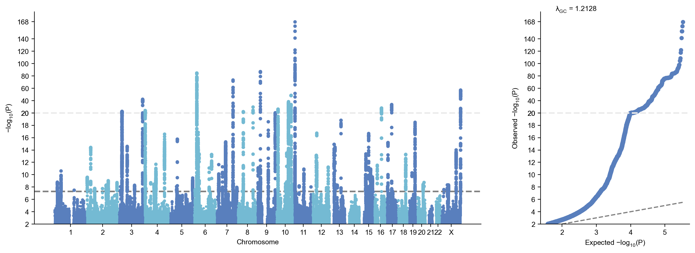
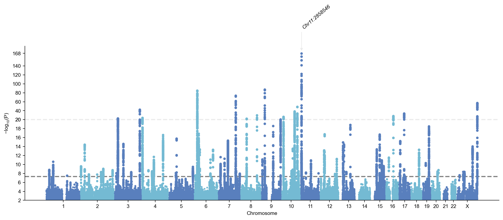
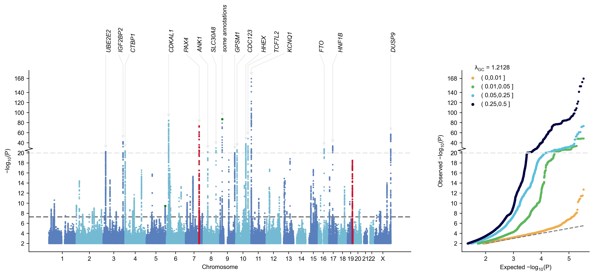
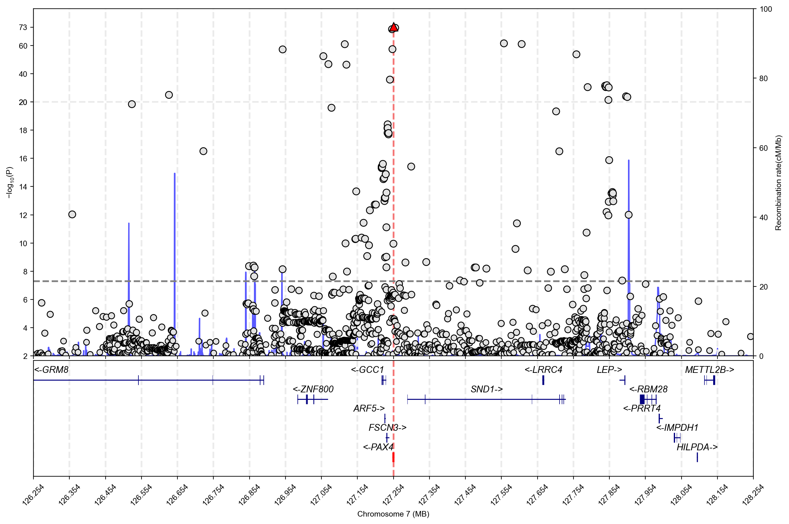
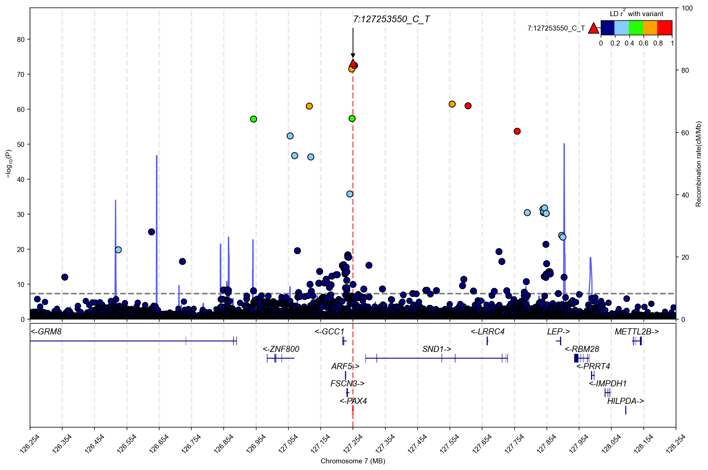

# Tutorial for gwaslab 3.5 (outdated)

- In this tutorial, we will briefly show:
    - the core functions in gwaslab for sumstats QC, standardization and harmonization. 
    - examples of visualization, including Manhattan plots, Q-Q plots and regional plots.

- This jupyter notebook can be downloaded from https://github.com/Cloufield/gwaslab/tree/main/examples/1_main_tutorial.
- Please note that the processed reference datasets are currently hosted on Dropbox. 

## Download sample data

- Using a jupyter notebook, we first download a real GWAS sumsatts dataset as our sample dataset.
- The dataset we will use as an example is the sumstats of type 2 diabetes from BBJ (K. Suzuki et al., Nature Genetics. 51, 379–386 (2019).)
- File size: 261M

First make a directory and then download the sumstats (supposing our working directory is `1_main_tutorial`)

```python
!mkdir ../0_sample_data
!wget -O ../0_sample_data/t2d_bbj.txt.gz http://jenger.riken.jp/14/
```

**stdout:**
```python
mkdir: cannot create directory ‘../0_sample_data’: File exists
--2025-05-04 11:44:42--  http://jenger.riken.jp/14/
Resolving jenger.riken.jp (jenger.riken.jp)... 134.160.84.25
Connecting to jenger.riken.jp (jenger.riken.jp)|134.160.84.25|:80... connected.
HTTP request sent, awaiting response... 200 OK
Length: 274187574 (261M) [text/plain]
Saving to: ‘../0_sample_data/t2d_bbj.txt.gz’

../0_sample_data/t2 100%[===================>] 261.49M  2.98MB/s    in 87s     

2025-05-04 11:46:09 (2.99 MB/s) - ‘../0_sample_data/t2d_bbj.txt.gz’ saved [274187574/274187574]
```

Sometimes the link is not stable. You can also download from alternative source: 

`!wget -O ../0_sample_data/t2d_bbj.txt.gz https://www.dropbox.com/s/5vp93eq0gtsm92n/t2d_bbj.txt.gz?dl=1`

## Import gwaslab package

gwaslab can be installed using pip 

```python
!pip install "gwaslab==3.5.8"
```

If you installed gwaslab from pip, simply run the command to import the package:

```python
import gwaslab as gl
```

Or if you want to use the latest version from github (beta version), you can clone the repository and import the package by inserting your package path into the system path like:

```python
import sys
sys.path.insert(0,"/home/yunye/work/gwaslab/src")
import gwaslab as gl
```

```python
gl.show_version()
```

**stdout:**
```python
2025/05/04 12:21:42 GWASLab v3.6.0 https://cloufield.github.io/gwaslab/
2025/05/04 12:21:42 (C) 2022-2025, Yunye He, Kamatani Lab, GPL-3.0 license, gwaslab@gmail.com
```

## Loading data into gwaslab Sumstats

Let's import the raw sumstats into the `gwaslab.Sumstats` Object by specifying the necessary columns.

Note: you can either specify `eaf` (effect allele frequency) or `neaf` (non-effect allele frequency), if `neaf` is specified, it will be converted to `eaf` when loading the sumstats.In this sumstats, Frq is neaf.

```python
mysumstats = gl.Sumstats("../0_sample_data/t2d_bbj.txt.gz",
             snpid="SNP",
             chrom="CHR",
             pos="POS",
             ea="ALT",
             nea="REF",
             neaf="Frq",
             beta="BETA",
             se="SE",
             p="P",
             direction="Dir",
             n="N",
             sep="\t")
```

**stdout:**
```python
2025/05/04 12:21:42 GWASLab v3.6.0 https://cloufield.github.io/gwaslab/
2025/05/04 12:21:42 (C) 2022-2025, Yunye He, Kamatani Lab, GPL-3.0 license, gwaslab@gmail.com
2025/05/04 12:21:42 Start to initialize gl.Sumstats from file :../0_sample_data/t2d_bbj.txt.gz
2025/05/04 12:21:59  -Reading columns          : ALT,POS,BETA,Dir,N,SE,P,Frq,SNP,REF,CHR
2025/05/04 12:21:59  -Renaming columns to      : EA,POS,BETA,DIRECTION,N,SE,P,EAF,SNPID,NEA,CHR
2025/05/04 12:21:59  -Current Dataframe shape : 12557761  x  11
2025/05/04 12:22:00  -Initiating a status column: STATUS ...
2025/05/04 12:22:00  #WARNING! Version of genomic coordinates is unknown...
2025/05/04 12:22:03  -NEAF is specified...
2025/05/04 12:22:03  -Checking if 0<= NEAF <=1 ...
2025/05/04 12:22:04  -Converted NEAF to EAF.
2025/05/04 12:22:04  -Removed 0 variants with bad NEAF.
2025/05/04 12:22:04 Start to reorder the columns...v3.6.0
2025/05/04 12:22:04  -Current Dataframe shape : 12557761 x 12 ; Memory usage: 1102.40 MB
2025/05/04 12:22:04  -Reordering columns to    : SNPID,CHR,POS,EA,NEA,EAF,BETA,SE,P,N,DIRECTION,STATUS
2025/05/04 12:22:05 Finished reordering the columns.
2025/05/04 12:22:05  -Trying to convert datatype for CHR: string -> Int64...Failed...
2025/05/04 12:22:06  -Column  : SNPID  CHR    POS   EA       NEA      EAF     BETA    SE      P       N     DIRECTION STATUS  
2025/05/04 12:22:06  -DType   : object string int64 category category float64 float64 float64 float64 int64 object    category
2025/05/04 12:22:06  -Verified: T      F      T     T        T        T       T       T       T       T     T         T       
2025/05/04 12:22:06  #WARNING! Columns with possibly incompatible dtypes: CHR
2025/05/04 12:22:06  -Current Dataframe memory usage: 1102.40 MB
2025/05/04 12:22:06 Finished loading data successfully!
```

Headers in raw sumstats are renamed and standardized into GWASLab format.

GWASLab automatically checks the data type of each column. In this summary statistics file, the data type of the CHR column cannot be verified because it is loaded as a string instead of an integer.

Sumstats are stored in `Sumstats.data` as a pandas.DataFrame, you can check the data like: 

```python
mysumstats.data
```

```python
| SNPID CHR | POS | EA NEA | EAF | BETA | \ |
| --- | --- | --- | --- | --- | --- |
| 0 | 1:725932_G_A | 1 | 725932 | G | A |
| 1 | 1:725933_A_G | 1 | 725933 | G | A |
| 2 | 1:737801_T_C | 1 | 737801 | C | T |
| 3 | 1:749963_T_TAA | 1 | 749963 | TAA | T |
| 4 | 1:751343_T_A | 1 | 751343 | T | A |
| ... | ... | .. | ... | ... | .. |
| 12557756 | X:154874837_A_G | X | 154874837 | G | A |
| 12557757 | X:154875192_GTACTC_G | X | 154875192 | GTACTC | G |
| 12557758 | X:154879115_A_G | X | 154879115 | G | A |
| 12557759 | X:154880669_T_A | X | 154880669 | T | A |
| 12557760 | X:154880917_C_T | X | 154880917 | C | T |
|  |  |  |  |  |  |
|  | SE | P | N DIRECTION | STATUS |  |
| 0 | 0.1394 | 0.5970 | 166718 | -?+- | 9999999 |
| 1 | 0.1394 | 0.5973 | 166718 | +?-+ | 9999999 |
| 2 | 0.1231 | 0.6908 | 166718 | +?-+ | 9999999 |
| 3 | 0.0199 | 0.2846 | 166718 | -?++ | 9999999 |
| 4 | 0.0156 | 0.2705 | 166718 | -?++ | 9999999 |
| ... | ... | ... | ... | ... | ... |
| 12557756 | 0.0117 | 0.5840 | 191764 | -+-+ | 9999999 |
| 12557757 | 0.0122 | 0.5612 | 191764 | +-+- | 9999999 |
| 12557758 | 0.0122 | 0.5646 | 191764 | -+-+ | 9999999 |
| 12557759 | 0.0122 | 0.5618 | 191764 | +-+- | 9999999 |
| 12557760 | 0.0122 | 0.5570 | 191764 | +-+- | 9999999 |
|  |  |  |  |  |  |
| [12557761 rows x 12 columns] |  |  |  |  |  |
```

For details on gwaslab Sumstats Object, see: https://cloufield.github.io/gwaslab/SumstatsObject/

## Infer genome build

In case, you do not know the build. gwaslab can infer it based on hapmap3 SNPs.
For details, see: https://cloufield.github.io/gwaslab/InferBuild/

```python
mysumstats.infer_build()
```

**stdout:**
```python
2025/05/04 12:22:06 Start to infer genome build version using hapmap3 SNPs...v3.6.0
2025/05/04 12:22:06  -Current Dataframe shape : 12557761 x 12 ; Memory usage: 1102.40 MB
2025/05/04 12:22:06 Start to infer genome build version using hapmap3 SNPs...
2025/05/04 12:22:06  -Loading Hapmap3 variants data...
2025/05/04 12:22:08  -CHR:POS will be used for matching...
2025/05/04 12:22:23  -Matching variants for hg19: num_hg19 =  1092441
2025/05/04 12:22:23  -Matching variants for hg38: num_hg38 =  15997
2025/05/04 12:22:23  -Since num_hg19 >> num_hg38, assigning genome build hg19...
2025/05/04 12:22:31 Finished inferring genome build version using hapmap3 SNPs.
```

## Create Manhattan plots and Q-Q plots

The first thing you want to check is probably the Manhattan and Q-Q plots for your sumstats. 

gwaslab will conduct a minimal QC for sumstats when plotting.

```python
mysumstats.plot_mqq()
```

**stdout:**
```python
2025/05/04 12:22:32 Start to create MQQ plot...v3.6.0:
2025/05/04 12:22:32  -Genomic coordinates version: 19...
2025/05/04 12:22:32  -Genome-wide significance level to plot is set to 5e-08 ...
2025/05/04 12:22:32  -Raw input contains 12557761 variants...
2025/05/04 12:22:32  -MQQ plot layout mode is : mqq
2025/05/04 12:22:36 Finished loading specified columns from the sumstats.
2025/05/04 12:22:36 Start data conversion and sanity check:
2025/05/04 12:22:36  -Removed 0 variants with nan in CHR or POS column ...
2025/05/04 12:22:37  -Removed 0 variants with CHR <=0...
2025/05/04 12:22:38  -Removed 0 variants with nan in P column ...
2025/05/04 12:22:39  -Sanity check after conversion: 0 variants with P value outside of (0,1] will be removed...
2025/05/04 12:22:39  -Sumstats P values are being converted to -log10(P)...
2025/05/04 12:22:41  -Sanity check: 0 na/inf/-inf variants will be removed...
2025/05/04 12:22:42  -Converting data above cut line...
2025/05/04 12:22:42  -Maximum -log10(P) value is 167.58838029403677 .
2025/05/04 12:22:42 Finished data conversion and sanity check.
2025/05/04 12:22:42 Start to create MQQ plot with 12557761 variants...
2025/05/04 12:22:55  -Creating background plot...
2025/05/04 12:23:18 Finished creating MQQ plot successfully!
2025/05/04 12:23:18 Start to extract variants for annotation...
2025/05/04 12:23:19  -Found 89 significant variants with a sliding window size of 500 kb...
2025/05/04 12:23:19 Finished extracting variants for annotation...
2025/05/04 12:23:19 Start to process figure arts.
2025/05/04 12:23:19  -Processing X ticks...
2025/05/04 12:23:19  -Processing X labels...
2025/05/04 12:23:19  -Processing Y labels...
2025/05/04 12:23:19  -Processing Y tick lables...
2025/05/04 12:23:19  -Processing Y labels...
2025/05/04 12:23:19  -Processing lines...
2025/05/04 12:23:19 Finished processing figure arts.
2025/05/04 12:23:19 Start to annotate variants...
2025/05/04 12:23:19  -Skip annotating
2025/05/04 12:23:19 Finished annotating variants.
2025/05/04 12:23:19 Start to create QQ plot with 12557761 variants:
2025/05/04 12:23:19  -Plotting all variants...
2025/05/04 12:23:22  -Expected range of P: (0,1.0)
2025/05/04 12:23:23  -Lambda GC (MLOG10P mode) at 0.5 is   1.21283
2025/05/04 12:23:23  -Processing Y tick lables...
2025/05/04 12:23:23 Finished creating QQ plot successfully!
2025/05/04 12:23:23 Start to save figure...
2025/05/04 12:23:23  -Skip saving figure!
2025/05/04 12:23:23 Finished saving figure...
2025/05/04 12:23:23 Finished creating plot successfully!
```

```python
(<Figure size 3000x1000 with 2 Axes>, <gwaslab.g_Log.Log at 0x7fa513830790>)
```


Using .plot_mqq(), you can easily generate Manhattan and QQ plots. However, without any customization, the plots may be less informative.Rendering all points can be time-consuming, and highly significant loci may overshadow less significant ones. 

To address this, GWASLab offers a wide range of customization options. For example, the skip and cut parameters can be used to adjust the plot:

- skip : skip variants with MLOG10P < `skip` for faster plotting speed
- cut : rescale the MLOG10P values when MLOG10P > `cut`  

```python
mysumstats.plot_mqq(skip=2, cut=20)
```

**stdout:**
```python
2025/05/04 12:25:38 Start to create MQQ plot...v3.6.0:
2025/05/04 12:25:38  -Genomic coordinates version: 19...
2025/05/04 12:25:38  -Genome-wide significance level to plot is set to 5e-08 ...
2025/05/04 12:25:38  -Raw input contains 12557761 variants...
2025/05/04 12:25:38  -MQQ plot layout mode is : mqq
2025/05/04 12:25:42 Finished loading specified columns from the sumstats.
2025/05/04 12:25:42 Start data conversion and sanity check:
2025/05/04 12:25:42  -Removed 0 variants with nan in CHR or POS column ...
2025/05/04 12:25:44  -Removed 0 variants with CHR <=0...
2025/05/04 12:25:44  -Removed 0 variants with nan in P column ...
2025/05/04 12:25:45  -Sanity check after conversion: 0 variants with P value outside of (0,1] will be removed...
2025/05/04 12:25:46  -Sumstats P values are being converted to -log10(P)...
2025/05/04 12:25:47  -Sanity check: 0 na/inf/-inf variants will be removed...
2025/05/04 12:25:48  -Converting data above cut line...
2025/05/04 12:25:48  -Maximum -log10(P) value is 167.58838029403677 .
2025/05/04 12:25:48  -Minus log10(P) values above 20 will be shrunk with a shrinkage factor of 10...
2025/05/04 12:25:48 Finished data conversion and sanity check.
2025/05/04 12:25:48 Start to create MQQ plot with 332882 variants...
2025/05/04 12:25:48  -Creating background plot...
2025/05/04 12:25:49 Finished creating MQQ plot successfully!
2025/05/04 12:25:49 Start to extract variants for annotation...
2025/05/04 12:25:50  -Found 89 significant variants with a sliding window size of 500 kb...
2025/05/04 12:25:50 Finished extracting variants for annotation...
2025/05/04 12:25:50 Start to process figure arts.
2025/05/04 12:25:50  -Processing X ticks...
2025/05/04 12:25:50  -Processing X labels...
2025/05/04 12:25:50  -Processing Y labels...
2025/05/04 12:25:50  -Processing Y tick lables...
2025/05/04 12:25:50  -Processing Y labels...
2025/05/04 12:25:50  -Processing lines...
2025/05/04 12:25:50 Finished processing figure arts.
2025/05/04 12:25:50 Start to annotate variants...
2025/05/04 12:25:50  -Skip annotating
2025/05/04 12:25:50 Finished annotating variants.
2025/05/04 12:25:50 Start to create QQ plot with 332882 variants:
2025/05/04 12:25:50  -Plotting all variants...
2025/05/04 12:25:50  -Expected range of P: (0,1.0)
2025/05/04 12:25:51  -Lambda GC (MLOG10P mode) at 0.5 is   1.21283
2025/05/04 12:25:51  -Processing Y tick lables...
2025/05/04 12:25:51 Finished creating QQ plot successfully!
2025/05/04 12:25:51 Start to save figure...
2025/05/04 12:25:51  -Skip saving figure!
2025/05/04 12:25:51 Finished saving figure...
2025/05/04 12:25:51 Finished creating plot successfully!
```

```python
(<Figure size 3000x1000 with 2 Axes>, <gwaslab.g_Log.Log at 0x7fa513830790>)
```



Looks better now. But what if we want to annotate some of the most significant loci (for example, lead variants with MLOG10P>30) and only plot Manhattan plot?

```python
mysumstats.plot_mqq(skip=2, cut=20, mode="m", anno=True, sig_level_lead=1e-30)
```

**stdout:**
```python
2025/05/04 12:25:56 Start to create MQQ plot...v3.6.0:
2025/05/04 12:25:56  -Genomic coordinates version: 19...
2025/05/04 12:25:56  -Genome-wide significance level to plot is set to 5e-08 ...
2025/05/04 12:25:56  -Raw input contains 12557761 variants...
2025/05/04 12:25:56  -MQQ plot layout mode is : m
2025/05/04 12:26:00 Finished loading specified columns from the sumstats.
2025/05/04 12:26:00 Start data conversion and sanity check:
2025/05/04 12:26:01  -Removed 0 variants with nan in CHR or POS column ...
2025/05/04 12:26:02  -Removed 0 variants with CHR <=0...
2025/05/04 12:26:03  -Removed 0 variants with nan in P column ...
2025/05/04 12:26:04  -Sanity check after conversion: 0 variants with P value outside of (0,1] will be removed...
2025/05/04 12:26:04  -Sumstats P values are being converted to -log10(P)...
2025/05/04 12:26:05  -Sanity check: 0 na/inf/-inf variants will be removed...
2025/05/04 12:26:06  -Converting data above cut line...
2025/05/04 12:26:06  -Maximum -log10(P) value is 167.58838029403677 .
2025/05/04 12:26:06  -Minus log10(P) values above 20 will be shrunk with a shrinkage factor of 10...
2025/05/04 12:26:06 Finished data conversion and sanity check.
2025/05/04 12:26:06 Start to create MQQ plot with 332882 variants...
2025/05/04 12:26:07  -Creating background plot...
2025/05/04 12:26:07 Finished creating MQQ plot successfully!
2025/05/04 12:26:07 Start to extract variants for annotation...
2025/05/04 12:26:08  -Found 1 significant variants with a sliding window size of 500 kb...
2025/05/04 12:26:08 Finished extracting variants for annotation...
2025/05/04 12:26:08 Start to process figure arts.
2025/05/04 12:26:08  -Processing X ticks...
2025/05/04 12:26:08  -Processing X labels...
2025/05/04 12:26:08  -Processing Y labels...
2025/05/04 12:26:08  -Processing Y tick lables...
2025/05/04 12:26:08  -Processing Y labels...
2025/05/04 12:26:08  -Processing lines...
2025/05/04 12:26:08 Finished processing figure arts.
2025/05/04 12:26:08 Start to annotate variants...
2025/05/04 12:26:08  -Annotating using column CHR:POS...
2025/05/04 12:26:08  -Adjusting text positions with repel_force=0.03...
2025/05/04 12:26:08 Finished annotating variants.
2025/05/04 12:26:08 Start to save figure...
2025/05/04 12:26:08  -Skip saving figure!
2025/05/04 12:26:08 Finished saving figure...
2025/05/04 12:26:08 Finished creating plot successfully!
```

```python
(<Figure size 3000x1000 with 1 Axes>, <gwaslab.g_Log.Log at 0x7fa513830790>)
```



gwaslab supports a wide range of customizable options. For details on other options for Manhattan and Q-Q plots, see: https://cloufield.github.io/gwaslab/Visualization/

## Standardization & QC : `.basic_check()`

Before performing any manipulation or analysis, it is essential to check key fields such as variant ID (SNPID), rsID, chromosome (CHR), base-pair position (POS), effect allele (EA), non-effect allele (NEA), and associated statistics. GWASLab provides an all-in-one function for this purpose: .basic_check().

Note: If the summary statistics are not in a standard format, it's recommended to run this check before generating any plots.

```python
#check SNPID,rsID,CHR,POS,EA, NEA and statistics
mysumstats.basic_check()
```

**stdout:**
```python
2025/05/04 12:26:11 Start to check SNPID/rsID...v3.6.0
2025/05/04 12:26:11  -Current Dataframe shape : 12557761 x 12 ; Memory usage: 1102.40 MB
2025/05/04 12:26:11  -Checking SNPID data type...
2025/05/04 12:26:11  -Converting SNPID to pd.string data type...
2025/05/04 12:26:12  -Checking if SNPID is CHR:POS:NEA:EA...(separator: - ,: , _)
2025/05/04 12:26:24 Finished checking SNPID/rsID.
2025/05/04 12:26:24 Start to fix chromosome notation (CHR)...v3.6.0
2025/05/04 12:26:24  -Current Dataframe shape : 12557761 x 12 ; Memory usage: 1102.40 MB
2025/05/04 12:26:24  -Checking CHR data type...
2025/05/04 12:26:26  -Variants with standardized chromosome notation: 12228970
2025/05/04 12:26:28  -Variants with fixable chromosome notations: 328791
2025/05/04 12:26:28  -No unrecognized chromosome notations...
2025/05/04 12:26:30  -Identifying non-autosomal chromosomes : X, Y, and MT ...
2025/05/04 12:26:31  -Identified  328791  variants on sex chromosomes...
2025/05/04 12:26:32  -Standardizing sex chromosome notations: X to 23...
2025/05/04 12:26:46 Finished fixing chromosome notation (CHR).
2025/05/04 12:26:47 Start to fix basepair positions (POS)...v3.6.0
2025/05/04 12:26:47  -Current Dataframe shape : 12557761 x 12 ; Memory usage: 1372.38 MB
2025/05/04 12:26:47  -Converting to Int64 data type ...
2025/05/04 12:26:54  -Position bound:(0 , 250,000,000)
2025/05/04 12:26:55  -Removed outliers: 0
2025/05/04 12:26:56 Finished fixing basepair positions (POS).
2025/05/04 12:26:56 Start to fix alleles (EA and NEA)...v3.6.0
2025/05/04 12:26:56  -Current Dataframe shape : 12557761 x 12 ; Memory usage: 1126.35 MB
2025/05/04 12:26:56  -Converted all bases to string datatype and UPPERCASE.
2025/05/04 12:27:00  -Variants with bad EA  : 0
2025/05/04 12:27:01  -Variants with bad NEA : 0
2025/05/04 12:27:02  -Variants with NA for EA or NEA: 0
2025/05/04 12:27:02  -Variants with same EA and NEA: 0
2025/05/04 12:27:03  -Detected 0 variants with alleles that contain bases other than A/C/T/G .
2025/05/04 12:27:22 Finished fixing alleles (EA and NEA).
2025/05/04 12:27:22 Start to perform sanity check for statistics...v3.6.0
2025/05/04 12:27:22  -Current Dataframe shape : 12557761 x 12 ; Memory usage: 1152.39 MB
2025/05/04 12:27:22  -Comparison tolerance for floats: 1e-07
2025/05/04 12:27:23  -Checking if 0 <= N <= 2147483647 ...
2025/05/04 12:27:27  -Removed 0 variants with bad/na N.
2025/05/04 12:27:27  -Checking if -1e-07 < EAF < 1.0000001 ...
2025/05/04 12:27:29  -Removed 0 variants with bad/na EAF.
2025/05/04 12:27:29  -Checking if -1e-07 < P < 1.0000001 ...
2025/05/04 12:27:32  -Removed 0 variants with bad/na P.
2025/05/04 12:27:32  -Checking if -100.0000001 < BETA < 100.0000001 ...
2025/05/04 12:27:34  -Removed 0 variants with bad/na BETA.
2025/05/04 12:27:34  -Checking if -1e-07 < SE < inf ...
2025/05/04 12:27:36  -Removed 0 variants with bad/na SE.
2025/05/04 12:27:36  -Checking STATUS and converting STATUS to categories....
2025/05/04 12:27:36  -Removed 0 variants with bad statistics in total.
2025/05/04 12:27:36  -Data types for each column:
2025/05/04 12:27:36  -Column  : SNPID  CHR   POS   EA       NEA      EAF     BETA    SE      P       N     DIRECTION STATUS  
2025/05/04 12:27:36  -DType   : string Int64 Int64 category category float32 float64 float64 float64 Int64 object    category
2025/05/04 12:27:36  -Verified: T      T     T     T        T        T       T       T       T       T     T         T       
2025/05/04 12:27:36 Finished sanity check for statistics.
2025/05/04 12:27:37 Start to check data consistency across columns...v3.6.0
2025/05/04 12:27:37  -Current Dataframe shape : 12557761 x 12 ; Memory usage: 1116.46 MB
2025/05/04 12:27:37  -Tolerance: 0.001 (Relative) and 0.001 (Absolute)
2025/05/04 12:27:37  -Checking if BETA/SE-derived-P is consistent with P...
2025/05/04 12:28:09   -Not consistent: 2380309 variant(s)
2025/05/04 12:28:09   -Variant SNPID with max difference: X:3293819_T_C with 0.0072642804381793935
2025/05/04 12:28:09  -Note: if the max difference is greater than expected, please check your original sumstats.
2025/05/04 12:28:09 Finished checking data consistency across columns.
2025/05/04 12:28:10 Start to normalize indels...v3.6.0
2025/05/04 12:28:10  -Current Dataframe shape : 12557761 x 12 ; Memory usage: 1374.46 MB
2025/05/04 12:28:15  -Not normalized allele IDs:X:7151130_TT_TC X:9093382_CTTTT_CTTT X:12292253_ATTT_ATT X:16001576_ATT_ATTT X:33822416_GT_GTT ... 
2025/05/04 12:28:15  -Not normalized allele:['TT' 'TC']['CTTTT' 'CTTT']['ATTT' 'ATT']['ATTT' 'ATT']['GTT' 'GT']... 
2025/05/04 12:28:15  -Modified 13 variants according to parsimony and left alignment principal.
2025/05/04 12:28:16 Finished normalizing indels.
2025/05/04 12:28:16 Start to sort the genome coordinates...v3.6.0
2025/05/04 12:28:16  -Current Dataframe shape : 12557761 x 12 ; Memory usage: 1374.46 MB
2025/05/04 12:28:23 Finished sorting coordinates.
2025/05/04 12:28:23 Start to reorder the columns...v3.6.0
2025/05/04 12:28:23  -Current Dataframe shape : 12557761 x 12 ; Memory usage: 1020.66 MB
2025/05/04 12:28:23  -Reordering columns to    : SNPID,CHR,POS,EA,NEA,EAF,BETA,SE,P,N,DIRECTION,STATUS
2025/05/04 12:28:24 Finished reordering the columns.
```

```python
mysumstats.data
```

```python
| SNPID | CHR | POS | EA NEA | EAF | BETA | \ |
| --- | --- | --- | --- | --- | --- | --- |
| 0 | 1:725932_G_A | 1 | 725932 | G | A | 0.9960 -0.0737 |
| 1 | 1:725933_A_G | 1 | 725933 | G | A | 0.0040 |
| 2 | 1:737801_T_C | 1 | 737801 | C | T | 0.0051 |
| 3 | 1:749963_T_TAA | 1 | 749963 | TAA | T | 0.8374 |
| 4 | 1:751343_T_A | 1 | 751343 | T | A | 0.8593 |
| ... | ... | ... | ... | ... | .. | ... |
| 12557756 | X:154874837_A_G | 23 | 154874837 | G | A | 0.7478 -0.0064 |
| 12557757 | X:154875192_GTACTC_G | 23 | 154875192 | GTACTC | G | 0.2525 |
| 12557758 | X:154879115_A_G | 23 | 154879115 | G | A | 0.7463 -0.0070 |
| 12557759 | X:154880669_T_A | 23 | 154880669 | T | A | 0.2558 |
| 12557760 | X:154880917_C_T | 23 | 154880917 | C | T | 0.2558 |
|  |  |  |  |  |  |  |
|  | SE | P | N DIRECTION | STATUS |  |  |
| 0 | 0.1394 | 0.5970 | 166718 | -?+- | 1960099 |  |
| 1 | 0.1394 | 0.5973 | 166718 | +?-+ | 1960099 |  |
| 2 | 0.1231 | 0.6908 | 166718 | +?-+ | 1960099 |  |
| 3 | 0.0199 | 0.2846 | 166718 | -?++ | 1960399 |  |
| 4 | 0.0156 | 0.2705 | 166718 | -?++ | 1960099 |  |
| ... | ... | ... | ... | ... | ... |  |
| 12557756 | 0.0117 | 0.5840 | 191764 | -+-+ | 1960099 |  |
| 12557757 | 0.0122 | 0.5612 | 191764 | +-+- | 1960399 |  |
| 12557758 | 0.0122 | 0.5646 | 191764 | -+-+ | 1960099 |  |
| 12557759 | 0.0122 | 0.5618 | 191764 | +-+- | 1960099 |  |
| 12557760 | 0.0122 | 0.5570 | 191764 | +-+- | 1960099 |  |
|  |  |  |  |  |  |  |
| [12557761 rows x 12 columns] |  |  |  |  |  |  |
```

The log indicates that the summary statistics are generally in good shape. However, several variants were found to be unnormalized. 

GWASLab corrected the positions and alleles for these indels and standardized the chromosome notation by converting chromosome X to 23.

In fact, `.basic_check()` is a wrapper of the following basic functions, you can also use these separately.

- Sumstats.fix_ID()
- Sumstats.fix_chr()
- Sumstats.fix_pos()
- Sumstats.fix_allele()
- Sumstats.check_sanity()
- Sumstats.check_data_consistency()
- Sumstats.normalize_allele()
- Sumstats.remove_dup()
- Sumstats.sort_coordinate()
- Sumstats.sort_column()

For other options, see: https://cloufield.github.io/gwaslab/Standardization/

## Extract lead variants : get_lead()

Let's extract the lead variants in each significant loci to check our data.

The significant loci are detected based on a sliding window (default window size: `windowsizekb=500` kb)

By specifying `anno=True` , gwaslab will also annotate the lead variant with its nearest gene names and distance.

**Note**: GWASLab default genome build version is `build="19"` (GRCh37/hg19), you can change it to `build="38"` (GRCh38/hg38) when needed.

**Note**: GWASLab will download reference files when you run it for the first time. In this case, `ensembl_hg19_gtf_protein_coding` was downloaded and processed automatically.

```python
mysumstats.get_lead(anno=True)
```

**stdout:**
```python
2025/05/04 12:28:24 Start to extract lead variants...v3.6.0
2025/05/04 12:28:24  -Current Dataframe shape : 12557761 x 12 ; Memory usage: 1020.66 MB
2025/05/04 12:28:24  -Processing 12557761 variants...
2025/05/04 12:28:24  -Significance threshold : 5e-08
2025/05/04 12:28:24  -Sliding window size: 500  kb
2025/05/04 12:28:26  -Using P for extracting lead variants...
2025/05/04 12:28:26  -Found 9461 significant variants in total...
2025/05/04 12:28:28  -Identified 89 lead variants!
2025/05/04 12:28:28  -Annotating variants using references:ensembl
2025/05/04 12:28:28  -Annotating variants using references based on genome build:19
2025/05/04 12:28:28 Start to annotate variants with nearest gene name(s)...
2025/05/04 12:28:28  -Assigning Gene name using ensembl_hg19_gtf for protein coding genes
2025/05/04 12:28:31 Finished annotating variants with nearest gene name(s) successfully!
2025/05/04 12:28:31 Finished extracting lead variants.
```

```python
| SNPID | CHR | POS | EA | NEA | EAF | BETA | SE | \ |
| --- | --- | --- | --- | --- | --- | --- | --- | --- |
| 96739 | 1:22068326_A_G | 1 | 22068326 | G | A | 0.7550 | 0.0621 | 0.0103 |
| 213860 | 1:51103268_T_C | 1 | 51103268 | C | T | 0.7953 -0.0802 | 0.0120 |  |
| 534095 | 1:154309595_TA_T | 1 | 154309595 | TA | T | 0.0947 -0.0915 | 0.0166 |  |
| 969974 | 2:640986_CACAT_C | 2 | 640986 | C | CACAT | 0.9006 -0.0946 | 0.0150 |  |
| 1091807 | 2:27734972_G_A | 2 | 27734972 | G | A | 0.5605 | 0.0691 | 0.0088 |
| ... | ... | ... | ... | .. | ... | ... | ... | ... |
| 12272930 | X:21569920_A_G | 23 | 21569920 | G | A | 0.3190 | 0.0423 | 0.0076 |
| 12341406 | X:48724648_CAA_C | 23 | 48724648 | C | CAA | 0.6260 -0.0602 | 0.0103 |  |
| 12350767 | X:57170781_A_AT | 23 | 57170781 | AT | A | 0.3003 -0.0447 | 0.0076 |  |
| 12469290 | X:117915163_T_TA | 23 | 117915163 | TA | T | 0.5560 | 0.0548 | 0.0071 |
| 12554976 | X:152908887_G_A | 23 | 152908887 | G | A | 0.6792 -0.1235 | 0.0077 |  |
|  |  |  |  |  |  |  |  |  |
|  | P | N DIRECTION | STATUS | LOCATION | GENE |  |  |  |
| 96739 | 1.629000e-09 | 191764 | ++++ | 1960099 | 0 | USP48 |  |  |
| 213860 | 2.519000e-11 | 191764 | ---- | 1960099 | 0 | FAF1 |  |  |
| 534095 | 3.289000e-08 | 191764 | ---- | 1960399 | 0 | ATP8B2 |  |  |
| 969974 | 2.665000e-10 | 191764 | ---- | 1960399 | 26349 | TMEM18 |  |  |
| 1091807 | 3.897000e-15 | 191764 | ++++ | 1960099 | 0 | GCKR |  |  |
| ... | ... | ... | ... | ... | ... | ... |  |  |
| 12272930 | 2.616000e-08 | 191764 | ++++ | 1960099 | 0 | CNKSR2 |  |  |
| 12341406 | 4.576000e-09 | 191764 | ---- | 1960399 | 26082 | TIMM17B |  |  |
| 12350767 | 4.583000e-09 | 191764 | ---- | 1960399 | -6723 | SPIN2A |  |  |
| 12469290 | 9.818000e-15 | 191764 | ++++ | 1960399 | 0 | IL13RA1 |  |  |
| 12554976 | 9.197000e-58 | 191764 | ---- | 1960099 | 0 | DUSP9 |  |  |
|  |  |  |  |  |  |  |  |  |
| [89 rows x 14 columns] |  |  |  |  |  |  |  |  |
```

We extracted a total of 89 lead variants with a sliding window size of 500kb!

For other options, see: https://cloufield.github.io/gwaslab/ExtractLead/

## Use the SNPID to create some highly customized mqq plot

GWASLab can create much more complicated Manhattan plots.

For example, 
- annotate the lead variants with closest gene names (threshold for annotation p<1e-20)
- annotate selected variants with user-provided texts 
- pinpoint some variants
- highlight some loci
- MAF-stratified Q-Q plot
- save as my_first_mqq_plot.png with {"dpi":400,"facecolor":"white"}

```python
mysumstats.plot_mqq(mode="mqq",
                    cut=20,
                    skip=2,
                    anno="GENENAME",
                    sig_level_lead=1e-20,
                    anno_alias={"9:22132729_A_G":"some annotations"},
                    anno_style="expand",
                    xpad=0.01,
                    pinpoint=["9:22132729_A_G","5:176513896_C_A"], 
                    pinpoint_color="green",
                    highlight=["7:127253550_C_T","19:46166604_C_T"],
                    highlight_windowkb =1000,
                    stratified=True,
                    jagged=True,
                    marker_size=(5,5),
                    figargs={"figsize":(15,5),"dpi":300},
                    save="my_first_mqq_plot.png", 
                    save_args={"dpi":400,"facecolor":"white"})
```

**stdout:**
```python
2025/05/04 12:28:31 Start to create MQQ plot...v3.6.0:
2025/05/04 12:28:31  -Genomic coordinates version: 19...
2025/05/04 12:28:31  -Genome-wide significance level to plot is set to 5e-08 ...
2025/05/04 12:28:31  -Raw input contains 12557761 variants...
2025/05/04 12:28:31  -MQQ plot layout mode is : mqq
2025/05/04 12:28:31  -Loci to highlight (#CB132D): 7:127253550_C_T,19:46166604_C_T
2025/05/04 12:28:31   -highlight_windowkb is set to:  1000  kb
2025/05/04 12:28:31  -Variants to pinpoint (green) : 9:22132729_A_G,5:176513896_C_A
2025/05/04 12:28:34 Finished loading specified columns from the sumstats.
2025/05/04 12:28:34 Start data conversion and sanity check:
2025/05/04 12:28:35  -Removed 0 variants with nan in CHR or POS column ...
2025/05/04 12:28:36  -Removed 0 variants with CHR <=0...
2025/05/04 12:28:38  -Removed 0 variants with nan in EAF column ...
2025/05/04 12:28:38  -Removed 0 variants with nan in P column ...
2025/05/04 12:28:40  -Sanity check after conversion: 0 variants with P value outside of (0,1] will be removed...
2025/05/04 12:28:41  -Sumstats P values are being converted to -log10(P)...
2025/05/04 12:28:42  -Sanity check: 0 na/inf/-inf variants will be removed...
2025/05/04 12:28:44  -Converting data above cut line...
2025/05/04 12:28:44  -Maximum -log10(P) value is 167.58838029403677 .
2025/05/04 12:28:44  -Minus log10(P) values above 20 will be shrunk with a shrinkage factor of 10...
2025/05/04 12:28:44 Finished data conversion and sanity check.
2025/05/04 12:28:44 Start to create MQQ plot with 332882 variants...
2025/05/04 12:28:44  -Creating background plot...
2025/05/04 12:28:45  -Highlighting target loci...
2025/05/04 12:28:45  -Pinpointing target vairants...
2025/05/04 12:28:45 Finished creating MQQ plot successfully!
2025/05/04 12:28:45 Start to extract variants for annotation...
2025/05/04 12:28:45  -Found 16 significant variants with a sliding window size of 500 kb...
2025/05/04 12:28:45 Start to annotate variants with nearest gene name(s)...
2025/05/04 12:28:45  -Assigning Gene name using ensembl_hg19_gtf for protein coding genes
2025/05/04 12:28:45 Finished annotating variants with nearest gene name(s) successfully!
2025/05/04 12:28:45 Finished extracting variants for annotation...
2025/05/04 12:28:45 Start to process figure arts.
2025/05/04 12:28:45  -Processing X ticks...
2025/05/04 12:28:45  -Processing X labels...
2025/05/04 12:28:45  -Processing Y labels...
2025/05/04 12:28:45  -Processing Y tick lables...
2025/05/04 12:28:45  -Processing Y labels...
2025/05/04 12:28:45  -Processing lines...
2025/05/04 12:28:45 Finished processing figure arts.
2025/05/04 12:28:45 Start to annotate variants...
2025/05/04 12:28:45  -Annotating using column GENENAME...
2025/05/04 12:28:45  -Adjusting text positions with repel_force=0.03...
2025/05/04 12:28:45 Finished annotating variants.
2025/05/04 12:28:45 Start to create QQ plot with 332882 variants:
2025/05/04 12:28:45  -Plotting variants stratified by MAF...
2025/05/04 12:28:47  -Lambda GC (MLOG10P mode) at 0.5 is   1.21283
2025/05/04 12:28:47  -Processing Y tick lables...
2025/05/04 12:28:47 Finished creating QQ plot successfully!
2025/05/04 12:28:47  -Processing jagged Y axis...
2025/05/04 12:28:47  -Processing jagged Y axis...
2025/05/04 12:28:47  -Adjusting X padding on both side: 0.01
2025/05/04 12:28:47 Start to save figure...
2025/05/04 12:28:52  -Saved to my_first_mqq_plot.png successfully! (overwrite)
2025/05/04 12:28:52 Finished saving figure...
2025/05/04 12:28:53 Finished creating plot successfully!
```

```python
(<Figure size 6000x2000 with 2 Axes>, <gwaslab.g_Log.Log at 0x7fa513830790>)
```



For details, see: https://cloufield.github.io/gwaslab/Visualization/

## Quick region plot without LD-information

gwaslab can also plot regional plots with or with out LD reference files.

For details, see: https://cloufield.github.io/gwaslab/RegionalPlot/

We first create a region plot without references by specifying `mode` and `region`.

```python
mysumstats.plot_mqq(mode="r",skip=2,cut=20, region=(7,126253550,128253550),region_grid=True)
```

**stdout:**
```python
2025/05/04 12:29:01 Start to create MQQ plot...v3.6.0:
2025/05/04 12:29:01  -Genomic coordinates version: 19...
2025/05/04 12:29:01  -Genome-wide significance level to plot is set to 5e-08 ...
2025/05/04 12:29:01  -Raw input contains 12557761 variants...
2025/05/04 12:29:01  -MQQ plot layout mode is : r
2025/05/04 12:29:01  -Region to plot : chr7:126253550-128253550.
2025/05/04 12:29:02  -Extract SNPs in region : chr7:126253550-128253550...
2025/05/04 12:29:03  -Extract SNPs in specified regions: 8087
2025/05/04 12:29:04 Finished loading specified columns from the sumstats.
2025/05/04 12:29:04 Start data conversion and sanity check:
2025/05/04 12:29:04  -Removed 0 variants with nan in CHR or POS column ...
2025/05/04 12:29:04  -Removed 0 variants with CHR <=0...
2025/05/04 12:29:04  -Removed 0 variants with nan in P column ...
2025/05/04 12:29:04  -Sanity check after conversion: 0 variants with P value outside of (0,1] will be removed...
2025/05/04 12:29:04  -Sumstats P values are being converted to -log10(P)...
2025/05/04 12:29:04  -Sanity check: 0 na/inf/-inf variants will be removed...
2025/05/04 12:29:04  -Converting data above cut line...
2025/05/04 12:29:04  -Maximum -log10(P) value is 73.38711023071251 .
2025/05/04 12:29:04  -Minus log10(P) values above 20 will be shrunk with a shrinkage factor of 10...
2025/05/04 12:29:04 Finished data conversion and sanity check.
2025/05/04 12:29:04 Start to create MQQ plot with 1600 variants...
2025/05/04 12:29:04  -Creating background plot...
2025/05/04 12:29:04  -Extracting lead variant...
2025/05/04 12:29:04  -Loading gtf files from:default
```

**stderr:**
```python
INFO:root:Extracted GTF attributes: ['gene_id', 'gene_name', 'gene_biotype']
```

**stdout:**
```python
2025/05/04 12:29:43  -plotting gene track..
2025/05/04 12:29:43  -plotting genes: 14..
2025/05/04 12:29:43  -plotting exons: 675..
2025/05/04 12:29:43  -Finished plotting gene track..
2025/05/04 12:29:45 Finished creating MQQ plot successfully!
2025/05/04 12:29:45 Start to extract variants for annotation...
2025/05/04 12:29:45  -Found 1 significant variants with a sliding window size of 500 kb...
2025/05/04 12:29:45 Finished extracting variants for annotation...
2025/05/04 12:29:45 Start to process figure arts.
2025/05/04 12:29:45  -Processing X ticks...
2025/05/04 12:29:45  -Processing X labels...
2025/05/04 12:29:45  -Processing Y labels...
2025/05/04 12:29:45  -Processing Y tick lables...
2025/05/04 12:29:45  -Processing Y labels...
2025/05/04 12:29:45  -Processing lines...
2025/05/04 12:29:45 Finished processing figure arts.
2025/05/04 12:29:45 Start to annotate variants...
2025/05/04 12:29:45  -Skip annotating
2025/05/04 12:29:45 Finished annotating variants.
2025/05/04 12:29:45 Start to save figure...
2025/05/04 12:29:45  -Skip saving figure!
2025/05/04 12:29:45 Finished saving figure...
2025/05/04 12:29:45 Finished creating plot successfully!
```

```python
(<Figure size 3000x2000 with 3 Axes>, <gwaslab.g_Log.Log at 0x7fa513830790>)
```



## Reference file downloading

Full regional plot will require user-provided vcf or preprocessed vcf files:
(e.g 1000 Genomes project, see Reference: https://cloufield.github.io/gwaslab/Reference/)

gwaslab also provide pre-processed 1KG datasets.

### check available reference from gwaslab

Update the available reference list first if needed

```python
# gl.update_available_ref()
```

```python
available_ref = gl.check_available_ref()
```

**stdout:**
```python
2025/05/04 12:29:46 Start to check available reference files...
2025/05/04 12:29:46  - 1kg_eas_hg19  :  https://www.dropbox.com/s/lztaxqhy2o6dpxw/EAS.ALL.split_norm_af.1kgp3v5.hg19.vcf.gz?dl=1
2025/05/04 12:29:46  - 1kg_eas_hg19_md5  :  c8c97434843c0da3113fc06879ead472
2025/05/04 12:29:46  - 1kg_eas_hg19_tbi  :  https://www.dropbox.com/s/k9klefl8m9fcfo1/EAS.ALL.split_norm_af.1kgp3v5.hg19.vcf.gz.tbi?dl=1
2025/05/04 12:29:46  - 1kg_eur_hg19  :  https://www.dropbox.com/s/1nbgqshknevseks/EUR.ALL.split_norm_af.1kgp3v5.hg19.vcf.gz?dl=1
2025/05/04 12:29:46  - 1kg_eur_hg19_md5  :  734069d895009d38c2f962bfbb6fab52
2025/05/04 12:29:46  - 1kg_eur_hg19_tbi  :  https://www.dropbox.com/s/vscvkrflh6fc5a0/EUR.ALL.split_norm_af.1kgp3v5.hg19.vcf.gz.tbi?dl=1
2025/05/04 12:29:46  - 1kg_eas_hg38  :  https://www.dropbox.com/s/3dstbbb1el9r3au/EAS.ALL.split_norm_af.1kg_30x.hg38.vcf.gz?dl=1
2025/05/04 12:29:46  - 1kg_eas_hg38_md5  :  f45e80bca9ef7b29e6b1832e6ac15375
2025/05/04 12:29:46  - 1kg_eas_hg38_tbi  :  https://www.dropbox.com/s/vwnp5vd8dcqksn4/EAS.ALL.split_norm_af.1kg_30x.hg38.vcf.gz.tbi?dl=1
2025/05/04 12:29:46  - 1kg_eur_hg38  :  https://www.dropbox.com/s/z0mkehg17lryapv/EUR.ALL.split_norm_af.1kg_30x.hg38.vcf.gz?dl=1
2025/05/04 12:29:46  - 1kg_eur_hg38_md5  :  228d3285fa99132cc6321e2925e0768d
2025/05/04 12:29:46  - 1kg_eur_hg38_tbi  :  https://www.dropbox.com/s/ze8g58x75x9qbf0/EUR.ALL.split_norm_af.1kg_30x.hg38.vcf.gz.tbi?dl=1
2025/05/04 12:29:46  - 1kg_sas_hg19  :  https://www.dropbox.com/scl/fi/fubqvuj3p4ii4y35zknv8/SAS.ALL.split_norm_af.1kgp3v5.hg19.vcf.gz?rlkey=5z50f66iltjchcaszznq5bczt&dl=1
2025/05/04 12:29:46  - 1kg_sas_hg19_md5  :  e2d3f9e2e6580d05e877e9effd435c4e
2025/05/04 12:29:46  - 1kg_sas_hg19_tbi  :  https://www.dropbox.com/scl/fi/icnmrnzee7ofdpx5l96tg/SAS.ALL.split_norm_af.1kgp3v5.hg19.vcf.gz.tbi?rlkey=st8t88snby26q37rqi6zh5zck&dl=1
2025/05/04 12:29:46  - 1kg_amr_hg19  :  https://www.dropbox.com/scl/fi/bxa4zfngsxsc38rhtiv8c/AMR.ALL.split_norm_af.1kgp3v5.hg19.vcf.gz?rlkey=ibcn8hb1n8n36j3u0jfzci267&dl=1
2025/05/04 12:29:46  - 1kg_amr_hg19_md5  :  68d3cdf01cbabdae6e74a07795fa881c
2025/05/04 12:29:46  - 1kg_amr_hg19_tbi  :  https://www.dropbox.com/scl/fi/1zk16x7h4r89jurzwu05u/AMR.ALL.split_norm_af.1kgp3v5.hg19.vcf.gz.tbi?rlkey=b4cere4w38zvzyfitfge3r8n0&dl=1
2025/05/04 12:29:46  - 1kg_sas_hg38  :  https://www.dropbox.com/scl/fi/jr3l5zz42py3kny2bccmj/SAS.ALL.split_norm_af.1kg_30x.hg38.vcf.gz?rlkey=x0t6tsy71jxzf021wfqdn8k5q&dl=1
2025/05/04 12:29:46  - 1kg_sas_hg38_md5  :  e5d79bea1958aa50c23f618d342ccc83
2025/05/04 12:29:46  - 1kg_sas_hg38_tbi  :  https://www.dropbox.com/scl/fi/02oia4ur5r7w9qgiuf6i9/SAS.ALL.split_norm_af.1kg_30x.hg38.vcf.gz.tbi?rlkey=00p9rxe0xzfs6hr1rg4d8oadm&dl=1
2025/05/04 12:29:46  - 1kg_amr_hg38  :  https://www.dropbox.com/scl/fi/4t4tyuhzp78uyb6tgkroq/AMR.ALL.split_norm_af.1kg_30x.hg38.vcf.gz?rlkey=p96gbs1tcdia31jnjv1b82kuz&dl=1
2025/05/04 12:29:46  - 1kg_amr_hg38_md5  :  229fbd610001cf6f137b7f738352a44a
2025/05/04 12:29:46  - 1kg_amr_hg38_tbi  :  https://www.dropbox.com/scl/fi/x0dby543tr9xpaqj2i0ba/AMR.ALL.split_norm_af.1kg_30x.hg38.vcf.gz.tbi?rlkey=uj8o7j0cy0spipe174jn54sqs&dl=1
2025/05/04 12:29:46  - 1kg_afr_hg19  :  https://www.dropbox.com/scl/fi/tq4w9lyt5z47ym7grtrxg/AFR.ALL.split_norm_af.1kgp3v5.hg19.vcf.gz?rlkey=k3bimeu3yr5loq8hohba5mr6k&dl=1
2025/05/04 12:29:46  - 1kg_afr_hg19_md5  :  f7b4425f39e8292dce6f13711e7f6c50
2025/05/04 12:29:46  - 1kg_afr_hg19_tbi  :  https://www.dropbox.com/scl/fi/0giiptu0btwj1kfm6jdzr/AFR.ALL.split_norm_af.1kgp3v5.hg19.vcf.gz.tbi?rlkey=ucb5weprsc5prcg8hvtgmruxx&dl=1
2025/05/04 12:29:46  - 1kg_pan_hg19  :  https://www.dropbox.com/scl/fi/6b4j9z9knmllfnbx86aw6/PAN.ALL.split_norm_af.1kgp3v5.hg19.vcf.gz?rlkey=eento8vg06zyrkvooc9wd4cvu&dl=1
2025/05/04 12:29:46  - 1kg_pan_hg19_md5  :  fed846482204487b60d33b21ddb18106
2025/05/04 12:29:46  - 1kg_pan_hg19_tbi  :  https://www.dropbox.com/scl/fi/stco946scio5tvto0ln4j/PAN.ALL.split_norm_af.1kgp3v5.hg19.vcf.gz.tbi?rlkey=hfh53beb627lmqwv3d8mzqy0c&dl=1
2025/05/04 12:29:46  - 1kg_afr_hg38  :  https://www.dropbox.com/scl/fi/239xmm7qijtnsks97chc9/AFR.ALL.split_norm_af.1kg_30x.hg38.vcf.gz?rlkey=47en5fk1icbekpg7we3uot9g8&dl=1
2025/05/04 12:29:46  - 1kg_afr_hg38_md5  :  3bb7923be0809a324d7b7633b8d58a3b
2025/05/04 12:29:46  - 1kg_afr_hg38_tbi  :  https://www.dropbox.com/scl/fi/3y3pg4yqwo2jaaamx1c8f/AFR.ALL.split_norm_af.1kg_30x.hg38.vcf.gz.tbi?rlkey=say0ihfwa51z3otgn4bjtze8p&dl=1
2025/05/04 12:29:46  - 1kg_pan_hg38  :  https://www.dropbox.com/scl/fi/nf01487smtmeq243ihfwm/PAN.ALL.split_norm_af.1kg_30x.hg38.vcf.gz?rlkey=3pefbkzxwcnejx4inynifpft7&dl=1
2025/05/04 12:29:46  - 1kg_pan_hg38_md5  :  23bb86d748c4a66e85e087f647e8b60e
2025/05/04 12:29:46  - 1kg_pan_hg38_tbi  :  https://www.dropbox.com/scl/fi/hu7cttr4cenw5yjsm2775/PAN.ALL.split_norm_af.1kg_30x.hg38.vcf.gz.tbi?rlkey=568u7bkvkybm4wt2q9284o198&dl=1
2025/05/04 12:29:46  - 1kg_eas_x_hg19  :  https://www.dropbox.com/scl/fi/1inmw09rk35ncuq7tibmp/EAS.chrX.split_norm_af.1kgp3v5.vcf.gz?rlkey=vcjpukgsb7gt4tizg1fvr7tr2&dl=1
2025/05/04 12:29:46  - 1kg_eas_x_hg19_md5  :  b2aced2a1522ed23818989b3153b7e91
2025/05/04 12:29:46  - 1kg_eas_x_hg19_tbi  :  https://www.dropbox.com/scl/fi/uyxb9lfi88dqjp5l3vrzf/EAS.chrX.split_norm_af.1kgp3v5.vcf.gz.tbi?rlkey=vt196d16h690dmzox5jyc33xx&dl=1
2025/05/04 12:29:46  - 1kg_eur_x_hg19  :  https://www.dropbox.com/scl/fi/6r4sc2yax8pk644piew2d/EUR.chrX.split_norm_af.1kgp3v5.vcf.gz?rlkey=l5towjhyl733nrd1msjr1d8gl&dl=1
2025/05/04 12:29:46  - 1kg_eur_x_hg19_md5  :  6380cb71eafe985d7b894029e979139b
2025/05/04 12:29:46  - 1kg_eur_x_hg19_tbi  :  https://www.dropbox.com/scl/fi/yuid87x398yc9n8nc4bb1/EUR.chrX.split_norm_af.1kgp3v5.vcf.gz.tbi?rlkey=01skm13sk6099y34zy6qvweqj&dl=1
2025/05/04 12:29:46  - 1kg_eas_x_hg38  :  https://www.dropbox.com/scl/fi/2m6i93vv1ooano0muukck/EAS.chrX.split_norm_af.1kg_30x.hg38.vcf.gz?rlkey=y6087mmt9kmls066mzobjeqp7&dl=1
2025/05/04 12:29:46  - 1kg_eas_x_hg38_md5  :  8c6a35da51621f952a5b97cbcc832046
2025/05/04 12:29:46  - 1kg_eas_x_hg38_tbi  :  https://www.dropbox.com/scl/fi/l6jpt86edarb4emehxwcy/EAS.chrX.split_norm_af.1kg_30x.hg38.vcf.gz.tbi?rlkey=ddr1fcijb1bh2nso0q0updolh&dl=1
2025/05/04 12:29:46  - 1kg_eur_x_hg38  :  https://www.dropbox.com/scl/fi/ceoff4p95ftef6yldhl67/EUR.chrX.split_norm_af.1kg_30x.hg38.vcf.gz?rlkey=yyt9u11dk6kyha0cvturvrtvf&dl=1
2025/05/04 12:29:46  - 1kg_eur_x_hg38_md5  :  b9a4b8553dec202109f72281f33cb454
2025/05/04 12:29:46  - 1kg_eur_x_hg38_tbi  :  https://www.dropbox.com/scl/fi/tux32myi6g18bx7nd1rdq/EUR.chrX.split_norm_af.1kg_30x.hg38.vcf.gz.tbi?rlkey=m4f0v3rblnzv7dj0lo6hsd0hb&dl=1
2025/05/04 12:29:46  - 1kg_sas_x_hg19  :  https://www.dropbox.com/scl/fi/592lbmrkfjn80twnvlt2q/SAS.chrX.split_norm_af.1kgp3v5.vcf.gz?rlkey=zrar7nmltpsuznlyuqw9k77q6&dl=1
2025/05/04 12:29:46  - 1kg_sas_x_hg19_md5  :  f4f370274fe586d209ca6fddc4eceaaf
2025/05/04 12:29:46  - 1kg_sas_x_hg19_tbi  :  https://www.dropbox.com/scl/fi/rmaybun6v248nmjmaz2tj/SAS.chrX.split_norm_af.1kgp3v5.vcf.gz.tbi?rlkey=izv96vfajgdd5wsyuvx98ntvk&dl=1
2025/05/04 12:29:46  - 1kg_amr_x_hg19  :  https://www.dropbox.com/scl/fi/gwryyxs0ilgoazqvp39be/AMR.chrX.split_norm_af.1kgp3v5.vcf.gz?rlkey=z46we3kshi9t96x7issl36bda&dl=1
2025/05/04 12:29:46  - 1kg_amr_x_hg19_md5  :  ead838f7059a80118e949959cf1a3ff3
2025/05/04 12:29:46  - 1kg_amr_x_hg19_tbi  :  https://www.dropbox.com/scl/fi/r6g5893smgmnsir5r0v5n/AMR.chrX.split_norm_af.1kgp3v5.vcf.gz.tbi?rlkey=sel2f4p7ctggf30udrhcy0psu&dl=1
2025/05/04 12:29:46  - 1kg_sas_x_hg38  :  https://www.dropbox.com/scl/fi/r6qa9l6h9rc5rvenjsdqo/SAS.chrX.split_norm_af.1kg_30x.hg38.vcf.gz?rlkey=mucn2zizrlkebn1e5q7rtzu8e&dl=1
2025/05/04 12:29:46  - 1kg_sas_x_hg38_md5  :  31c60999ebb9a13d17d21e02fd9d1f4c
2025/05/04 12:29:46  - 1kg_sas_x_hg38_tbi  :  https://www.dropbox.com/scl/fi/5ktxs24sq6v8hvaowr4xv/SAS.chrX.split_norm_af.1kg_30x.hg38.vcf.gz.tbi?rlkey=5y2z66b3s6bgzoikdjvr46ccw&dl=1
2025/05/04 12:29:46  - 1kg_amr_x_hg38  :  https://www.dropbox.com/scl/fi/5brd1nh7u20oigtb17mkb/AMR.chrX.split_norm_af.1kg_30x.hg38.vcf.gz?rlkey=zt0d0nqmlq3u5uu6ukwvof6ta&dl=1
2025/05/04 12:29:46  - 1kg_amr_x_hg38_md5  :  bc7de683d603c8bbff02f5bec8d3469a
2025/05/04 12:29:46  - 1kg_amr_x_hg38_tbi  :  https://www.dropbox.com/scl/fi/8bz6uwjgw8bj16uaz6kye/AMR.chrX.split_norm_af.1kg_30x.hg38.vcf.gz.tbi?rlkey=pkc2mepgosxdijpfru4vhum5v&dl=1
2025/05/04 12:29:46  - 1kg_afr_x_hg19  :  https://www.dropbox.com/scl/fi/kz5j4532pyaigceww0vg5/AFR.chrX.split_norm_af.1kgp3v5.vcf.gz?rlkey=sti0g2ri004chu8b12pqgicvw&dl=1
2025/05/04 12:29:46  - 1kg_afr_x_hg19_md5  :  77807e5e315a6e47504c175b0aaece88
2025/05/04 12:29:46  - 1kg_afr_x_hg19_tbi  :  https://www.dropbox.com/scl/fi/oadjwamy5pe1ilv2237gq/AFR.chrX.split_norm_af.1kgp3v5.vcf.gz.tbi?rlkey=a10bhxrfa904dasrcuc40njq4&dl=1
2025/05/04 12:29:46  - 1kg_pan_x_hg19  :  https://www.dropbox.com/scl/fi/rwov9vszj8rx78u65dxnk/PAN.chrX.split_norm_af.1kgp3v5.vcf.gz?rlkey=ej33zb9ulwdfseur1surz653z&dl=1
2025/05/04 12:29:46  - 1kg_pan_x_hg19_md5  :  389d474984ff82df79efd25c0dd66fc9
2025/05/04 12:29:46  - 1kg_pan_x_hg19_tbi  :  https://www.dropbox.com/scl/fi/x0n1htmkbulqybr5cc2cb/PAN.chrX.split_norm_af.1kgp3v5.vcf.gz.tbi?rlkey=8rga64u5gm9vp9whqwlj37hre&dl=1
2025/05/04 12:29:46  - 1kg_afr_x_hg38  :  https://www.dropbox.com/scl/fi/ef8h09lhg8vmdxfxsayv4/AFR.chrX.split_norm_af.1kg_30x.hg38.vcf.gz?rlkey=96xjxu546sbbq5hbgaihh84l8&dl=1
2025/05/04 12:29:46  - 1kg_afr_x_hg38_md5  :  b1410bb21e389a0f08fc2741d33fcc51
2025/05/04 12:29:46  - 1kg_afr_x_hg38_tbi  :  https://www.dropbox.com/scl/fi/tlwhui80cy32mtx6hc8f6/AFR.chrX.split_norm_af.1kg_30x.hg38.vcf.gz.tbi?rlkey=ana497w8is840ygarx3w1v5pc&dl=1
2025/05/04 12:29:46  - 1kg_pan_x_hg38  :  https://www.dropbox.com/scl/fi/tf7j5540jyzxz2oo7jtho/PAN.chrX.split_norm_af.1kg_30x.hg38.vcf.gz?rlkey=e872ihg5477mlu30vet1e5lvk&dl=1
2025/05/04 12:29:46  - 1kg_pan_x_hg38_md5  :  8ae424786a6bfe64c92ca6b9f96ee5e6
2025/05/04 12:29:46  - 1kg_pan_x_hg38_tbi  :  https://www.dropbox.com/scl/fi/u28zo2sjbcmtfs69zqaya/PAN.chrX.split_norm_af.1kg_30x.hg38.vcf.gz.tbi?rlkey=t5psxvoewd1oog2hwzellc78p&dl=1
2025/05/04 12:29:46  - dbsnp_v151_hg19  :  https://ftp.ncbi.nih.gov/snp/organisms/human_9606_b151_GRCh37p13/VCF/00-All.vcf.gz
2025/05/04 12:29:46  - dbsnp_v151_hg19_tbi  :  https://ftp.ncbi.nih.gov/snp/organisms/human_9606_b151_GRCh37p13/VCF/00-All.vcf.gz.tbi
2025/05/04 12:29:46  - dbsnp_v151_hg38  :  https://ftp.ncbi.nih.gov/snp/organisms/human_9606_b151_GRCh38p7/VCF/00-All.vcf.gz
2025/05/04 12:29:46  - dbsnp_v151_hg38_tbi  :  https://ftp.ncbi.nih.gov/snp/organisms/human_9606_b151_GRCh38p7/VCF/00-All.vcf.gz.tbi
2025/05/04 12:29:46  - dbsnp_v156_hg19  :  https://ftp.ncbi.nih.gov/snp/archive/b156/VCF/GCF_000001405.25.gz
2025/05/04 12:29:46  - dbsnp_v156_hg19_tbi  :  https://ftp.ncbi.nih.gov/snp/archive/b156/VCF/GCF_000001405.25.gz.tbi
2025/05/04 12:29:46  - dbsnp_v156_hg38  :  https://ftp.ncbi.nih.gov/snp/archive/b156/VCF/GCF_000001405.40.gz
2025/05/04 12:29:46  - dbsnp_v156_hg38_tbi  :  https://ftp.ncbi.nih.gov/snp/archive/b156/VCF/GCF_000001405.40.gz.tbi
2025/05/04 12:29:46  - ucsc_genome_hg19  :  http://hgdownload.cse.ucsc.edu/goldenpath/hg19/bigZips/hg19.fa.gz
2025/05/04 12:29:46  - ucsc_genome_hg38  :  https://hgdownload.soe.ucsc.edu/goldenPath/hg38/bigZips/hg38.fa.gz
2025/05/04 12:29:46  - 1kg_dbsnp151_hg19_auto  :  https://www.dropbox.com/s/37p2u1xwmux4gwo/1kg_dbsnp151_hg19_auto.txt.gz?dl=1
2025/05/04 12:29:46  - 1kg_dbsnp151_hg19_auto_md5  :  7d1e7624fb6e4df7a2f6f05558d436b4
2025/05/04 12:29:46  - 1kg_dbsnp151_hg38_auto  :  https://www.dropbox.com/s/ouf60n7gdz6cm0g/1kg_dbsnp151_hg38_auto.txt.gz?dl=1
2025/05/04 12:29:46  - 1kg_dbsnp151_hg38_auto_md5  :  4c7ef2d2415c18c286219e970fdda972
2025/05/04 12:29:46  - 1kg_dbsnp151_hg19_x  :  https://www.dropbox.com/scl/fi/ghwq2yh5bi7o411m1mw15/1kg_dbsnp151_hg19_X.txt.gz?rlkey=50du8e42qjdgzge0lcdiu7tv2&dl=1
2025/05/04 12:29:46  - 1kg_dbsnp151_hg19_x_md5  :  cbf0e3518ab73d6d8a96bab9d55c094d
2025/05/04 12:29:46  - 1kg_dbsnp151_hg38_x  :  https://www.dropbox.com/scl/fi/bqdrfh0dx561ir210tu92/1kg_dbsnp151_hg38_X.txt.gz?rlkey=jjetkirbflt02f3w8mrxdqa4g&dl=1
2025/05/04 12:29:46  - 1kg_dbsnp151_hg38_x_md5  :  48c05eeb1454c0dd4cbee3cb26382e8e
2025/05/04 12:29:46  - recombination_hg19  :  https://www.dropbox.com/s/wbesl8haxknonuc/recombination_hg19.tar.gz?dl=1
2025/05/04 12:29:46  - recombination_hg38  :  https://www.dropbox.com/s/vuo8mvqx0fpibzj/recombination_hg38.tar.gz?dl=1
2025/05/04 12:29:46  - ensembl_hg19_gtf  :  https://ftp.ensembl.org/pub/grch37/release-87/gtf/homo_sapiens/Homo_sapiens.GRCh37.87.chr.gtf.gz
2025/05/04 12:29:46  - ensembl_hg38_gtf  :  https://ftp.ensembl.org/pub/release-109/gtf/homo_sapiens//Homo_sapiens.GRCh38.109.chr.gtf.gz
2025/05/04 12:29:46  - refseq_hg19_gtf  :  https://ftp.ncbi.nlm.nih.gov/refseq/H_sapiens/annotation/GRCh37_latest/refseq_identifiers/GRCh37_latest_genomic.gtf.gz
2025/05/04 12:29:46  - refseq_hg38_gtf  :  https://ftp.ncbi.nlm.nih.gov/refseq/H_sapiens/annotation/GRCh38_latest/refseq_identifiers/GRCh38_latest_genomic.gtf.gz
2025/05/04 12:29:46  - testlink  :  https://www.dropbox.com/s/8u7capwge0ihshu/EAS.chr22.split_norm_af.1kgp3v5.vcf.gz?dl=1
2025/05/04 12:29:46  - testlink_tbi  :  https://www.dropbox.com/s/hdneg53t6u1j6ib/EAS.chr22.split_norm_af.1kgp3v5.vcf.gz.tbi?dl=1
2025/05/04 12:29:46  - 19to38  :  https://hgdownload.soe.ucsc.edu/goldenPath/hg19/liftOver/hg19ToHg38.over.chain.gz
2025/05/04 12:29:46  - 19to13  :  https://s3-us-west-2.amazonaws.com/human-pangenomics/T2T/CHM13/assemblies/chain/v1_nflo/hg19-chm13v2.chain
2025/05/04 12:29:46  - 38to19  :  https://hgdownload.soe.ucsc.edu/goldenPath/hg38/liftOver/hg38ToHg19.over.chain.gz
2025/05/04 12:29:46  - 38to13  :  https://s3-us-west-2.amazonaws.com/human-pangenomics/T2T/CHM13/assemblies/chain/v1_nflo/grch38-chm13v2.chain
2025/05/04 12:29:46  - 13to19  :  https://s3-us-west-2.amazonaws.com/human-pangenomics/T2T/CHM13/assemblies/chain/v1_nflo/chm13v2-hg19.chain
2025/05/04 12:29:46  - 13to38  :  https://s3-us-west-2.amazonaws.com/human-pangenomics/T2T/CHM13/assemblies/chain/v1_nflo/chm13v2-grch38.chain
2025/05/04 12:29:46  - 18to19  :  https://hgdownload.soe.ucsc.edu/goldenPath/hg18/liftOver/hg18ToHg19.over.chain.gz
2025/05/04 12:29:46  - 18to38  :  https://hgdownload.soe.ucsc.edu/goldenPath/hg18/liftOver/hg18ToHg38.over.chain.gz
2025/05/04 12:29:46  - 1kg_hm3_hg38_eaf  :  https://www.dropbox.com/scl/fi/ymkqfsaec6mwjzlvxsm45/PAN.hapmap3.hg38.EAF.tsv.gz?rlkey=p1auef5y1kk7ui41k6j3s8b0z&dl=1
2025/05/04 12:29:46  - 1kg_hm3_hg19_eaf  :  https://www.dropbox.com/scl/fi/dmv9wtfchv6ahim86d49r/PAN.hapmap3.hg19.EAF.tsv.gz?rlkey=ywne2gj1rlm2nj42q9lt2d99n&dl=1
```

You can see the current available reference files (from the original source or pre-processed by gwaslab). 

### download reference using gwaslab

Select the keyword and use `download_ref` to download the files. The downloaded files will be placed in `~/.gwasalb` by default.
- `1kg_eas_hg19` : processed 1000 Genomes Project EAS samples dataset(hg19; ~2.8GB) It may take several minutes to download.

You can also use your own reference VCF for plotting.

```python
# ~2.8GB
#gl.download_ref("1kg_eas_hg19")
```

```python
gl.check_downloaded_ref()
```

**stdout:**
```python
2025/05/04 12:29:46 Start to check downloaded reference files...
2025/05/04 12:29:46  -Checking the config file:/home/yunye/work/gwaslab/src/gwaslab/data/config.json
2025/05/04 12:29:46  -Config file exists.
2025/05/04 12:29:46  -Updating config.json...
2025/05/04 12:29:46   - ensembl_hg19_gtf  :  /home/yunye/.gwaslab/Homo_sapiens.GRCh37.87.chr.gtf.gz
2025/05/04 12:29:46   - 1kg_eas_hg19  :  /home/yunye/.gwaslab/EAS.ALL.split_norm_af.1kgp3v5.hg19.vcf.gz
2025/05/04 12:29:46   - 1kg_eas_hg19_tbi  :  /home/yunye/.gwaslab/EAS.ALL.split_norm_af.1kgp3v5.hg19.vcf.gz.tbi
2025/05/04 12:29:46   - recombination_hg38  :  /home/yunye/.gwaslab/recombination/hg38/recombination_hg38.tar.gz
2025/05/04 12:29:46   - ensembl_hg38_gtf  :  /home/yunye/.gwaslab/Homo_sapiens.GRCh38.109.chr.gtf.gz
2025/05/04 12:29:46   - ucsc_genome_hg19  :  /home/yunye/.gwaslab/hg19.fa
2025/05/04 12:29:46   - ucsc_genome_hg38  :  /home/yunye/.gwaslab/hg38.fa
2025/05/04 12:29:46   - refseq_hg19_gtf  :  /home/yunye/.gwaslab/GRCh37_latest_genomic.gtf.gz
2025/05/04 12:29:46   - refseq_hg38_gtf  :  /home/yunye/.gwaslab/GRCh38_latest_genomic.gtf.gz
2025/05/04 12:29:46   - 1kg_dbsnp151_hg19_auto  :  /home/yunye/.gwaslab/1kg_dbsnp151_hg19_auto.txt.gz
2025/05/04 12:29:46   - 1kg_eas_x_hg19  :  /home/yunye/.gwaslab/EAS.chrX.split_norm_af.1kgp3v5.vcf.gz
2025/05/04 12:29:46   - 1kg_eas_x_hg19_tbi  :  /home/yunye/.gwaslab/EAS.chrX.split_norm_af.1kgp3v5.vcf.gz.tbi
2025/05/04 12:29:46   - 1kg_afr_hg19  :  /home/yunye/.gwaslab/AFR.ALL.split_norm_af.1kgp3v5.hg19.vcf.gz
2025/05/04 12:29:46   - 1kg_afr_hg19_tbi  :  /home/yunye/.gwaslab/AFR.ALL.split_norm_af.1kgp3v5.hg19.vcf.gz.tbi
2025/05/04 12:29:46   - testlink_tbi  :  /home/yunye/.gwaslab/EAS.chr22.split_norm_af.1kgp3v5.vcf.gz.tbi
2025/05/04 12:29:46   - 1kg_eur_hg38  :  /home/yunye/.gwaslab/EUR.ALL.split_norm_af.1kg_30x.hg38.vcf.gz
2025/05/04 12:29:46   - 1kg_eur_hg38_tbi  :  /home/yunye/.gwaslab/EUR.ALL.split_norm_af.1kg_30x.hg38.vcf.gz.tbi
2025/05/04 12:29:46   - 1kg_eur_hg19  :  /home/yunye/.gwaslab/EUR.ALL.split_norm_af.1kgp3v5.hg19.vcf.gz
2025/05/04 12:29:46   - 1kg_eur_hg19_tbi  :  /home/yunye/.gwaslab/EUR.ALL.split_norm_af.1kgp3v5.hg19.vcf.gz.tbi
2025/05/04 12:29:46   - 19to38  :  /home/yunye/.gwaslab/hg19ToHg38.over.chain.gz
```

```python
{'ensembl_hg19_gtf': '/home/yunye/.gwaslab/Homo_sapiens.GRCh37.87.chr.gtf.gz',
 '1kg_eas_hg19': '/home/yunye/.gwaslab/EAS.ALL.split_norm_af.1kgp3v5.hg19.vcf.gz',
 '1kg_eas_hg19_tbi': '/home/yunye/.gwaslab/EAS.ALL.split_norm_af.1kgp3v5.hg19.vcf.gz.tbi',
 'recombination_hg38': '/home/yunye/.gwaslab/recombination/hg38/recombination_hg38.tar.gz',
 'ensembl_hg38_gtf': '/home/yunye/.gwaslab/Homo_sapiens.GRCh38.109.chr.gtf.gz',
 'ucsc_genome_hg19': '/home/yunye/.gwaslab/hg19.fa',
 'ucsc_genome_hg38': '/home/yunye/.gwaslab/hg38.fa',
 'refseq_hg19_gtf': '/home/yunye/.gwaslab/GRCh37_latest_genomic.gtf.gz',
 'refseq_hg38_gtf': '/home/yunye/.gwaslab/GRCh38_latest_genomic.gtf.gz',
 '1kg_dbsnp151_hg19_auto': '/home/yunye/.gwaslab/1kg_dbsnp151_hg19_auto.txt.gz',
 '1kg_eas_x_hg19': '/home/yunye/.gwaslab/EAS.chrX.split_norm_af.1kgp3v5.vcf.gz',
 '1kg_eas_x_hg19_tbi': '/home/yunye/.gwaslab/EAS.chrX.split_norm_af.1kgp3v5.vcf.gz.tbi',
 '1kg_afr_hg19': '/home/yunye/.gwaslab/AFR.ALL.split_norm_af.1kgp3v5.hg19.vcf.gz',
 '1kg_afr_hg19_tbi': '/home/yunye/.gwaslab/AFR.ALL.split_norm_af.1kgp3v5.hg19.vcf.gz.tbi',
 'testlink_tbi': '/home/yunye/.gwaslab/EAS.chr22.split_norm_af.1kgp3v5.vcf.gz.tbi',
 '1kg_eur_hg38': '/home/yunye/.gwaslab/EUR.ALL.split_norm_af.1kg_30x.hg38.vcf.gz',
 '1kg_eur_hg38_tbi': '/home/yunye/.gwaslab/EUR.ALL.split_norm_af.1kg_30x.hg38.vcf.gz.tbi',
 '1kg_eur_hg19': '/home/yunye/.gwaslab/EUR.ALL.split_norm_af.1kgp3v5.hg19.vcf.gz',
 '1kg_eur_hg19_tbi': '/home/yunye/.gwaslab/EUR.ALL.split_norm_af.1kgp3v5.hg19.vcf.gz.tbi',
 '19to38': '/home/yunye/.gwaslab/hg19ToHg38.over.chain.gz'}
```

After downloading, use `get_path` to obtain the file path by specifying the keyword.

**Note**: 
- If tabix is available in the system's PATH, performance will be significantly improved. Otherwise, VCF files will be read from the beginning, which may slow down processing.
- tabix: http://www.htslib.org/download/

```python
mysumstats.plot_mqq(mode="r",
                    region=(7,126253550,128253550),
                    region_grid=True,
                    anno="SNPID",
                    anno_args={"rotation":0,"fontsize":12},
                    vcf_path=gl.get_path("1kg_eas_hg19"))
```

**stdout:**
```python
2025/05/04 12:29:46 Start to create MQQ plot...v3.6.0:
2025/05/04 12:29:46  -Genomic coordinates version: 19...
2025/05/04 12:29:46  -Genome-wide significance level to plot is set to 5e-08 ...
2025/05/04 12:29:46  -Raw input contains 12557761 variants...
2025/05/04 12:29:46  -MQQ plot layout mode is : r
2025/05/04 12:29:46  -Region to plot : chr7:126253550-128253550.
2025/05/04 12:29:46  -Checking chromosome notations in VCF/BCF files...
2025/05/04 12:29:46  -Checking prefix for chromosomes in VCF/BCF files...
2025/05/04 12:29:46  -No prefix for chromosomes in the VCF/BCF files.
2025/05/04 12:29:48  -Extract SNPs in region : chr7:126253550-128253550...
2025/05/04 12:29:49  -Extract SNPs in specified regions: 8087
2025/05/04 12:29:49 Finished loading specified columns from the sumstats.
2025/05/04 12:29:49 Start data conversion and sanity check:
2025/05/04 12:29:49  -Removed 0 variants with nan in CHR or POS column ...
2025/05/04 12:29:49  -Removed 0 variants with CHR <=0...
2025/05/04 12:29:49  -Removed 0 variants with nan in P column ...
2025/05/04 12:29:49  -Sanity check after conversion: 0 variants with P value outside of (0,1] will be removed...
2025/05/04 12:29:49  -Sumstats P values are being converted to -log10(P)...
2025/05/04 12:29:49  -Sanity check: 0 na/inf/-inf variants will be removed...
2025/05/04 12:29:50  -Converting data above cut line...
2025/05/04 12:29:50  -Maximum -log10(P) value is 73.38711023071251 .
2025/05/04 12:29:50 Finished data conversion and sanity check.
2025/05/04 12:29:50 Start to create MQQ plot with 8087 variants...
2025/05/04 12:29:50  -tabix will be used: /home/yunye/tools/bin/tabix
2025/05/04 12:29:50 Start to load reference genotype...
2025/05/04 12:29:50  -reference vcf path : /home/yunye/.gwaslab/EAS.ALL.split_norm_af.1kgp3v5.hg19.vcf.gz
2025/05/04 12:29:53  -Retrieving index...
2025/05/04 12:29:53  -Ref variants in the region: 54234
2025/05/04 12:29:53  -Matching variants using POS, NEA, EA ...
2025/05/04 12:29:53  -Calculating Rsq...
2025/05/04 12:29:53 Finished loading reference genotype successfully!
2025/05/04 12:29:53  -Creating background plot...
2025/05/04 12:29:54  -Extracting lead variant...
2025/05/04 12:29:54  -Loading gtf files from:default
```

**stderr:**
```python
INFO:root:Extracted GTF attributes: ['gene_id', 'gene_name', 'gene_biotype']
```

**stdout:**
```python
2025/05/04 12:30:33  -plotting gene track..
2025/05/04 12:30:33  -plotting genes: 14..
2025/05/04 12:30:33  -plotting exons: 675..
2025/05/04 12:30:33  -Finished plotting gene track..
2025/05/04 12:30:34 Finished creating MQQ plot successfully!
2025/05/04 12:30:34 Start to extract variants for annotation...
2025/05/04 12:30:35  -Found 1 significant variants with a sliding window size of 500 kb...
2025/05/04 12:30:35 Finished extracting variants for annotation...
2025/05/04 12:30:35 Start to process figure arts.
2025/05/04 12:30:35  -Processing X ticks...
2025/05/04 12:30:35  -Processing X labels...
2025/05/04 12:30:35  -Processing Y labels...
2025/05/04 12:30:35  -Processing Y tick lables...
2025/05/04 12:30:35  -Processing Y labels...
2025/05/04 12:30:35  -Processing color bar...
2025/05/04 12:30:35  -Processing lines...
2025/05/04 12:30:35 Finished processing figure arts.
2025/05/04 12:30:35 Start to annotate variants...
2025/05/04 12:30:35  -Annotating using column SNPID...
2025/05/04 12:30:35  -Adjusting text positions with repel_force=0.03...
2025/05/04 12:30:35 Finished annotating variants.
2025/05/04 12:30:35 Start to save figure...
2025/05/04 12:30:35  -Skip saving figure!
2025/05/04 12:30:35 Finished saving figure...
2025/05/04 12:30:35 Finished creating plot successfully!
```

```python
(<Figure size 3000x2000 with 4 Axes>, <gwaslab.g_Log.Log at 0x7fa513830790>)
```



Alternatively, you can provide your own reference panel in VCF format using the vcf_path parameter.

```python
# mysumstats.plot_mqq(mode="r",
#                     region=(7,156538803,157538803),
#                     region_grid=True,
#                     anno=True,
#                     vcf_path="/home/yunye/mydata/d_disk/eas_1kg_af/EAS.ALL.split_norm_af.1kgp3v5.hg19.vcf.gz")
```

**Note**: gwaslab default genome build version is `build="19"` (GRCh37/hg19), you can change it to `build="38"` (GRCh38/hg38) when needed. For gene tracks, default is `gtf_path="ensembl"` , you can also use `gtf_path="refseq"` (NCBA RefSeq)

## Sampling

There are more than 10 million variants in the original sumstats and it will take some time to process the entrie dataset. Let's just randomly sample 100K variants for this tutorial.

```python
mysumstats.random_variants(n=100000,inplace=True,random_state=1234)
```

**stdout:**
```python
2025/05/04 12:30:36 Start to randomly select variants from the sumstats...
2025/05/04 12:30:36  -Number of variants selected from the sumstats: 100000
2025/05/04 12:30:36  -Random state (seed): 1234
2025/05/04 12:30:37 Finished sampling...
```

In case you don't know the genome build of the sumstats 

## Fix SNPID

You may notice that the SNPID in the raw summary statistics is in the `CHR:POS_REF_ALT` format. To convert it to the standardized `CHR:POS:REF:ALT` format, you can use the fix_id function as follows:

For other options of standardization, see: https://cloufield.github.io/gwaslab/Standardization/

```python
#fixsep : fix ID separator
mysumstats.fix_id(fixsep=True)
```

**stdout:**
```python
2025/05/04 12:30:37 Start to check SNPID/rsID...v3.6.0
2025/05/04 12:30:37  -Current Dataframe shape : 100000 x 12 ; Memory usage: 35.32 MB
2025/05/04 12:30:37  -Checking SNPID data type...
2025/05/04 12:30:37  -Checking if SNPID is CHR:POS:NEA:EA...(separator: - ,: , _)
2025/05/04 12:30:40  -Replacing [_-] in SNPID with ":" ...
2025/05/04 12:30:40 Finished checking SNPID/rsID.
```

```python
mysumstats.data
```

```python
| SNPID | CHR | POS EA NEA | EAF | BETA | SE | \ |
| --- | --- | --- | --- | --- | --- | --- |
| 1736173 | 2:180784768:G:T | 2 | 180784768 | G | T | 0.9978 |
| 258841 | 1:61108984:G:C | 1 | 61108984 | G | C | 0.4847 -0.0095 |
| 89268 | 1:20294687:G:A | 1 | 20294687 | G | A | 0.7936 |
| 10697866 | 16:86560264:T:C | 16 | 86560264 | C | T | 0.3114 -0.0016 |
| 6068219 | 7:152311067:G:A | 7 | 152311067 | G | A | 0.9977 |
| ... | ... | ... | ... .. | .. | ... | ... |
| 3376277 | 4:105613391:C:T | 4 | 105613391 | C | T | 0.9966 |
| 5598990 | 7:38184549:A:T | 7 | 38184549 | T | A | 0.6533 -0.0000 |
| 7580034 | 10:58897803:A:G | 10 | 58897803 | G | A | 0.0096 -0.0339 |
| 10546104 | 16:58355232:G:A | 16 | 58355232 | G | A | 0.6904 |
| 9937711 | 14:94630415:G:A | 14 | 94630415 | G | A | 0.7970 |
|  |  |  |  |  |  |  |
|  | P | N DIRECTION | STATUS |  |  |  |
| 1736173 | 0.4850 | 191764 | -+++ | 1960099 |  |  |
| 258841 | 0.2767 | 191764 | +--+ | 1960099 |  |  |
| 89268 | 0.1484 | 191764 | 0++- | 1960099 |  |  |
| 10697866 | 0.8663 | 191764 | --+- | 1960099 |  |  |
| 6068219 | 0.3395 | 166718 | +?++ | 1960099 |  |  |
| ... | ... | ... | ... | ... |  |  |
| 3376277 | 0.1974 | 191764 | ++++ | 1960099 |  |  |
| 5598990 | 0.9982 | 191764 | +-+- | 1960099 |  |  |
| 7580034 | 0.5860 | 191764 | ++-- | 1960099 |  |  |
| 10546104 | 0.4401 | 191764 | +-++ | 1960099 |  |  |
| 9937711 | 0.1221 | 191764 | ++++ | 1960099 |  |  |
|  |  |  |  |  |  |  |
| [100000 rows x 12 columns] |  |  |  |  |  |  |
```

## Annotate rsID

rsID is assigned using two types of reference file:
- ref_rsid_tsv : tsv file for annotation of commonly used variants
- ref_rsid_vcf : vcf file for annotation of other variants

GWASLab provides preprocessed tsv files for 1KG variants (~80M), we can download the file using `.download_ref` with key words. This time we will use `1kg_dbsnp151_hg19_auto`, which is the SNPID-rsID conversion table for autosomal variants in 1KG project (hg19). This will take around a few minutes to download.

```python
# 961M
#gl.download_ref("1kg_dbsnp151_hg19_auto")
```

```python
mysumstats.assign_rsid(ref_rsid_tsv= gl.get_path("1kg_dbsnp151_hg19_auto"))
```

**stdout:**
```python
2025/05/04 12:30:41 Start to assign rsID by matching SNPID with CHR:POS:REF:ALT in the reference TSV...v3.6.0
2025/05/04 12:30:41  -Current Dataframe shape : 100000 x 12 ; Memory usage: 35.32 MB
2025/05/04 12:30:41  -Number of threads/cores to use: 1
2025/05/04 12:30:41  -Reference TSV: /home/yunye/.gwaslab/1kg_dbsnp151_hg19_auto.txt.gz
2025/05/04 12:30:41  -100000 rsID could be possibly fixed...
2025/05/04 12:30:41  -Setting block size:  5000000
2025/05/04 12:30:41  -Loading block: 0   1   2   3   4   5   6   7   8   9   10   11   12   13   14   15   
2025/05/04 12:35:01  -rsID annotation for 3266 needed to be fixed!
2025/05/04 12:35:01  -Annotated 96734 rsID successfully!
2025/05/04 12:35:01 Finished assign rsID using reference file.
```

```python
mysumstats.data
```

```python
| SNPID | CHR | POS EA NEA | EAF | BETA | SE | P | \ |
| --- | --- | --- | --- | --- | --- | --- | --- |
| 0 | 2:180784768:G:T | 2 | 180784768 | G | T | 0.9978 | 0.0797 |
| 1 | 1:61108984:G:C | 1 | 61108984 | G | C | 0.4847 -0.0095 | 0.0087 |
| 2 | 1:20294687:G:A | 1 | 20294687 | G | A | 0.7936 | 0.0161 |
| 3 | 16:86560264:T:C | 16 | 86560264 | C | T | 0.3114 -0.0016 | 0.0095 |
| 4 | 7:152311067:G:A | 7 | 152311067 | G | A | 0.9977 | 0.1369 |
| ... | ... | ... | ... .. | .. | ... | ... | ... |
| 99995 | 4:105613391:C:T | 4 | 105613391 | C | T | 0.9966 | 0.1211 |
| 99996 | 7:38184549:A:T | 7 | 38184549 | T | A | 0.6533 -0.0000 | 0.0095 |
| 99997 | 10:58897803:A:G | 10 | 58897803 | G | A | 0.0096 -0.0339 | 0.0623 |
| 99998 | 16:58355232:G:A | 16 | 58355232 | G | A | 0.6904 | 0.0083 |
| 99999 | 14:94630415:G:A | 14 | 94630415 | G | A | 0.7970 | 0.0174 |
|  |  |  |  |  |  |  |  |
|  | N DIRECTION | STATUS | rsID |  |  |  |  |
| 0 | 191764 | -+++ | 1960099 | rs188318363 |  |  |  |
| 1 | 191764 | +--+ | 1960099 | rs146105629 |  |  |  |
| 2 | 191764 | 0++- | 1960099 | rs36018955 |  |  |  |
| 3 | 191764 | --+- | 1960099 | rs17192068 |  |  |  |
| 4 | 166718 | +?++ | 1960099 | rs541925011 |  |  |  |
| ... | ... | ... | ... | ... |  |  |  |
| 99995 | 191764 | ++++ | 1960099 | rs556733371 |  |  |  |
| 99996 | 191764 | +-+- | 1960099 | rs1524059 |  |  |  |
| 99997 | 191764 | ++-- | 1960099 | rs146203705 |  |  |  |
| 99998 | 191764 | +-++ | 1960099 | rs4784919 |  |  |  |
| 99999 | 191764 | ++++ | 1960099 | rs11851684 |  |  |  |
|  |  |  |  |  |  |  |  |
| [100000 rows x 13 columns] |  |  |  |  |  |  |  |
```

- We successfully annotated 96,734 variants (96.7%) using the conversion table.

- To annotate the remaining 3.3% of variants, a dbSNP reference VCF file is required.

### Maximize the annotation

For the annotation of variants not included in 1000 Genome Project, we can use VCF files downloaded form NCBI dbSNP (https://ftp.ncbi.nih.gov/snp/latest_release/VCF/). 

Note:
- The file size is huge (>20GB) and it might take several hours to download. (we can skip this step in this tutorial. )
- Specify `chr_dict` to match the chromosome notations in sumstats and in VCF files.

Parameters : 
- `ref_rsid_vcf`: the path to the reference rsID vcf file
- `threads` : number of threads to use

```python
mysumstats.assign_rsid(threads=1,
                       ref_rsid_vcf= "/home/yunye/mydata/d_disk/dbsnp/GCF_000001405.25.vcf.gz",
                       chr_dict = gl.get_number_to_NC(build="19") )
```

**stdout:**
```python
2025/05/04 12:35:02 Start to assign rsID using reference VCF...v3.6.0
2025/05/04 12:35:02  -Current Dataframe shape : 100000 x 13 ; Memory usage: 35.32 MB
2025/05/04 12:35:02  -Number of threads/cores to use: 1
2025/05/04 12:35:02  -Reference VCF: /home/yunye/mydata/d_disk/dbsnp/GCF_000001405.25.vcf.gz
2025/05/04 12:35:02  -Assigning rsID based on CHR:POS and REF:ALT/ALT:REF...
2025/05/04 12:35:18  -rsID Annotation for 122 need to be fixed!
2025/05/04 12:35:18  -Annotated 3144 rsID successfully!
2025/05/04 12:35:18 Finished assign rsID using reference file.
```

```python
mysumstats.data
```

```python
| SNPID | CHR | POS EA NEA | EAF | BETA | SE | P | \ |
| --- | --- | --- | --- | --- | --- | --- | --- |
| 0 | 2:180784768:G:T | 2 | 180784768 | G | T | 0.9978 | 0.0797 |
| 1 | 1:61108984:G:C | 1 | 61108984 | G | C | 0.4847 -0.0095 | 0.0087 |
| 2 | 1:20294687:G:A | 1 | 20294687 | G | A | 0.7936 | 0.0161 |
| 3 | 16:86560264:T:C | 16 | 86560264 | C | T | 0.3114 -0.0016 | 0.0095 |
| 4 | 7:152311067:G:A | 7 | 152311067 | G | A | 0.9977 | 0.1369 |
| ... | ... | ... | ... .. | .. | ... | ... | ... |
| 99995 | 4:105613391:C:T | 4 | 105613391 | C | T | 0.9966 | 0.1211 |
| 99996 | 7:38184549:A:T | 7 | 38184549 | T | A | 0.6533 -0.0000 | 0.0095 |
| 99997 | 10:58897803:A:G | 10 | 58897803 | G | A | 0.0096 -0.0339 | 0.0623 |
| 99998 | 16:58355232:G:A | 16 | 58355232 | G | A | 0.6904 | 0.0083 |
| 99999 | 14:94630415:G:A | 14 | 94630415 | G | A | 0.7970 | 0.0174 |
|  |  |  |  |  |  |  |  |
|  | N DIRECTION | STATUS | rsID |  |  |  |  |
| 0 | 191764 | -+++ | 1960099 | rs188318363 |  |  |  |
| 1 | 191764 | +--+ | 1960099 | rs146105629 |  |  |  |
| 2 | 191764 | 0++- | 1960099 | rs36018955 |  |  |  |
| 3 | 191764 | --+- | 1960099 | rs17192068 |  |  |  |
| 4 | 166718 | +?++ | 1960099 | rs541925011 |  |  |  |
| ... | ... | ... | ... | ... |  |  |  |
| 99995 | 191764 | ++++ | 1960099 | rs556733371 |  |  |  |
| 99996 | 191764 | +-+- | 1960099 | rs1524059 |  |  |  |
| 99997 | 191764 | ++-- | 1960099 | rs146203705 |  |  |  |
| 99998 | 191764 | +-++ | 1960099 | rs4784919 |  |  |  |
| 99999 | 191764 | ++++ | 1960099 | rs11851684 |  |  |  |
|  |  |  |  |  |  |  |  |
| [100000 rows x 13 columns] |  |  |  |  |  |  |  |
```

After this, only 122 variants were not annotated. (122/100000 = 0.122%), mostly indels that are not available in the reference VCF.

```python
mysumstats.data.loc[mysumstats.data["rsID"].isna(),:]
```

```python
| SNPID | CHR | POS | EA | NEA | EAF | \ |
| --- | --- | --- | --- | --- | --- | --- |
| 248 | 2:175894098:G:AA | 2 | 175894098 | G | AA | 0.6600 |
| 269 | X:95972533:A:AT | 23 | 95972533 | AT | A | 0.2461 |
| 1455 | X:120283097:A:AT | 23 | 120283097 | AT | A | 0.1279 |
| 1803 | 2:153147115:C:AA | 2 | 153147115 | C | AA | 0.5061 |
| 1985 | X:113620243:CAAA:C | 23 | 113620243 | C | CAAA | 0.2933 |
| ... | ... | ... | ... | ... | ... | ... |
| 93825 | 3:104431873:C:AA | 3 | 104431873 | C | AA | 0.0417 |
| 93840 | X:18195379:CTT:C | 23 | 18195379 | C | CTT | 0.1204 |
| 94793 | 8:69844929:CAAACAAAACA:C | 8 | 69844929 | C | CAAACAAAACA | 0.0300 |
| 98581 | X:97528779:TTTG:T | 23 | 97528779 | TTTG | T | 0.1536 |
| 98879 | X:14442356:G:GAC | 23 | 14442356 | GAC | G | 0.0828 |
|  |  |  |  |  |  |  |
|  | BETA | SE | P | N DIRECTION | STATUS | rsID |
| 248 | -0.0029 | 0.0095 | 0.76090 | 191764 | ++-- | 1960399 |
| 269 | 0.0175 | 0.0096 | 0.06804 | 191764 | +-++ | 1960399 |
| 1455 | -0.0144 | 0.0110 | 0.18910 | 191764 | ---+ | 1960399 |
| 1803 | -0.0005 | 0.0103 | 0.96120 | 191764 | -++- | 1960399 |
| 1985 | 0.0053 | 0.0082 | 0.52150 | 191764 | -+++ | 1960399 |
| ... | ... | ... | ... | ... | ... | ... |
| 93825 -0.0328 | 0.0221 | 0.13830 | 191764 | ++-- | 1960399 | <NA> |
| 93840 | 0.0260 | 0.0131 | 0.04715 | 191764 | ++++ | 1960399 |
| 94793 | 0.0332 | 0.0368 | 0.36610 | 191764 | ++++ | 1960399 |
| 98581 | 0.0007 | 0.0097 | 0.93880 | 191764 | -++- | 1960399 |
| 98879 -0.0036 | 0.0145 | 0.80530 | 191764 | --+- | 1960399 | <NA> |
|  |  |  |  |  |  |  |
| [122 rows x 13 columns] |  |  |  |  |  |  |
```

Tips : The two steps can be run in a single call.

```python
#mysumstats.assign_rsid(threads=3,
#                       ref_rsid_tsv= gl.get_path("1kg_dbsnp151_hg19_auto"),
#                       ref_rsid_vcf= "/home/yunye/CommonData/Reference/ncbi_dbsnp/ncbi_dbsnp/db155/GCF_000001405.25.gz",
#                       chr_dict = gl.get_number_to_NC(build="19") )
```

## Harmonization

gwaslab can harmonize the sumstats based on reference files.

- ref_seq : reference genome fasta file for allele alignment
- ref_infer : vcf file with allele frequency information for inferring strand and comparing allele frequency 
- ref_alt_freq : field in INFO of vcf file for alternative allele frequency

For details see: https://cloufield.github.io/gwaslab/Harmonization/

For reference data, see: https://cloufield.github.io/gwaslab/Reference/

We can use the refernce genome from 1000 genomes. 

http://ftp.1000genomes.ebi.ac.uk/vol1/ftp/technical/reference/human_g1k_v37.fasta.gz
http://ftp.1000genomes.ebi.ac.uk/vol1/ftp/technical/reference/human_g1k_v37.fasta.fai

When calling `.harmonize()`, `.basic_check()` will be called first to make sure the dataset is ready for harmonization. Since we have already performed basic_check, we set `basic_check=False` here. For `ref_infer`, we pass the downloaded vcf files for 1KG EAS and specify the field for alternative allele frequency to AF by `ref_alt_freq= "AF"`.  

```python
mysumstats.harmonize(basic_check=False,
                     threads=3,
                     ref_seq     = "/home/yunye/.gwaslab/hg19.fa",
                     ref_infer   = gl.get_path("1kg_eas_hg19"),
                     ref_alt_freq= "AF")
```

**stdout:**
```python
2025/05/04 12:35:19 Start to check if NEA is aligned with reference sequence...v3.6.0
2025/05/04 12:35:19  -Current Dataframe shape : 100000 x 13 ; Memory usage: 35.32 MB
2025/05/04 12:35:19  -Reference genome FASTA file: /home/yunye/.gwaslab/hg19.fa
2025/05/04 12:35:19  -Loading fasta records:1  2  3  4  5  6  7  X  8  9  10  11  12  13  14  15  16  17  18  20  19  22  21  
2025/05/04 12:35:34  -Checking records
2025/05/04 12:35:34    -Building numpy fasta records from dict
2025/05/04 12:35:43    -Checking records for ( len(NEA) <= 4 and len(EA) <= 4 )
2025/05/04 12:35:45    -Checking records for ( len(NEA) > 4 or len(EA) > 4 )
2025/05/04 12:35:47  -Finished checking records
2025/05/04 12:35:50  -Variants allele on given reference sequence :  41528
2025/05/04 12:35:50  -Variants flipped :  50055
2025/05/04 12:35:50   -Raw Matching rate :  91.58%
2025/05/04 12:35:50  -Variants inferred reverse_complement :  0
2025/05/04 12:35:50  -Variants inferred reverse_complement_flipped :  0
2025/05/04 12:35:50  -Both allele on genome + unable to distinguish :  8417
2025/05/04 12:35:50  -Variants not on given reference sequence :  0
2025/05/04 12:35:50 Finished checking if NEA is aligned with reference sequence.
2025/05/04 12:35:50 Start to adjust statistics based on STATUS code...v3.6.0
2025/05/04 12:35:50  -Current Dataframe shape : 100000 x 13 ; Memory usage: 35.32 MB
2025/05/04 12:35:51 Start to flip allele-specific stats for SNPs with status xxxxx[35]x: ALT->EA , REF->NEA ...v3.6.0
2025/05/04 12:35:51  -Flipping 50055 variants...
2025/05/04 12:35:51  -Swapping column: NEA <=> EA...
2025/05/04 12:35:51  -Flipping column: BETA = - BETA...
2025/05/04 12:35:51  -Flipping column: DIRECTION +-?0 <=> -+?0 ...
2025/05/04 12:35:51  -Flipping column: EAF = 1 - EAF...
2025/05/04 12:35:51  -Changed the status for flipped variants : xxxxx[35]x -> xxxxx[12]x
2025/05/04 12:35:53 Finished adjusting statistics based on STATUS code.
2025/05/04 12:35:54 Start to infer strand for palindromic SNPs/align indistinguishable indels...v3.6.0
2025/05/04 12:35:54  -Current Dataframe shape : 100000 x 13 ; Memory usage: 35.32 MB
2025/05/04 12:35:54  -Number of threads/cores to use: 3
2025/05/04 12:35:54  -Reference VCF: /home/yunye/.gwaslab/EAS.ALL.split_norm_af.1kgp3v5.hg19.vcf.gz
2025/05/04 12:35:54  -Checking chromosome notations in VCF/BCF files...
2025/05/04 12:35:54  -Checking prefix for chromosomes in VCF/BCF files...
2025/05/04 12:35:54  -No prefix for chromosomes in the VCF/BCF files.
2025/05/04 12:35:54  -Field for alternative allele frequency in VCF INFO: AF
2025/05/04 12:35:56  -Identified  14174  palindromic SNPs...
2025/05/04 12:35:58  -After filtering by MAF< 0.4 , 12937 palindromic SNPs with unknown strand will be inferred...
2025/05/04 12:35:58  -Starting strand inference for palindromic SNPs...
2025/05/04 12:36:08  -Finished strand inference.
2025/05/04 12:36:10   -Non-palindromic :  76650
2025/05/04 12:36:10   -Palindromic SNPs on + strand:  12566
2025/05/04 12:36:10   -Palindromic SNPs on - strand and needed to be flipped: 17
2025/05/04 12:36:10   -Palindromic SNPs with MAF not available to infer :  1237
2025/05/04 12:36:10   -Palindromic SNPs with no macthes or no information :  181
2025/05/04 12:36:10  -Identified  8417  indistinguishable Indels...
2025/05/04 12:36:10  -Indistinguishable indels will be inferred from reference vcf REF and ALT...
2025/05/04 12:36:10  -Difference in allele frequency (DAF) tolerance: 0.2
2025/05/04 12:36:10  -Starting indistinguishable indel inference...
2025/05/04 12:36:24  -Finished indistinguishable indel inference.
2025/05/04 12:36:25   -Indels ea/nea match reference :  3656
2025/05/04 12:36:25   -Indels ea/nea need to be flipped :  4483
2025/05/04 12:36:25   -Indels with no macthes or no information :  278
2025/05/04 12:36:25 Finished inferring strand for palindromic SNPs/align indistinguishable indels.
2025/05/04 12:36:25 Start to adjust statistics based on STATUS code...v3.6.0
2025/05/04 12:36:25  -Current Dataframe shape : 100000 x 13 ; Memory usage: 35.32 MB
2025/05/04 12:36:26 Start to flip allele-specific stats for standardized indels with status xxxx[123][67][6]: ALT->EA , REF->NEA...v3.6.0
2025/05/04 12:36:26  -Flipping 4483 variants...
2025/05/04 12:36:26  -Swapping column: NEA <=> EA...
2025/05/04 12:36:26  -Flipping column: BETA = - BETA...
2025/05/04 12:36:26  -Flipping column: DIRECTION +-?0 <=> -+?0 ...
2025/05/04 12:36:26  -Flipping column: EAF = 1 - EAF...
2025/05/04 12:36:26  -Changed the status for flipped variants xxxx[123][67]6 -> xxxx[123][67]4
2025/05/04 12:36:28 Start to flip allele-specific stats for palindromic SNPs with status xxxxx[12]5: (-)strand <=> (+)strand...v3.6.0
2025/05/04 12:36:28  -Flipping 17 variants...
2025/05/04 12:36:28  -Flipping column: BETA = - BETA...
2025/05/04 12:36:28  -Flipping column: DIRECTION +-?0 <=> -+?0 ...
2025/05/04 12:36:28  -Flipping column: EAF = 1 - EAF...
2025/05/04 12:36:28  -Changed the status for flipped variants:  xxxxx[012]5: ->  xxxxx[012]2
2025/05/04 12:36:29 Finished adjusting statistics based on STATUS code.
2025/05/04 12:36:30 Start to sort the genome coordinates...v3.6.0
2025/05/04 12:36:30  -Current Dataframe shape : 100000 x 13 ; Memory usage: 35.32 MB
2025/05/04 12:36:30 Finished sorting coordinates.
2025/05/04 12:36:30 Start to reorder the columns...v3.6.0
2025/05/04 12:36:30  -Current Dataframe shape : 100000 x 13 ; Memory usage: 35.32 MB
2025/05/04 12:36:30  -Reordering columns to    : SNPID,rsID,CHR,POS,EA,NEA,EAF,BETA,SE,P,N,DIRECTION,STATUS
2025/05/04 12:36:30 Finished reordering the columns.
```

```python
<gwaslab.g_Sumstats.Sumstats at 0x7fa5078cbe80>
```

Check the data again. Looks good!

```python
mysumstats.data
```

```python
| SNPID | rsID | CHR | POS EA NEA | EAF | BETA | \ |
| --- | --- | --- | --- | --- | --- | --- |
| 0 | 1:875643:C:G | rs7411115 | 1 | 875643 | G | C |
| 1 | 1:928416:G:A | rs111754459 | 1 | 928416 | A | G |
| 2 | 1:933045:C:T | rs189213898 | 1 | 933045 | T | C |
| 3 | 1:1019158:G:A | rs142369888 | 1 | 1019158 | A | G |
| 4 | 1:1023310:T:C | rs11260589 | 1 | 1023310 | C | T |
| ... | ... | ... | ... | ... .. | .. | ... |
| 99995 | X:153882706:C:T | rs3829775 | 23 | 153882706 | T | C |
| 99996 | X:154087726:C:T | rs112922881 | 23 | 154087726 | T | C |
| 99997 | X:154126990:T:C | rs28370221 | 23 | 154126990 | C | T |
| 99998 | X:154140146:T:G | rs28895719 | 23 | 154140146 | G | T |
| 99999 | X:154278797:T:C | rs114209171 | 23 | 154278797 | C | T |
|  |  |  |  |  |  |  |
|  | SE | P | N DIRECTION | STATUS |  |  |
| 0 | 0.0130 | 0.258600 | 166718 | +?+- | 1960001 |  |
| 1 | 0.0142 | 0.423300 | 191764 | --+- | 1960010 |  |
| 2 | 0.0704 | 0.991500 | 166718 | -?+- | 1960010 |  |
| 3 | 0.0613 | 0.052510 | 166718 | +?++ | 1960010 |  |
| 4 | 0.0182 | 0.265600 | 191764 | +++- | 1960000 |  |
| ... | ... | ... | ... | ... | ... |  |
| 99995 | 0.0526 | 0.973600 | 166718 | +?-- | 1960010 |  |
| 99996 | 0.0151 | 0.006171 | 191764 | +-+- | 1960010 |  |
| 99997 | 0.0132 | 0.519500 | 191764 | +--- | 1960000 |  |
| 99998 | 0.0096 | 0.652700 | 191764 | +-+- | 1960000 |  |
| 99999 | 0.0091 | 0.785500 | 191764 | +-+- | 1960000 |  |
|  |  |  |  |  |  |  |
| [100000 rows x 13 columns] |  |  |  |  |  |  |
```

## Sumstats Summary

Check the summary of the currrent sumstats (see: https://cloufield.github.io/gwaslab/StatusCode/):

```python
mysumstats.summary()
```

```python
| Values | \ |
| --- | --- |
| Category Items |  |
| META | Row_num |
|  | Column_num |
|  | Column_names |
|  | Last_checked_time |
| MISSING | Missing_total |
|  | Missing_rsID |
| MAF | Common |
|  | Low_frequency |
|  | Rare |
| P | Minimum |
|  | Significant |
|  | Suggestive |
| STATUS | 1960010 |
|  | 1960000 |
|  | 1960001 |
|  | 1960011 |
|  | 1960364 |
|  | 1960363 |
|  | 1960007 |
|  | 1960017 |
|  | 1960309 |
|  | 1960368 |
|  | 1960319 |
|  | 1960018 |
|  | 1960008 |
|  | 1960012 |
|  | 1960002 |
|  |  |
|  | Percentage |
| Category Items |  |
| META | Row_num |
|  | Column_num |
|  | Column_names |
|  | Last_checked_time |
| MISSING | Missing_total |
|  | Missing_rsID |
| MAF | Common |
|  | Low_frequency |
|  | Rare |
| P | Minimum |
|  | Significant |
|  | Suggestive |
| STATUS | 1960010 |
|  | 1960000 |
|  | 1960001 |
|  | 1960011 |
|  | 1960364 |
|  | 1960363 |
|  | 1960007 |
|  | 1960017 |
|  | 1960309 |
|  | 1960368 |
|  | 1960319 |
|  | 1960018 |
|  | 1960008 |
|  | 1960012 |
|  | 1960002 |
```

Check the details of harmonization results `.lookup_status()`

```python
mysumstats.lookup_status()
```

```python
| Genome_Build | rsID&SNPID | CHR&POS | \ |
| --- | --- | --- | --- |
| 1960000 | hg19 | rsid unknown & SNPID valid | CHR valid & POS valid |
| 1960001 | hg19 | rsid unknown & SNPID valid | CHR valid & POS valid |
| 1960002 | hg19 | rsid unknown & SNPID valid | CHR valid & POS valid |
| 1960007 | hg19 | rsid unknown & SNPID valid | CHR valid & POS valid |
| 1960008 | hg19 | rsid unknown & SNPID valid | CHR valid & POS valid |
| 1960010 | hg19 | rsid unknown & SNPID valid | CHR valid & POS valid |
| 1960011 | hg19 | rsid unknown & SNPID valid | CHR valid & POS valid |
| 1960012 | hg19 | rsid unknown & SNPID valid | CHR valid & POS valid |
| 1960017 | hg19 | rsid unknown & SNPID valid | CHR valid & POS valid |
| 1960018 | hg19 | rsid unknown & SNPID valid | CHR valid & POS valid |
| 1960309 | hg19 | rsid unknown & SNPID valid | CHR valid & POS valid |
| 1960319 | hg19 | rsid unknown & SNPID valid | CHR valid & POS valid |
| 1960363 | hg19 | rsid unknown & SNPID valid | CHR valid & POS valid |
| 1960364 | hg19 | rsid unknown & SNPID valid | CHR valid & POS valid |
| 1960368 | hg19 | rsid unknown & SNPID valid | CHR valid & POS valid |
|  |  |  |  |
|  | Stadardize&Normalize | \ |  |
| 1960000 | standardized SNP |  |  |
| 1960001 | standardized SNP |  |  |
| 1960002 | standardized SNP |  |  |
| 1960007 | standardized SNP |  |  |
| 1960008 | standardized SNP |  |  |
| 1960010 | standardized SNP |  |  |
| 1960011 | standardized SNP |  |  |
| 1960012 | standardized SNP |  |  |
| 1960017 | standardized SNP |  |  |
| 1960018 | standardized SNP |  |  |
| 1960309 | standardized & normalized indel |  |  |
| 1960319 | standardized & normalized indel |  |  |
| 1960363 | standardized & normalized indel |  |  |
| 1960364 | standardized & normalized indel |  |  |
| 1960368 | standardized & normalized indel |  |  |
|  |  |  |  |
|  | Align | Panlidromic_SNP&Indel | \ |
| 1960000 | Match: NEA=REF | Not_palindromic_SNPs |  |
| 1960001 | Match: NEA=REF | Palindromic+strand |  |
| 1960002 | Match: NEA=REF | Palindromic-strand_fixed |  |
| 1960007 | Match: NEA=REF | Indistinguishable |  |
| 1960008 | Match: NEA=REF | No_matching_or_no_info |  |
| 1960010 | Flipped_fixed | Not_palindromic_SNPs |  |
| 1960011 | Flipped_fixed | Palindromic+strand |  |
| 1960012 | Flipped_fixed | Palindromic-strand_fixed |  |
| 1960017 | Flipped_fixed | Indistinguishable |  |
| 1960018 | Flipped_fixed | No_matching_or_no_info |  |
| 1960309 | Match: NEA=REF | Unchecked |  |
| 1960319 | Flipped_fixed | Unchecked |  |
| 1960363 | Both_alleles_on_ref+indistinguishable | Indel_match |  |
| 1960364 | Both_alleles_on_ref+indistinguishable | Indel_flipped_fixed |  |
| 1960368 | Both_alleles_on_ref+indistinguishable | No_matching_or_no_info |  |
|  |  |  |  |
|  | Count Percentage(%) |  |  |
| 1960000 | 33835 | 33.84 |  |
| 1960001 | 6329 | 6.33 |  |
| 1960002 | 7 | 0.01 |  |
| 1960007 | 621 | 0.62 |  |
| 1960008 | 173 | 0.17 |  |
| 1960010 | 42815 | 42.82 |  |
| 1960011 | 6237 | 6.24 |  |
| 1960012 | 10 | 0.01 |  |
| 1960017 | 616 | 0.62 |  |
| 1960018 | 181 | 0.18 |  |
| 1960309 | 563 | 0.56 |  |
| 1960319 | 196 | 0.2 |  |
| 1960363 | 3656 | 3.66 |  |
| 1960364 | 4483 | 4.48 |  |
| 1960368 | 278 | 0.28 |  |
```

## Formatting and saving : to_format()

You can easily format the processed sumstats and save it. For details, see: https://cloufield.github.io/gwaslab/Format/

Let's export the sumstats as the default format used in LDSC. 

```python
mysumstats.to_format("clean_sumstats",fmt="ldsc")
```

**stdout:**
```python
2025/05/04 12:36:31 Start to convert the output sumstats in:  ldsc  format
2025/05/04 12:36:31  -Formatting statistics ...
2025/05/04 12:36:31  -Float statistics formats:
2025/05/04 12:36:31   - Columns       : ['EAF', 'BETA', 'SE', 'P']
2025/05/04 12:36:31   - Output formats: ['{:.4g}', '{:.4f}', '{:.4f}', '{:.4e}']
2025/05/04 12:36:31  -Start outputting sumstats in ldsc format...
2025/05/04 12:36:31  -ldsc format will be loaded...
2025/05/04 12:36:31  -ldsc format meta info:
2025/05/04 12:36:31   - format_name  : ldsc
2025/05/04 12:36:31   - format_source  : https://github.com/bulik/ldsc/wiki/Summary-Statistics-File-Format
2025/05/04 12:36:31   - format_source2  : https://github.com/bulik/ldsc/blob/master/munge_sumstats.py
2025/05/04 12:36:31   - format_version  :  20150306
2025/05/04 12:36:31  -gwaslab to ldsc format dictionary:
2025/05/04 12:36:31   - gwaslab keys: rsID,NEA,EA,EAF,N,BETA,P,Z,INFO,OR,CHR,POS
2025/05/04 12:36:31   - ldsc values: SNP,A2,A1,Frq,N,Beta,P,Z,INFO,OR,CHR,POS
2025/05/04 12:36:31  -Output path: clean_sumstats.ldsc.tsv.gz
2025/05/04 12:36:31  -Output columns: SNP,CHR,POS,A1,A2,Frq,Beta,P,N
2025/05/04 12:36:31  -Writing sumstats to: clean_sumstats.ldsc.tsv.gz...
2025/05/04 12:36:31   -Fast to csv mode...
2025/05/04 12:36:32  -Saving log file to: clean_sumstats.ldsc.log
2025/05/04 12:36:32 Finished outputting successfully!
```

Sometimes we only need to export part of the sumstats. For example, 
- we can specify `hapmap3=True` to export only hapmap3 variants; 
- specify `exclude_hla=True` to exclude variants in HLA region when exporting; 
- specify `md5sum=True` to calculate the md5sum value for the exported sumstats.

```python
mysumstats.to_format("clean_sumstats",fmt="ldsc",hapmap3=True,exclude_hla=True,md5sum=True)
```

**stdout:**
```python
2025/05/04 12:36:32 Start to convert the output sumstats in:  ldsc  format
2025/05/04 12:36:32  -Excluded 609 variants in HLA region (chr6: 25000000-34000000 )...
2025/05/04 12:36:32 Start to extract HapMap3 SNPs...v3.6.0
2025/05/04 12:36:32  -Current Dataframe shape : 99391 x 13 ; Memory usage: 36.03 MB
2025/05/04 12:36:32  -Loading Hapmap3 variants from built-in datasets...
2025/05/04 12:36:33  -rsID will be used for matching...
2025/05/04 12:36:33  -Raw input contains 8644 Hapmap3 variants based on rsID...
2025/05/04 12:36:33  -Extract 8644 variants in Hapmap3 datasets for build 19.
2025/05/04 12:36:33  -Formatting statistics ...
2025/05/04 12:36:33  -Float statistics formats:
2025/05/04 12:36:33   - Columns       : ['EAF', 'BETA', 'SE', 'P']
2025/05/04 12:36:33   - Output formats: ['{:.4g}', '{:.4f}', '{:.4f}', '{:.4e}']
2025/05/04 12:36:33  -Start outputting sumstats in ldsc format...
2025/05/04 12:36:33  -ldsc format will be loaded...
2025/05/04 12:36:33  -ldsc format meta info:
2025/05/04 12:36:33   - format_name  : ldsc
2025/05/04 12:36:33   - format_source  : https://github.com/bulik/ldsc/wiki/Summary-Statistics-File-Format
2025/05/04 12:36:33   - format_source2  : https://github.com/bulik/ldsc/blob/master/munge_sumstats.py
2025/05/04 12:36:33   - format_version  :  20150306
2025/05/04 12:36:33  -gwaslab to ldsc format dictionary:
2025/05/04 12:36:33   - gwaslab keys: rsID,NEA,EA,EAF,N,BETA,P,Z,INFO,OR,CHR,POS
2025/05/04 12:36:33   - ldsc values: SNP,A2,A1,Frq,N,Beta,P,Z,INFO,OR,CHR,POS
2025/05/04 12:36:33  -Output path: clean_sumstats.hapmap3.noMHC.ldsc.tsv.gz
2025/05/04 12:36:33  -Output columns: SNP,CHR,POS,A1,A2,Frq,Beta,P,N
2025/05/04 12:36:33  -Writing sumstats to: clean_sumstats.hapmap3.noMHC.ldsc.tsv.gz...
2025/05/04 12:36:33   -Fast to csv mode...
2025/05/04 12:36:33  -md5sum hashing for the file: clean_sumstats.hapmap3.noMHC.ldsc.tsv.gz
2025/05/04 12:36:33  -md5sum path: clean_sumstats.hapmap3.noMHC.ldsc.tsv.gz.md5sum
2025/05/04 12:36:33  -md5sum: 6bcefb2e475de606117840e535296ae0
2025/05/04 12:36:33  -Saving log file to: clean_sumstats.hapmap3.noMHC.ldsc.log
2025/05/04 12:36:33 Finished outputting successfully!
```

Output in GWAS-SSF format

```python
mysumstats.to_format("clean_sumstats",fmt="ssf",ssfmeta=True, md5sum=True)
```

**stdout:**
```python
2025/05/04 12:36:33 Start to convert the output sumstats in:  ssf  format
2025/05/04 12:36:33  -Formatting statistics ...
2025/05/04 12:36:33  -Float statistics formats:
2025/05/04 12:36:33   - Columns       : ['EAF', 'BETA', 'SE', 'P']
2025/05/04 12:36:33   - Output formats: ['{:.4g}', '{:.4f}', '{:.4f}', '{:.4e}']
2025/05/04 12:36:33  -Replacing SNPID separator from ":" to "_"...
2025/05/04 12:36:33  -Start outputting sumstats in ssf format...
2025/05/04 12:36:33  -ssf format will be loaded...
2025/05/04 12:36:33  -ssf format meta info:
2025/05/04 12:36:33   - format_name  : ssf
2025/05/04 12:36:33   - format_source  : https://www.biorxiv.org/content/10.1101/2022.07.15.500230v1.full
2025/05/04 12:36:33   - format_cite_name  : GWAS-SSF v0.1
2025/05/04 12:36:33   - format_separator  : \t
2025/05/04 12:36:33   - format_na  : #NA
2025/05/04 12:36:33   - format_col_order  : chromosome,base_pair_location,effect_allele,other_allele,beta,odds_ratio,hazard_ratio,standard_error,effect_allele_frequency,p_value,neg_log_10_p_value,ci_upper,ci_lower,rsid,variant_id,info,ref_allele,n
2025/05/04 12:36:33   - format_version  :  20230328
2025/05/04 12:36:33  -gwaslab to ssf format dictionary:
2025/05/04 12:36:33   - gwaslab keys: SNPID,rsID,CHR,POS,NEA,EA,EAF,N,BETA,SE,P,MLOG10P,INFO,OR,HR,OR_95L,OR_95U
2025/05/04 12:36:33   - ssf values: variant_id,rsid,chromosome,base_pair_location,other_allele,effect_allele,effect_allele_frequency,n,beta,standard_error,p_value,neg_log_10_p_value,info,odds_ratio,hazard_ratio,ci_lower,ci_upper
2025/05/04 12:36:33  -Output path: clean_sumstats.ssf.tsv.gz
2025/05/04 12:36:33  -Output columns: chromosome,base_pair_location,effect_allele,other_allele,beta,standard_error,effect_allele_frequency,p_value,rsid,variant_id,n
2025/05/04 12:36:33  -Writing sumstats to: clean_sumstats.ssf.tsv.gz...
2025/05/04 12:36:33   -Fast to csv mode...
2025/05/04 12:36:34  -md5sum hashing for the file: clean_sumstats.ssf.tsv.gz
2025/05/04 12:36:34  -md5sum path: clean_sumstats.ssf.tsv.gz.md5sum
2025/05/04 12:36:34  -md5sum: 44a19fd5839d9662cf93764f03aa950f
2025/05/04 12:36:34  -Exporting SSF-style meta data to clean_sumstats.ssf.tsv.gz.ssf.tsv-meta.yaml
2025/05/04 12:36:34  -Saving log file to: clean_sumstats.ssf.log
2025/05/04 12:36:34 Finished outputting successfully!
```

Check the output ssf file

```python
!zcat clean_sumstats.ssf.tsv.gz |head
```

**stdout:**
```python
chromosome	base_pair_location	effect_allele	other_allele	beta	standard_error	effect_allele_frequency	p_value	rsid	variant_id	n
1	875643	G	C	0.0147	0.0130	0.729	2.5860e-01	rs7411115	1_875643_C_G	166718
1	928416	A	G	0.0113	0.0142	0.1363	4.2330e-01	rs111754459	1_928416_G_A	191764
1	933045	T	C	0.0008	0.0704	0.0087	9.9150e-01	rs189213898	1_933045_C_T	166718
1	1019158	A	G	0.1189	0.0613	0.011	5.2510e-02	rs142369888	1_1019158_G_A	166718
1	1023310	C	T	0.0202	0.0182	0.0854	2.6560e-01	rs11260589	1_1023310_T_C	191764
1	1034569	G	A	-0.0866	0.0553	0.0169	1.1690e-01	rs113840254	1_1034569_A_G	166718
1	1046162	G	A	0.0878	0.1518	0.0031	5.6300e-01	rs6670941	1_1046162_A_G	191764
1	1126080	T	G	-0.0406	0.1047	0.0055	6.9790e-01	rs187532747	1_1126080_G_T	191764
1	1135651	T	C	0.0332	0.0126	0.1716	8.2220e-03	rs72894031	1_1135651_C_T	191764

gzip: stdout: Broken pipe
```

## Liftover

gwaslab can perform liftover for base pair positions.

**Note**: GWASLab only liftover CHR and POS, and when lifted, the last two digits status code will be rolled back to 99. Since for different reference genome, the reference allele or strand might be reverse, so it is needed to harmonize again after liftover.


```python
mysumstats.liftover(threads=3, from_build="19", to_build="38")
```

**stdout:**
```python
2025/05/04 12:36:34 Start to perform liftover...v3.6.0
2025/05/04 12:36:34  -Current Dataframe shape : 100000 x 13 ; Memory usage: 35.32 MB
2025/05/04 12:36:34  -Number of threads/cores to use: 3
2025/05/04 12:36:34  -Creating converter using provided ChainFile: /home/yunye/.gwaslab/hg19ToHg38.over.chain.gz
2025/05/04 12:36:34  -Creating converter : 19 -> 38
2025/05/04 12:36:34  -Converting variants with status code xxx0xxx :100000...
2025/05/04 12:36:45  -Removed unmapped variants: 26
2025/05/04 12:36:45 Start to fix chromosome notation (CHR)...v3.6.0
2025/05/04 12:36:45  -Current Dataframe shape : 99974 x 13 ; Memory usage: 36.08 MB
2025/05/04 12:36:45  -Checking CHR data type...
2025/05/04 12:36:45  -Variants with standardized chromosome notation: 99974
2025/05/04 12:36:45  -All CHR are already fixed...
2025/05/04 12:36:46 Finished fixing chromosome notation (CHR).
2025/05/04 12:36:46 Start to fix basepair positions (POS)...v3.6.0
2025/05/04 12:36:46  -Current Dataframe shape : 99974 x 13 ; Memory usage: 36.08 MB
2025/05/04 12:36:46  -Converting to Int64 data type ...
2025/05/04 12:36:48  -Position bound:(0 , 250,000,000)
2025/05/04 12:36:48  -Removed outliers: 0
2025/05/04 12:36:48  -Removed 0 variants with bad positions.
2025/05/04 12:36:48 Finished fixing basepair positions (POS).
2025/05/04 12:36:48 Finished liftover.
```

```python
mysumstats.data
```

```python
| SNPID | rsID | CHR | POS EA NEA | EAF | BETA | \ |
| --- | --- | --- | --- | --- | --- | --- |
| 0 | 1:875643:C:G | rs7411115 | 1 | 940263 | G | C |
| 1 | 1:928416:G:A | rs111754459 | 1 | 993036 | A | G |
| 2 | 1:933045:C:T | rs189213898 | 1 | 997665 | T | C |
| 3 | 1:1019158:G:A | rs142369888 | 1 | 1083778 | A | G |
| 4 | 1:1023310:T:C | rs11260589 | 1 | 1087930 | C | T |
| ... | ... | ... | ... | ... .. | .. | ... |
| 99995 | X:153882706:C:T | rs3829775 | 23 | 154654432 | T | C |
| 99996 | X:154087726:C:T | rs112922881 | 23 | 154859451 | T | C |
| 99997 | X:154126990:T:C | rs28370221 | 23 | 154898715 | C | T |
| 99998 | X:154140146:T:G | rs28895719 | 23 | 154911871 | G | T |
| 99999 | X:154278797:T:C | rs114209171 | 23 | 155050522 | C | T |
|  |  |  |  |  |  |  |
|  | SE | P | N DIRECTION | STATUS |  |  |
| 0 | 0.0130 | 0.258600 | 166718 | +?+- | 3860099 |  |
| 1 | 0.0142 | 0.423300 | 191764 | --+- | 3860099 |  |
| 2 | 0.0704 | 0.991500 | 166718 | -?+- | 3860099 |  |
| 3 | 0.0613 | 0.052510 | 166718 | +?++ | 3860099 |  |
| 4 | 0.0182 | 0.265600 | 191764 | +++- | 3860099 |  |
| ... | ... | ... | ... | ... | ... |  |
| 99995 | 0.0526 | 0.973600 | 166718 | +?-- | 3860099 |  |
| 99996 | 0.0151 | 0.006171 | 191764 | +-+- | 3860099 |  |
| 99997 | 0.0132 | 0.519500 | 191764 | +--- | 3860099 |  |
| 99998 | 0.0096 | 0.652700 | 191764 | +-+- | 3860099 |  |
| 99999 | 0.0091 | 0.785500 | 191764 | +-+- | 3860099 |  |
|  |  |  |  |  |  |  |
| [99974 rows x 13 columns] |  |  |  |  |  |  |
```

For details, see https://cloufield.github.io/gwaslab/LiftOver/

# More examples

For more examples, please check the example section on https://cloufield.github.io/gwaslab/.
