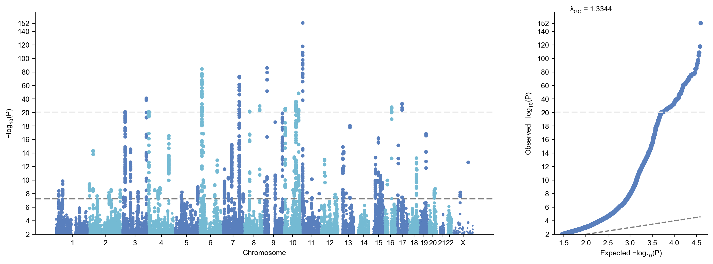
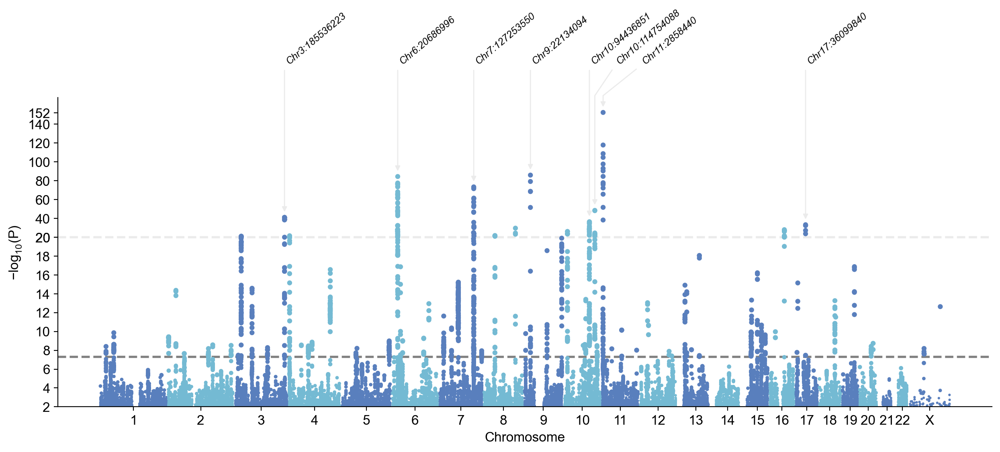
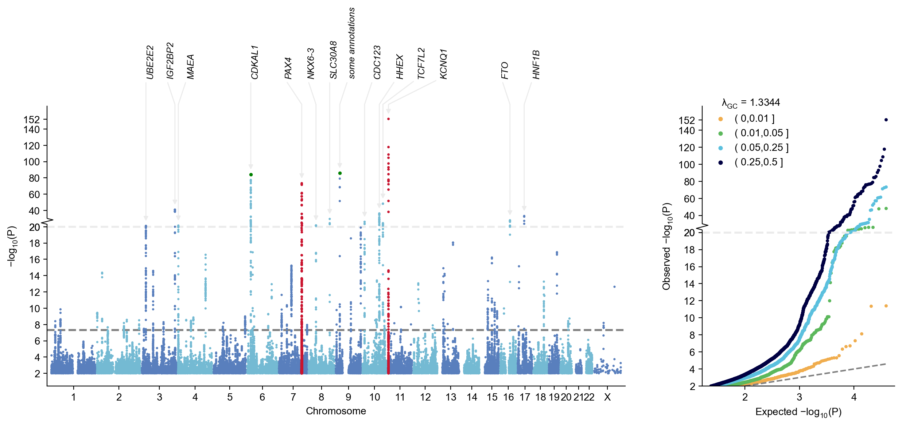
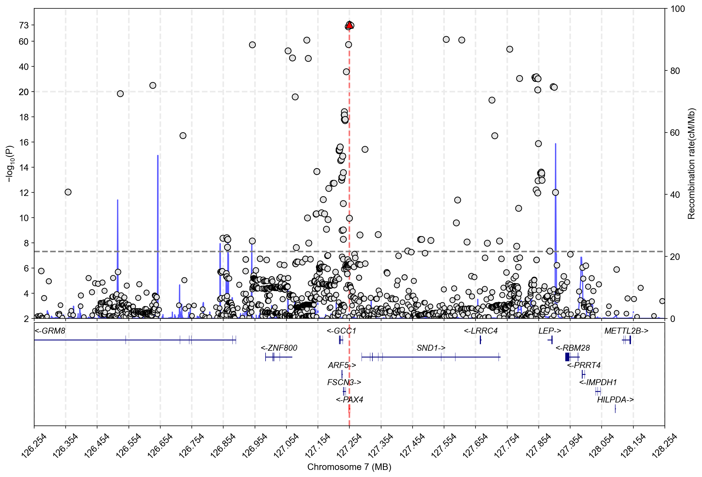
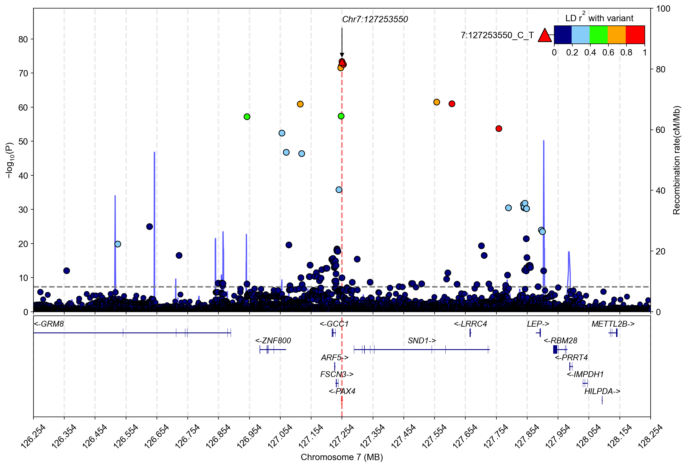

# Tutorial for gwaslab 4.0.0

- In this tutorial, we provide a brief overview of the core functions in GWASLab for summary statistics quality control (QC), standardization, and harmonization.
- We also demonstrate visualization features, including Manhattan plots, Q–Q plots, and regional plots.
- The Jupyter notebook for this tutorial can be downloaded from https://github.com/Cloufield/gwaslab/blob/main/docs/tutorial_v4.ipynb
- Please note that the sample data and reference files are available on GitHub, while the full processed reference datasets are currently hosted on Dropbox.


## Download sample data

- Using a Jupyter notebook, we first download a sample dataset.
- The sample dataset we will use as an example (File size: ~40M):
  1. Sample sumstats `bbj_t2d_hm3_chr7_variants.txt.gz`: processed sumstats (only HapMap3 variants and chr7 region) of type 2 diabetes from BBJ (K. Suzuki et al., Nature Genetics. 51, 379–386 (2019).)
  2. SNPID-rsID conversion table (sample) `1kg_dbsnp151_hg19_auto_hm3_chr7_variants.txt.gz`
  3. dbSNP VCF (sample) `b157_2564.vcf.gz`
  4. 1KG EAS reference VCF (only chr7:126253550-128253550) `1kg_eas_hg19.chr7_126253550_128253550.vcf.gz`
    

```python
!git clone https://github.com/Cloufield/gwaslab-sample-data.git
```

```python
!ls  gwaslab-sample-data
```

**stdout:**
```
1kg_dbsnp151_hg19_auto_hm3_chr7_variants.txt.gz
1kg_eas_hg19.chr7_126253550_128253550.vcf.gz
1kg_eas_hg19.chr7_126253550_128253550.vcf.gz.tbi
LICENSE
README.md
b157_2564.vcf.gz
b157_2564.vcf.gz.tbi
bbj_t2d_hm3_chr7_variants.txt.gz
chr7.fasta.gz
eas_ldscores
```

## Import gwaslab package

📖 **Documentation**: [Import gwaslab package](https://cloufield.github.io/gwaslab/)


GWASLab can be installed using pip: 

```python
# !pip install gwaslab==4.0.0
```

If you installed gwaslab from pip, simply run the command to import the package:

```python
import gwaslab as gl
```

Alternatively, if you want to use the latest development version from GitHub, you can clone the repository and import the package by inserting your package path into the system path:

```python
#!git clone https://github.com/Cloufield/gwaslab.git

import sys
sys.path.insert(0,"/home/yunye/work/gwaslab/src")
import gwaslab as gl
```

## Loading data into gwaslab Sumstats

📖 **Documentation**: [Loading data into gwaslab Sumstats](https://cloufield.github.io/gwaslab/SumstatsObject/)


Let's import the raw sumstats into the `gwaslab.Sumstats` object by specifying the necessary columns.

```python
mysumstats = gl.Sumstats("gwaslab-sample-data/bbj_t2d_hm3_chr7_variants.txt.gz",
             snpid="SNPID",
             chrom="CHR",
             pos="POS",
             ea="EA",
             nea="NEA",
             neaf="EAF",
             beta="BETA",
             se="SE",
             p="P",
             n="N",
             sep="\t")
```

**stdout:**
```
2025/12/25 20:50:19 GWASLab v4.0.0 https://cloufield.github.io/gwaslab/
2025/12/25 20:50:19 (C) 2022-2025, Yunye He, Kamatani Lab, GPL-3.0 license, gwaslab@gmail.com
2025/12/25 20:50:19 Python version: 3.12.0 | packaged by conda-forge | (main, Oct  3 2023, 08:43:22) [GCC 12.3.0]
2025/12/25 20:50:19 Start to initialize gl.Sumstats from file :gwaslab-sample-data/bbj_t2d_hm3_chr7_variants.txt.gz
2025/12/25 20:50:21  -Reading columns          : CHR,POS,SNPID,BETA,P,NEA,SE,N,EAF,EA
2025/12/25 20:50:21  -Renaming columns to      : CHR,POS,SNPID,BETA,P,NEA,SE,N,EAF,EA
2025/12/25 20:50:21  -Current Dataframe shape : 1103020  x  10
2025/12/25 20:50:21  -Initiating a status column: STATUS ...
2025/12/25 20:50:21 #WARNING! Version of genomic coordinates is unknown...
2025/12/25 20:50:21  -NEAF is specified...
2025/12/25 20:50:21  -Checking if 0<= NEAF <=1 ...
2025/12/25 20:50:21  -Converted NEAF to EAF.
2025/12/25 20:50:21  -Removed 0 variants with bad NEAF.
2025/12/25 20:50:21 Start to reorder the columns ...(v4.0.0)
2025/12/25 20:50:21  -Reordering columns to    : SNPID,CHR,POS,EA,NEA,STATUS,EAF,BETA,SE,P,N
2025/12/25 20:50:21 Finished reordering the columns.
2025/12/25 20:50:21  -Trying to convert datatype for CHR: string -> Int64...Failed...
2025/12/25 20:50:21  -Column  : SNPID  CHR    POS   EA       NEA      STATUS EAF     BETA    SE      P       N    
2025/12/25 20:50:21  -DType   : object string int64 category category int64  float64 float64 float64 float64 int64
2025/12/25 20:50:21  -Verified: T      F      T     T        T        T      T       T       T       T       T    
2025/12/25 20:50:21 #WARNING! Columns with possibly incompatible dtypes: CHR
2025/12/25 20:50:21 #WARNING! Consider using Sumstats.fix_chr() to fix CHR dtype
2025/12/25 20:50:21  -Current Dataframe memory usage: 87.32 MB
2025/12/25 20:50:21 Finished loading data successfully!
```

## Loading by specifying keyword in formatbook

📖 **Documentation**: [Loading by specifying keyword in formatbook](https://cloufield.github.io/gwaslab/SumstatsObject/)


Alternatively, you can specify format keywords listed in the formatbook (https://github.com/Cloufield/formatbook):  

```python
# mysumstats = gl.Sumstats("gwaslab-sample-data/bbj_t2d_hm3_chr7_variants.txt.gz", fmt="gwaslab", verbose=True)
```

## Sumstats.data

📖 **Documentation**: [Sumstats.data](https://cloufield.github.io/gwaslab/SumstatsObject/)


Sumstats are stored in `Sumstats.data` as a pandas DataFrame. You can check the data like: 

```python
mysumstats.data
```

| SNPID | CHR | POS | EA | NEA | STATUS | EAF | BETA | SE | P | N |
| --- | --- | --- | --- | --- | --- | --- | --- | --- | --- | --- |
| 1:752566_G_A | 1 | 752566 | G | A | 9999999 | 0.8422 | -0.0155 | 0.0131 | 0.2350 | 166718 |
| 1:752721_A_G | 1 | 752721 | G | A | 9999999 | 0.2507 | 0.0204 | 0.0147 | 0.1650 | 166718 |
| 1:754182_A_G | 1 | 754182 | G | A | 9999999 | 0.2505 | 0.0222 | 0.0166 | 0.1817 | 166718 |
| 1:760912_C_T | 1 | 760912 | C | T | 9999999 | 0.8425 | -0.0171 | 0.0148 | 0.2480 | 166718 |
| 1:761147_T_C | 1 | 761147 | C | T | 9999999 | 0.1581 | 0.0171 | 0.0148 | 0.2480 | 166718 |
| ... | ... | ... | ... | ... | ... | ... | ... | ... | ... | ... |
| X:154343911_A_G | X | 154343911 | G | A | 9999999 | 0.8058 | 0.0019 | 0.0090 | 0.8297 | 191764 |
| X:154379088_C_A | X | 154379088 | C | A | 9999999 | 0.7783 | 0.0027 | 0.0094 | 0.7723 | 191764 |
| X:154536836_C_T | X | 154536836 | C | T | 9999999 | 0.2196 | -0.0084 | 0.0085 | 0.3192 | 191764 |
| X:154763036_A_G | X | 154763036 | G | A | 9999999 | 0.3686 | -0.0102 | 0.0105 | 0.3302 | 191764 |
| X:154816439_A_C | X | 154816439 | C | A | 9999999 | 0.2339 | -0.0083 | 0.0100 | 0.4021 | 191764 |

*[1103020 rows x 11 columns]*

- For details on the GWASLab Sumstats object, see: https://cloufield.github.io/gwaslab/SumstatsObject/

## Standardization & QC : `.basic_check()`

📖 **Documentation**: [Standardization & QC : `.basic_check()`](https://cloufield.github.io/gwaslab/QC&Filtering/)


It is necessary to check variant ID (SNPID), rsID, chromosome (CHR), base pair position (POS), alleles (EA and NEA), and statistics before any manipulations or analysis. GWASLab provides an all-in-one function for this: `.basic_check()`.

**Note**: Sometimes you need to run this before plotting if the sumstats are not in a standard format.

```python
#check SNPID,rsID,CHR,POS,EA, NEA and statistics
mysumstats.basic_check()
```

**stdout:**
```
2025/12/25 20:50:21 Start to check SNPID/rsID ...(v4.0.0)
2025/12/25 20:50:21  -Current Dataframe shape : 1103020 x 11 ; Memory usage: 87.32 MB
2025/12/25 20:50:21  -Checking SNPID data type...
2025/12/25 20:50:21  -Converted datatype for SNPID: object -> string
2025/12/25 20:50:21  -Checking NA strings :na,NA,Na,Nan,NaN,<NA>,null,NULL,#N/A,#VALUE!,N/A,n/a,missing,
2025/12/25 20:50:21  -Checking if SNPID contains NA strings...
2025/12/25 20:50:21  -Checking if SNPID is CHR:POS:NEA:EA...(separator: - ,: , _)
2025/12/25 20:50:22 Finished checking SNPID/rsID.
2025/12/25 20:50:22 Start to fix chromosome notation (CHR) ...(v4.0.0)
2025/12/25 20:50:22  -Checking CHR data type...
2025/12/25 20:50:22  -Variants with standardized chromosome notation: 1100517
2025/12/25 20:50:22  -Variants with fixable chromosome notations: 2503
2025/12/25 20:50:22  -No unrecognized chromosome notations...
2025/12/25 20:50:22  -Identifying non-autosomal chromosomes : X, Y, and MT ...
2025/12/25 20:50:22  -Identified  2503  variants on sex chromosomes...
2025/12/25 20:50:22  -Standardizing sex chromosome notations: X to 23...
2025/12/25 20:50:22 Finished fixing chromosome notation (CHR).
2025/12/25 20:50:22 Start to fix basepair positions (POS) ...(v4.0.0)
2025/12/25 20:50:22  -Trying to convert datatype for POS: int64 -> Int64...
2025/12/25 20:50:22  -Position bound:(0 , 250,000,000)
2025/12/25 20:50:22  -Removed variants outliers: 0
2025/12/25 20:50:22 Finished fixing basepair positions (POS).
2025/12/25 20:50:22 Start to fix alleles (EA and NEA) ...(v4.0.0)
2025/12/25 20:50:22  -Converted all bases to string datatype and UPPERCASE
2025/12/25 20:50:23  -Variants with bad EA: 0
2025/12/25 20:50:23  -Variants with bad NEA: 0
2025/12/25 20:50:23  -Variants with NA for EA or NEA: 0
2025/12/25 20:50:23  -Variants with same EA and NEA: 0
2025/12/25 20:50:23  -Detected 0 variants with alleles that contain bases other than A/C/T/G .
2025/12/25 20:50:23 Finished fixing alleles (EA and NEA).
2025/12/25 20:50:23 Start to perform sanity check for statistics ...(v4.0.0)
2025/12/25 20:50:23  -Comparison tolerance for floats: 1e-07
2025/12/25 20:50:23  -Checking if any columns are empty...
2025/12/25 20:50:23  -Checking if 0 <= N <= 2147483647 ...
2025/12/25 20:50:24  -Removed 0 variants with bad/na N.
2025/12/25 20:50:24  -Checking if -1e-07 < EAF < 1.0000001 ...
2025/12/25 20:50:24  -Removed 0 variants with bad/na EAF.
2025/12/25 20:50:24  -Checking if -1e-07 < P < 1.0000001 ...
2025/12/25 20:50:24  -Removed 0 variants with bad/na P.
2025/12/25 20:50:24  -Checking if -100.0000001 < BETA < 100.0000001 ...
2025/12/25 20:50:24  -Removed 0 variants with bad/na BETA.
2025/12/25 20:50:24  -Checking if -1e-07 < SE < inf ...
2025/12/25 20:50:24  -Removed 0 variants with bad/na SE.
2025/12/25 20:50:24  -Checking STATUS and converting STATUS to Int64....
2025/12/25 20:50:24  -Removed 0 variants with bad statistics in total.
2025/12/25 20:50:24  -Data types for each column:
2025/12/25 20:50:24 Finished sanity check for statistics.
2025/12/25 20:50:24 Start to check data consistency across columns ...(v4.0.0)
2025/12/25 20:50:24  -Tolerance: 0.001 (Relative) and 0.001 (Absolute)
2025/12/25 20:50:24  -Checking if BETA/SE-derived-P is consistent with P...
2025/12/25 20:50:27   -Potentially inconsistent (likely due to rounding): 380165 variant(s)
2025/12/25 20:50:27   -Variant SNPID with max difference: X:15800751_G_A with 0.006652248071004951
2025/12/25 20:50:27  -Note: Minor differences are typically due to rounding.
2025/12/25 20:50:27   -If the max difference is greater than expected, please check your original sumstats.
2025/12/25 20:50:27 Finished checking data consistency across columns.
2025/12/25 20:50:27 Start to normalize indels ...(v4.0.0)
2025/12/25 20:50:27  -No available variants to normalize..
2025/12/25 20:50:27 Finished normalizing indels.
2025/12/25 20:50:27 Start to sort the genome coordinates ...(v4.0.0)
2025/12/25 20:50:27 Finished sorting coordinates.
2025/12/25 20:50:27 Start to reorder the columns ...(v4.0.0)
2025/12/25 20:50:27  -Reordering columns to    : SNPID,CHR,POS,EA,NEA,STATUS,EAF,BETA,SE,P,N
2025/12/25 20:50:27 Finished reordering the columns.
```

| SNPID | CHR | POS | EA | NEA | STATUS | EAF | BETA | SE | P | N |
| --- | --- | --- | --- | --- | --- | --- | --- | --- | --- | --- |
| 1:752566_G_A | 1 | 752566 | G | A | 9960099 | 0.8422 | -0.0155 | 0.0131 | 0.2350 | 166718 |
| 1:752721_A_G | 1 | 752721 | G | A | 9960099 | 0.2507 | 0.0204 | 0.0147 | 0.1650 | 166718 |
| 1:754182_A_G | 1 | 754182 | G | A | 9960099 | 0.2505 | 0.0222 | 0.0166 | 0.1817 | 166718 |
| 1:760912_C_T | 1 | 760912 | C | T | 9960099 | 0.8425 | -0.0171 | 0.0148 | 0.2480 | 166718 |
| 1:761147_T_C | 1 | 761147 | C | T | 9960099 | 0.1581 | 0.0171 | 0.0148 | 0.2480 | 166718 |
| ... | ... | ... | ... | ... | ... | ... | ... | ... | ... | ... |
| X:154343911_A_G | 23 | 154343911 | G | A | 9960099 | 0.8058 | 0.0019 | 0.0090 | 0.8297 | 191764 |
| X:154379088_C_A | 23 | 154379088 | C | A | 9960099 | 0.7783 | 0.0027 | 0.0094 | 0.7723 | 191764 |
| X:154536836_C_T | 23 | 154536836 | C | T | 9960099 | 0.2196 | -0.0084 | 0.0085 | 0.3192 | 191764 |
| X:154763036_A_G | 23 | 154763036 | G | A | 9960099 | 0.3686 | -0.0102 | 0.0105 | 0.3302 | 191764 |
| X:154816439_A_C | 23 | 154816439 | C | A | 9960099 | 0.2339 | -0.0083 | 0.0100 | 0.4021 | 191764 |

## Infer genome build

📖 **Documentation**: [Infer genome build](https://cloufield.github.io/gwaslab/InferBuild/)


If the genome build is not specified, GWASLab can infer it based on HapMap3 SNPs. For more details, see: https://cloufield.github.io/gwaslab/InferBuild/

```python
mysumstats.infer_build()
```

**stdout:**
```
2025/12/25 20:50:27  -Genomic coordinates are based on GRCh37/hg19...
2025/12/25 20:50:27 Start to infer genome build version using hapmap3 SNPs ...(v4.0.0)
2025/12/25 20:50:27  -Loading Hapmap3 variants data...
2025/12/25 20:50:31  -CHR and POS will be used for matching...
2025/12/25 20:50:32  -Matching variants for hg19: num_hg19 =  1092430
2025/12/25 20:50:32  -Matching variants for hg38: num_hg38 =  10807
2025/12/25 20:50:32  -Since num_hg19 >> num_hg38, set the genome build to hg19 for the STATUS code....
2025/12/25 20:50:33 Finished inferring genome build version using hapmap3 SNPs.
```

## Create Manhattan plots and Q-Q plots

📖 **Documentation**: [Create Manhattan plots and Q-Q plots](https://cloufield.github.io/gwaslab/Visualization/)


Next you’ll probably want to check is the Manhattan and Q–Q plots for your summary statistics.
gwaslab performs a minimal QC on the data automatically when generating these plots.

```python
mysumstats.plot_mqq()
```

**stdout:**
```
2025/12/25 20:50:33 Configured plot style for plot_mqq:mqq
2025/12/25 20:50:33  -QC is finished according to meta. Quick QC will be skipped.
2025/12/25 20:50:33 Starting Manhattan-QQ plot creation (Version v4.0.0)
2025/12/25 20:50:33  -Genomic coordinates are based on GRCh37/hg19...
2025/12/25 20:50:33  - Genomic coordinates version: 19 ...
2025/12/25 20:50:33  - Genome-wide significance level to plot is set to 5e-08 ...
2025/12/25 20:50:33  - Input sumstats contains 1103020 variants...
2025/12/25 20:50:33  - Manhattan-QQ plot layout mode selected: mqq
2025/12/25 20:50:33  -POS data type is already numeric. Skipping conversion...
2025/12/25 20:50:33  -CHR data type is already numeric. Skipping conversion...
2025/12/25 20:50:33 Finished loading specified columns from the statistics
2025/12/25 20:50:33 Start data conversion and sanity check:
2025/12/25 20:50:33  -Sanity check will be skipped.
2025/12/25 20:50:33  -Sanity check after conversion: 0 variants with P value outside of (0,1] will be removed...
2025/12/25 20:50:33  -Sumstats P values are being converted to -log10(P)...
2025/12/25 20:50:33  -Sanity check: 0 na/inf/-inf variants will be removed...
2025/12/25 20:50:33  -Converting data above cut line...
2025/12/25 20:50:33  -Maximum -log10(P) value is 152.39254497678533 .
2025/12/25 20:50:33 Finished data conversion and sanity check.
2025/12/25 20:50:33 Start to create Manhattan-QQ plot with 1103020 variants...
2025/12/25 20:50:34  -Creating background plot...
2025/12/25 20:50:36 Finished creating Manhattan-QQ plot successfully
2025/12/25 20:50:36 Start to extract variants for annotation...
2025/12/25 20:50:36  -Found 75 significant variants with a sliding window size of 500 kb...
2025/12/25 20:50:36 Finished extracting variants for annotation...
2025/12/25 20:50:36  -Processing X ticks...
2025/12/25 20:50:36  -Processing X labels...
2025/12/25 20:50:36  -Processing Y labels...
2025/12/25 20:50:36  -Processing Y tick lables...
2025/12/25 20:50:36  -Processing Y labels...
2025/12/25 20:50:36  -Processing lines...
2025/12/25 20:50:36 Start to create QQ plot with 1103020 variants:
2025/12/25 20:50:36  -Plotting all variants...
2025/12/25 20:50:36  -Expected range of P: (0,1.0)
2025/12/25 20:50:36  -Lambda GC (MLOG10P mode) at 0.5 is   1.33437
2025/12/25 20:50:36  -Processing Y tick lables...
2025/12/25 20:50:36 Finished creating QQ plot successfully!
2025/12/25 20:50:36 Start to save figure...
2025/12/25 20:50:36  -Skip saving figure!
2025/12/25 20:50:36 Finished saving figure...
2025/12/25 20:50:37 Finished creating plot successfully
```


Using `.plot_mqq()`, you can easily plot the Manhattan and Q–Q plots. However, plotting all points without any adjustments may not be informative in this case, and it can take a relatively long time. The most significant locus may dwarf other less significant loci. To adjust the plot, GWASLab provides a wide range of customization options. For example, we can use `skip` and `cut`:

- `skip`: skip variants with MLOG10P < `skip` for faster plotting speed
- `cut`: rescale the MLOG10P values when MLOG10P > `cut`  

```python
mysumstats.plot_mqq(skip=2, cut=20)
```

**stdout:**
```
2025/12/25 20:50:43 Configured plot style for plot_mqq:mqq
2025/12/25 20:50:43  -QC is finished according to meta. Quick QC will be skipped.
2025/12/25 20:50:43 Starting Manhattan-QQ plot creation (Version v4.0.0)
2025/12/25 20:50:43  -Genomic coordinates are based on GRCh37/hg19...
2025/12/25 20:50:43  - Genomic coordinates version: 19 ...
2025/12/25 20:50:43  - Genome-wide significance level to plot is set to 5e-08 ...
2025/12/25 20:50:43  - Input sumstats contains 1103020 variants...
2025/12/25 20:50:43  - Manhattan-QQ plot layout mode selected: mqq
2025/12/25 20:50:43  -POS data type is already numeric. Skipping conversion...
2025/12/25 20:50:43  -CHR data type is already numeric. Skipping conversion...
2025/12/25 20:50:43 Finished loading specified columns from the statistics
2025/12/25 20:50:43 Start data conversion and sanity check:
2025/12/25 20:50:43  -Sanity check will be skipped.
2025/12/25 20:50:43  -Sanity check after conversion: 0 variants with P value outside of (0,1] will be removed...
2025/12/25 20:50:43  -Sumstats P values are being converted to -log10(P)...
2025/12/25 20:50:43  -Sanity check: 0 na/inf/-inf variants will be removed...
2025/12/25 20:50:43  -Converting data above cut line...
2025/12/25 20:50:43  -Maximum -log10(P) value is 152.39254497678533 .
2025/12/25 20:50:43  -Minus log10(P) values above 20 will be shrunk with a shrinkage factor of 10...
2025/12/25 20:50:43 Finished data conversion and sanity check.
2025/12/25 20:50:43 Start to create Manhattan-QQ plot with 38995 variants...
2025/12/25 20:50:43  -Creating background plot...
2025/12/25 20:50:44 Finished creating Manhattan-QQ plot successfully
2025/12/25 20:50:44 Start to extract variants for annotation...
2025/12/25 20:50:44  -Found 75 significant variants with a sliding window size of 500 kb...
2025/12/25 20:50:44 Finished extracting variants for annotation...
2025/12/25 20:50:44  -Processing X ticks...
2025/12/25 20:50:44  -Processing X labels...
2025/12/25 20:50:44  -Processing Y labels...
2025/12/25 20:50:44  -Processing Y tick lables...
2025/12/25 20:50:44  -Processing Y labels...
2025/12/25 20:50:44  -Processing lines...
2025/12/25 20:50:44 Start to create QQ plot with 38995 variants:
2025/12/25 20:50:44  -Plotting all variants...
2025/12/25 20:50:44  -Expected range of P: (0,1.0)
2025/12/25 20:50:44  -Lambda GC (MLOG10P mode) at 0.5 is   1.33437
2025/12/25 20:50:44  -Processing Y tick lables...
2025/12/25 20:50:44 Finished creating QQ plot successfully!
2025/12/25 20:50:44 Start to save figure...
2025/12/25 20:50:44  -Skip saving figure!
2025/12/25 20:50:44 Finished saving figure...
2025/12/25 20:50:44 Finished creating plot successfully
```



This looks better now. But what if we want to annotate some of the most significant loci (for example, lead variants with MLOG10P > 30) and only plot the Manhattan plot?

```python
mysumstats.plot_mqq(skip=2, cut=20, mode="m", anno=True, anno_sig_level=1e-30)
```

**stdout:**
```
2025/12/25 20:50:44 Configured plot style for plot_mqq:m
2025/12/25 20:50:44  -QC is finished according to meta. Quick QC will be skipped.
2025/12/25 20:50:44 Starting Manhattan plot creation (Version v4.0.0)
2025/12/25 20:50:44  -Genomic coordinates are based on GRCh37/hg19...
2025/12/25 20:50:44  - Genomic coordinates version: 19 ...
2025/12/25 20:50:44  - Genome-wide significance level to plot is set to 5e-08 ...
2025/12/25 20:50:44  - Input sumstats contains 1103020 variants...
2025/12/25 20:50:44  - Manhattan plot layout mode selected: m
2025/12/25 20:50:45  -POS data type is already numeric. Skipping conversion...
2025/12/25 20:50:45  -CHR data type is already numeric. Skipping conversion...
2025/12/25 20:50:45 Finished loading specified columns from the statistics
2025/12/25 20:50:45 Start data conversion and sanity check:
2025/12/25 20:50:45  -Sanity check will be skipped.
2025/12/25 20:50:45  -Sanity check after conversion: 0 variants with P value outside of (0,1] will be removed...
2025/12/25 20:50:45  -Sumstats P values are being converted to -log10(P)...
2025/12/25 20:50:45  -Sanity check: 0 na/inf/-inf variants will be removed...
2025/12/25 20:50:45  -Converting data above cut line...
2025/12/25 20:50:45  -Maximum -log10(P) value is 152.39254497678533 .
2025/12/25 20:50:45  -Minus log10(P) values above 20 will be shrunk with a shrinkage factor of 10...
2025/12/25 20:50:45 Finished data conversion and sanity check.
2025/12/25 20:50:45 Start to create Manhattan plot with 38995 variants...
2025/12/25 20:50:45  -Creating background plot...
2025/12/25 20:50:45 Finished creating Manhattan plot successfully
2025/12/25 20:50:45 Start to extract variants for annotation...
2025/12/25 20:50:45  -Found 8 significant variants with a sliding window size of 500 kb...
2025/12/25 20:50:45 Finished extracting variants for annotation...
2025/12/25 20:50:45  -Processing X ticks...
2025/12/25 20:50:45  -Processing X labels...
2025/12/25 20:50:45  -Processing Y labels...
2025/12/25 20:50:45  -Processing Y tick lables...
2025/12/25 20:50:45  -Processing Y labels...
2025/12/25 20:50:45  -Processing lines...
2025/12/25 20:50:45  -Annotating using column CHR:POS...
2025/12/25 20:50:45  -Adjusting text positions with repel_force=0.03...
2025/12/25 20:50:45 Start to save figure...
2025/12/25 20:50:45  -Skip saving figure!
2025/12/25 20:50:45 Finished saving figure...
2025/12/25 20:50:45 Finished creating plot successfully
```



GWASLab supports a wide range of customizable options. For details on other options for Manhattan and Q–Q plots, see: https://cloufield.github.io/gwaslab/Visualization/

```python
mysumstats.data
```

| SNPID | CHR | POS | EA | NEA | STATUS | EAF | BETA | SE | P | N |
| --- | --- | --- | --- | --- | --- | --- | --- | --- | --- | --- |
| 1:752566_G_A | 1 | 752566 | G | A | 1960099 | 0.8422 | -0.0155 | 0.0131 | 0.2350 | 166718 |
| 1:752721_A_G | 1 | 752721 | G | A | 1960099 | 0.2507 | 0.0204 | 0.0147 | 0.1650 | 166718 |
| 1:754182_A_G | 1 | 754182 | G | A | 1960099 | 0.2505 | 0.0222 | 0.0166 | 0.1817 | 166718 |
| 1:760912_C_T | 1 | 760912 | C | T | 1960099 | 0.8425 | -0.0171 | 0.0148 | 0.2480 | 166718 |
| 1:761147_T_C | 1 | 761147 | C | T | 1960099 | 0.1581 | 0.0171 | 0.0148 | 0.2480 | 166718 |
| ... | ... | ... | ... | ... | ... | ... | ... | ... | ... | ... |
| X:154343911_A_G | 23 | 154343911 | G | A | 1960099 | 0.8058 | 0.0019 | 0.0090 | 0.8297 | 191764 |
| X:154379088_C_A | 23 | 154379088 | C | A | 1960099 | 0.7783 | 0.0027 | 0.0094 | 0.7723 | 191764 |
| X:154536836_C_T | 23 | 154536836 | C | T | 1960099 | 0.2196 | -0.0084 | 0.0085 | 0.3192 | 191764 |
| X:154763036_A_G | 23 | 154763036 | G | A | 1960099 | 0.3686 | -0.0102 | 0.0105 | 0.3302 | 191764 |
| X:154816439_A_C | 23 | 154816439 | C | A | 1960099 | 0.2339 | -0.0083 | 0.0100 | 0.4021 | 191764 |

*[1103020 rows x 11 columns]*

By checking the log, we can see that the sumstats look good. However, we still found several variants that were not normalized. GWASLab fixed the position and alleles for the unnormalized indels. GWASLab also standardized the notation for chromosome X to 23.

In fact, `.basic_check()` is a wrapper of the following basic functions, you can also use these separately.

- mysumstats.fix_ID()
- mysumstats.fix_chr()
- mysumstats.fix_pos()
- mysumstats.fix_allele()
- mysumstats.check_sanity()
- mysumstats.check_data_consistency()
- mysumstats.normalize_allele()
- mysumstats.remove_dup()

For other options, see: https://cloufield.github.io/gwaslab/Standardization/

## Extract lead variants : get_lead()

📖 **Documentation**: [Extract lead variants : get_lead()](https://cloufield.github.io/gwaslab/ExtractNovel/)


Let's extract the lead variants in each significant locus to check our data.

The significant loci are detected based on a sliding window (default window size: `windowsizekb=500` kb).

By specifying `anno=True`, GWASLab will also annotate the lead variant with its nearest gene names and distance.

**Note**: If you did not specify the build when loading the summary statistics or have not run `.infer_build()`, you need to explicitly set `build="19"` (GRCh37/hg19) or `build="38"` (GRCh38/hg38) here for annotation.

**Note**: GWASLab will download reference files when you run it for the first time. In this case, `ensembl_hg19_gtf_protein_coding` was downloaded and processed automatically.

```python
mysumstats.get_lead(anno=True)
```

**stdout:**
```
2025/12/25 20:50:46  -Genomic coordinates are based on GRCh37/hg19...
2025/12/25 20:50:46 Start to extract lead variants ...(v4.0.0)
2025/12/25 20:50:46  -Processing 1103020 variants...
2025/12/25 20:50:46  -Significance threshold : 5e-08
2025/12/25 20:50:46  -Sliding window size: 500  kb
2025/12/25 20:50:46  -Using P for extracting lead variants...
2025/12/25 20:50:46  -Found 1271 significant variants in total...
2025/12/25 20:50:46  -Identified 75 lead variants!
2025/12/25 20:50:46  -Annotating variants using references:ensembl
2025/12/25 20:50:46  -Annotating variants using references based on genome build:19
2025/12/25 20:50:46  -Genomic coordinates are based on GRCh37/hg19...
2025/12/25 20:50:46 Start to annotate variants with nearest gene name(s) ...(v4.0.0)
2025/12/25 20:50:46  -Current Dataframe shape : 75 x 12 ; Memory usage: 0.03 MB
2025/12/25 20:50:46  -Genomic coordinates are based on GRCh37/hg19...
2025/12/25 20:50:46  -Assigning Gene name using ensembl_hg19_gtf for protein coding genes
2025/12/25 20:50:46  -Loading and indexing GTF file...
2025/12/25 20:50:49  -Processing variants by chromosome...
2025/12/25 20:50:49    -Processed 2 variants on chromosome 1
2025/12/25 20:50:49    -Processed 6 variants on chromosome 2
2025/12/25 20:50:49    -Processed 5 variants on chromosome 3
2025/12/25 20:50:49    -Processed 5 variants on chromosome 4
2025/12/25 20:50:49    -Processed 3 variants on chromosome 5
2025/12/25 20:50:49    -Processed 5 variants on chromosome 6
2025/12/25 20:50:49    -Processed 6 variants on chromosome 7
2025/12/25 20:50:49    -Processed 2 variants on chromosome 8
2025/12/25 20:50:49    -Processed 4 variants on chromosome 9
2025/12/25 20:50:49    -Processed 8 variants on chromosome 10
2025/12/25 20:50:49    -Processed 4 variants on chromosome 11
2025/12/25 20:50:49    -Processed 4 variants on chromosome 12
2025/12/25 20:50:49    -Processed 4 variants on chromosome 13
2025/12/25 20:50:49    -Processed 5 variants on chromosome 15
2025/12/25 20:50:49    -Processed 2 variants on chromosome 16
2025/12/25 20:50:49    -Processed 3 variants on chromosome 17
2025/12/25 20:50:49    -Processed 2 variants on chromosome 18
2025/12/25 20:50:49    -Processed 1 variants on chromosome 19
2025/12/25 20:50:49    -Processed 2 variants on chromosome 20
2025/12/25 20:50:49    -Processed 2 variants on chromosome 23
2025/12/25 20:50:49 Finished annotating variants with nearest gene name(s) successfully!.
2025/12/25 20:50:49 Finished extracting lead variants.
```

| SNPID | CHR | POS | EA | NEA | STATUS | EAF | BETA | SE | P | N | LOCATION | GENE |
| --- | --- | --- | --- | --- | --- | --- | --- | --- | --- | --- | --- | --- |
| 1:22046558_A_C | 1 | 22046558 | C | A | 1960099 | 0.2527 | 0.0607 | 0.0103 | 3.941000e-09 | 191764 | 0 | USP48 |
| 1:51174330_C_T | 1 | 51174330 | C | T | 1960099 | 0.7902 | 0.0723 | 0.0113 | 1.380000e-10 | 191764 | 0 | FAF1 |
| 2:637597_C_T | 2 | 637597 | C | T | 1960099 | 0.9017 | 0.0938 | 0.0150 | 3.725000e-10 | 191764 | -29738 | TMEM18 |
| 2:27742603_T_C | 2 | 27742603 | C | T | 1960099 | 0.5613 | -0.0690 | 0.0088 | 4.358000e-15 | 191764 | 0 | GCKR |
| 2:58959112_G_A | 2 | 58959112 | G | A | 1960099 | 0.1754 | 0.0654 | 0.0117 | 2.237000e-08 | 191764 | 490605 | FANCL |
| ... | ... | ... | ... | ... | ... | ... | ... | ... | ... | ... | ... | ... |
| 19:46158643_G_T | 19 | 46158643 | G | T | 1960099 | 0.6372 | 0.0805 | 0.0094 | 1.332000e-17 | 191764 | 9756 | EML2 |
| 20:42989777_G_A | 20 | 42989777 | G | A | 1960099 | 0.4503 | 0.0518 | 0.0088 | 3.770000e-09 | 191764 | 0 | HNF4A |
| 20:50155386_T_C | 20 | 50155386 | C | T | 1960099 | 0.4266 | 0.0538 | 0.0090 | 1.836000e-09 | 191764 | 0 | NFATC2 |
| X:57150010_C_T | 23 | 57150010 | C | T | 1960099 | 0.3012 | 0.0443 | 0.0076 | 6.427000e-09 | 191764 | 1000000 | Unknown |
| X:117916520_A_G | 23 | 117916520 | G | A | 1960099 | 0.5681 | -0.0507 | 0.0069 | 2.330000e-13 | 191764 | 1000000 | Unknown |

*[75 rows x 13 columns]*

We extracted a total of 75 lead variants with a sliding window size of 500 kb from this processed dataset.

For other options, see: https://cloufield.github.io/gwaslab/ExtractLead/

## Use the SNPID to create some highly customized mqq plot

📖 **Documentation**: [Use the SNPID to create some highly customized mqq plot](https://cloufield.github.io/gwaslab/Visualization/)


GWASLab can create highly customized Manhattan plots.

For example:
- Annotate the lead variants with closest gene names (threshold for annotation p < 1e-20)
- Annotate selected variants with user-provided texts
- Pinpoint some variants
- Highlight some loci
- MAF-stratified Q–Q plot
- Save as `my_first_mqq_plot.png` with `{"dpi":400,"facecolor":"white"}`

```python
mysumstats.plot_mqq(mode="mqq",
                    cut=20,
                    skip=2,
                    anno="GENENAME",
                    anno_sig_level=1e-20,
                    anno_alias={"9:22134094_T_C":"some annotations"},
                    anno_style="expand",
                    xpad=0.01,
                    pinpoint=["9:22134094_T_C","6:20686996_C_A"], 
                    pinpoint_color="green",
                    highlight=["7:127253550_C_T","11:2858440_G_A"],
                    highlight_windowkb=1000,
                    stratified=True,
                    jagged=True,
                    marker_size=(5,5),
                    fig_kwargs={"figsize":(15,5),"dpi":300},
                    save="my_first_mqq_plot.png", 
                    save_kwargs={"dpi":400,"facecolor":"white"})
```

**stdout:**
```
2025/12/25 20:50:49 Configured plot style for plot_mqq:mqq
2025/12/25 20:50:49  -QC is finished according to meta. Quick QC will be skipped.
2025/12/25 20:50:49 Starting Manhattan-QQ plot creation (Version v4.0.0)
2025/12/25 20:50:49  -Genomic coordinates are based on GRCh37/hg19...
2025/12/25 20:50:49  - Genomic coordinates version: 19 ...
2025/12/25 20:50:49  - Genome-wide significance level to plot is set to 5e-08 ...
2025/12/25 20:50:49  - Input sumstats contains 1103020 variants...
2025/12/25 20:50:49  - Manhattan-QQ plot layout mode selected: mqq
2025/12/25 20:50:49  -Highlight locis (#CB132D): 7:127253550_C_T,11:2858440_G_A
2025/12/25 20:50:49   -highlight_windowkb is set to: 1000 kb
2025/12/25 20:50:49  -Pinpoint variants (green): 9:22134094_T_C,6:20686996_C_A
2025/12/25 20:50:49  -POS data type is already numeric. Skipping conversion...
2025/12/25 20:50:49  -CHR data type is already numeric. Skipping conversion...
2025/12/25 20:50:49  -EAF data type is already numeric. Skipping conversion...
2025/12/25 20:50:49 Finished loading specified columns from the statistics
2025/12/25 20:50:49 Start data conversion and sanity check:
2025/12/25 20:50:49  -Sanity check will be skipped.
2025/12/25 20:50:49  -Sanity check after conversion: 0 variants with P value outside of (0,1] will be removed...
2025/12/25 20:50:49  -Sumstats P values are being converted to -log10(P)...
2025/12/25 20:50:49  -Sanity check: 0 na/inf/-inf variants will be removed...
2025/12/25 20:50:49  -Converting data above cut line...
2025/12/25 20:50:49  -Maximum -log10(P) value is 152.39254497678533 .
2025/12/25 20:50:49  -Minus log10(P) values above 20 will be shrunk with a shrinkage factor of 10...
2025/12/25 20:50:49 Finished data conversion and sanity check.
2025/12/25 20:50:49 Start to create Manhattan-QQ plot with 38995 variants...
2025/12/25 20:50:50  -Creating background plot...
2025/12/25 20:50:50  -Highlighting target loci...
2025/12/25 20:50:50  -Pinpointing target vairants...
2025/12/25 20:50:50 Finished creating Manhattan-QQ plot successfully
2025/12/25 20:50:50 Start to extract variants for annotation...
2025/12/25 20:50:50  -Found 14 significant variants with a sliding window size of 500 kb...
2025/12/25 20:50:50  -Genomic coordinates are based on GRCh37/hg19...
2025/12/25 20:50:50 Start to annotate variants with nearest gene name(s) ...(v4.0.0)
2025/12/25 20:50:50  -Current Dataframe shape : 14 x 13 ; Memory usage: 0.00 MB
2025/12/25 20:50:50  -Genomic coordinates are based on GRCh37/hg19...
2025/12/25 20:50:50  -Assigning Gene name using ensembl_hg19_gtf for protein coding genes
2025/12/25 20:50:50  -Loading and indexing GTF file...
2025/12/25 20:50:52  -Processing variants by chromosome...
2025/12/25 20:50:52    -Processed 2 variants on chromosome 3
2025/12/25 20:50:52    -Processed 1 variants on chromosome 4
2025/12/25 20:50:52    -Processed 1 variants on chromosome 6
2025/12/25 20:50:52    -Processed 1 variants on chromosome 7
2025/12/25 20:50:52    -Processed 2 variants on chromosome 8
2025/12/25 20:50:52    -Processed 1 variants on chromosome 9
2025/12/25 20:50:52    -Processed 3 variants on chromosome 10
2025/12/25 20:50:52    -Processed 1 variants on chromosome 11
2025/12/25 20:50:52    -Processed 1 variants on chromosome 16
2025/12/25 20:50:52    -Processed 1 variants on chromosome 17
2025/12/25 20:50:52 Finished annotating variants with nearest gene name(s) successfully!.
2025/12/25 20:50:52 Finished extracting variants for annotation...
2025/12/25 20:50:52  -Processing X ticks...
2025/12/25 20:50:52  -Processing X labels...
2025/12/25 20:50:52  -Processing Y labels...
2025/12/25 20:50:52  -Processing Y tick lables...
2025/12/25 20:50:52  -Processing Y labels...
2025/12/25 20:50:52  -Processing lines...
2025/12/25 20:50:52  -Processing jagged Y axis...
2025/12/25 20:50:52  -Processing jagged Y axis...
2025/12/25 20:50:52  -Adjusting X padding on both side: 0.01
2025/12/25 20:50:52 Start to create QQ plot with 38995 variants:
2025/12/25 20:50:52  -Plotting variants stratified by MAF...
2025/12/25 20:50:52  -Lambda GC (MLOG10P mode) at 0.5 is   1.33437
2025/12/25 20:50:52  -Processing Y tick lables...
2025/12/25 20:50:52 Finished creating QQ plot successfully!
2025/12/25 20:50:52  -Annotating using column GENENAME...
2025/12/25 20:50:52  -Adjusting text positions with repel_force=0.03...
2025/12/25 20:50:52 Start to save figure...
2025/12/25 20:50:53  -Saved to my_first_mqq_plot.png successfully! (png) (overwrite)
2025/12/25 20:50:53 Finished saving figure...
2025/12/25 20:50:54 Finished creating plot successfully
```



For details, see: https://cloufield.github.io/gwaslab/Visualization/

## Quick regional plot without LD-information

📖 **Documentation**: [Quick regional plot without LD-information](https://cloufield.github.io/gwaslab/RegionalPlot/)


GWASLab can also plot regional plots with or without LD reference files.

For details, see: https://cloufield.github.io/gwaslab/RegionalPlot/

We first create a regional plot without LD references by specifying `mode` and `region`.

```python
mysumstats.plot_mqq(mode="r",skip=2,cut=20, region=(7,126253550,128253550),region_grid=True)
```

**stdout:**
```
2025/12/25 20:50:55 Filtered out args for `plot_mqq`: highlight
2025/12/25 20:50:55 Configured plot style for plot_mqq:r
2025/12/25 20:50:55  -QC is finished according to meta. Quick QC will be skipped.
2025/12/25 20:50:55 Starting Region plot creation (Version v4.0.0)
2025/12/25 20:50:55  -Genomic coordinates are based on GRCh37/hg19...
2025/12/25 20:50:55  - Genomic coordinates version: 19 ...
2025/12/25 20:50:55  - Genome-wide significance level to plot is set to 5e-08 ...
2025/12/25 20:50:55  - Input sumstats contains 1103020 variants...
2025/12/25 20:50:55  - Region plot layout mode selected: r
2025/12/25 20:50:55  -Region to plot : chr7:126253550-128253550.
2025/12/25 20:50:55  -POS data type is already numeric. Skipping conversion...
2025/12/25 20:50:55  -CHR data type is already numeric. Skipping conversion...
2025/12/25 20:50:55  -Normalized region: (CHR=7, START=126253550, END=128253550)
2025/12/25 20:50:55 Start to filter variants within a specific genomic region ...(v4.0.0)
2025/12/25 20:50:55  -Current Dataframe shape : 1103020 x 7 ; Memory usage: 48.41 MB
2025/12/25 20:50:55  -Extract SNPs in region : chr7:126253550-128253550...
2025/12/25 20:50:55  -Extract SNPs in specified regions: 8857
2025/12/25 20:50:55  -Filtered out variants: 1094163
2025/12/25 20:50:55  -Current Dataframe shape : 8857 x 7 ; Memory usage: 0.48 MB
2025/12/25 20:50:55 Finished filtering variants.
2025/12/25 20:50:55 Finished loading specified columns from the statistics
2025/12/25 20:50:55 Start data conversion and sanity check:
2025/12/25 20:50:55  -Sanity check will be skipped.
2025/12/25 20:50:55  -Sanity check after conversion: 0 variants with P value outside of (0,1] will be removed...
2025/12/25 20:50:55  -Sumstats P values are being converted to -log10(P)...
2025/12/25 20:50:55  -Sanity check: 0 na/inf/-inf variants will be removed...
2025/12/25 20:50:55  -Converting data above cut line...
2025/12/25 20:50:55  -Maximum -log10(P) value is 73.38711023071251 .
2025/12/25 20:50:55  -Minus log10(P) values above 20 will be shrunk with a shrinkage factor of 10...
2025/12/25 20:50:55 Finished data conversion and sanity check.
2025/12/25 20:50:55 Start to create Region plot with 1878 variants...
2025/12/25 20:50:55  -Creating background plot...
2025/12/25 20:50:55 Configured plot style for plot_region:r
2025/12/25 20:50:55  -Extracting lead variant...
2025/12/25 20:50:55  -Loading gtf files from:default
2025/12/25 20:50:59  -plotting gene track..
2025/12/25 20:50:59  -plotting genes: 14..
2025/12/25 20:50:59  -plotting exons: 675..
2025/12/25 20:50:59  -Finished plotting gene track..
2025/12/25 20:50:59 Finished creating Region plot successfully
2025/12/25 20:50:59 Start to extract variants for annotation...
2025/12/25 20:50:59  -Found 1 significant variants with a sliding window size of 500 kb...
2025/12/25 20:50:59 Finished extracting variants for annotation...
2025/12/25 20:50:59  -Processing X ticks...
2025/12/25 20:50:59  -Processing X labels...
2025/12/25 20:50:59  -Processing Y labels...
2025/12/25 20:50:59  -Processing Y tick lables...
2025/12/25 20:50:59  -Processing Y labels...
2025/12/25 20:50:59  -Processing lines...
2025/12/25 20:50:59 Start to save figure...
2025/12/25 20:50:59  -Skip saving figure!
2025/12/25 20:50:59 Finished saving figure...
2025/12/25 20:51:00 Finished creating plot successfully
```



## Reference file downloading

📖 **Documentation**: [Reference file downloading](https://cloufield.github.io/gwaslab/Download/)


Full regional plots with LD information will require either user-provided VCF files or preprocessed VCF files by GWASLab (e.g., 1000 Genomes project; see Reference: https://cloufield.github.io/gwaslab/Reference/).

GWASLab provides preprocessed 1KG datasets for downloading.

### check available reference from gwaslab

📖 **Documentation**: [# check available reference from gwaslab](https://cloufield.github.io/gwaslab/Download/)


Update the available reference list first if needed:

```python
gl.check_available_ref()
```

**stdout:**
```
2025/12/25 20:51:00 Start to check available reference files...
2025/12/25 20:51:00  - Avaiable keywords:  1kg_eas_hg19 1kg_eur_hg19 1kg_eas_hg38 1kg_eur_hg38 1kg_sas_hg19 1kg_amr_hg19 1kg_sas_hg38 1kg_amr_hg38 1kg_afr_hg19 1kg_pan_hg19 1kg_afr_hg38 1kg_pan_hg38 dbsnp_v151_hg19 dbsnp_v151_hg38 dbsnp_v157_hg19 dbsnp_v157_hg38 ucsc_genome_hg19 ucsc_genome_hg38 1kg_dbsnp151_hg19_auto 1kg_dbsnp151_hg38_auto recombination_hg19 recombination_hg38 ensembl_hg19_gtf ensembl_hg38_gtf refseq_hg19_gtf refseq_hg38_gtf testlink 19to38 38to19 1kg_hm3_hg38_eaf 1kg_hm3_hg19_eaf
```

```
{'1kg_eas_hg19': {'description': '1000 Genomes Project East Asian (1KG EAS) VCF on the hg19 reference. Multi-allelic variants were decomposed. Variants were normalized. The INFO field includes the AF annotation, representing allele frequency in the EAS population.',
  'suggested_use': 'LD reference panel for creating region plot; infer strand for EAS population'},
 '1kg_eur_hg19': {'description': '1000 Genomes Project European (1KG EUR) VCF on the hg19 reference. Multi-allelic variants were decomposed. Variants were normalized. The INFO field includes the AF annotation, representing allele frequency in the EUR population.',
  'suggested_use': 'LD reference panel for creating region plot; infer strand for EUR population'},
 '1kg_eas_hg38': {'description': '1000 Genomes Project East Asian (1KG EAS) VCF on the hg38 reference. Multi-allelic variants were decomposed. Variants were normalized. The INFO field includes the AF annotation, representing allele frequency in the EAS population.',
  'suggested_use': 'LD reference panel for creating region plot; infer strand for EAS population'},
 '1kg_eur_hg38': {'description': '1000 Genomes Project European (1KG EUR) VCF on the hg38 reference. Multi-allelic variants were decomposed. Variants were normalized. The INFO field includes the AF annotation, representing allele frequency in the EUR population.',
  'suggested_use': 'LD reference panel for creating region plot; infer strand for EUR population'},
 '1kg_sas_hg19': {'description': '1000 Genomes Project South Asian (1KG SAS) VCF on the hg19 reference. Multi-allelic variants were decomposed. Variants were normalized. The INFO field includes the AF annotation, representing allele frequency in the SAS population.',
  'suggested_use': 'LD reference panel for creating region plot; infer strand for SAS population'},
 '1kg_amr_hg19': {'description': '1000 Genomes Project American (1KG AMR) VCF on the hg19 reference. Multi-allelic variants were decomposed. Variants were normalized. The INFO field includes the AF annotation, representing allele frequency in the AMR population.',
  'suggested_use': 'LD reference panel for creating region plot; infer strand for AMR population'},
 '1kg_sas_hg38': {'description': '1000 Genomes Project South Asian (1KG SAS) VCF on the hg38 reference. Multi-allelic variants were decomposed. Variants were normalized. The INFO field includes the AF annotation, representing allele frequency in the SAS population.',
  'suggested_use': 'LD reference panel for creating region plot; infer strand for SAS population'},
 '1kg_amr_hg38': {'description': '1000 Genomes Project American (1KG AMR) VCF on the hg38 reference. Multi-allelic variants were decomposed. Variants were normalized. The INFO field includes the AF annotation, representing allele frequency in the AMR population.',
  'suggested_use': 'LD reference panel for creating region plot; infer strand for AMR population'},
 '1kg_afr_hg19': {'description': '1000 Genomes Project African (1KG AFR) VCF on the hg19 reference. Multi-allelic variants were decomposed. Variants were normalized. The INFO field includes the AF annotation, representing allele frequency in the AFR population.',
  'suggested_use': 'LD reference panel for creating region plot; infer strand for AFR population'},
 '1kg_pan_hg19': {'description': '1000 Genomes Project Pan-ancestry (1KG PAN) VCF on the hg19 reference. Multi-allelic variants were decomposed. Variants were normalized. The INFO field includes the AF annotation, representing allele frequency in the PAN population.',
  'suggested_use': 'LD reference panel for creating region plot; infer strand for PAN population'},
 '1kg_afr_hg38': {'description': '1000 Genomes Project African (1KG AFR) VCF on the hg38 reference. Multi-allelic variants were decomposed. Variants were normalized. The INFO field includes the AF annotation, representing allele frequency in the AFR population.',
  'suggested_use': 'LD reference panel for creating region plot; infer strand for AFR population'},
 '1kg_pan_hg38': {'description': '1000 Genomes Project Pan-ancestry (1KG PAN) VCF on the hg38 reference. Multi-allelic variants were decomposed. Variants were normalized. The INFO field includes the AF annotation, representing allele frequency in the PAN population.',
  'suggested_use': 'LD reference panel for creating region plot; infer strand for PAN population'},
 'dbsnp_v151_hg19': {'description': 'dbSNP v151 hg19 is the 2018 release of the dbSNP database mapped to the human genome assembly GRCh37/hg19, providing standardized rsID identifiers and allele information for known genetic variants.',
  'suggested_use': 'rsID assignment'},
 'dbsnp_v151_hg38': {'description': 'dbSNP v151 hg38 is the 2018 release of the dbSNP database mapped to the human genome assembly GRCh38, providing standardized rsID identifiers and allele information for known genetic variants.',
  'suggested_use': 'rsID assignment'},
 'dbsnp_v157_hg19': {'description': 'dbSNP v157 hg19 is the release of the dbSNP database mapped to the human genome assembly GRCh37/hg19, providing standardized rsID identifiers and allele information for known genetic variants.',
  'suggested_use': 'rsID assignment'},
 'dbsnp_v157_hg38': {'description': 'dbSNP v157 hg38 is the release of the dbSNP database mapped to the human genome assembly GRCh38, providing standardized rsID identifiers and allele information for known genetic variants.',
  'suggested_use': 'rsID assignment'},
 'ucsc_genome_hg19': {'description': 'UCSC Genome reference sequence on hg19 (GRCh37), providing the complete human genome assembly used for alignment and variant annotation.',
  'suggested_use': 'Reference genome for alignment and annotation'},
 'ucsc_genome_hg38': {'description': 'UCSC Genome reference sequence on hg38 (GRCh38), providing the complete human genome assembly used for alignment and variant annotation.',
  'suggested_use': 'Reference genome for alignment and annotation'},
 '1kg_dbsnp151_hg19_auto': {'description': '1KG dbSNP151 hg19 auto variants table containing SNP ID, chromosome, position, effect allele, non-effect allele, and rsID mappings for autosomal variants.',
  'suggested_use': 'SNP annotation and rsID mapping'},
 '1kg_dbsnp151_hg38_auto': {'description': '1KG dbSNP151 hg38 auto variants table containing SNP ID, chromosome, position, effect allele, non-effect allele, and rsID mappings for autosomal variants.',
  'suggested_use': 'SNP annotation and rsID mapping'},
 'recombination_hg19': {'description': 'Recombination map for hg19 (GRCh37), providing genetic distance estimates in centimorgans used for linkage disequilibrium and haplotype analysis.',
  'suggested_use': 'Genetic mapping and LD calculations'},
 'recombination_hg38': {'description': 'Recombination map for hg38 (GRCh38), providing genetic distance estimates in centimorgans used for linkage disequilibrium and haplotype analysis.',
  'suggested_use': 'Genetic mapping and LD calculations'},
 'ensembl_hg19_gtf': {'description': 'Ensembl annotation for hg19 (GRCh37) release 87, providing comprehensive gene models, transcript structures, and functional annotations for the human genome.',
  'suggested_use': 'Gene annotation and functional analysis'},
 'ensembl_hg38_gtf': {'description': 'Ensembl annotation for hg38 (GRCh38) release 109, providing comprehensive gene models, transcript structures, and functional annotations for the human genome.',
  'suggested_use': 'Gene annotation and functional analysis'},
 'refseq_hg19_gtf': {'description': 'RefSeq annotation for hg19 (GRCh37), providing curated gene models and transcript structures for the human genome.',
  'suggested_use': 'Gene annotation and functional analysis'},
 'refseq_hg38_gtf': {'description': 'RefSeq annotation for hg38 (GRCh38), providing curated gene models and transcript structures for the human genome.',
  'suggested_use': 'Gene annotation and functional analysis'},
 'testlink': {'description': 'Test link', 'suggested_use': ''},
 '19to38': {'description': 'LiftOver chain file for converting genomic coordinates from hg19 (GRCh37) to hg38 (GRCh38) reference builds, enabling cross-reference genome analysis.',
  'suggested_use': 'Genome build conversion and coordinate remapping'},
 '38to19': {'description': 'LiftOver chain file for converting genomic coordinates from hg38 (GRCh38) to hg19 (GRCh37) reference builds, enabling cross-reference genome analysis.',
  'suggested_use': 'Genome build conversion and coordinate remapping'},
 '1kg_hm3_hg38_eaf': {'description': '1KG HapMap3 hg38 EAF (GRCh38) provides allele frequency estimates for the HapMap3 populations on the hg38 reference genome, derived from 1000 Genomes Project data.',
  'suggested_use': 'Ancestry inference and population structure analysis'},
 '1kg_hm3_hg19_eaf': {'description': '1KG HapMap3 hg19 EAF (GRCh37) provides allele frequency estimates for the HapMap3 populations on the hg19 reference genome, derived from 1000 Genomes Project data.',
  'suggested_use': 'Ancestry inference and population structure analysis'}}
```

You can see the currently available reference files (from the original source or preprocessed by GWASLab). 

### download reference using gwaslab

📖 **Documentation**: [# download reference using gwaslab](https://cloufield.github.io/gwaslab/Download/)


Select the keyword and use `download_ref` to download the files. The downloaded files will be placed in `~/.gwaslab` by default.
- `1kg_eas_hg19`: processed 1000 Genomes Project EAS samples dataset (hg19; ~2.8GB). It may take several minutes to download.

```python
# ~2.8GB
# gl.download_ref("1kg_eas_hg19")
```

```python
# gl.check_downloaded_ref()
```

After downloading, use `get_path` to obtain the file path by specifying the keyword.

```python
# gl.get_path("1kg_eas_hg19")
```

**Note**: 
- If `tabix` is available in PATH, the speed will be greatly improved. Otherwise, vcf files will be loaded from the head. 
- tabix: http://www.htslib.org/download/

### Region plots with or with out LD reference files.

📖 **Documentation**: [# Region plots with or with out LD reference files....](https://cloufield.github.io/gwaslab/RegionalPlot/)


To create a regional plot with LD information, you need to pass the path of the reference VCF to `vcf_path`.

- For this tutorial, we use the `1kg_eas_hg19.chr7_126253550_128253550.vcf.gz` included in the sample dataset.
- You can also use the downloaded preprocessed file like `vcf_path = gl.get_path("1kg_eas_hg19")` or your own VCF files.

```python
# gl.download_ref("ensembl_hg19_gtf")
```

```python
mysumstats.plot_mqq(mode="r",
                    region=(7,126253550,128253550),
                    region_grid=True,
                    anno=True,
                    anno_kwargs={"rotation":0,"fontsize":12},
                    vcf_path="gwaslab-sample-data/1kg_eas_hg19.chr7_126253550_128253550.vcf.gz")
```

**stdout:**
```
2025/12/25 20:51:00 Filtered out args for `plot_mqq`: highlight
2025/12/25 20:51:00 Configured plot style for plot_mqq:r
2025/12/25 20:51:00  -QC is finished according to meta. Quick QC will be skipped.
2025/12/25 20:51:00 Starting Region plot creation (Version v4.0.0)
2025/12/25 20:51:00  -Genomic coordinates are based on GRCh37/hg19...
2025/12/25 20:51:00  - Genomic coordinates version: 19 ...
2025/12/25 20:51:00  - Genome-wide significance level to plot is set to 5e-08 ...
2025/12/25 20:51:00  - Input sumstats contains 1103020 variants...
2025/12/25 20:51:00  - Region plot layout mode selected: r
2025/12/25 20:51:00  -Region to plot : chr7:126253550-128253550.
2025/12/25 20:51:00  -POS data type is already numeric. Skipping conversion...
2025/12/25 20:51:00  -CHR data type is already numeric. Skipping conversion...
2025/12/25 20:51:00  -Normalized region: (CHR=7, START=126253550, END=128253550)
2025/12/25 20:51:00 Start to filter variants within a specific genomic region ...(v4.0.0)
2025/12/25 20:51:00  -Current Dataframe shape : 1103020 x 7 ; Memory usage: 48.41 MB
2025/12/25 20:51:00  -Extract SNPs in region : chr7:126253550-128253550...
2025/12/25 20:51:00  -Extract SNPs in specified regions: 8857
2025/12/25 20:51:00  -Filtered out variants: 1094163
2025/12/25 20:51:00  -Current Dataframe shape : 8857 x 7 ; Memory usage: 0.48 MB
2025/12/25 20:51:00 Finished filtering variants.
2025/12/25 20:51:00 Finished loading specified columns from the statistics
2025/12/25 20:51:00 Start data conversion and sanity check:
2025/12/25 20:51:00  -Sanity check will be skipped.
2025/12/25 20:51:00  -Sanity check after conversion: 0 variants with P value outside of (0,1] will be removed...
2025/12/25 20:51:00  -Sumstats P values are being converted to -log10(P)...
2025/12/25 20:51:00  -Sanity check: 0 na/inf/-inf variants will be removed...
2025/12/25 20:51:00  -Converting data above cut line...
2025/12/25 20:51:00  -Maximum -log10(P) value is 73.38711023071251 .
2025/12/25 20:51:00 Finished data conversion and sanity check.
2025/12/25 20:51:00 Start to create Region plot with 8857 variants...
2025/12/25 20:51:00  -tabix will be used: /home/yunye/tools/bin/tabix
2025/12/25 20:51:00  -Checking chromosome notations in VCF/BCF files...
2025/12/25 20:51:01  -Checking prefix for chromosomes in VCF/BCF files...
2025/12/25 20:51:01  -No prefix for chromosomes in the VCF/BCF files.
2025/12/25 20:51:01 Start to load reference genotype...
2025/12/25 20:51:01  -reference vcf path : gwaslab-sample-data/1kg_eas_hg19.chr7_126253550_128253550.vcf.gz
2025/12/25 20:51:04  -Retrieving index...
2025/12/25 20:51:04  -Ref variants in the region: 54234
2025/12/25 20:51:04  -Matching variants using POS, NEA, EA ...
2025/12/25 20:51:04  -Calculating Rsq...
2025/12/25 20:51:04 Finished loading reference genotype successfully!
2025/12/25 20:51:04  -Creating background plot...
2025/12/25 20:51:04 Configured plot style for plot_region:r
2025/12/25 20:51:04  -Extracting lead variant...
2025/12/25 20:51:04  -Loading gtf files from:default
2025/12/25 20:51:08  -plotting gene track..
2025/12/25 20:51:08  -plotting genes: 14..
2025/12/25 20:51:08  -plotting exons: 675..
2025/12/25 20:51:08  -Finished plotting gene track..
2025/12/25 20:51:08 Finished creating Region plot successfully
2025/12/25 20:51:08 Start to extract variants for annotation...
2025/12/25 20:51:08  -Found 1 significant variants with a sliding window size of 500 kb...
2025/12/25 20:51:08 Finished extracting variants for annotation...
2025/12/25 20:51:08  -Processing X ticks...
2025/12/25 20:51:08  -Processing X labels...
2025/12/25 20:51:08  -Processing Y labels...
2025/12/25 20:51:08  -Processing Y tick lables...
2025/12/25 20:51:08  -Processing Y labels...
2025/12/25 20:51:08  -Processing color bar...
2025/12/25 20:51:08  -Processing lines...
2025/12/25 20:51:08  -Annotating using column CHR:POS...
2025/12/25 20:51:08  -Adjusting text positions with repel_force=0.03...
2025/12/25 20:51:08 Start to save figure...
2025/12/25 20:51:08  -Skip saving figure!
2025/12/25 20:51:08 Finished saving figure...
2025/12/25 20:51:09 Finished creating plot successfully
```



**Note**: 
- GWASLab's default genome build version is `build="19"` (GRCh37/hg19). You can change it to `build="38"` (GRCh38/hg38) when needed.
- For gene tracks, the default is `gtf_path="ensembl"`. You can also use `gtf_path="refseq"` (NCBI RefSeq).

## Annotate rsID

📖 **Documentation**: [Annotate rsID](https://cloufield.github.io/gwaslab/AssignrsID/)


rsID is assigned using two types of reference files:
- `ref_rsid_tsv`: TSV file for annotation of commonly used variants
- `ref_rsid_vcf`: VCF file for annotation of other variants

GWASLab provides preprocessed TSV files for 1KG variants (~80M). We can download the file using `.download_ref` with keywords. This time we will use `1kg_dbsnp151_hg19_auto`, which is the SNPID-rsID conversion table for autosomal variants in the 1KG project (hg19). This will take around a few minutes to download.

```python
# 961M
# gl.download_ref("1kg_dbsnp151_hg19_auto")
```

For now, we use the `1kg_dbsnp151_hg19_auto_hm3_chr7_variants.txt.gz` included in the sample dataset.

```python
mysumstats.assign_rsid(ref_rsid_tsv="gwaslab-sample-data/1kg_dbsnp151_hg19_auto_hm3_chr7_variants.txt.gz")
```

**stdout:**
```
2025/12/25 20:51:10 Start to assign rsID using reference file ...(v4.0.0)
2025/12/25 20:51:10  -Current Dataframe shape : 1103020 x 11 ; Memory usage: 79.97 MB
2025/12/25 20:51:10  -1103020 rsID could be possibly fixed...
2025/12/25 20:51:10  -Setting block size:  5000000
2025/12/25 20:51:10  -Loading block: 0   
2025/12/25 20:51:12  -rsID annotation for 1103020 needed to be fixed!
2025/12/25 20:51:12  -Annotated 0 rsID successfully!
2025/12/25 20:51:13  -Current Dataframe shape : 1103020 x 12 ; Memory usage: 88.38 MB
2025/12/25 20:51:13 Finished assign rsID using reference file.
```

| SNPID | CHR | POS | EA | NEA | STATUS | EAF | BETA | SE | P | N | rsID |
| --- | --- | --- | --- | --- | --- | --- | --- | --- | --- | --- | --- |
| 1:752566_G_A | 1 | 752566 | G | A | 1960099 | 0.8422 | -0.0155 | 0.0131 | 0.2350 | 166718 | <NA> |
| 1:752721_A_G | 1 | 752721 | G | A | 1960099 | 0.2507 | 0.0204 | 0.0147 | 0.1650 | 166718 | <NA> |
| 1:754182_A_G | 1 | 754182 | G | A | 1960099 | 0.2505 | 0.0222 | 0.0166 | 0.1817 | 166718 | <NA> |
| 1:760912_C_T | 1 | 760912 | C | T | 1960099 | 0.8425 | -0.0171 | 0.0148 | 0.2480 | 166718 | <NA> |
| 1:761147_T_C | 1 | 761147 | C | T | 1960099 | 0.1581 | 0.0171 | 0.0148 | 0.2480 | 166718 | <NA> |
| ... | ... | ... | ... | ... | ... | ... | ... | ... | ... | ... | ... |
| X:154343911_A_G | 23 | 154343911 | G | A | 1960099 | 0.8058 | 0.0019 | 0.0090 | 0.8297 | 191764 | <NA> |
| X:154379088_C_A | 23 | 154379088 | C | A | 1960099 | 0.7783 | 0.0027 | 0.0094 | 0.7723 | 191764 | <NA> |
| X:154536836_C_T | 23 | 154536836 | C | T | 1960099 | 0.2196 | -0.0084 | 0.0085 | 0.3192 | 191764 | <NA> |
| X:154763036_A_G | 23 | 154763036 | G | A | 1960099 | 0.3686 | -0.0102 | 0.0105 | 0.3302 | 191764 | <NA> |
| X:154816439_A_C | 23 | 154816439 | C | A | 1960099 | 0.2339 | -0.0083 | 0.0100 | 0.4021 | 191764 | <NA> |

For the annotation of less common variants, we can use VCF files downloaded from NCBI dbSNP (https://ftp.ncbi.nih.gov/snp/latest_release/VCF/).

**Note**:
- The file size is huge (>20GB) and it might take several hours to download. (We can skip this step in this tutorial.)
- Specify `chr_dict` to match the chromosome notations in sumstats and VCF files.

Parameters:
- `ref_rsid_vcf`: the path to the reference rsID VCF file
- `threads`: number of threads to use

For this tutorial, we use `b157_2564.vcf.gz` in the sample dataset, which is extracted from the b157 version of dbSNP VCF.

```python
### normal mode
```

```python
mysumstats.assign_rsid(threads=1,
                       ref_rsid_vcf="gwaslab-sample-data/b157_2564.vcf.gz"
                       #chr_dict = gl.get_number_to_NC(build="19")
                      )
```

**stdout:**
```
2025/12/25 20:51:13 Start to assign rsID using reference file ...(v4.0.0)
2025/12/25 20:51:13  -Checking chromosome notations in VCF/BCF files...
2025/12/25 20:51:13   -RefSeq ID detected (hg19) in VCF/BCF...
2025/12/25 20:51:13  -Assigning rsID based on CHR:POS and REF:ALT/ALT:REF...
2025/12/25 20:51:32  -rsID Annotation for 1100554 need to be fixed!
2025/12/25 20:51:32  -Annotated 2466 rsID successfully!
2025/12/25 20:51:32 Finished assign rsID using reference file.
```

| SNPID | CHR | POS | EA | NEA | STATUS | EAF | BETA | SE | P | N | rsID |
| --- | --- | --- | --- | --- | --- | --- | --- | --- | --- | --- | --- |
| 1:752566_G_A | 1 | 752566 | G | A | 1960099 | 0.8422 | -0.0155 | 0.0131 | 0.2350 | 166718 | <NA> |
| 1:752721_A_G | 1 | 752721 | G | A | 1960099 | 0.2507 | 0.0204 | 0.0147 | 0.1650 | 166718 | <NA> |
| 1:754182_A_G | 1 | 754182 | G | A | 1960099 | 0.2505 | 0.0222 | 0.0166 | 0.1817 | 166718 | <NA> |
| 1:760912_C_T | 1 | 760912 | C | T | 1960099 | 0.8425 | -0.0171 | 0.0148 | 0.2480 | 166718 | <NA> |
| 1:761147_T_C | 1 | 761147 | C | T | 1960099 | 0.1581 | 0.0171 | 0.0148 | 0.2480 | 166718 | <NA> |
| ... | ... | ... | ... | ... | ... | ... | ... | ... | ... | ... | ... |
| X:154343911_A_G | 23 | 154343911 | G | A | 1960099 | 0.8058 | 0.0019 | 0.0090 | 0.8297 | 191764 | rs4898358 |
| X:154379088_C_A | 23 | 154379088 | C | A | 1960099 | 0.7783 | 0.0027 | 0.0094 | 0.7723 | 191764 | rs5987090 |
| X:154536836_C_T | 23 | 154536836 | C | T | 1960099 | 0.2196 | -0.0084 | 0.0085 | 0.3192 | 191764 | rs12013168 |
| X:154763036_A_G | 23 | 154763036 | G | A | 1960099 | 0.3686 | -0.0102 | 0.0105 | 0.3302 | 191764 | rs5940466 |
| X:154816439_A_C | 23 | 154816439 | C | A | 1960099 | 0.2339 | -0.0083 | 0.0100 | 0.4021 | 191764 | rs1084451 |

After this, only 98 variants were not annotated, mostly indels that are not available in the reference VCF.

```python
mysumstats.data.loc[mysumstats.data["rsID"].isna(),:]
```

| SNPID | CHR | POS | EA | NEA | STATUS | EAF | BETA | SE | P | N | rsID |
| --- | --- | --- | --- | --- | --- | --- | --- | --- | --- | --- | --- |
| 1:752566_G_A | 1 | 752566 | G | A | 1960099 | 0.8422 | -0.0155 | 0.0131 | 0.2350 | 166718 | <NA> |
| 1:752721_A_G | 1 | 752721 | G | A | 1960099 | 0.2507 | 0.0204 | 0.0147 | 0.1650 | 166718 | <NA> |
| 1:754182_A_G | 1 | 754182 | G | A | 1960099 | 0.2505 | 0.0222 | 0.0166 | 0.1817 | 166718 | <NA> |
| 1:760912_C_T | 1 | 760912 | C | T | 1960099 | 0.8425 | -0.0171 | 0.0148 | 0.2480 | 166718 | <NA> |
| 1:761147_T_C | 1 | 761147 | C | T | 1960099 | 0.1581 | 0.0171 | 0.0148 | 0.2480 | 166718 | <NA> |
| ... | ... | ... | ... | ... | ... | ... | ... | ... | ... | ... | ... |
| X:145493373_TAA_T | 23 | 145493373 | TAA | T | 1960399 | 0.1006 | 0.0098 | 0.0120 | 0.4141 | 191764 | <NA> |
| X:145943926_TA_T | 23 | 145943926 | TA | T | 1960399 | 0.5974 | -0.0076 | 0.0118 | 0.5213 | 191764 | <NA> |
| X:151172462_CGT_C | 23 | 151172462 | C | CGT | 1960399 | 0.7959 | 0.0066 | 0.0138 | 0.6319 | 191764 | <NA> |
| X:152032452_A_AT | 23 | 152032452 | AT | A | 1960399 | 0.9633 | 0.0111 | 0.0239 | 0.6411 | 191764 | <NA> |
| X:153254566_C_CTTT | 23 | 153254566 | C | CTTT | 1960399 | 0.6664 | -0.0014 | 0.0084 | 0.8677 | 191764 | <NA> |

*[1100554 rows x 12 columns]*

### fast implementation using bcftools: sweep mode

📖 **Documentation**: [# fast implementation using bcftools: sweep mode...](https://cloufield.github.io/gwaslab/AssignrsID/)


```python
mysumstats.assign_rsid2(path="gwaslab-sample-data/b157_2564.vcf.gz",overwrite="all")
```

**stdout:**
```
2025/12/25 20:51:33 Start to assign rsID from reference ...(v4.0.0)
2025/12/25 20:51:33  -Determining reference mode: vcf/bcf...
2025/12/25 20:51:33  -Extracting new lookup TSV from: gwaslab-sample-data/b157_2564.vcf.gz...
2025/12/25 20:51:33 Start to extract lookup table from vcf/bcf ...(v4.0.0)
2025/12/25 20:51:33  -Current Dataframe shape : 1103020 x 2 ; Memory usage: 27.35 MB
2025/12/25 20:51:33  -Checking chromosome notations in VCF/BCF files...
2025/12/25 20:51:33   -RefSeq ID detected (hg19) in VCF/BCF...
2025/12/25 20:51:33  -Running multiprocessing: 6 workers, 23 chromosomes
2025/12/25 20:51:33  -Calling: bcftools view -r <CHR> -T <TARGETS> -Ou <VCF>| bcftools query -f '<FMT>'
2025/12/25 20:51:33  -Finished: 5 3 1 4 2 6 9 10 8 12 7 11 15 13 18 16 14 17 19 21 22 23 20
2025/12/25 20:51:34  -Lookup table created: /tmp/tmpu8un07do.lookup.txt.gz
2025/12/25 20:51:34 Finished extracting lookup table from vcf/bcf.
2025/12/25 20:51:34 Start to assign from lookup table ...(v4.0.0)
2025/12/25 20:51:34  -Current Dataframe shape : 1103020 x 12 ; Memory usage: 88.38 MB
2025/12/25 20:51:34  -Detected allele mode: REF_ALT using ALT(EA/ALT) / REF(NEA/REF)...
2025/12/25 20:51:34  -Loaded 5,324 lookup rows...
2025/12/25 20:51:35  -Newly annotated sumstats rows: 2,466 (chunk lookup rows: 5,324) | New flips: 2,466
2025/12/25 20:51:35  -Total unique sumstats rows annotated: 2,466
2025/12/25 20:51:35  -Total unique rows with allele flips: 1,364
2025/12/25 20:51:35  -Current Dataframe shape : 1103020 x 13 ; Memory usage: 89.43 MB
2025/12/25 20:51:35 Finished assigning from lookup table.
2025/12/25 20:51:35  -Filled 2466 rsIDs...
2025/12/25 20:51:35  -rsID count: 2466 → 2466 / 1103020...
2025/12/25 20:51:35  -Finished assigning rsID from reference.
2025/12/25 20:51:35  -Current Dataframe shape : 1103020 x 13 ; Memory usage: 89.43 MB
2025/12/25 20:51:35 Finished assigning rsID from reference.
```

| SNPID | CHR | POS | EA | NEA | STATUS | EAF | BETA | SE | P | N | rsID | ALLELE_FLIPPED |
| --- | --- | --- | --- | --- | --- | --- | --- | --- | --- | --- | --- | --- |
| 1:752566_G_A | 1 | 752566 | G | A | 1960099 | 0.8422 | -0.0155 | 0.0131 | 0.2350 | 166718 | <NA> | False |
| 1:752721_A_G | 1 | 752721 | G | A | 1960099 | 0.2507 | 0.0204 | 0.0147 | 0.1650 | 166718 | <NA> | False |
| 1:754182_A_G | 1 | 754182 | G | A | 1960099 | 0.2505 | 0.0222 | 0.0166 | 0.1817 | 166718 | <NA> | False |
| 1:760912_C_T | 1 | 760912 | C | T | 1960099 | 0.8425 | -0.0171 | 0.0148 | 0.2480 | 166718 | <NA> | False |
| 1:761147_T_C | 1 | 761147 | C | T | 1960099 | 0.1581 | 0.0171 | 0.0148 | 0.2480 | 166718 | <NA> | False |
| ... | ... | ... | ... | ... | ... | ... | ... | ... | ... | ... | ... | ... |
| X:154343911_A_G | 23 | 154343911 | G | A | 1960099 | 0.8058 | 0.0019 | 0.0090 | 0.8297 | 191764 | rs4898358 | False |
| X:154379088_C_A | 23 | 154379088 | C | A | 1960099 | 0.7783 | 0.0027 | 0.0094 | 0.7723 | 191764 | rs5987090 | True |
| X:154536836_C_T | 23 | 154536836 | C | T | 1960099 | 0.2196 | -0.0084 | 0.0085 | 0.3192 | 191764 | rs12013168 | True |
| X:154763036_A_G | 23 | 154763036 | G | A | 1960099 | 0.3686 | -0.0102 | 0.0105 | 0.3302 | 191764 | rs5940466 | False |
| X:154816439_A_C | 23 | 154816439 | C | A | 1960099 | 0.2339 | -0.0083 | 0.0100 | 0.4021 | 191764 | rs1084451 | False |

## Harmonization

📖 **Documentation**: [Harmonization](https://cloufield.github.io/gwaslab/Harmonization/)


GWASLab can harmonize the sumstats based on reference files.

- `ref_seq`: reference genome FASTA file for allele alignment
- `ref_infer`: VCF file with allele frequency information for inferring strand and comparing allele frequency
- `ref_alt_freq`: field in INFO of VCF file for alternative allele frequency

For details see: https://cloufield.github.io/gwaslab/Harmonization/

For reference data, see: https://cloufield.github.io/gwaslab/Reference/

We can use the reference genome from 1000 Genomes. 

http://ftp.1000genomes.ebi.ac.uk/vol1/ftp/technical/reference/human_g1k_v37.fasta.gz
http://ftp.1000genomes.ebi.ac.uk/vol1/ftp/technical/reference/human_g1k_v37.fasta.fai

When calling `.harmonize()`, `.basic_check()` will be called first to make sure the dataset is ready for harmonization. Since we have already performed `basic_check`, we set `basic_check=False` here. For `ref_infer`, we pass the downloaded VCF files for 1KG EAS and specify the field for alternative allele frequency to AF by `ref_alt_freq="AF"`.  

```python
mysumstats.harmonize(basic_check=False,
                     threads=3,
                     ref_seq="gwaslab-sample-data/chr7.fasta.gz",
                     ref_infer="gwaslab-sample-data/1kg_eas_hg19.chr7_126253550_128253550.vcf.gz",
                     ref_alt_freq="AF")
```

**stdout:**
```
2025/12/25 20:51:35 Start to check if NEA is aligned with reference sequence ...(v4.0.0)
2025/12/25 20:51:35  -Reference genome FASTA file: gwaslab-sample-data/chr7.fasta.gz
2025/12/25 20:51:35    -Loading and building numpy fasta records:1  2  3  4  5  6  7  
2025/12/25 20:51:38  -Checking records
2025/12/25 20:51:38    -Checking records for ( len(NEA) <= 4 and len(EA) <= 4 )
2025/12/25 20:51:39    -Checking records for ( len(NEA) > 4 or len(EA) > 4 )
2025/12/25 20:51:39  -Finished checking records
2025/12/25 20:51:39  -Variants allele on given reference sequence :  32894
2025/12/25 20:51:39  -Variants flipped :  35188
2025/12/25 20:51:39   -Raw Matching rate :  6.17%
2025/12/25 20:51:39 #WARNING! Matching rate is low, please check if the right reference genome is used.
2025/12/25 20:51:39  -Variants inferred reverse_complement :  0
2025/12/25 20:51:39  -Variants inferred reverse_complement_flipped :  0
2025/12/25 20:51:39  -Both allele on genome + unable to distinguish :  693
2025/12/25 20:51:39  -Variants not on given reference sequence :  465521
2025/12/25 20:51:39 Finished checking if NEA is aligned with reference sequence.
2025/12/25 20:51:39 Start to adjust statistics based on STATUS code ...(v4.0.0)
2025/12/25 20:51:39 Start to flip allele-specific stats for SNPs with status xxxxx[35]x: ALT->EA , REF->NEA ...v4.0.0
2025/12/25 20:51:39  -Flipping 35,188 variants...
2025/12/25 20:51:39  -Swapping column: NEA <=> EA...
2025/12/25 20:51:39  -Flipping column: BETA = - BETA...
2025/12/25 20:51:39  -Flipping column: EAF = 1 - EAF...
2025/12/25 20:51:39  -Changed the status for flipped variants : xxxxx[35]x -> xxxxx[12]x
2025/12/25 20:51:39 Start to flip allele-specific stats for standardized indels with status xxxx[123][67][6]: ALT->EA , REF->NEA...v4.0.0
2025/12/25 20:51:39  -Flipping 693 variants...
2025/12/25 20:51:39  -Swapping column: NEA <=> EA...
2025/12/25 20:51:39  -Flipping column: BETA = - BETA...
2025/12/25 20:51:39  -Flipping column: EAF = 1 - EAF...
2025/12/25 20:51:39  -Changed the status for flipped variants xxxx[123][67]6 -> xxxx[123][67]4
2025/12/25 20:51:39 Start to flip allele-specific stats for palindromic SNPs with status xxxxx[12]5: (-)strand <=> (+)strand...v4.0.0
2025/12/25 20:51:39  -Flipping 68,082 variants...
2025/12/25 20:51:39  -Flipping column: BETA = - BETA...
2025/12/25 20:51:39  -Flipping column: EAF = 1 - EAF...
2025/12/25 20:51:39  -Changed the status for flipped variants:  xxxxx[012]5: ->  xxxxx[012]2
2025/12/25 20:51:39 Finished adjusting statistics based on STATUS code.
2025/12/25 20:51:39 Start to infer strand for palindromic SNPs/align indistinguishable indels ...(v4.0.0)
2025/12/25 20:51:39  -Checking chromosome notations in VCF/BCF files...
2025/12/25 20:51:39  -Checking prefix for chromosomes in VCF/BCF files...
2025/12/25 20:51:39  -No prefix for chromosomes in the VCF/BCF files.
2025/12/25 20:51:39  -Field for alternative allele frequency in VCF INFO: AF
2025/12/25 20:51:39  -Identified  1431  palindromic SNPs...
2025/12/25 20:51:39  -After filtering by MAF< 0.4 , 1015 palindromic SNPs with unknown strand will be inferred...
2025/12/25 20:51:39  -Starting strand inference for palindromic SNPs...
2025/12/25 20:51:41  -Finished strand inference.
2025/12/25 20:51:41   -Non-palindromic :  1100575
2025/12/25 20:51:41   -Palindromic SNPs on + strand:  1015
2025/12/25 20:51:41   -Palindromic SNPs on - strand and needed to be flipped: 0
2025/12/25 20:51:41   -Palindromic SNPs with MAF not available to infer :  96
2025/12/25 20:51:41   -Palindromic SNPs lacking reference matches, or with reference ALT unavailable or above MAF threshold for inference :  0
2025/12/25 20:51:41  -Identified  693  indistinguishable Indels...
2025/12/25 20:51:41  -Indistinguishable indels will be inferred from reference vcf REF and ALT...
2025/12/25 20:51:41  -Difference in allele frequency (DAF) tolerance: 0.2
2025/12/25 20:51:41  -Starting indistinguishable indel inference...
2025/12/25 20:51:42  -Finished indistinguishable indel inference.
2025/12/25 20:51:42   -Indels ea/nea match reference :  31
2025/12/25 20:51:42   -Indels ea/nea need to be flipped :  27
2025/12/25 20:51:42   -Indels with no macthes or no information :  635
2025/12/25 20:51:42 Finished inferring strand for palindromic SNPs/align indistinguishable indels.
2025/12/25 20:51:42 Start to adjust statistics based on STATUS code ...(v4.0.0)
2025/12/25 20:51:42 Start to flip allele-specific stats for standardized indels with status xxxx[123][67][6]: ALT->EA , REF->NEA...v4.0.0
2025/12/25 20:51:42  -Flipping 693 variants...
2025/12/25 20:51:42  -Swapping column: NEA <=> EA...
2025/12/25 20:51:42  -Flipping column: BETA = - BETA...
2025/12/25 20:51:42  -Flipping column: EAF = 1 - EAF...
2025/12/25 20:51:42  -Changed the status for flipped variants xxxx[123][67]6 -> xxxx[123][67]4
2025/12/25 20:51:42 Start to flip allele-specific stats for palindromic SNPs with status xxxxx[12]5: (-)strand <=> (+)strand...v4.0.0
2025/12/25 20:51:42  -Flipping 68,082 variants...
2025/12/25 20:51:42  -Flipping column: BETA = - BETA...
2025/12/25 20:51:42  -Flipping column: EAF = 1 - EAF...
2025/12/25 20:51:42  -Changed the status for flipped variants:  xxxxx[012]5: ->  xxxxx[012]2
2025/12/25 20:51:42 Finished adjusting statistics based on STATUS code.
2025/12/25 20:51:42 Start to sort the genome coordinates ...(v4.0.0)
2025/12/25 20:51:43 Finished sorting coordinates.
2025/12/25 20:51:43 Start to reorder the columns ...(v4.0.0)
2025/12/25 20:51:43  -Reordering columns to    : SNPID,rsID,CHR,POS,EA,NEA,STATUS,EAF,BETA,SE,P,N,ALLELE_FLIPPED
2025/12/25 20:51:43 Finished reordering the columns.
```

| SNPID | rsID | CHR | POS | EA | NEA | STATUS | EAF | BETA | SE | P | N | ALLELE_FLIPPED |
| --- | --- | --- | --- | --- | --- | --- | --- | --- | --- | --- | --- | --- |
| 1:752566_G_A | <NA> | 1 | 752566 | G | A | 1960080 | 0.8422 | -0.0155 | 0.0131 | 0.2350 | 166718 | False |
| 1:752721_A_G | <NA> | 1 | 752721 | G | A | 1960080 | 0.2507 | 0.0204 | 0.0147 | 0.1650 | 166718 | False |
| 1:754182_A_G | <NA> | 1 | 754182 | G | A | 1960080 | 0.2505 | 0.0222 | 0.0166 | 0.1817 | 166718 | False |
| 1:760912_C_T | <NA> | 1 | 760912 | C | T | 1960080 | 0.8425 | -0.0171 | 0.0148 | 0.2480 | 166718 | False |
| 1:761147_T_C | <NA> | 1 | 761147 | C | T | 1960080 | 0.1581 | 0.0171 | 0.0148 | 0.2480 | 166718 | False |
| ... | ... | ... | ... | ... | ... | ... | ... | ... | ... | ... | ... | ... |
| X:154343911_A_G | rs4898358 | 23 | 154343911 | G | A | 1960090 | 0.8058 | 0.0019 | 0.0090 | 0.8297 | 191764 | False |
| X:154379088_C_A | rs5987090 | 23 | 154379088 | C | A | 1960090 | 0.7783 | 0.0027 | 0.0094 | 0.7723 | 191764 | True |
| X:154536836_C_T | rs12013168 | 23 | 154536836 | C | T | 1960090 | 0.2196 | -0.0084 | 0.0085 | 0.3192 | 191764 | True |
| X:154763036_A_G | rs5940466 | 23 | 154763036 | G | A | 1960090 | 0.3686 | -0.0102 | 0.0105 | 0.3302 | 191764 | False |
| X:154816439_A_C | rs1084451 | 23 | 154816439 | C | A | 1960090 | 0.2339 | -0.0083 | 0.0100 | 0.4021 | 191764 | False |

```python
mysumstats.data
```

| SNPID | rsID | CHR | POS | EA | NEA | STATUS | EAF | BETA | SE | P | N | ALLELE_FLIPPED |
| --- | --- | --- | --- | --- | --- | --- | --- | --- | --- | --- | --- | --- |
| 1:752566_G_A | <NA> | 1 | 752566 | G | A | 1960080 | 0.8422 | -0.0155 | 0.0131 | 0.2350 | 166718 | False |
| 1:752721_A_G | <NA> | 1 | 752721 | G | A | 1960080 | 0.2507 | 0.0204 | 0.0147 | 0.1650 | 166718 | False |
| 1:754182_A_G | <NA> | 1 | 754182 | G | A | 1960080 | 0.2505 | 0.0222 | 0.0166 | 0.1817 | 166718 | False |
| 1:760912_C_T | <NA> | 1 | 760912 | C | T | 1960080 | 0.8425 | -0.0171 | 0.0148 | 0.2480 | 166718 | False |
| 1:761147_T_C | <NA> | 1 | 761147 | C | T | 1960080 | 0.1581 | 0.0171 | 0.0148 | 0.2480 | 166718 | False |
| ... | ... | ... | ... | ... | ... | ... | ... | ... | ... | ... | ... | ... |
| X:154343911_A_G | rs4898358 | 23 | 154343911 | G | A | 1960090 | 0.8058 | 0.0019 | 0.0090 | 0.8297 | 191764 | False |
| X:154379088_C_A | rs5987090 | 23 | 154379088 | C | A | 1960090 | 0.7783 | 0.0027 | 0.0094 | 0.7723 | 191764 | True |
| X:154536836_C_T | rs12013168 | 23 | 154536836 | C | T | 1960090 | 0.2196 | -0.0084 | 0.0085 | 0.3192 | 191764 | True |
| X:154763036_A_G | rs5940466 | 23 | 154763036 | G | A | 1960090 | 0.3686 | -0.0102 | 0.0105 | 0.3302 | 191764 | False |
| X:154816439_A_C | rs1084451 | 23 | 154816439 | C | A | 1960090 | 0.2339 | -0.0083 | 0.0100 | 0.4021 | 191764 | False |

*[1103020 rows x 13 columns]*

Check the data again. It looks good!

## Sumstats Summary

📖 **Documentation**: [Sumstats Summary](https://cloufield.github.io/gwaslab/SumstatsObject/)


Check the summary of the current sumstats (see: https://cloufield.github.io/gwaslab/StatusCode/):

```python
mysumstats.summary()
```

```
{'overview': {'Row_num': '1103020',
  'Column_num': '13',
  'Column_names': 'SNPID,rsID,CHR,POS,EA,NEA,STATUS,EAF,BETA,SE,P,N,ALLELE_FLIPPED',
  'Last_checked_time': 'Thu Dec 25 20:51:43 2025',
  'QC and Harmonization': {'basic_check': {'performed': True,
    'last_executed': '2025-12-25 20:50:27',
    'parameters_used': {'remove': False,
     'remove_dup': False,
     'threads': 1,
     'fix_id_kwargs': {},
     'remove_dup_kwargs': {},
     'fix_chr_kwargs': {},
     'fix_pos_kwargs': {},
     'fix_allele_kwargs': {},
     'sanity_check_stats_kwargs': {},
     'consistency_check_kwargs': {},
     'normalize': True,
     'normalize_allele_kwargs': {},
     'verbose': True}},
   'harmonize': {'performed': True,
    'last_executed': '2025-12-25 20:51:43',
    'parameters_used': {'basic_check': False,
     'ref_seq': 'gwaslab-sample-data/chr7.fasta.gz',
     'ref_rsid_tsv': None,
     'ref_rsid_vcf': None,
     'ref_infer': 'gwaslab-sample-data/1kg_eas_hg19.chr7_126253550_128253550.vcf.gz',
     'ref_alt_freq': 'AF',
     'ref_maf_threshold': 0.5,
     'maf_threshold': 0.4,
     'threads': 3,
     'remove': False,
     'check_ref_kwargs': {},
     'remove_dup_kwargs': {},
     'assign_rsid_kwargs': {},
     'infer_strand_kwargs': {},
     'flip_allele_stats_kwargs': {},
     'liftover_kwargs': {},
     'fix_id_kwargs': {},
     'fix_chr_kwargs': {},
     'fix_pos_kwargs': {},
     'fix_allele_kwargs': {},
     'sanity_check_stats_kwargs': {},
     'normalize_allele_kwargs': {},
     'verbose': True,
     'sweep_mode': False}},
   'qc_and_harmonization_status': {'qc': {'id': {'performed': True,
      'last_executed': '2025-12-25 20:50:27',
      'parameters_used': {}},
     'chr': {'performed': True,
      'last_executed': '2025-12-25 20:50:27',
      'parameters_used': {}},
     'pos': {'performed': True,
      'last_executed': '2025-12-25 20:50:27',
      'parameters_used': {}},
     'allele': {'performed': True,
      'last_executed': '2025-12-25 20:50:27',
      'parameters_used': {}},
     'sanity': {'performed': True,
      'last_executed': '2025-12-25 20:50:27',
      'parameters_used': {}},
     'consistency': {'performed': True,
      'last_executed': '2025-12-25 20:50:27',
      'parameters_used': {}},
     'normalize': {'performed': True,
      'last_executed': '2025-12-25 20:50:27',
      'parameters_used': {}},
     'remove_dup': {'performed': False,
      'last_executed': '',
      'parameters_used': {}},
     'sort_coord': {'performed': True,
      'last_executed': '2025-12-25 20:51:43',
      'parameters_used': {'chrom': 'CHR', 'pos': 'POS', 'reindex': True}},
     'sort_column': {'performed': True,
      'last_executed': '2025-12-25 20:51:43',
      'parameters_used': {'order': ['SNPID',
        'rsID',
        'CHR',
        'POS',
        'EA',
        'NEA',
        'STATUS',
        'REF',
        'ALT',
        'EAF',
        'RAF',
        'NEAF',
        'MAF',
        'DAF',
        'INFO',
        'BETA',
        'SE',
        'BETA_95U',
        'BETA_95L',
        'OR',
        'OR_95U',
        'OR_95L',
        'HR',
        'HR_95U',
        'HR_95L',
        'CHISQ',
        'Z',
        'T',
        'F',
        'P',
        'P_MANTISSA',
        'P_EXPONENT',
        'MLOG10P',
        'SNPR2',
        'DOF',
        'P_HET',
        'I2_HET',
        'I2',
        'DIRECTION',
        'DENSITY',
        'N',
        'N_CASE',
        'N_CONTROL',
        'N_EFF',
        'GENENAME',
        'CIS/TRANS',
        'DISTANCE_TO_KNOWN',
        'LOCATION_OF_KNOWN',
        'KNOWN_ID',
        'KNOWN_PUBMED_ID',
        'KNOWN_AUTHOR',
        'KNOWN_SET_VARIANT',
        'KNOWN_VARIANT',
        'KNOWN_SET',
        'NOVEL',
        'PIP',
        'CREDIBLE_SET_INDEX',
        'N_SNP',
        'LOCUS',
        'STUDY',
        'TEST',
        'BETA_RANDOM',
        'SE_RANDOM',
        'Z_RANDOM',
        'P_RANDOM']}}},
    'harmonize': {'check_ref': {'performed': True,
      'last_executed': '2025-12-25 20:51:43',
      'parameters_used': {}},
     'flip_allele_stats': {'performed': True,
      'last_executed': '2025-12-25 20:51:43',
      'parameters_used': {}},
     'infer_strand': {'performed': True,
      'last_executed': '2025-12-25 20:51:43',
      'parameters_used': {}},
     'assign_rsid': {'performed': True,
      'last_executed': '2025-12-25 20:51:35',
      'parameters_used': {'path': 'gwaslab-sample-data/b157_2564.vcf.gz',
       'vcf_path': None,
       'tsv_path': None,
       'lookup_path': None,
       'threads': 6,
       'rsid': 'rsID',
       'chrom': 'CHR',
       'pos': 'POS',
       'ea': 'EA',
       'nea': 'NEA',
       'overwrite': 'all',
       'convert_to_bcf': False,
       'strip_info': True}},
     'liftover': {'performed': False,
      'last_executed': '',
      'parameters_used': {}}}}}},
 'chromosomes': {'Chromosomes_notations': [1,
   2,
   3,
   4,
   5,
   6,
   7,
   8,
   9,
   10,
   11,
   12,
   13,
   14,
   15,
   16,
   17,
   18,
   19,
   20,
   21,
   22,
   23],
  'Chromosomes_numbers': 23,
  'chr1': 90289,
  'chr2': 91402,
  'chr3': 76594,
  'chr4': 68760,
  'chr5': 69045,
  'chr6': 69431,
  'chr7': 68775,
  'chr8': 59570,
  'chr9': 51080,
  'chr10': 58505,
  'chr11': 56095,
  'chr12': 54555,
  'chr13': 41586,
  'chr14': 36288,
  'chr15': 33251,
  'chr16': 33267,
  'chr17': 29331,
  'chr18': 32457,
  'chr19': 20605,
  'chr20': 28211,
  'chr21': 15692,
  'chr22': 15728,
  'chr23': 2503,
  'Chromosomes_numbers percentage': 2.0851843121611576e-05,
  'chr1 percentage': 0.08185617667857337,
  'chr2 percentage': 0.0828652245652844,
  'chr3 percentage': 0.06944026400246596,
  'chr4 percentage': 0.06233794491487008,
  'chr5 percentage': 0.0625963264492031,
  'chr6 percentage': 0.06294627477289623,
  'chr7 percentage': 0.062351543942992874,
  'chr8 percentage': 0.05400627368497398,
  'chr9 percentage': 0.046309223767474754,
  'chr10 percentage': 0.05304074268825588,
  'chr11 percentage': 0.05085583216986093,
  'chr12 percentage': 0.04945966528258781,
  'chr13 percentage': 0.037701945567623435,
  'chr14 percentage': 0.03289876883465395,
  'chr15 percentage': 0.03014541894072637,
  'chr16 percentage': 0.03015992457072401,
  'chr17 percentage': 0.026591539591303875,
  'chr18 percentage': 0.029425577052093345,
  'chr19 percentage': 0.018680531631339415,
  'chr20 percentage': 0.025576145491468878,
  'chr21 percentage': 0.01422639662018821,
  'chr22 percentage': 0.014259034287682907,
  'chr23 percentage': 0.002269224492756251},
 'missing_values': {'Missing_total': 1100554,
  'Missing_rsID': 1100554,
  'Missing_total percentage': 0.9977643197766133,
  'Missing_rsID percentage': 0.9977643197766133},
 'MAF': {'Common (MAF>=0.05)': 954173,
  'Low_frequency (0.01<MAF<=0.05)': 105710,
  'Rare (0.001<MAF<=0.01)': 42280,
  'Ultra Rare (MAF<=0.001)': 1002,
  'Common (MAF>=0.05) percentage': 0.8650550307338035,
  'Low_frequency (0.01<MAF<=0.05) percentage': 0.0958368841906765,
  'Rare (0.001<MAF<=0.01) percentage': 0.03833112726877119,
  'Ultra Rare (MAF<=0.001) percentage': 0.0009084150786023825},
 'p_values': {'Minimum': 4.05e-153,
  'P<5e-8': 1271,
  'P<5e-6': 2532,
  'P<5e-8 percentage': 0.0011522909829377527,
  'P<5e-6 percentage': 0.0022955159471269786},
 'beta_for_significant_variants': {'P<5e-8 with ABS(BETA)>10': 0,
  'P<5e-8 with ABS(BETA)>3': 0,
  'P<5e-8 with ABS(BETA)>1': 0,
  'P<5e-8 with ABS(BETA)>0.5': 2,
  'P<5e-8 with ABS(BETA)>0.3': 4,
  'P<5e-8 with ABS(BETA)>0.2': 39,
  'P<5e-8 with ABS(BETA)>0.1': 307,
  'P<5e-8 with ABS(BETA)>0.05': 1207,
  'P<5e-8 with ABS(BETA)>10 percentage': 0.0,
  'P<5e-8 with ABS(BETA)>3 percentage': 0.0,
  'P<5e-8 with ABS(BETA)>1 percentage': 0.0,
  'P<5e-8 with ABS(BETA)>0.5 percentage': 1.8132037497053544e-06,
  'P<5e-8 with ABS(BETA)>0.3 percentage': 3.626407499410709e-06,
  'P<5e-8 with ABS(BETA)>0.2 percentage': 3.5357473119254413e-05,
  'P<5e-8 with ABS(BETA)>0.1 percentage': 0.0002783267755797719,
  'P<5e-8 with ABS(BETA)>0.05 percentage': 0.0010942684629471815},
 'variant_status': {'1960090': {'count': 568122,
   'explanation': {'Genome_Build': 'hg19',
    'rsID&SNPID': 'rsid unknown & SNPID valid',
    'CHR&POS': 'CHR valid & POS valid',
    'Stadardize&Normalize': 'standardized SNP',
    'Align': 'Unchecked',
    'Panlidromic_SNP&Indel': 'Not_palindromic_SNPs'}},
  '1960080': {'count': 465521,
   'explanation': {'Genome_Build': 'hg19',
    'rsID&SNPID': 'rsid unknown & SNPID valid',
    'CHR&POS': 'CHR valid & POS valid',
    'Stadardize&Normalize': 'standardized SNP',
    'Align': 'Not_on_reference_genome',
    'Panlidromic_SNP&Indel': 'Not_palindromic_SNPs'}},
  '1960010': {'count': 34644,
   'explanation': {'Genome_Build': 'hg19',
    'rsID&SNPID': 'rsid unknown & SNPID valid',
    'CHR&POS': 'CHR valid & POS valid',
    'Stadardize&Normalize': 'standardized SNP',
    'Align': 'Flipped_fixed',
    'Panlidromic_SNP&Indel': 'Not_palindromic_SNPs'}},
  '1960000': {'count': 32288,
   'explanation': {'Genome_Build': 'hg19',
    'rsID&SNPID': 'rsid unknown & SNPID valid',
    'CHR&POS': 'CHR valid & POS valid',
    'Stadardize&Normalize': 'standardized SNP',
    'Align': 'Match: NEA=REF',
    'Panlidromic_SNP&Indel': 'Not_palindromic_SNPs'}},
  '1960368': {'count': 635,
   'explanation': {'Genome_Build': 'hg19',
    'rsID&SNPID': 'rsid unknown & SNPID valid',
    'CHR&POS': 'CHR valid & POS valid',
    'Stadardize&Normalize': 'standardized & normalized indel',
    'Align': 'Both_alleles_on_ref+indistinguishable',
    'Panlidromic_SNP&Indel': 'No_matching_or_no_info'}},
  '1960001': {'count': 521,
   'explanation': {'Genome_Build': 'hg19',
    'rsID&SNPID': 'rsid unknown & SNPID valid',
    'CHR&POS': 'CHR valid & POS valid',
    'Stadardize&Normalize': 'standardized SNP',
    'Align': 'Match: NEA=REF',
    'Panlidromic_SNP&Indel': 'Palindromic+strand'}},
  '1960011': {'count': 494,
   'explanation': {'Genome_Build': 'hg19',
    'rsID&SNPID': 'rsid unknown & SNPID valid',
    'CHR&POS': 'CHR valid & POS valid',
    'Stadardize&Normalize': 'standardized SNP',
    'Align': 'Flipped_fixed',
    'Panlidromic_SNP&Indel': 'Palindromic+strand'}},
  '1960099': {'count': 320,
   'explanation': {'Genome_Build': 'hg19',
    'rsID&SNPID': 'rsid unknown & SNPID valid',
    'CHR&POS': 'CHR valid & POS valid',
    'Stadardize&Normalize': 'standardized SNP',
    'Align': 'Unchecked',
    'Panlidromic_SNP&Indel': 'Unchecked'}},
  '1960399': {'count': 254,
   'explanation': {'Genome_Build': 'hg19',
    'rsID&SNPID': 'rsid unknown & SNPID valid',
    'CHR&POS': 'CHR valid & POS valid',
    'Stadardize&Normalize': 'standardized & normalized indel',
    'Align': 'Unchecked',
    'Panlidromic_SNP&Indel': 'Unchecked'}},
  '1960309': {'count': 51,
   'explanation': {'Genome_Build': 'hg19',
    'rsID&SNPID': 'rsid unknown & SNPID valid',
    'CHR&POS': 'CHR valid & POS valid',
    'Stadardize&Normalize': 'standardized & normalized indel',
    'Align': 'Match: NEA=REF',
    'Panlidromic_SNP&Indel': 'Unchecked'}},
  '1960007': {'count': 34,
   'explanation': {'Genome_Build': 'hg19',
    'rsID&SNPID': 'rsid unknown & SNPID valid',
    'CHR&POS': 'CHR valid & POS valid',
    'Stadardize&Normalize': 'standardized SNP',
    'Align': 'Match: NEA=REF',
    'Panlidromic_SNP&Indel': 'Indistinguishable'}},
  '1960017': {'count': 34,
   'explanation': {'Genome_Build': 'hg19',
    'rsID&SNPID': 'rsid unknown & SNPID valid',
    'CHR&POS': 'CHR valid & POS valid',
    'Stadardize&Normalize': 'standardized SNP',
    'Align': 'Flipped_fixed',
    'Panlidromic_SNP&Indel': 'Indistinguishable'}},
  '1960363': {'count': 31,
   'explanation': {'Genome_Build': 'hg19',
    'rsID&SNPID': 'rsid unknown & SNPID valid',
    'CHR&POS': 'CHR valid & POS valid',
    'Stadardize&Normalize': 'standardized & normalized indel',
    'Align': 'Both_alleles_on_ref+indistinguishable',
    'Panlidromic_SNP&Indel': 'Indel_match'}},
  '1960097': {'count': 28,
   'explanation': {'Genome_Build': 'hg19',
    'rsID&SNPID': 'rsid unknown & SNPID valid',
    'CHR&POS': 'CHR valid & POS valid',
    'Stadardize&Normalize': 'standardized SNP',
    'Align': 'Unchecked',
    'Panlidromic_SNP&Indel': 'Indistinguishable'}},
  '1960364': {'count': 27,
   'explanation': {'Genome_Build': 'hg19',
    'rsID&SNPID': 'rsid unknown & SNPID valid',
    'CHR&POS': 'CHR valid & POS valid',
    'Stadardize&Normalize': 'standardized & normalized indel',
    'Align': 'Both_alleles_on_ref+indistinguishable',
    'Panlidromic_SNP&Indel': 'Indel_flipped_fixed'}},
  '1960319': {'count': 16,
   'explanation': {'Genome_Build': 'hg19',
    'rsID&SNPID': 'rsid unknown & SNPID valid',
    'CHR&POS': 'CHR valid & POS valid',
    'Stadardize&Normalize': 'standardized & normalized indel',
    'Align': 'Flipped_fixed',
    'Panlidromic_SNP&Indel': 'Unchecked'}}},
 'variants': {'variant_number': 1103020,
  'min_P': 4.05e-153,
  'min_minor_allele_freq': 0.0009999871253967285},
 'samples': {'sample_size': 191764,
  'sample_size_median': 191764.0,
  'sample_size_min': 150186}}
```

Check the details of harmonization results `.lookup_status()`

```python
mysumstats.lookup_status()
```

| Genome_Build | rsID&SNPID | CHR&POS | Stadardize&Normalize | Align | Panlidromic_SNP&Indel | Count | Percentage(%) |
| --- | --- | --- | --- | --- | --- | --- | --- |
| hg19 | rsid unknown & SNPID valid | CHR valid & POS valid | standardized SNP | Match: NEA=REF | Not_palindromic_SNPs | 32288 | 2.93 |
| hg19 | rsid unknown & SNPID valid | CHR valid & POS valid | standardized SNP | Match: NEA=REF | Palindromic+strand | 521 | 0.05 |
| hg19 | rsid unknown & SNPID valid | CHR valid & POS valid | standardized SNP | Match: NEA=REF | Indistinguishable | 34 | 0.0 |
| hg19 | rsid unknown & SNPID valid | CHR valid & POS valid | standardized SNP | Flipped_fixed | Not_palindromic_SNPs | 34644 | 3.14 |
| hg19 | rsid unknown & SNPID valid | CHR valid & POS valid | standardized SNP | Flipped_fixed | Palindromic+strand | 494 | 0.04 |
| ... | ... | ... | ... | ... | ... | ... | ... |
| hg19 | rsid unknown & SNPID valid | CHR valid & POS valid | standardized & normalized indel | Flipped_fixed | Unchecked | 16 | 0.0 |
| hg19 | rsid unknown & SNPID valid | CHR valid & POS valid | standardized & normalized indel | Both_alleles_on_ref+indistinguishable | Indel_match | 31 | 0.0 |
| hg19 | rsid unknown & SNPID valid | CHR valid & POS valid | standardized & normalized indel | Both_alleles_on_ref+indistinguishable | Indel_flipped_fixed | 27 | 0.0 |
| hg19 | rsid unknown & SNPID valid | CHR valid & POS valid | standardized & normalized indel | Both_alleles_on_ref+indistinguishable | No_matching_or_no_info | 635 | 0.06 |
| hg19 | rsid unknown & SNPID valid | CHR valid & POS valid | standardized & normalized indel | Unchecked | Unchecked | 254 | 0.02 |

## Formatting and saving : to_format()

📖 **Documentation**: [Formatting and saving : to_format()](https://cloufield.github.io/gwaslab/Format/)


You can easily format the processed sumstats and save them. For details, see: https://cloufield.github.io/gwaslab/Format/

Let's export the sumstats in the default format used in LDSC. 

```python
mysumstats.to_format("clean_sumstats",fmt="ldsc")
```

**stdout:**
```
2025/12/25 20:51:45 Start to convert the output sumstats in:  ldsc  format
2025/12/25 20:51:46  -Formatting statistics ...
2025/12/25 20:51:47  -Float statistics formats:
2025/12/25 20:51:47   - Columns       : ['EAF', 'BETA', 'SE', 'P']
2025/12/25 20:51:47   - Output formats: ['{:.4g}', '{:.4f}', '{:.4f}', '{:.4e}']
2025/12/25 20:51:47  -Start outputting sumstats in ldsc format...
2025/12/25 20:51:47  -ldsc format will be loaded...
2025/12/25 20:51:47  -ldsc format meta info:
2025/12/25 20:51:47   - format_name  : ldsc
2025/12/25 20:51:47   - format_source  : https://github.com/bulik/ldsc/wiki/Summary-Statistics-File-Format
2025/12/25 20:51:47   - format_source2  : https://github.com/bulik/ldsc/blob/master/munge_sumstats.py
2025/12/25 20:51:47   - format_version  :  20150306
2025/12/25 20:51:47  -gwaslab to ldsc format dictionary:
2025/12/25 20:51:47   - gwaslab keys: rsID,NEA,EA,EAF,N,BETA,P,Z,INFO,OR,CHR,POS
2025/12/25 20:51:47   - ldsc values: SNP,A2,A1,Frq,N,Beta,P,Z,INFO,OR,CHR,POS
2025/12/25 20:51:47  -Output path: clean_sumstats.ldsc.tsv.gz
2025/12/25 20:51:48  -Output columns: SNP,CHR,POS,A1,A2,Frq,Beta,P,N
2025/12/25 20:51:48  -Writing sumstats to: clean_sumstats.ldsc.tsv.gz...
2025/12/25 20:51:48   -Fast to csv mode...
2025/12/25 20:51:49  -Saving log file to: clean_sumstats.ldsc.log
2025/12/25 20:51:49 Finished outputting successfully!
```

Sometimes we only need to export part of the sumstats. For example:
- We can specify `hapmap3=True` to export only HapMap3 variants
- We can specify `exclude_hla=True` to exclude variants in the HLA region when exporting
- We can specify `md5sum=True` to calculate the MD5 checksum value for the exported sumstats

```python
mysumstats.to_format("clean_sumstats",fmt="ldsc",hapmap3=True,exclude_hla=True,md5sum=True)
```

**stdout:**
```
2025/12/25 20:51:49 Start to convert the output sumstats in:  ldsc  format
2025/12/25 20:51:49 Start to exclude variants in HLA regions ...(v4.0.0)
2025/12/25 20:51:49  -Excluded 2757 variants in HLA region (chr6: 25000000-34000000 )...
2025/12/25 20:51:49  -Filtered out variants: 2757
2025/12/25 20:51:49  -Current Dataframe shape : 1100263 x 13 ; Memory usage: 97.60 MB
2025/12/25 20:51:49 Finished filtering variants.
2025/12/25 20:51:49  -Genomic coordinates are based on GRCh37/hg19...
2025/12/25 20:51:49 Start to extract HapMap3 SNPs ...(v4.0.0)
2025/12/25 20:51:49  -Current Dataframe shape : 1100263 x 13 ; Memory usage: 97.60 MB
2025/12/25 20:51:49  -Loading Hapmap3 variants from built-in datasets...
2025/12/25 20:51:50  -rsID will be used for matching...
2025/12/25 20:51:51  -Raw input contains 5 Hapmap3 variants based on rsID...
2025/12/25 20:51:51  -Checking if alleles are same...
2025/12/25 20:51:52  -Filtered 0 Hapmap3 variants due to unmatech alleles...
2025/12/25 20:51:52 Finished extracting HapMap3 SNPs.
2025/12/25 20:51:52  -Extract 5 variants in Hapmap3 datasets for build 19.
2025/12/25 20:51:52  -Formatting statistics ...
2025/12/25 20:51:52  -Float statistics formats:
2025/12/25 20:51:52   - Columns       : ['EAF', 'BETA', 'SE', 'P']
2025/12/25 20:51:52   - Output formats: ['{:.4g}', '{:.4f}', '{:.4f}', '{:.4e}']
2025/12/25 20:51:52  -Start outputting sumstats in ldsc format...
2025/12/25 20:51:52  -ldsc format will be loaded...
2025/12/25 20:51:52  -ldsc format meta info:
2025/12/25 20:51:52   - format_name  : ldsc
2025/12/25 20:51:52   - format_source  : https://github.com/bulik/ldsc/wiki/Summary-Statistics-File-Format
2025/12/25 20:51:52   - format_source2  : https://github.com/bulik/ldsc/blob/master/munge_sumstats.py
2025/12/25 20:51:52   - format_version  :  20150306
2025/12/25 20:51:52  -gwaslab to ldsc format dictionary:
2025/12/25 20:51:52   - gwaslab keys: rsID,NEA,EA,EAF,N,BETA,P,Z,INFO,OR,CHR,POS
2025/12/25 20:51:52   - ldsc values: SNP,A2,A1,Frq,N,Beta,P,Z,INFO,OR,CHR,POS
2025/12/25 20:51:52  -Output path: clean_sumstats.hapmap3.noMHC.ldsc.tsv.gz
2025/12/25 20:51:52  -Output columns: SNP,CHR,POS,A1,A2,Frq,Beta,P,N
2025/12/25 20:51:52  -Writing sumstats to: clean_sumstats.hapmap3.noMHC.ldsc.tsv.gz...
2025/12/25 20:51:52   -Fast to csv mode...
2025/12/25 20:51:52  -md5sum hashing for the file: clean_sumstats.hapmap3.noMHC.ldsc.tsv.gz
2025/12/25 20:51:52  -md5sum path: clean_sumstats.hapmap3.noMHC.ldsc.tsv.gz.md5sum
2025/12/25 20:51:52  -md5sum: 4cb4c736048269143073633d1c3aac26
2025/12/25 20:51:52  -Saving log file to: clean_sumstats.hapmap3.noMHC.ldsc.log
2025/12/25 20:51:52 Finished outputting successfully!
```

### Output in GWAS-SSF format with validation

📖 **Documentation**: [# Output in GWAS-SSF format with validation...](https://cloufield.github.io/gwaslab/Format/)


```python
mysumstats.to_format("clean_sumstats",fmt="ssf",ssfmeta=True, md5sum=True, validate=True)
```

**stdout:**
```
2025/12/25 20:51:52 Start to convert the output sumstats in:  ssf  format
2025/12/25 20:51:52  -Formatting statistics ...
2025/12/25 20:51:53  -Float statistics formats:
2025/12/25 20:51:53   - Columns       : ['EAF', 'BETA', 'SE', 'P']
2025/12/25 20:51:53   - Output formats: ['{:.4g}', '{:.4f}', '{:.4f}', '{:.4e}']
2025/12/25 20:51:53  -Replacing SNPID separator from ":" to "_"...
2025/12/25 20:51:53  -Start outputting sumstats in ssf format...
2025/12/25 20:51:53  -ssf format will be loaded...
2025/12/25 20:51:53  -ssf format meta info:
2025/12/25 20:51:53   - format_name  : ssf
2025/12/25 20:51:53   - format_source  : https://www.biorxiv.org/content/10.1101/2022.07.15.500230v1.full
2025/12/25 20:51:53   - format_cite_name  : GWAS-SSF v0.1
2025/12/25 20:51:53   - format_separator  : \t
2025/12/25 20:51:53   - format_na  : #NA
2025/12/25 20:51:53   - format_col_order  : chromosome,base_pair_location,effect_allele,other_allele,beta,odds_ratio,hazard_ratio,standard_error,effect_allele_frequency,p_value,neg_log_10_p_value,ci_upper,ci_lower,rsid,variant_id,info,ref_allele,n
2025/12/25 20:51:53   - format_version  :  20230328
2025/12/25 20:51:53  -gwaslab to ssf format dictionary:
2025/12/25 20:51:53   - gwaslab keys: SNPID,rsID,CHR,POS,NEA,EA,EAF,N,BETA,SE,P,MLOG10P,INFO,OR,HR,OR_95L,OR_95U
2025/12/25 20:51:53   - ssf values: variant_id,rsid,chromosome,base_pair_location,other_allele,effect_allele,effect_allele_frequency,n,beta,standard_error,p_value,neg_log_10_p_value,info,odds_ratio,hazard_ratio,ci_lower,ci_upper
2025/12/25 20:51:53  -Output path: clean_sumstats.ssf.tsv.gz
2025/12/25 20:51:54  -Output columns: chromosome,base_pair_location,effect_allele,other_allele,beta,standard_error,effect_allele_frequency,p_value,rsid,variant_id,n
2025/12/25 20:51:54  -Writing sumstats to: clean_sumstats.ssf.tsv.gz...
2025/12/25 20:51:54   -Fast to csv mode...
2025/12/25 20:51:56  -md5sum hashing for the file: clean_sumstats.ssf.tsv.gz
2025/12/25 20:51:56  -md5sum path: clean_sumstats.ssf.tsv.gz.md5sum
2025/12/25 20:51:56  -md5sum: 7cc4824ca3710657f7f1bae33ca9d54c
2025/12/25 20:51:56  -Exporting SSF-style meta data to clean_sumstats.ssf.tsv.gz.ssf.tsv-meta.yaml
2025/12/25 20:51:56  -Saving log file to: clean_sumstats.ssf.log
2025/12/25 20:51:56 Finished outputting successfully!
2025/12/25 20:51:56 Validating SSF format output...
2025/12/25 20:51:56 Using built-in SSF validator (gwas-ssf CLI not available)...
2025/12/25 20:51:56 Validating file extension...
2025/12/25 20:51:56 ✓ File extension OK
2025/12/25 20:51:56 Validating column order...
2025/12/25 20:51:56 ✓ Column order OK
2025/12/25 20:51:56 Validating chromosomes...
2025/12/25 20:51:57 ✓ Chromosomes OK (All autosomes exist. Optional chromosomes ['24', '25'] do not exist.)
2025/12/25 20:51:57 Validating minimum row count...
2025/12/25 20:51:57 ✓ Minimum row count OK
2025/12/25 20:51:57 Validating the first 100000 rows...
2025/12/25 20:51:58 #WARNING! ✗ SSF validation failed: Data validation failed on sample: 1 errors found
2025/12/25 20:51:58 #WARNING!   - Invalid rsid format: 99998 rows with non-standard rsID format
```

## Liftover

📖 **Documentation**: [Liftover](https://cloufield.github.io/gwaslab/LiftOver/)


GWASLab can perform liftover for base pair positions.

**Note**: GWASLab only lifts over CHR and POS, and when lifted, the last two digits of the status code will be rolled back to 99. Since for different reference genomes, the reference allele or strand might be reversed, it is necessary to harmonize again after liftover.


```python
mysumstats.liftover(from_build="19", to_build="38")
```

**stdout:**
```
2025/12/25 20:55:33 Start to perform liftover ...(v4.0.0)
2025/12/25 20:55:33  -Using built-in chain file: /home/yunye/anaconda3/envs/py312/lib/python3.12/site-packages/gwaslab/data/chains/hg19ToHg38.over.chain.gz
2025/12/25 20:55:34  -Converting variants with status code xxx0xxx: 1,103,020
2025/12/25 20:55:34  -Target build: 38
2025/12/25 20:55:34  -Input positions are 1-based
2025/12/25 20:55:34  -Output positions will be 1-based
2025/12/25 20:55:36  -Chromosome mismatches detected: 116 variants (treated as unmapped)
2025/12/25 20:55:36  -Examples of chromosome mismatches:
2025/12/25 20:55:36    SNPID=7:142099013_C_T | CHR=7 | POS=142099013 | CHR_LIFT=7_KI270803v1_alt | POS_LIFT=516530 | STATUS=1960010
2025/12/25 20:55:36    SNPID=7:142100911_C_T | CHR=7 | POS=142100911 | CHR_LIFT=7_KI270803v1_alt | POS_LIFT=514632 | STATUS=1960010
2025/12/25 20:55:36    SNPID=7:142104852_A_G | CHR=7 | POS=142104852 | CHR_LIFT=7_KI270803v1_alt | POS_LIFT=510691 | STATUS=1960000
2025/12/25 20:55:36    SNPID=7:142115211_A_G | CHR=7 | POS=142115211 | CHR_LIFT=7_KI270803v1_alt | POS_LIFT=500332 | STATUS=1960000
2025/12/25 20:55:36    SNPID=7:142118034_C_A | CHR=7 | POS=142118034 | CHR_LIFT=7_KI270803v1_alt | POS_LIFT=497509 | STATUS=1960010
2025/12/25 20:55:36  -Mapped: 1102446 variants
2025/12/25 20:55:36  -Unmapped: 574 variants
2025/12/25 20:55:36  -Examples of unmapped variants:
2025/12/25 20:55:36    SNPID=1:12436431_A_G | CHR=1 | POS=12436431 | STATUS=1960080
2025/12/25 20:55:36    SNPID=1:12592282_C_T | CHR=1 | POS=12592282 | STATUS=1960080
2025/12/25 20:55:36    SNPID=1:12605011_C_T | CHR=1 | POS=12605011 | STATUS=1960080
2025/12/25 20:55:36    SNPID=1:12606394_G_A | CHR=1 | POS=12606394 | STATUS=1960080
2025/12/25 20:55:36    SNPID=1:12754569_C_T | CHR=1 | POS=12754569 | STATUS=1960080
2025/12/25 20:55:37  -Removed 574 unmapped variants
2025/12/25 20:55:37 Start to fix chromosome notation (CHR) ...(v4.0.0)
2025/12/25 20:55:37  -Current Dataframe shape : 1102446 x 13 ; Memory usage: 96.75 MB
2025/12/25 20:55:37  -Checking CHR data type...
2025/12/25 20:55:37  -Variants with standardized chromosome notation: 1099950
2025/12/25 20:55:37  -Variants with fixable chromosome notations: 2496
2025/12/25 20:55:37  -No unrecognized chromosome notations...
2025/12/25 20:55:37  -Identifying non-autosomal chromosomes : X, Y, and MT ...
2025/12/25 20:55:37  -Identified  2496  variants on sex chromosomes...
2025/12/25 20:55:37  -Standardizing sex chromosome notations: X to 23...
2025/12/25 20:55:37 Finished fixing chromosome notation (CHR).
2025/12/25 20:55:37 Start to fix basepair positions (POS) ...(v4.0.0)
2025/12/25 20:55:37  -Trying to convert datatype for POS: Int64 -> Int64...
2025/12/25 20:55:37  -Position bound:(0 , 250,000,000)
2025/12/25 20:55:37  -Removed variants outliers: 0
2025/12/25 20:55:37  -Removed variants with bad positions: 0
2025/12/25 20:55:37 Finished fixing basepair positions (POS).
2025/12/25 20:55:37 Finished liftover.
```

```python
mysumstats.data
```

| SNPID | rsID | CHR | POS | EA | NEA | STATUS | EAF | BETA | SE | P | N | ALLELE_FLIPPED |
| --- | --- | --- | --- | --- | --- | --- | --- | --- | --- | --- | --- | --- |
| 1:752566_G_A | <NA> | 1 | 817186 | G | A | 3860099 | 0.8422 | -0.0155 | 0.0131 | 0.2350 | 166718 | False |
| 1:752721_A_G | <NA> | 1 | 817341 | G | A | 3860099 | 0.2507 | 0.0204 | 0.0147 | 0.1650 | 166718 | False |
| 1:754182_A_G | <NA> | 1 | 818802 | G | A | 3860099 | 0.2505 | 0.0222 | 0.0166 | 0.1817 | 166718 | False |
| 1:760912_C_T | <NA> | 1 | 825532 | C | T | 3860099 | 0.8425 | -0.0171 | 0.0148 | 0.2480 | 166718 | False |
| 1:761147_T_C | <NA> | 1 | 825767 | C | T | 3860099 | 0.1581 | 0.0171 | 0.0148 | 0.2480 | 166718 | False |
| ... | ... | ... | ... | ... | ... | ... | ... | ... | ... | ... | ... | ... |
| X:154343911_A_G | rs4898358 | 23 | 155115636 | G | A | 3860099 | 0.8058 | 0.0019 | 0.0090 | 0.8297 | 191764 | False |
| X:154379088_C_A | rs5987090 | 23 | 155150813 | C | A | 3860099 | 0.7783 | 0.0027 | 0.0094 | 0.7723 | 191764 | True |
| X:154536836_C_T | rs12013168 | 23 | 155307523 | C | T | 3860099 | 0.2196 | -0.0084 | 0.0085 | 0.3192 | 191764 | True |
| X:154763036_A_G | rs5940466 | 23 | 155533375 | G | A | 3860099 | 0.3686 | -0.0102 | 0.0105 | 0.3302 | 191764 | False |
| X:154816439_A_C | rs1084451 | 23 | 155586778 | C | A | 3860099 | 0.2339 | -0.0083 | 0.0100 | 0.4021 | 191764 | False |

*[1102446 rows x 13 columns]*

For details, see https://cloufield.github.io/gwaslab/LiftOver/

## LDSC

📖 **Documentation**: [LDSC](https://cloufield.github.io/gwaslab/LDSCinGWASLab/)


Reload the sample data and run LDSC in GWASLab:

```python
mysumstats = gl.Sumstats("gwaslab-sample-data/bbj_t2d_hm3_chr7_variants.txt.gz", fmt="gwaslab", build="19", verbose=False)
```

```python
mysumstats.filter_hapmap3(inplace=True)
```

**stdout:**
```
2025/12/25 20:55:40  -Genomic coordinates are based on GRCh37/hg19...
2025/12/25 20:55:40 Start to extract HapMap3 SNPs ...(v4.0.0)
2025/12/25 20:55:40  -Current Dataframe shape : 1103020 x 13 ; Memory usage: 95.74 MB
2025/12/25 20:55:40  -Loading Hapmap3 variants from built-in datasets...
2025/12/25 20:55:41  -rsID will be used for matching...
2025/12/25 20:55:42  -Raw input contains 1092430 Hapmap3 variants based on rsID...
2025/12/25 20:55:42  -Checking if alleles are same...
2025/12/25 20:55:43  -Filtered 0 Hapmap3 variants due to unmatech alleles...
2025/12/25 20:55:43 Finished extracting HapMap3 SNPs.
```

```python
# Pass your LD score files downloaded from LDSC
# https://github.com/bulik/ldsc

mysumstats.estimate_h2_by_ldsc(ref_ld_chr="gwaslab-sample-data/eas_ldscores/", 
                                 w_ld_chr="gwaslab-sample-data/eas_ldscores/")
```

**stdout:**
```
2025/12/25 20:55:43  -Genomic coordinates are based on GRCh37/hg19...
2025/12/25 20:55:43 Start to extract HapMap3 SNPs ...(v4.0.0)
2025/12/25 20:55:43  -Current Dataframe shape : 1092430 x 13 ; Memory usage: 103.15 MB
2025/12/25 20:55:43  -Loading Hapmap3 variants from built-in datasets...
2025/12/25 20:55:44  -rsID will be used for matching...
2025/12/25 20:55:46  -Raw input contains 1213752 Hapmap3 variants based on rsID...
2025/12/25 20:55:46  -Checking if alleles are same...
2025/12/25 20:55:47  -Filtered 0 Hapmap3 variants due to unmatech alleles...
2025/12/25 20:55:47 Finished extracting HapMap3 SNPs.
2025/12/25 20:55:47 Start to run LD score regression ...(v4.0.0)
2025/12/25 20:55:47  -Current Dataframe shape : 1213752 x 13 ; Memory usage: 114.61 MB
2025/12/25 20:55:47  -Run single variate LD score regression:
2025/12/25 20:55:47   -Adopted from LDSC source code: https://github.com/bulik/ldsc
2025/12/25 20:55:47   -Please cite LDSC: Bulik-Sullivan, et al. LD Score Regression Distinguishes Confounding from Polygenicity in Genome-Wide Association Studies. Nature Genetics, 2015.
2025/12/25 20:55:47  -Arguments:
2025/12/25 20:55:47   -ref_ld_chr:gwaslab-sample-data/eas_ldscores/
2025/12/25 20:55:47   -w_ld_chr:gwaslab-sample-data/eas_ldscores/
2025/12/25 20:55:47  -LDSC log:
2025/12/25 20:55:47   -Reading reference panel LD Score from gwaslab-sample-data/eas_ldscores/[1-22] ... (ldscore_fromlist)
2025/12/25 20:55:49   -Read reference panel LD Scores for 1208050 SNPs.
2025/12/25 20:55:49   -Removing partitioned LD Scores with zero variance.
2025/12/25 20:55:49   -Reading regression weight LD Score from gwaslab-sample-data/eas_ldscores/[1-22] ... (ldscore_fromlist)
2025/12/25 20:55:50   -Read regression weight LD Scores for 1208050 SNPs.
2025/12/25 20:55:51   -After merging with reference panel LD, 1079390 SNPs remain.
2025/12/25 20:55:52   -After merging with regression SNP LD, 1079390 SNPs remain.
2025/12/25 20:55:52   -Using two-step estimator with cutoff at 30.
2025/12/25 20:55:53  -Results have been stored in .ldsc_h2
2025/12/25 20:55:53  -Current Dataframe shape : 1213752 x 14 ; Memory usage: 123.87 MB
2025/12/25 20:55:53 Finished running LD score regression.
```

```python
mysumstats.ldsc_h2
```

| h2_obs | h2_se | Lambda_gc | Mean_chi2 | Intercept | Intercept_se | Ratio | Ratio_se | Catagories |
| --- | --- | --- | --- | --- | --- | --- | --- | --- |
| 0.10394433 | 0.00650644 | 1.32982693 | 1.49125406 | 1.09147712 | 0.01056279 | 0.18621142 | 0.02150169 | NA |

For details, see https://cloufield.github.io/gwaslab/LDSCinGWASLab/
