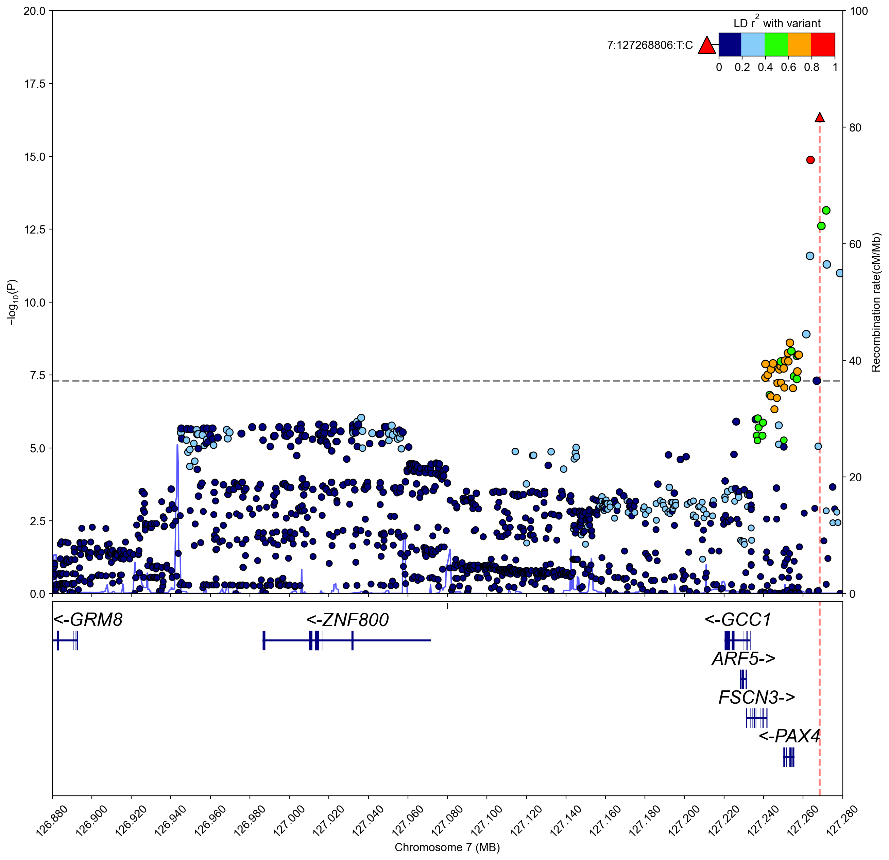
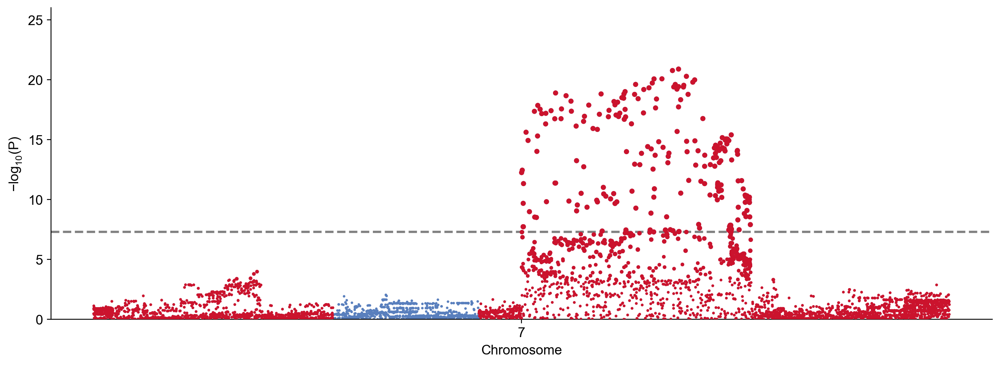

# Simulate GWAS summary statistics

!!! example
    ```python
    import gwaslab as gl
    ```

!!! example
    ```python
    gl.show_version()
    ```

**stdout:**
```
2026/07/07 13:17:27 GWASLab v4.2.0 https://cloufield.github.io/gwaslab/
2026/07/07 13:17:27 (C) 2022-2026, Yunye He, Kamatani Lab, GPL-3.0 license, gwaslab@gmail.com
2026/07/07 13:17:27 Python version: 3.12.0 | packaged by conda-forge | (main, Oct  3 2023, 08:43:22) [GCC 12.3.0]
```

This workflow generates simulated GWAS summary statistics from a reference-panel VCF. For the full parameter reference, see [Simulate GWAS summary statistics](SimulateSumstats.md).

!!! note "In development"
    These functions are under active development. This page is not yet in the site navigation. Development notebook: `examples/_development/simulation/utility_simulate_sumstats.ipynb`.

## Reference panel

Use a tabix-indexed VCF with genotypes and allele frequencies. Region demos use the bundled chr7 slice (same as [tutorial v4](tutorial_v4.md)) with a **1 Mb** window inside it. Global simulation uses the full genome reference.

!!! example
    ```python
    vcf_path = "test/ref/1kg_eas_hg19.chr7_126253550_128253550.vcf.gz"
    region = ("7", 126753550, 127753550)  # 1 Mb, centered in bundled slice

    # gl.download_ref("1kg_eas_hg19")  # once, if registry path is missing
    vcf_path_gw = gl.get_path("1kg_eas_hg19")
    ```

Alternative paths:

```python
# vcf_path = "gwaslab-sample-data/1kg_eas_hg19.chr7_126253550_128253550.vcf.gz"
```

## Region simulation (quantitative, sparse)

Simulate a quantitative trait with a fixed number of causal variants in the region.

!!! example
    ```python
    sumstats, causal_ids = gl.simulate_sumstats_region(
        vcf_path=vcf_path,
        region=region,
        trait="quant",
        n=10_000,
        mode="sparse",
        n_causal=3,
        seed=42,
        build="19",
        verbose=False,
    )

    print(f"Variants: {len(sumstats.data)}")
    print(f"Causal SNP IDs: {causal_ids}")
    sumstats.data.head(3)
    ```

**stdout:**
```
Variants: 2414
Causal SNP IDs: ['7:127080377:C:T', '7:127520162:T:G', '7:127623840:G:A']
```

| SNPID | CHR | POS | EA | NEA | EAF | BETA | SE | P | N | IS_CAUSAL |
| --- | --- | --- | --- | --- | --- | --- | --- | --- | --- | --- |
| 7:126254118:C:T | 7 | 126254118 | T | C | 0.447 | 0.018 | 0.010 | 0.082 | 10000 | False |
| 7:126254629:T:C | 7 | 126254629 | C | T | 0.431 | 0.016 | 0.010 | 0.114 | 10000 | False |
| 7:126254693:A:G | 7 | 126254693 | G | A | 0.628 | 0.001 | 0.010 | 0.943 | 10000 | False |

Ground-truth columns `IS_CAUSAL` and `BETA_TRUE` are included for benchmarking fine-mapping, colocalization, or power simulations.

## Polygenic architecture

Use `mode="polygenic"` and set the causal fraction with `pi`.

!!! example
    ```python
    sumstats_poly, _ = gl.simulate_sumstats_region(
        vcf_path=vcf_path,
        region=region,
        n=10_000,
        mode="polygenic",
        pi=0.01,
        seed=42,
        build="19",
        verbose=False,
    )

    print(f"Causal variants: {sumstats_poly.data['IS_CAUSAL'].sum()}")
    ```

**stdout:**
```
Causal variants: 23
```

## Binary trait (case–control)

!!! example
    ```python
    sumstats_cc, causal_ids = gl.simulate_sumstats_region(
        vcf_path=vcf_path,
        region=region,
        trait="binary",
        n_case=5_000,
        n_ctrl=5_000,
        n_causal=2,
        seed=42,
        build="19",
        verbose=False,
    )

    sumstats_cc.data.head(2)[["CHR", "POS", "N", "N_CASE", "N_CONTROL"]]
    ```

| CHR | POS | N | N_CASE | N_CONTROL |
| --- | --- | --- | --- | --- |
| 7 | 126254118 | 10000 | 5000 | 5000 |
| 7 | 126254629 | 10000 | 5000 | 5000 |

## Realism knobs

Defaults are neutral (`thin=None`, `lambda_gc=1.0`, `sigma_strat=0.0`, `n_drop_rate=0.0`). For tutorial-style plots, pass an explicit preset:

```python
REALISM_DEMO = dict(
    thin=0.5,
    lambda_gc=1.01,
    sigma_strat=0.05,
    n_drop_rate=0.15,
)
```

### Cryptic relatedness (`lambda_gc`)

!!! example
    ```python
    sumstats_inf, _ = gl.simulate_sumstats_region(
        vcf_path=vcf_path,
        region=region,
        n=10_000,
        n_causal=2,
        lambda_gc=1.1,
        seed=42,
        build="19",
        verbose=False,
    )
    ```

### Variant thinning (`thin`)

By default, all filtered variants are kept (`thin=None`). Pass e.g. `thin=0.5` to simulate incomplete GWAS coverage (~half of variants).

!!! example
    ```python
    sumstats_full, _ = gl.simulate_sumstats_region(
        vcf_path=vcf_path,
        region=region,
        n=10_000,
        n_causal=2,
        thin=None,
        seed=42,
        build="19",
        verbose=False,
    )
    print(len(sumstats_full.data))
    ```

## Downstream use

Treat the result like any `Sumstats` object:

!!! example
    ```python
    sumstats.basic_check(verbose=False)
    # sumstats.to_fmt("tsv", "simulated_sumstats.tsv.gz")
    ```

## Global simulation (advanced)

For genome-wide output with heritability calibration, use `simulate_sumstats_global` on the full reference panel. Omit `chromosomes=` to simulate all chromosomes in the VCF.

!!! example
    ```python
    sumstats_gw, causals_gw = gl.simulate_sumstats_global(
        vcf_path=vcf_path_gw,
        n=10_000,
        mode="sparse",
        n_causal=3,
        h2=0.01,
        seed=42,
        build="19",
        verbose=False,
    )

    print(f"Variants: {len(sumstats_gw.data)}")
    print(f"Causals: {len(causals_gw)}")
    ```

**stdout:**
```
Variants: 4304675
Causals: 3
```

!!! warning
    Full-genome global simulation can take several minutes and requires `1kg_eas_hg19` installed (`gl.download_ref("1kg_eas_hg19")`). Prefer region mode for quick tests, or pass `chromosomes=["7"]` to restrict scope.

## Visualize simulated results

The returned `Sumstats` objects work with [`plot_mqq()`](visualization_mqq.md). Use **`highlight`** on Manhattan plots and **`pinpoint`** on regional plots to mark ground-truth causals from simulation.

For regional LD coloring, pass the same tabix VCF used in simulation as `vcf_path`. See [Regional plot workflow](visualization_regional.md) for gene tracks and advanced options.

### Regional plot (around a causal locus)

Build a window around the first causal variant (clipped to the simulated region), then plot with LD from the reference panel:

!!! example
    ```python
    causal_row = sumstats.data.loc[sumstats.data["IS_CAUSAL"]].iloc[0]
    pos = int(causal_row["POS"])
    plot_region = (
        7,
        max(region[1], pos - 200_000),
        min(region[2], pos + 200_000),
    )

    sumstats.plot_mqq(
        mode="r",
        region=plot_region,
        vcf_path=vcf_path,
        pinpoint=causal_ids,
        save="simulated_regional.png",
        verbose=False,
    )
    ```



### Manhattan plot (genome-wide)

Plot the full-genome global simulation and highlight true causal variants:

!!! example
    ```python
    sumstats_gw.basic_check(verbose=False)
    sumstats_gw.plot_mqq(
        mode="m",
        highlight=causals_gw,
        save="simulated_manhattan.png",
        verbose=False,
    )
    # sumstats_gw.plot_mqq(mode="mqq", highlight=causals_gw, verbose=False)  # add QQ panel
    ```


