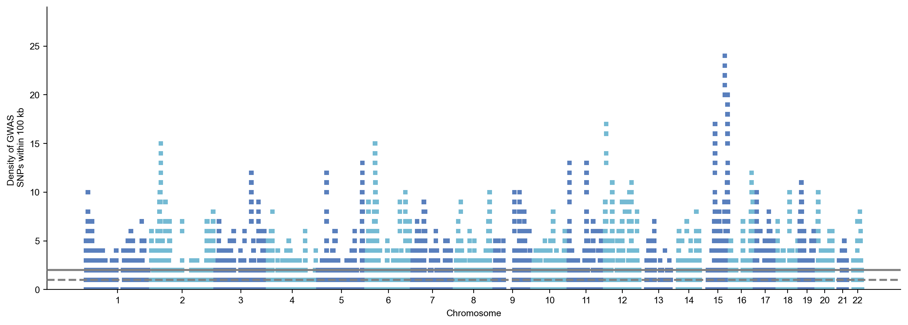
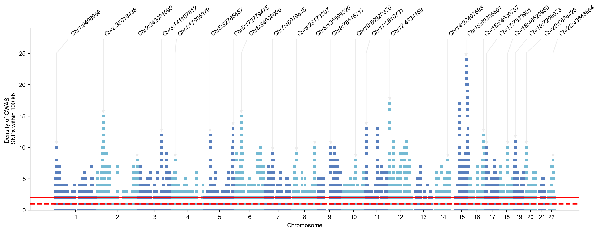
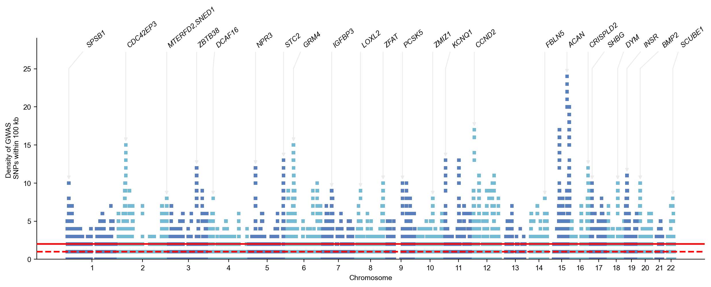

# Brisbane plot

!!! example
    ```python
    import gwaslab as gl
    import pandas as pd
    ```

!!! example
    ```python
    gl.show_version()
    ```

**stdout:**
```
2024/12/23 12:19:09 GWASLab v3.5.4 https://cloufield.github.io/gwaslab/
2024/12/23 12:19:09 (C) 2022-2024, Yunye He, Kamatani Lab, MIT License, gwaslab@gmail.com
```

## Download data

Yengo, L., Vedantam, S., Marouli, E., Sidorenko, J., Bartell, E., Sakaue, S., ... & Lee, J. Y. (2022). A saturated map of common genetic variants associated with human height. Nature, 1-16.
Fig. 2: Brisbane plot

!!! example
    ```python
    !wget https://static-content.springer.com/esm/art%3A10.1038%2Fs41586-022-05275-y/MediaObjects/41586_2022_5275_MOESM3_ESM.xlsx
    ```

**stdout:**
```
--2024-12-23 12:19:13--  https://static-content.springer.com/esm/art%3A10.1038%2Fs41586-022-05275-y/MediaObjects/41586_2022_5275_MOESM3_ESM.xlsx
Resolving static-content.springer.com (static-content.springer.com)... 146.75.112.95
Connecting to static-content.springer.com (static-content.springer.com)|146.75.112.95|:443... connected.
HTTP request sent, awaiting response... 200 OK
Length: 9368771 (8.9M) [application/octet-stream]
Saving to: ‘41586_2022_5275_MOESM3_ESM.xlsx.1’

41586_2022_5275_MOE 100%[===================>]   8.93M  46.0MB/s    in 0.2s    

2024-12-23 12:19:14 (46.0 MB/s) - ‘41586_2022_5275_MOESM3_ESM.xlsx.1’ saved [9368771/9368771]
```

## Read into pandas dataframe

!!! example
    ```python
    data = pd.read_excel("41586_2022_5275_MOESM3_ESM.xlsx",sheet_name=10,skiprows=1)
    data
    ```

**stderr:**
```
/home/yunye/anaconda3/envs/gwaslab_py39/lib/python3.9/site-packages/openpyxl/worksheet/_reader.py:329: UserWarning: Unknown extension is not supported and will be removed
  warn(msg)
```

| Locus | Chr | SNP | BP (HG19) | BP (HG38) | Effect Allele (A1) | A1 Frequency | Marginal effect size (b) | b SE | b P-value | ... | LD with the next SNP | Distance to the closest gene (kb) | Closest gene | Position relative to the closest gene | Replication (EBB) effect size | Replication (EBB) SE | Replication (EBB) P-value | Replication (EBB) COJO effect size | Replication (EBB) COJO SE | Replication (EBB) COJO P-value |
| --- | --- | --- | --- | --- | --- | --- | --- | --- | --- | --- | --- | --- | --- | --- | --- | --- | --- | --- | --- | --- |
| 1:METAFE | 1 | rs2710888 | 959842 | 1024462 | T | 0.340777 | 0.011478 | 0.000719 | 2.190000e-57 | ... | 0.383297 | 4.340 | AGRN | Gene-Body | 0.016117 | 0.006618 | 0.014882 | 0.011628 | 0.007169 | 0.104822 |
| 1:METAFE | 1 | rs3934834 | 1005806 | 1070426 | T | 0.155679 | 0.009750 | 0.000867 | 2.440000e-29 | ... | 0.032079 | 1.319 | RNF223 | Up-stream | 0.020319 | 0.008240 | 0.013661 | 0.014769 | 0.008928 | 0.098090 |
| 2:METAFE | 1 | rs182532 | 1287040 | 1351660 | T | 0.032072 | -0.016253 | 0.001845 | 1.250000e-18 | ... | -0.060743 | 1.028 | MXRA8 | Up-stream | 0.019320 | 0.017633 | 0.273230 | 0.017967 | 0.017684 | 0.309621 |
| 2:METAFE | 1 | rs17160669 | 1305561 | 1370181 | T | 0.187613 | 0.010000 | 0.000902 | 1.480000e-28 | ... | 0.017875 | 3.548 | AURKAIP1 | Up-stream | 0.009437 | 0.009642 | 0.327702 | 0.011038 | 0.009670 | 0.253674 |
| 3:METAFE | 1 | rs9660106 | 1797947 | 1866508 | G | 0.484076 | 0.004450 | 0.000632 | 1.860000e-12 | ... | 0.027731 | 24.609 | GNB1 | Gene-Body | 0.014751 | 0.006449 | 0.022182 | 0.013992 | 0.006462 | 0.030383 |
| ... | ... | ... | ... | ... | ... | ... | ... | ... | ... | ... | ... | ... | ... | ... | ... | ... | ... | ... | ... | ... |
| 7206:METAFE | 22 | rs9628283 | 50540766 | 50102337 | C | 0.028417 | 0.014488 | 0.001852 | 5.130000e-15 | ... | -0.065326 | 12.332 | MOV10L1 | Gene-Body | 0.014345 | 0.027401 | 0.600616 | 0.008326 | 0.027836 | 0.764848 |
| 7207:METAFE | 22 | rs28642259 | 50785718 | 50347289 | T | 0.323849 | -0.005336 | 0.000719 | 1.140000e-13 | ... | -0.101697 | 3.973 | PPP6R2 | Gene-Body | -0.003071 | 0.007242 | 0.671512 | -0.001554 | 0.007312 | 0.831684 |
| 7208:METAFE | 22 | rs11555194 | 50876662 | 50438233 | G | 0.028294 | 0.015256 | 0.001921 | 2.000000e-15 | ... | 0.106224 | 6.768 | SBF1 | Up-stream | 0.018349 | 0.019176 | 0.338620 | 0.017029 | 0.019396 | 0.379943 |
| 7208:METAFE | 22 | rs762669 | 50943423 | 50504994 | A | 0.175297 | -0.009376 | 0.000820 | 3.000000e-30 | ... | 0.006762 | 2.048 | LMF2 | Gene-Body | -0.001830 | 0.009092 | 0.840476 | -0.002904 | 0.009160 | 0.751260 |
| 7209:METAFE | 22 | rs9628185 | 51109992 | 50671564 | C | 0.457101 | 0.004333 | 0.000628 | 5.430000e-12 | ... | 0.000000 | 3.077 | SHANK3 | Up-stream | 0.000249 | 0.006356 | 0.968802 | 0.000514 | 0.006368 | 0.935627 |

*[12111 rows x 26 columns]*

## Load into gwaslab Sumstats

!!! example
    ```python
    sumstats = gl.Sumstats(data,snpid="SNP",chrom="Chr",pos="BP (HG19)",p="b P-value")
    ```

**stdout:**
```
2024/12/23 12:19:16 GWASLab v3.5.4 https://cloufield.github.io/gwaslab/
2024/12/23 12:19:16 (C) 2022-2024, Yunye He, Kamatani Lab, MIT License, gwaslab@gmail.com
2024/12/23 12:19:16 Start to initialize gl.Sumstats from pandas DataFrame ...
2024/12/23 12:19:16  -Reading columns          : BP (HG19),Chr,SNP,b P-value
2024/12/23 12:19:16  -Renaming columns to      : POS,CHR,SNPID,P
2024/12/23 12:19:16  -Current Dataframe shape : 12111  x  4
2024/12/23 12:19:16  -Initiating a status column: STATUS ...
2024/12/23 12:19:16  #WARNING! Version of genomic coordinates is unknown...
2024/12/23 12:19:17 Start to reorder the columns...v3.5.4
2024/12/23 12:19:17  -Current Dataframe shape : 12111 x 5 ; Memory usage: 21.88 MB
2024/12/23 12:19:17  -Reordering columns to    : SNPID,CHR,POS,P,STATUS
2024/12/23 12:19:17 Finished reordering the columns.
2024/12/23 12:19:17  -Column  : SNPID  CHR    POS   P       STATUS  
2024/12/23 12:19:17  -DType   : object string int64 float64 category
2024/12/23 12:19:17  -Verified: T      F      T     T       T       
2024/12/23 12:19:17  #WARNING! Columns with possibly incompatible dtypes: CHR
2024/12/23 12:19:17  -Current Dataframe memory usage: 21.88 MB
2024/12/23 12:19:17 Finished loading data successfully!
```

## Brisbane plot

- `mode=b` : Brisbane plot

!!! example
    ```python
    sumstats.plot_mqq(mode="b")
    ```

**stdout:**
```
2024/12/23 12:19:17 Start to create MQQ plot...v3.5.4:
2024/12/23 12:19:17  -Genomic coordinates version: 99...
2024/12/23 12:19:17  #WARNING! Genomic coordinates version is unknown.
2024/12/23 12:19:17  -Genome-wide significance level to plot is set to 5e-08 ...
2024/12/23 12:19:17  -Raw input contains 12111 variants...
2024/12/23 12:19:17  -MQQ plot layout mode is : b
2024/12/23 12:19:17 Finished loading specified columns from the sumstats.
2024/12/23 12:19:17 Start data conversion and sanity check:
2024/12/23 12:19:17  -Removed 0 variants with nan in CHR or POS column ...
2024/12/23 12:19:17  -Removed 0 variants with CHR <=0...
2024/12/23 12:19:17  -Calculating DENSITY with windowsize of  100  kb
2024/12/23 12:19:17  -Converting data above cut line...
2024/12/23 12:19:17  -Maximum DENSITY value is 24.0 .
2024/12/23 12:19:17 Finished data conversion and sanity check.
2024/12/23 12:19:17 Start to create MQQ plot with 12111 variants...
2024/12/23 12:19:17  -Creating background plot...
2024/12/23 12:19:17 Finished creating MQQ plot successfully!
2024/12/23 12:19:17 Start to extract variants for annotation...
2024/12/23 12:19:17 Finished extracting variants for annotation...
2024/12/23 12:19:17 Start to process figure arts.
2024/12/23 12:19:17  -Processing X ticks...
2024/12/23 12:19:17  -Processing X labels...
2024/12/23 12:19:17  -Processing Y labels...
2024/12/23 12:19:17  -Processing Y tick lables...
2024/12/23 12:19:17  -Processing Y labels...
2024/12/23 12:19:17  -Processing lines...
2024/12/23 12:19:17  -Plotting horizontal line (  mean DENISTY): y = 1.9998348608702832
2024/12/23 12:19:17  -Plotting horizontal line ( median DENISTY): y = 1.0
2024/12/23 12:19:17 Finished processing figure arts.
2024/12/23 12:19:17 Start to annotate variants...
2024/12/23 12:19:17  -Skip annotating
2024/12/23 12:19:17 Finished annotating variants.
2024/12/23 12:19:17 Start to save figure...
2024/12/23 12:19:17  -Skip saving figure!
2024/12/23 12:19:17 Finished saving figure...
2024/12/23 12:19:17 Finished creating plot successfully!
```

```
(<Figure size 3000x1000 with 1 Axes>, <gwaslab.g_Log.Log at 0x7f1446bc8b80>)
```



## Some customizations

!!! example
    ```python
    sumstats.plot_mqq(mode="b",anno=True,sig_line_color="red", windowsizekb=100000, verbose=False)
    ```

**stdout:**
```
2024/12/23 12:19:18  #WARNING! Genomic coordinates version is unknown.
```

```
(<Figure size 3000x1000 with 1 Axes>, <gwaslab.g_Log.Log at 0x7f1446bc8b80>)
```



## Annotate with gene names

!!! example
    ```python
    sumstats.plot_mqq(mode="b",anno="GENENAME",sig_line_color="red",build="19",windowsizekb=100000, verbose=False)
    ```

```
(<Figure size 3000x1000 with 1 Axes>, <gwaslab.g_Log.Log at 0x7f1446bc8b80>)
```


