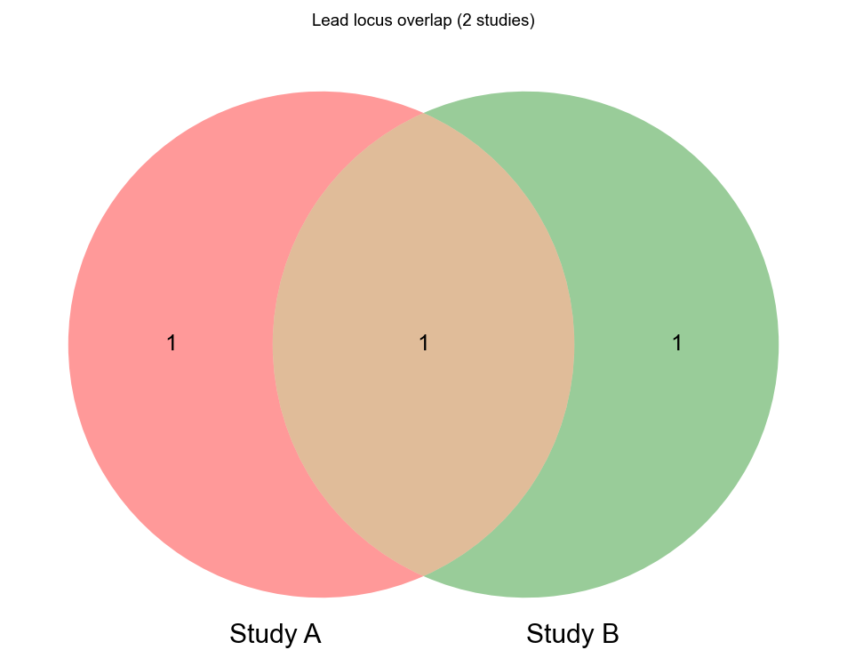
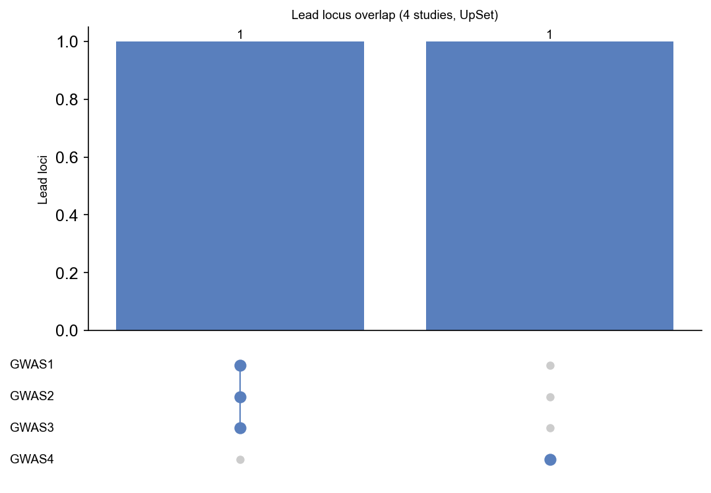

# Lead overlap plot

!!! example
    ```python
    import gwaslab as gl
    import pandas as pd
    ```

This tutorial builds small synthetic `Sumstats` objects and plots lead-locus overlap with `gl.plot_lead_overlap()`. For the full parameter reference, see [Lead Overlap Plot](LeadOverlapPlot.md).

## Two-study Venn diagram

When comparing two studies, `mode="auto"` selects a Venn diagram. Leads within 500 kb on the same chromosome are merged into one locus group.

!!! example
    ```python
    def make_sumstats(rows, study_name):
        df = pd.DataFrame(rows)
        ss = gl.Sumstats(
            sumstats=df,
            snpid="SNPID",
            chrom="CHR",
            pos="POS",
            p="P",
            verbose=False,
        )
        ss.meta["gwaslab"]["study_name"] = study_name
        return ss

    ss_a = make_sumstats(
        [
            {"SNPID": "s1_shared", "CHR": 1, "POS": 1_000_000, "P": 1e-10},
            {"SNPID": "s1_only", "CHR": 1, "POS": 10_000_000, "P": 1e-9},
        ],
        "Study A",
    )
    ss_b = make_sumstats(
        [
            {"SNPID": "s2_shared", "CHR": 1, "POS": 1_100_000, "P": 1e-12},
            {"SNPID": "s2_only", "CHR": 2, "POS": 2_000_000, "P": 1e-9},
        ],
        "Study B",
    )

    overlap_df, fig, log = gl.plot_lead_overlap(
        objects=[ss_a, ss_b],
        titles=["Study A", "Study B"],
        anno=False,
        windowsizekb_for_overlap=500,
        title="Lead locus overlap (2 studies)",
        verbose=False,
    )
    overlap_df[["LOCUS_ID", "MEMBERSHIP_KEY", "N_STUDIES", "STUDIES"]]
    ```



## Four-study UpSet plot

With four or more studies, `mode="auto"` switches to an UpSet matrix. Each row is a unique membership pattern (which studies share a locus).

!!! example
    ```python
    studies = []
    for i in range(3):
        studies.append(
            make_sumstats(
                [{"SNPID": f"s{i}a", "CHR": 1, "POS": 1_000_000, "P": 1e-10}],
                f"GWAS{i + 1}",
            )
        )
    studies.append(
        make_sumstats(
            [{"SNPID": "s4_only", "CHR": 3, "POS": 5_000_000, "P": 1e-9}],
            "GWAS4",
        )
    )

    overlap_df, fig, log = gl.plot_lead_overlap(
        objects=studies,
        titles=[f"GWAS{i + 1}" for i in range(4)],
        mode="auto",
        anno=False,
        windowsizekb_for_overlap=500,
        title="Lead locus overlap (4 studies, UpSet)",
        verbose=False,
    )
    set_list = overlap_df.attrs.get("set_list")
    set_list
    ```



