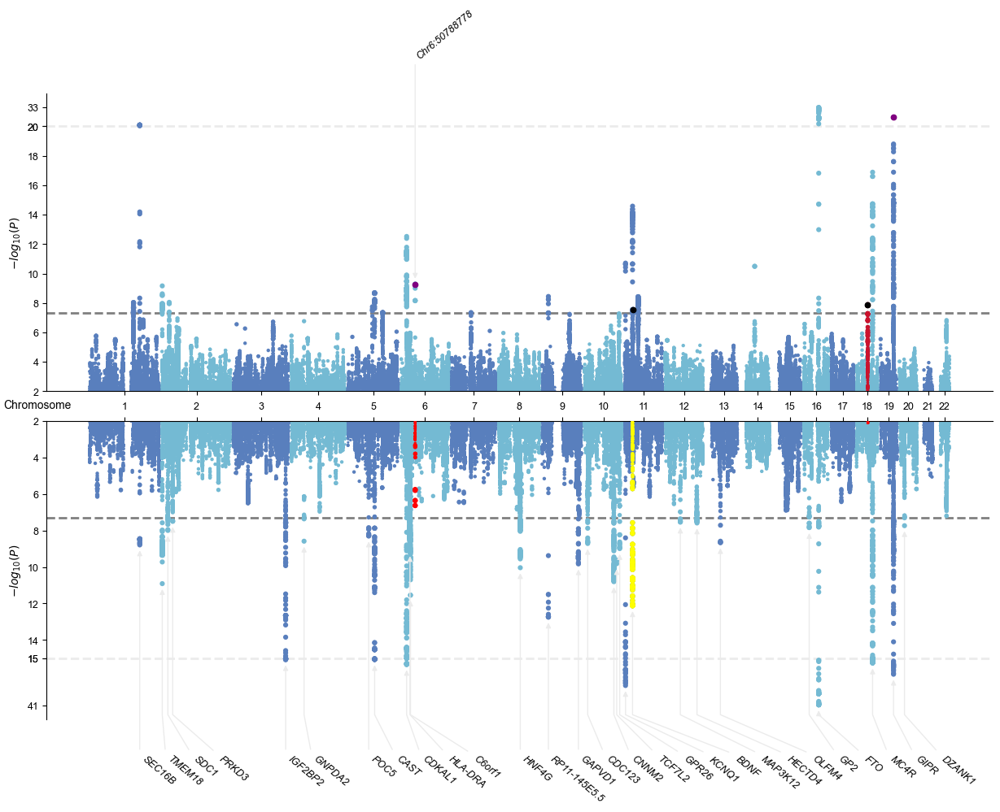

# Miami plot

```python
#!wget -O ../0_sample_data/bmi_male_bbj.txt.gz http://jenger.riken.jp/2analysisresult_qtl_download/
#!wget -O ../0_sample_data/bmi_female_bbj.txt.gz http://jenger.riken.jp/4analysisresult_qtl_download/
```

## Load gwaslab and sample data

```python
import gwaslab as gl
```

```python
gl.show_version()
```

**stdout:**
```
2024/12/23 13:00:30 GWASLab v3.5.4 https://cloufield.github.io/gwaslab/
2024/12/23 13:00:30 (C) 2022-2024, Yunye He, Kamatani Lab, MIT License, gwaslab@gmail.com
```

```python
gl1 = gl.Sumstats("../0_sample_data/bbj_bmi_female.txt.gz",fmt="gwaslab",snpid="SNP",ea="REF",nea="ALT",sep="\t",build="19",verbose=False)
gl2 = gl.Sumstats("../0_sample_data/bbj_bmi_male.txt.gz",fmt="gwaslab",snpid="SNP",ea="REF",nea="ALT",sep="\t",build="19",verbose=False)
```

```python
gl1.get_lead()
```

**stdout:**
```
2024/12/23 13:00:43 Start to extract lead variants...v3.5.4
2024/12/23 13:00:43  -Current Dataframe shape : 5961600 x 9 ; Memory usage: 328.48 MB
2024/12/23 13:00:43  -Processing 5961600 variants...
2024/12/23 13:00:43  -Significance threshold : 5e-08
2024/12/23 13:00:43  -Sliding window size: 500  kb
2024/12/23 13:00:45  -Using P for extracting lead variants...
2024/12/23 13:00:45  -Found 948 significant variants in total...
2024/12/23 13:00:45  -Identified 20 lead variants!
2024/12/23 13:00:45 Finished extracting lead variants.
```

| SNPID | CHR | POS | EA | NEA | BETA | SE | P | STATUS |
| --- | --- | --- | --- | --- | --- | --- | --- | --- |
| rs860295 | 1 | 155767708 | A | G | 0.04005 | 0.006973 | 9.221000e-09 | 1999999 |
| rs532504 | 1 | 177878933 | G | A | 0.06024 | 0.006294 | 1.062000e-21 | 1999999 |
| rs939584 | 2 | 621558 | C | T | 0.05446 | 0.008828 | 6.897000e-10 | 1999999 |
| rs713586 | 2 | 25158008 | T | C | 0.03073 | 0.005345 | 9.015000e-09 | 1999999 |
| rs1846974 | 5 | 87969927 | G | A | 0.02988 | 0.005307 | 1.808000e-08 | 1999999 |
| ... | ... | ... | ... | ... | ... | ... | ... | ... |
| rs75766425 | 14 | 52511911 | G | C | 0.05405 | 0.008145 | 3.222000e-11 | 1999999 |
| rs11642015 | 16 | 53802494 | C | T | 0.07912 | 0.006551 | 1.375000e-33 | 1999999 |
| rs8098510 | 18 | 40773435 | A | C | -0.03211 | 0.005647 | 1.296000e-08 | 1999999 |
| rs6567160 | 18 | 57829135 | T | C | 0.05420 | 0.006344 | 1.299000e-17 | 1999999 |
| rs35560038 | 19 | 46175046 | A | T | -0.05872 | 0.005473 | 7.421000e-27 | 1999999 |

*[20 rows x 9 columns]*

## Most options in plot_mqq() are available for plot_miami2()

```python
#simply add 1 or 2 after the option for plot_mqq() to customize the top or bottom figure in miami plot
a = gl.plot_miami2(path1= gl1,
                   path2= gl2,
                   skip=2,
                   cut1=20,
                   cut2=15,
                   id1="SNPID",
                   id2="SNPID",
                   anno1=True,
                   anno2="GENENAME",
                   anno_set1=["rs3798519"],
                   pinpoint1=[["rs3798519","rs35560038"],["rs7933262","rs8098510"]],
                   pinpoint_color1=["purple","black"],
                   highlight1=["rs8098510"],
                   highlight2=[["rs8098510","rs3798519"], ["rs1491850"]],
                   highlight_color2=["red","yellow"],
                   verbose1=False,
                   verbose2=False
)
```

**stdout:**
```
2024/12/23 13:00:45 Start to create miami plot v3.5.4:
2024/12/23 13:00:45  -Obtaining Sumstats1 CHR, POS, P and annotation from: ['CHR', 'POS', 'P', 'SNPID']
2024/12/23 13:00:45  -Loading Sumstats1 from gwaslab.Sumstats Object
2024/12/23 13:00:46  -Obtaining Sumstats2 CHR, POS, P and annotation from: ['CHR', 'POS', 'P', 'SNPID']
2024/12/23 13:00:46  -Loading Sumstats2 from gwaslab.Sumstats Object
2024/12/23 13:00:47  -Sanity check after conversion: 0 variants with P value outside of (0,1] will be removed...
2024/12/23 13:00:47  -Sumstats P values are being converted to -log10(P)...
2024/12/23 13:00:48  -Sanity check: 0 na/inf/-inf variants will be removed...
2024/12/23 13:00:49  -Sanity check after conversion: 0 variants with P value outside of (0,1] will be removed...
2024/12/23 13:00:49  -Sumstats P values are being converted to -log10(P)...
2024/12/23 13:00:49  -Sanity check: 0 na/inf/-inf variants will be removed...
2024/12/23 13:00:50  -Merging sumstats using chr and pos...
2024/12/23 13:00:59  -Columns in merged sumstats: P_1,SNPID_1,scaled_P_1,TCHR+POS,P_2,SNPID_2,scaled_P_2,CHR,POS,_ADD,i
2024/12/23 13:00:59 Start to create Manhattan plot for sumstats1...
2024/12/23 13:01:03 Finished creating Manhattan plot for sumstats1
2024/12/23 13:01:03 Start to create Manhattan plot for sumstats2...
2024/12/23 13:01:08 Finished creating Manhattan plot for sumstats2
2024/12/23 13:01:08 Start to save figure...
2024/12/23 13:01:08  -Skip saving figure!
2024/12/23 13:01:08 Finished saving figure...
2024/12/23 13:01:08 Finished creating miami plot successfully
```


