# Manhattan and Q-Q plot

## Load gwaslab 

```python
import sys
sys.path.insert(0, "/home/yunye/work/gwaslab/src")
import gwaslab as gl
```

## Load data into Sumstats Object

```python
mysumstats = gl.Sumstats("../0_sample_data/t2d_bbj.txt.gz",
             snpid="SNP",
             chrom="CHR",
             pos="POS",
             ea="ALT",
             nea="REF",
             neaf="Frq",
             p="P",
             build="19",             
             verbose=False)
mysumstats.fix_chr(verbose=False)
```

```python
<gwaslab.g_Sumstats.Sumstats at 0x7fa84ffbcb30>
```

## Create Manhattan plot and QQ plot

```python
mysumstats.plot_mqq(skip=2)
```

**stdout:**
```python
2025/12/24 00:50:47 Configured plot style for plot_mqq:mqq
2025/12/24 00:50:47 Starting Manhattan-QQ plot creation (Version v4.0.0)
2025/12/24 00:50:47  -Genomic coordinates are based on GRCh37/hg19...
2025/12/24 00:50:47  - Genomic coordinates version: 19 ...
2025/12/24 00:50:47  - Genome-wide significance level to plot is set to 5e-08 ...
2025/12/24 00:50:47  - Input sumstats contains 12557761 variants...
2025/12/24 00:50:47  - Manhattan-QQ plot layout mode selected: mqq
2025/12/24 00:50:47  -POS data type is already numeric. Skipping conversion...
2025/12/24 00:50:49  -CHR data type is already numeric. Skipping conversion...
2025/12/24 00:50:49 Finished loading specified columns from the statistics
2025/12/24 00:50:49 Start data conversion and sanity check:
2025/12/24 00:50:49  -Removed 0 variants with nan in CHR or POS column ...
2025/12/24 00:50:51  -Removed 0 variants with CHR <=0...
2025/12/24 00:50:51  -Removed 0 variants with nan in P column ...
2025/12/24 00:50:52  -Sanity check after conversion: 0 variants with P value outside of (0,1] will be removed...
2025/12/24 00:50:53  -Sumstats P values are being converted to -log10(P)...
2025/12/24 00:50:53  -Sanity check: 0 na/inf/-inf variants will be removed...
2025/12/24 00:50:54  -Converting data above cut line...
2025/12/24 00:50:54  -Maximum -log10(P) value is 167.58838029403677 .
2025/12/24 00:50:54 Finished data conversion and sanity check.
2025/12/24 00:50:54 Start to create Manhattan-QQ plot with 332882 variants...
2025/12/24 00:50:54  -Creating background plot...
2025/12/24 00:50:55 Finished creating Manhattan-QQ plot successfully
2025/12/24 00:50:55 Start to extract variants for annotation...
2025/12/24 00:50:55  -Found 89 significant variants with a sliding window size of 500 kb...
2025/12/24 00:50:55 Finished extracting variants for annotation...
2025/12/24 00:50:55  -Processing X ticks...
2025/12/24 00:50:55  -Processing X labels...
2025/12/24 00:50:55  -Processing Y labels...
2025/12/24 00:50:55  -Processing Y tick lables...
2025/12/24 00:50:55  -Processing Y labels...
2025/12/24 00:50:55  -Processing lines...
2025/12/24 00:50:55 Start to create QQ plot with 332882 variants:
2025/12/24 00:50:55  -Plotting all variants...
2025/12/24 00:50:56  -Expected range of P: (0,1.0)
2025/12/24 00:50:56  -Lambda GC (MLOG10P mode) at 0.5 is   1.21283
2025/12/24 00:50:56  -Processing Y tick lables...
2025/12/24 00:50:56 Finished creating QQ plot successfully!
2025/12/24 00:50:56 Start to save figure...
2025/12/24 00:50:56  -Skip saving figure!
2025/12/24 00:50:56 Finished saving figure...
2025/12/24 00:50:56 Finished creating plot successfully
```

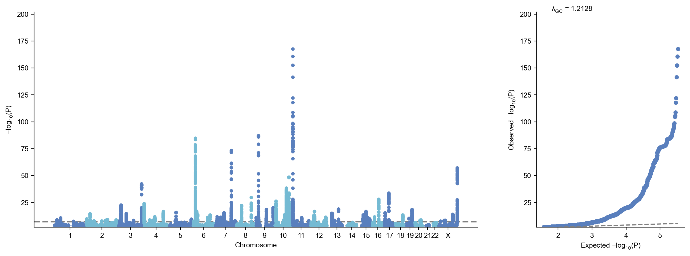

## gl.plot_mqq() Options

### Layout mode

If plotting all variants, it may take several minutes. You can use `skip` to skip variants with low MLOG10P in the plot. 

Note: use verbose=False to stop printing log and use check=False to skip sanity check for mqq plots

4 patterns of layout: 

- `mode= "mqq"` (default)
- `mode= "qqm"`
- `mode= "qq"` 
- `mode= "m"`

```python
mysumstats.plot_mqq(skip=3,cut=20,mode="qqm",check=False, verbose=False)
```

**stdout:**
```python
2025/12/23 23:54:57  -POS data type is already numeric. Skipping conversion...
2025/12/23 23:54:59  -CHR data type is already numeric. Skipping conversion...
```


```python
mysumstats.plot_mqq(skip=3,cut=20,mode="qqm",check=False, verbose=False)
```

**stdout:**
```python
2025/12/23 23:55:05  -POS data type is already numeric. Skipping conversion...
2025/12/23 23:55:07  -CHR data type is already numeric. Skipping conversion...
```

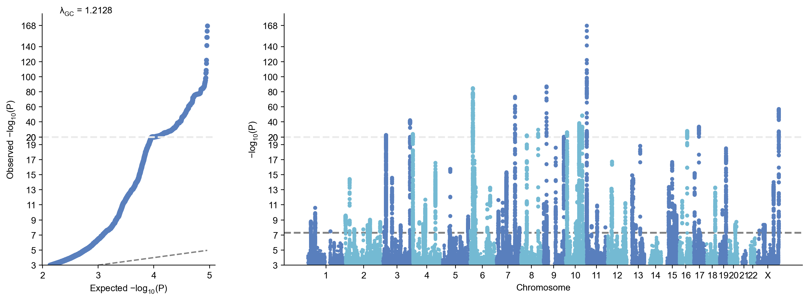

```python
mysumstats.plot_mqq(skip=3,cut=20,mode="m",check=False,verbose=False)
```

**stdout:**
```python
2025/12/23 23:55:13  -POS data type is already numeric. Skipping conversion...
2025/12/23 23:55:15  -CHR data type is already numeric. Skipping conversion...
```

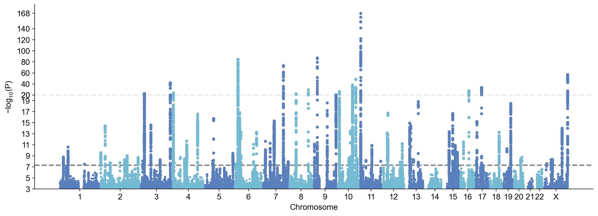

```python
mysumstats.plot_mqq(mode="qq", fig_args= {"figsize":(1,1)},check=False,verbose=False)
```

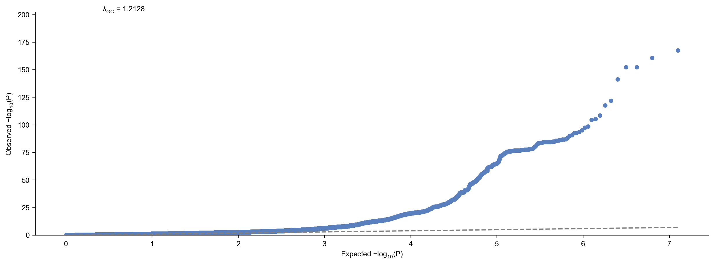

### Y axis

#### skip

- `skip` : skip the variants with low -log10(P) values for plotting


```python
mysumstats.plot_mqq(skip=5,mode= "m", check=False ,verbose=False)
```

**stdout:**
```python
2025/12/23 23:55:58  -POS data type is already numeric. Skipping conversion...
2025/12/23 23:55:59  -CHR data type is already numeric. Skipping conversion...
```


#### cut

 `cut` : scale down the -log10(P) for variants above a certain threshold

```python
mysumstats.plot_mqq(cut=20 ,mode= "m",check=False,verbose=False)
```

**stdout:**
```python
2025/12/23 23:56:04  -POS data type is already numeric. Skipping conversion...
2025/12/23 23:56:05  -CHR data type is already numeric. Skipping conversion...
```

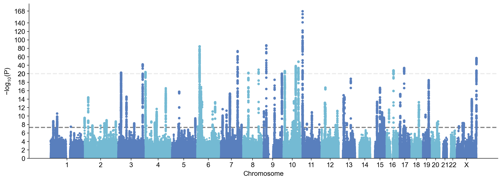

Make the Y axis jagged to indicate that it has been rescale. 

#### jagged

```python
mysumstats.plot_mqq(skip=3,cut=20, jagged=True,mode= "m",check=False,verbose=False)
```

**stdout:**
```python
2025/12/23 23:57:36  -POS data type is already numeric. Skipping conversion...
2025/12/23 23:57:38  -CHR data type is already numeric. Skipping conversion...
```

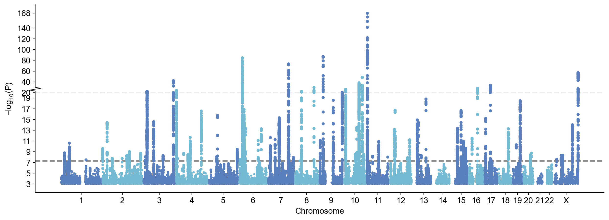

### X axis

#### use_rank

- `use_rank`: if True, GWASLab will use position rank instead of the physical base-pair positions for x aixs.

There will be no gap if `use_rank = True`

```python
mysumstats.plot_mqq(skip=3,cut=20,use_rank=True,mode= "m",check=False,verbose=False)
```

**stdout:**
```python
2025/12/23 23:57:42  -POS data type is already numeric. Skipping conversion...
2025/12/23 23:57:44  -CHR data type is already numeric. Skipping conversion...
```


#### xtight

`xtight=True` can be used to remove the padding 

```python
mysumstats.plot_mqq(xtight=True, skip=3,cut=20,mode= "m",check=False,verbose=False)
```

**stdout:**
```python
2025/12/23 23:57:48  -POS data type is already numeric. Skipping conversion...
2025/12/23 23:57:50  -CHR data type is already numeric. Skipping conversion...
```

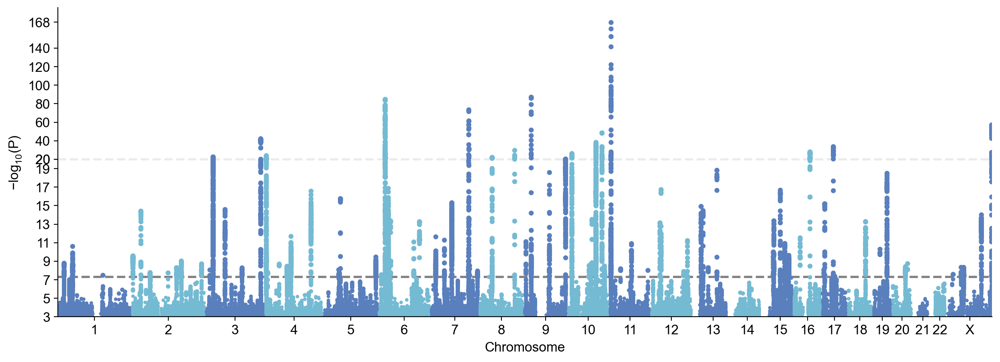

#### chrpad

`chrpad`: adjust space between each chromosome by `max(POS) * chrpad`

```python
mysumstats.plot_mqq(chrpad=0.2,xtight=True, skip=3,cut=20,mode= "m",check=False,verbose=False)
```

**stdout:**
```python
2025/12/23 23:57:55  -POS data type is already numeric. Skipping conversion...
2025/12/23 23:57:56  -CHR data type is already numeric. Skipping conversion...
```

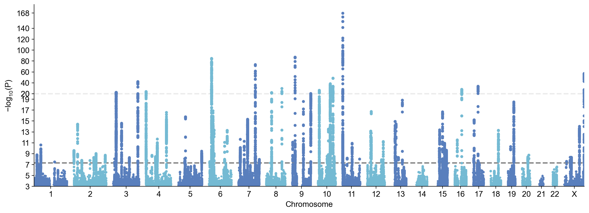

### Annotation

#### anno=True

`anno=True` : annoatate all lead variants with chr:pos

```python
mysumstats.plot_mqq(skip=3,cut=20,anno=True,mode= "m",check=False,verbose=False)
```

**stdout:**
```python
2025/12/23 23:58:01  -POS data type is already numeric. Skipping conversion...
2025/12/23 23:58:02  -CHR data type is already numeric. Skipping conversion...
```


Since there are a large number of novel loci, if we annotate all loci, it will be too messy. Let's only annotate the loci with P<1e-20 by specifying `sig_level_lead=1e-20`.

```python
mysumstats.plot_mqq(skip=3,cut=20,anno=True, anno_sig_level=1e-40,mode= "m",check=False,verbose=True)
```

**stdout:**
```python
2025/12/24 00:50:59 Configured plot style for plot_mqq:m
2025/12/24 00:50:59 Starting Manhattan plot creation (Version v4.0.0)
2025/12/24 00:50:59  -Genomic coordinates are based on GRCh37/hg19...
2025/12/24 00:50:59  - Genomic coordinates version: 19 ...
2025/12/24 00:50:59  - Genome-wide significance level to plot is set to 5e-08 ...
2025/12/24 00:50:59  - Input sumstats contains 12557761 variants...
2025/12/24 00:50:59  - Manhattan plot layout mode selected: m
2025/12/24 00:51:00  -POS data type is already numeric. Skipping conversion...
2025/12/24 00:51:01  -CHR data type is already numeric. Skipping conversion...
2025/12/24 00:51:01 Finished loading specified columns from the statistics
2025/12/24 00:51:01 Start data conversion and sanity check:
2025/12/24 00:51:01  -Sanity check will be skipped.
2025/12/24 00:51:02  -Sanity check after conversion: 0 variants with P value outside of (0,1] will be removed...
2025/12/24 00:51:03  -Sumstats P values are being converted to -log10(P)...
2025/12/24 00:51:03  -Sanity check: 0 na/inf/-inf variants will be removed...
2025/12/24 00:51:04  -Converting data above cut line...
2025/12/24 00:51:04  -Maximum -log10(P) value is 167.58838029403677 .
2025/12/24 00:51:04  -Minus log10(P) values above 20 will be shrunk with a shrinkage factor of 10...
2025/12/24 00:51:04 Finished data conversion and sanity check.
2025/12/24 00:51:04 Start to create Manhattan plot with 91234 variants...
2025/12/24 00:51:04  -Creating background plot...
2025/12/24 00:51:04 Finished creating Manhattan plot successfully
2025/12/24 00:51:04 Start to extract variants for annotation...
2025/12/24 00:51:04  -Found 7 significant variants with a sliding window size of 500 kb...
2025/12/24 00:51:04 Finished extracting variants for annotation...
2025/12/24 00:51:04  -Processing X ticks...
2025/12/24 00:51:04  -Processing X labels...
2025/12/24 00:51:04  -Processing Y labels...
2025/12/24 00:51:04  -Processing Y tick lables...
2025/12/24 00:51:04  -Processing Y labels...
2025/12/24 00:51:04  -Processing lines...
2025/12/24 00:51:04  -Annotating using column CHR:POS...
2025/12/24 00:51:04  -Adjusting text positions with repel_force=0.03...
2025/12/24 00:51:04 Start to save figure...
2025/12/24 00:51:04  -Skip saving figure!
2025/12/24 00:51:04 Finished saving figure...
2025/12/24 00:51:04 Finished creating plot successfully
```

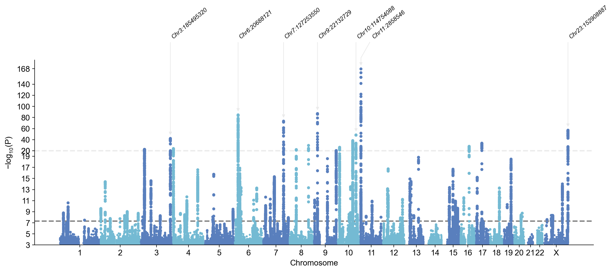

#### anno="GENENAME"

- `anno="GENENAME"` : automatically annoatate the nearest gene name

Note: remerber to set `build=19` or `build=38` when loading or plotting.

```python
mysumstats.plot_mqq(skip=3,cut=20,anno="GENENAME", sig_level_lead=1e-20,mode= "m",check=False,verbose=False)
```

**stdout:**
```python
2025/12/23 23:58:15  -POS data type is already numeric. Skipping conversion...
2025/12/23 23:58:17  -CHR data type is already numeric. Skipping conversion...
```

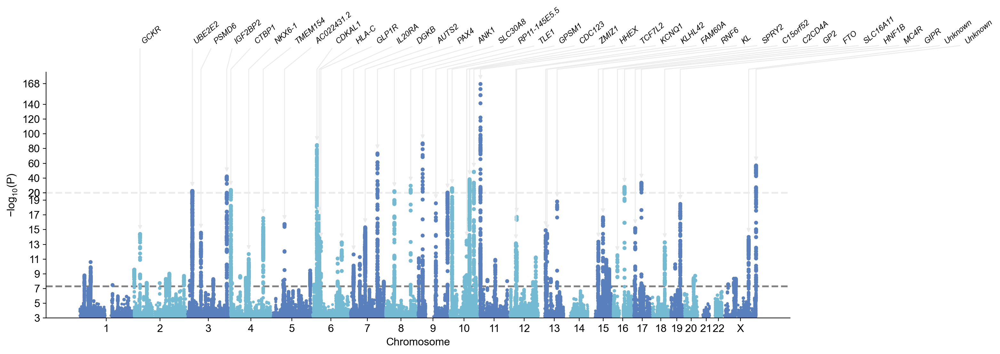

You can specify `anno_gtf_path` to use you own GTF file for GENENAME annotation

```python
# mysumstats.plot_mqq(anno_gtf_path="/home/yunye/.gwaslab/Homo_sapiens.GRCh37.87.chr.gtf.gz",anno="GENENAME")
```

#### anno_d

We can use `anno_d` to slightly adjust the arrows.

`anno_d` accepts a dictionary of `index of annotation`: `left`/`right`

For example, `1:"left"` means to adjust towards left. 

```python
mysumstats.plot_mqq(anno_d={1:"left",2:"right"}, skip=3,cut=20,anno=True, sig_level_lead=1e-20,mode= "m",check=False,verbose=False)
```

**stdout:**
```python
2025/12/23 23:58:25  -POS data type is already numeric. Skipping conversion...
2025/12/23 23:58:26  -CHR data type is already numeric. Skipping conversion...
```


#### anno_scale

We can also use `arm_scale` to adjust where to put the annotation texts.

For example, `arm_scale=1.2` means the default length will be multiplied by a factor of 1.2.

```python
mysumstats.plot_mqq(arm_scale=1.2, skip=3,cut=20,anno=True, sig_level_lead=1e-20,mode= "m",check=False,verbose=False)
```

**stdout:**
```python
2025/12/23 23:58:32  -POS data type is already numeric. Skipping conversion...
2025/12/23 23:58:33  -CHR data type is already numeric. Skipping conversion...
```

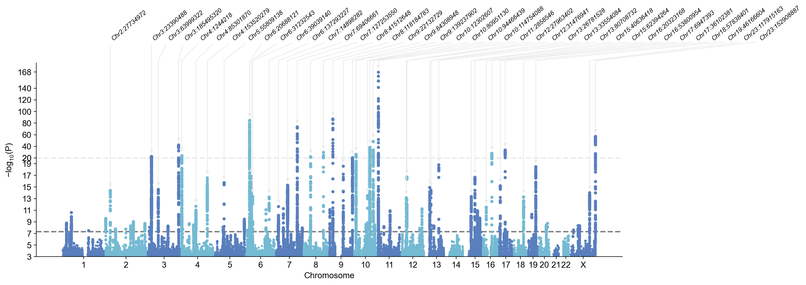

`arm_scale_d` accepts a dictionary of `index of annotation`: `arm_scale`

For example, `1:1.2` means to adjust the arm of the second by a factor of 1.2. 

```python
mysumstats.plot_mqq(arm_scale_d={0:0.8,
                                 1:0.7,
                                 2:0.6,
                                 3:0.8}, 
                    skip=3,cut=20,anno=True, sig_level_lead=1e-20,mode= "m",check=False,verbose=False)
```

**stdout:**
```python
2025/12/23 23:58:39  -POS data type is already numeric. Skipping conversion...
2025/12/23 23:58:40  -CHR data type is already numeric. Skipping conversion...
```

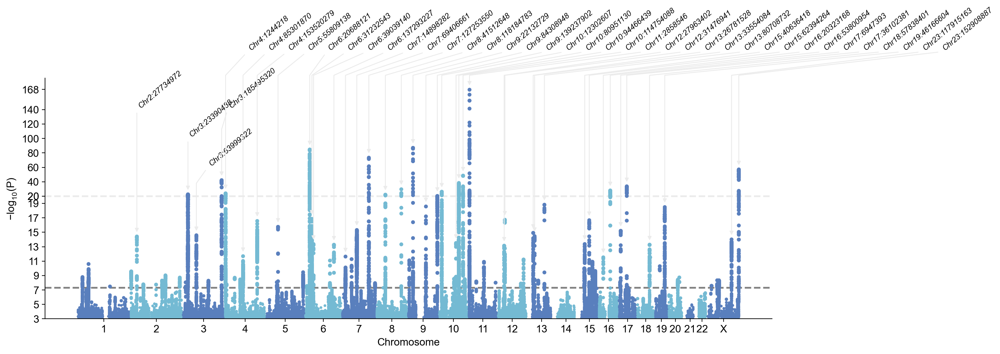

#### anno_style

GWASLab provides three types of different annotation styles

`anno_style="right"`, `anno_style="expand"`, and `anno_style="tight"`

```python
mysumstats.plot_mqq(skip=3,cut=20,anno=True,anno_style="expand", sig_level_lead=1e-20,mode= "m",check=False,verbose=False)
```

**stdout:**
```python
2025/12/23 23:58:46  -POS data type is already numeric. Skipping conversion...
2025/12/23 23:58:47  -CHR data type is already numeric. Skipping conversion...
```

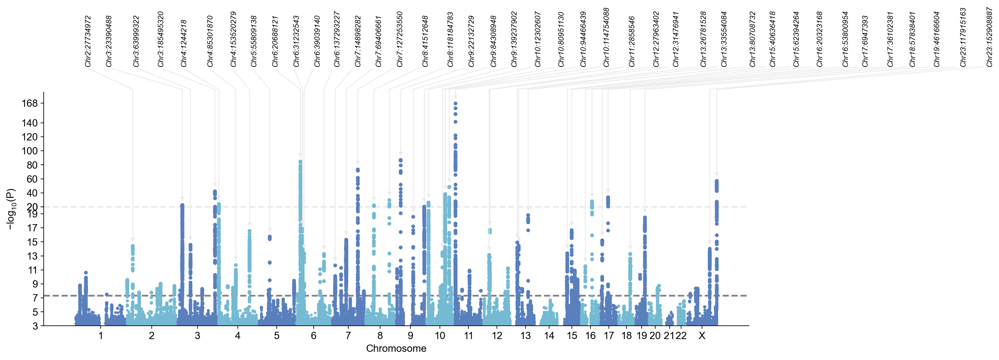

```python
mysumstats.plot_mqq(skip=3,cut=20,anno=True,anno_style="tight", sig_level_lead=1e-20,mode= "m", check=False,verbose=False)
```

**stdout:**
```python
2025/12/23 23:58:53  -POS data type is already numeric. Skipping conversion...
2025/12/23 23:58:54  -CHR data type is already numeric. Skipping conversion...
```

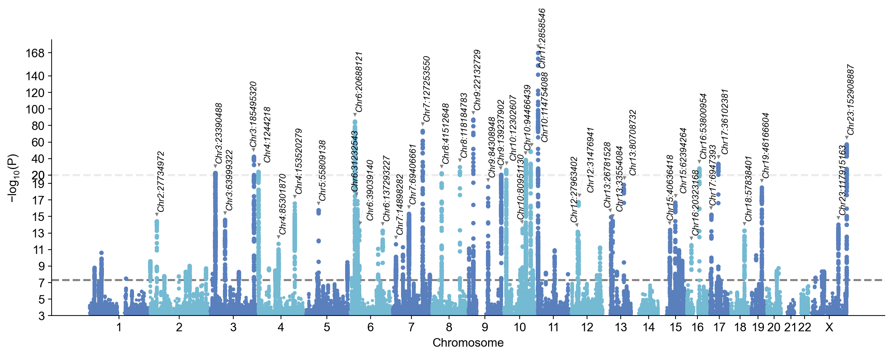

#### anno_set

If we want to annotate only a subset of variants, we can pass a list of variant IDs to `anno_set`. 

Let's check all lead variants and select only two to annotate.

```python
mysumstats.get_lead(verbose=False).sort_values(by="P")
```

```python
| SNPID | CHR | POS | EA NEA | STATUS | EAF | \ |
| --- | --- | --- | --- | --- | --- | --- |
| 7947442 | 11:2858546_C_T | 11 | 2858546 | C | T | 1995999 |
| 6903480 | 9:22132729_A_G | 9 | 22132729 | G | A | 1995999 |
| 4664126 | 6:20688121_T_A | 6 | 20688121 | T | A | 1995999 |
| 5965364 | 7:127253550_C_T | 7 | 127253550 | C | T | 1995999 |
| 12554976 | X:152908887_G_A | 23 | 152908887 | G | A | 1995999 |
| ... | ... | ... | ... | ... | ... | ... |
| 12272930 | 2.616000e-08 |  |  |  |  |  |
| 4599424 | 2.849000e-08 |  |  |  |  |  |
| 10287151 | 3.134000e-08 |  |  |  |  |  |
| 534095 | 3.289000e-08 |  |  |  |  |  |
| 10874150 | 4.159000e-08 |  |  |  |  |  |

*[89 rows x 8 columns]*
```

This time, let's annotate 1:154309595_TA_T and 2:27734972_G_A with its nearest gene names!


`anno_set` : the set of variants you want to annotate

```python
mysumstats.plot_mqq(skip=3,cut=20,anno="GENENAME",anno_set=["1:154309595_TA_T","2:27734972_G_A"],mode= "m",check=False,verbose=False)
```

**stdout:**
```python
2025/12/23 23:59:27  -POS data type is already numeric. Skipping conversion...
2025/12/23 23:59:28  -CHR data type is already numeric. Skipping conversion...
```

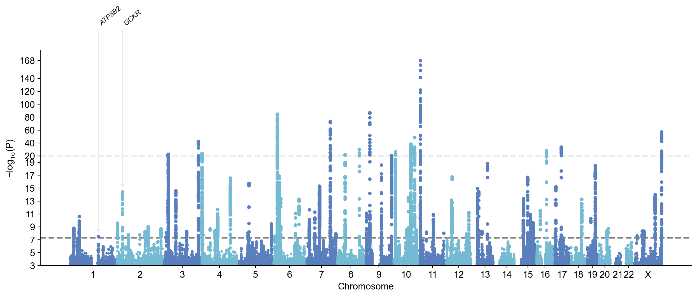

#### anno_alias

anno_alias accepts a dictionary of `SNPID`:`string`. You can use this to customized the text for annotation.

```python
mysumstats.plot_mqq(skip=3,
                    cut=20,
                    anno=True,
                    anno_set=["1:154309595_TA_T","2:27734972_G_A"],
                    anno_alias={"1:154309595_TA_T":"anything you want here"},
                    mode= "m",
                    verbose=False)
```

**stdout:**
```python
2025/12/23 23:59:35  -POS data type is already numeric. Skipping conversion...
2025/12/23 23:59:36  -CHR data type is already numeric. Skipping conversion...
```

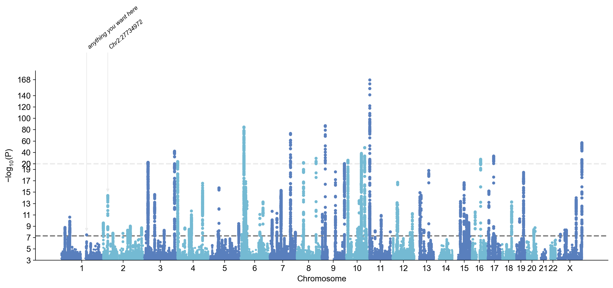

### Highlight loci & Pinpoint variants (single group)

- `highlight`: a variant list of loci you want to highlight
- `pinpoint`: a variant list of variants you want to pinpoint

```python
mysumstats.plot_mqq(skip=3,cut=20,
                    anno=True,
                    anno_set=["2:27734972_G_A","2:27734972_G_A","7:127253550_C_T", "19:46166604_C_T"],
                    highlight=["19:46166604_C_T","1:154309595_TA_T","7:127253550_C_T"],
                    highlight_windowkb=1000,
                    pinpoint=["2:27734972_G_A"],
                    mode= "m",
                    check=False,verbose=False)
```

**stdout:**
```python
2025/12/23 23:59:44  -POS data type is already numeric. Skipping conversion...
2025/12/23 23:59:45  -CHR data type is already numeric. Skipping conversion...
```

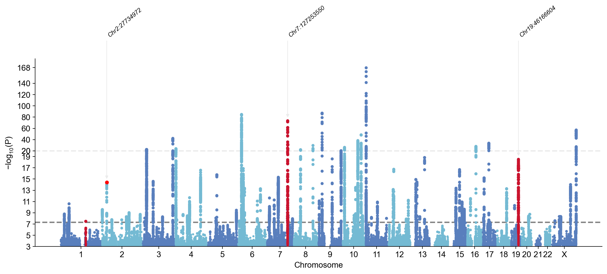

### Highlight loci & Pinpoint variants (multi-group)

Instead of a list, you can provide a list of lists. Each member list is then a group.

```python
mysumstats.plot_mqq(skip=3,cut=20,
                    highlight=[
                               ["19:46166604_C_T","1:154309595_TA_T"],
                               ["X:57170781_A_AT","7:127253550_C_T"]
                              ],
                    highlight_windowkb=1000,
                    highlight_color=["yellow","red"],
                    mode= "m",
                    check=False,verbose=False)
```

**stdout:**
```python
2025/12/23 23:59:53  -POS data type is already numeric. Skipping conversion...
2025/12/23 23:59:54  -CHR data type is already numeric. Skipping conversion...
```

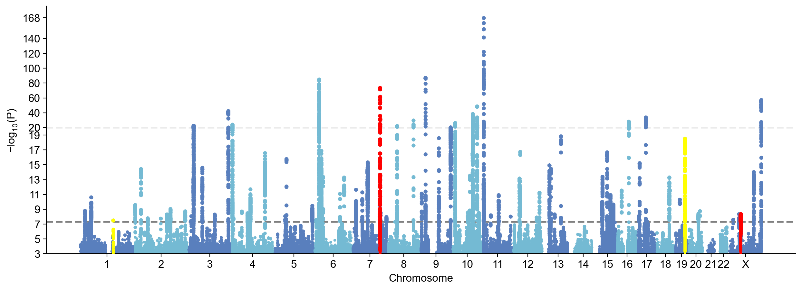

### MAF-stratified QQ plot

```python
mysumstats.plot_mqq(skip=3,cut=20, mode="mqq",stratified=True,check=False,verbose=False)
```

**stdout:**
```python
2025/12/24 00:00:02  -POS data type is already numeric. Skipping conversion...
2025/12/24 00:00:03  -CHR data type is already numeric. Skipping conversion...
2025/12/24 00:00:03  -EAF data type is already numeric. Skipping conversion...
```


### Auxiliary lines

```python
mysumstats.plot_mqq(skip=3,
                build="19",
                anno="GENENAME",
                windowsizekb=1000000,
                cut=20,
                cut_line_color="purple",
                sig_level=5e-8,  
                sig_level_lead=1e-6, 
                sig_line_color="grey",
                suggestive_sig_line = True,
                suggestive_sig_level = 1e-6,
                suggestive_sig_line_color="blue",
                additional_line=[1e-40,1e-60],
                additional_line_color=["yellow","green"],
                mode= "m",check=False,verbose=False)
```

**stdout:**
```python
2025/12/24 00:00:12  -POS data type is already numeric. Skipping conversion...
2025/12/24 00:00:14  -CHR data type is already numeric. Skipping conversion...
```

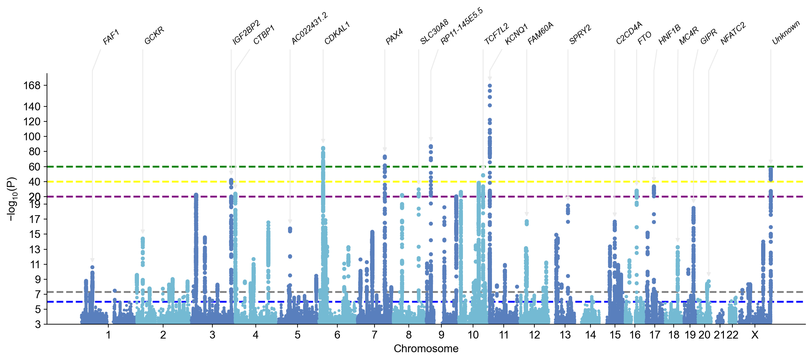

### Font and marker size

- `fontsize`
- `anno_fontsize`
- `title_fontsize`
- `marker_size`

```python
mysumstats.plot_mqq(skip=3,
          anno="GENENAME",
          title= "My Manhattan Plot",
          windowsizekb=1000000,
          fontsize =13,
          anno_fontsize = 15,
          title_fontsize = 30,
          marker_size=(5,25),
          mode= "m", 
          verbose=False,
          check=False
)
```

**stdout:**
```python
2025/12/24 00:00:21  -POS data type is already numeric. Skipping conversion...
2025/12/24 00:00:22  -CHR data type is already numeric. Skipping conversion...
```

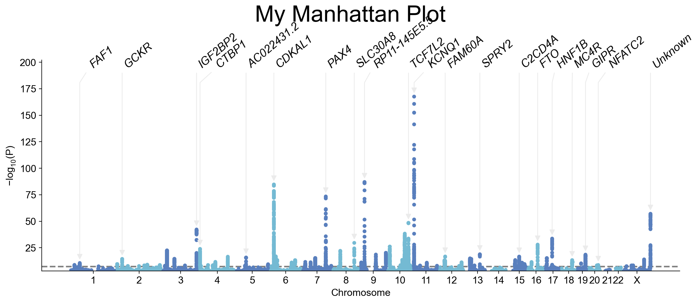

### Colors

- `colors`
- `cut_line_color`
- `sig_line_color`
- `highlight_color`
- `pinpoint_color`
- `maf_bin_colors`

```python
mysumstats.plot_mqq(skip=3,
          cut=20,
          stratified=True,
          highlight=["7:127253550_C_T"],
          pinpoint=["2:27734972_G_A"],
          colors=["orange","blue"],
          cut_line_color="yellow",
          sig_line_color="red",
          highlight_color="purple",
          pinpoint_color ="green",
          maf_bin_colors = ["#FFE2D1","#E1F0C4", "#6BAB90","#55917F"],
          check=False,verbose=False
)
```

**stdout:**
```python
2025/12/24 00:00:30  -POS data type is already numeric. Skipping conversion...
2025/12/24 00:00:31  -CHR data type is already numeric. Skipping conversion...
2025/12/24 00:00:31  -EAF data type is already numeric. Skipping conversion...
```

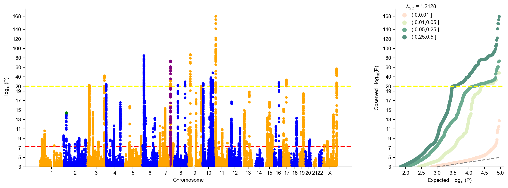

### Save plots

```python
mysumstats.plot_mqq(skip=3,
                    cut=20, 
                    mode="mqq",
                    stratified=True,
                    save="my_maf_stratified_mqq_plot.png",
                    save_kwargs={"dpi":300,"facecolor":"white"})
```

**stdout:**
```python
2025/12/24 00:01:39 Configured plot style for plot_mqq:mqq
2025/12/24 00:01:39 Starting Manhattan-QQ plot creation (Version v4.0.0)
2025/12/24 00:01:39  -Genomic coordinates are based on GRCh37/hg19...
2025/12/24 00:01:39  - Genomic coordinates version: 19 ...
2025/12/24 00:01:39  - Genome-wide significance level to plot is set to 5e-08 ...
2025/12/24 00:01:39  - Input sumstats contains 12557761 variants...
2025/12/24 00:01:39  - Manhattan-QQ plot layout mode selected: mqq
2025/12/24 00:01:40  -POS data type is already numeric. Skipping conversion...
2025/12/24 00:01:41  -CHR data type is already numeric. Skipping conversion...
2025/12/24 00:01:41  -EAF data type is already numeric. Skipping conversion...
2025/12/24 00:01:42 Finished loading specified columns from the statistics
2025/12/24 00:01:42 Start data conversion and sanity check:
2025/12/24 00:01:43  -Removed 0 variants with nan in CHR or POS column ...
2025/12/24 00:01:44  -Removed 0 variants with CHR <=0...
2025/12/24 00:01:45  -Removed 0 variants with nan in EAF column ...
2025/12/24 00:01:46  -Removed 0 variants with nan in P column ...
2025/12/24 00:01:46  -Sanity check after conversion: 0 variants with P value outside of (0,1] will be removed...
2025/12/24 00:01:47  -Sumstats P values are being converted to -log10(P)...
2025/12/24 00:01:47  -Sanity check: 0 na/inf/-inf variants will be removed...
2025/12/24 00:01:48  -Converting data above cut line...
2025/12/24 00:01:48  -Maximum -log10(P) value is 167.58838029403677 .
2025/12/24 00:01:48  -Minus log10(P) values above 20 will be shrunk with a shrinkage factor of 10...
2025/12/24 00:01:48 Finished data conversion and sanity check.
2025/12/24 00:01:48 Start to create Manhattan-QQ plot with 91234 variants...
2025/12/24 00:01:49  -Creating background plot...
2025/12/24 00:01:49 Finished creating Manhattan-QQ plot successfully
2025/12/24 00:01:49 Start to extract variants for annotation...
2025/12/24 00:01:49  -Found 89 significant variants with a sliding window size of 500 kb...
2025/12/24 00:01:49 Finished extracting variants for annotation...
2025/12/24 00:01:49  -Processing X ticks...
2025/12/24 00:01:49  -Processing X labels...
2025/12/24 00:01:49  -Processing Y labels...
2025/12/24 00:01:49  -Processing Y tick lables...
2025/12/24 00:01:49  -Processing Y labels...
2025/12/24 00:01:49  -Processing lines...
2025/12/24 00:01:49 Start to create QQ plot with 91234 variants:
2025/12/24 00:01:49  -Plotting variants stratified by MAF...
2025/12/24 00:01:51  -Lambda GC (MLOG10P mode) at 0.5 is   1.21283
2025/12/24 00:01:51  -Processing Y tick lables...
2025/12/24 00:01:51 Finished creating QQ plot successfully!
2025/12/24 00:01:51 Start to save figure...
2025/12/24 00:01:52  -Saved to my_maf_stratified_mqq_plot.png successfully! (png)
2025/12/24 00:01:52 Finished saving figure...
2025/12/24 00:01:52 Finished creating plot successfully
```

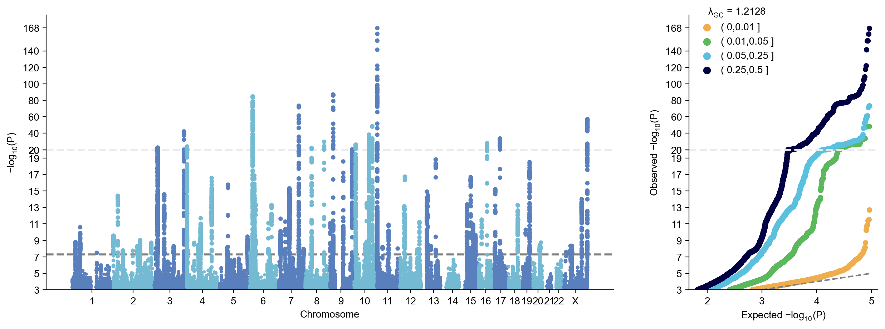

### Fig and Log object

plot_mqq will return a matplotlib figure object and a gwaslab log object

```python
my_mqqplot,my_log = mysumstats.plot_mqq(skip=3,cut=20, mode="mqq",stratified=True,verbose=False)
```

```python
my_mqqplot
```

```python
my_log
```

```python
my_log.show()
```
