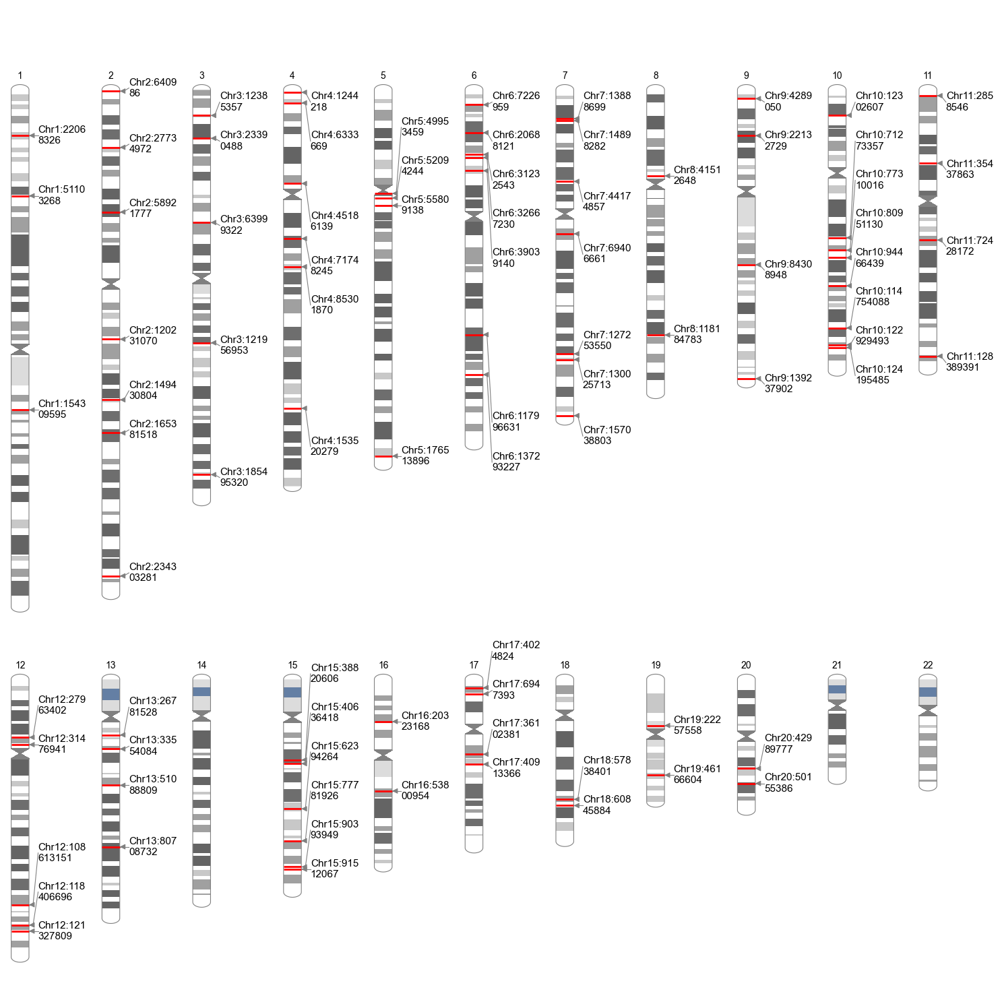
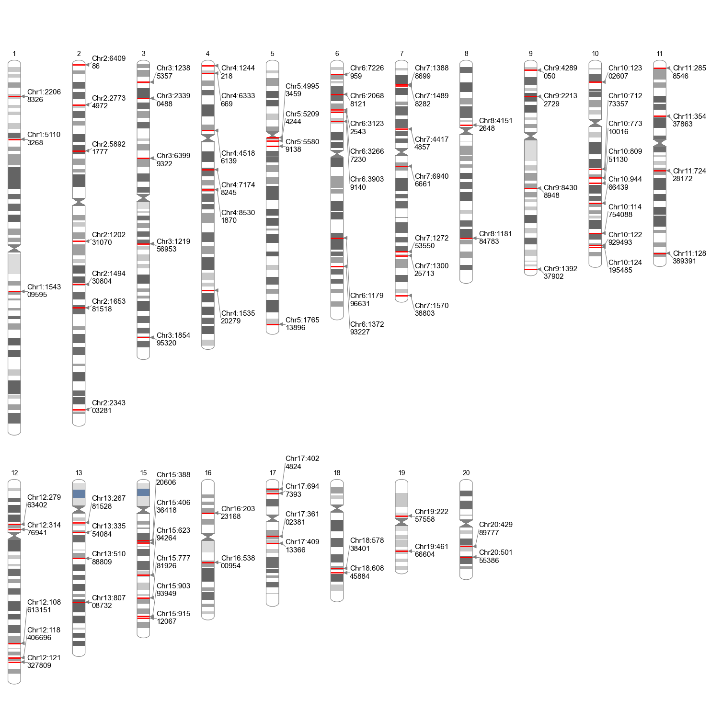
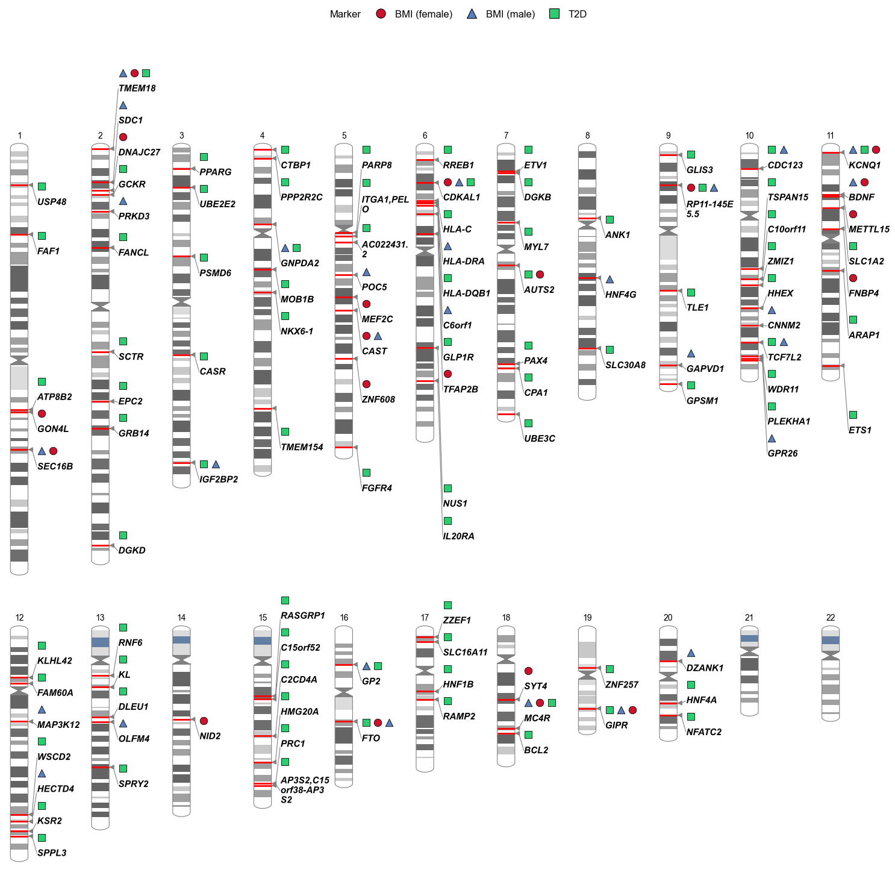
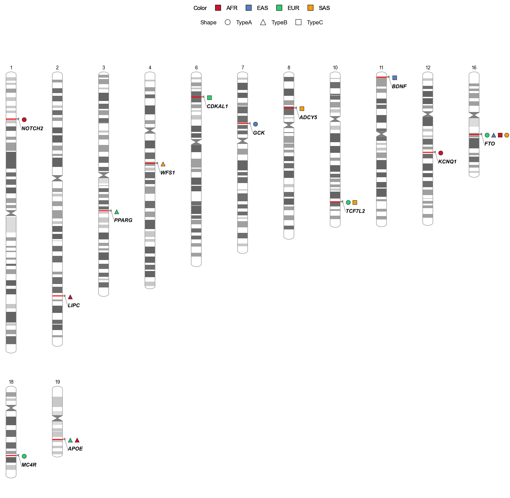

# Phenogram plot

!!! info "Available since v4.2.0"

!!! example
    ```python
    import gwaslab as gl
    import pandas as pd
    ```

!!! example
    ```python
    gl.show_version()
    ```

**stdout:**
```
2026/06/28 15:28:16 GWASLab v4.2.0 https://cloufield.github.io/gwaslab/
2026/06/28 15:28:16 (C) 2022-2026, Yunye He, Kamatani Lab, GPL-3.0 license, gwaslab@gmail.com
2026/06/28 15:28:16 Python version: 3.12.0 | packaged by conda-forge | (main, Oct  3 2023, 08:43:22) [GCC 12.3.0]
```

## Load data

This tutorial uses the bundled T2D GWAS sample file at `examples/0_sample_data/t2d_bbj.txt.gz` (hg19). Paths below are relative to the repository root after clone; if you run notebooks from the `examples/` directory, use `0_sample_data/t2d_bbj.txt.gz` instead.

!!! example
    ```python
    # BBJ T2D GWAS; map columns to GWASLab reserved headers
    mysumstats = gl.Sumstats(
        "examples/0_sample_data/t2d_bbj.txt.gz",
        snpid="SNP",
        chrom="CHR",
        pos="POS",
        ea="ALT",
        nea="REF",
        neaf="Frq",
        p="P",
        build="19",
        verbose=False,
    )
    mysumstats.fix_chr(verbose=False)
    ```

**stdout:**
```
2026/06/28 15:28:16 Start to initialize gl.Sumstats from file :examples/0_sample_data/t2d_bbj.txt.gz
2026/06/28 15:28:34  -Reading columns          : P,CHR,REF,SNP,POS,Frq,ALT
2026/06/28 15:28:34  -Renaming columns to      : P,CHR,NEA,SNPID,POS,EAF,EA
2026/06/28 15:28:34  -Current Dataframe shape : 12557761  x  7
2026/06/28 15:28:35  -Genomic coordinates are based on GRCh37/hg19...
2026/06/28 15:28:42 Finished loading data successfully!
```

## Basic phenogram (text mode)

By default, `plot_phenogram()` extracts lead variants at genome-wide significance (`anno_sig_level=5e-8`, `windowsizekb=500`) and draws them on cytoband-colored chromosome ideograms. Set `anno=True` to label each lead with `Chr:POS`.

!!! example
    ```python
    mysumstats.plot_phenogram(
        anno=True,              # Chr:POS text labels
        figsize=(12, 20),       # smaller demo size (default is much taller)
        dpi=100,
        verbose=False,
    )
    ```

**stdout:**
```
2026/06/28 15:28:47 Start to create phenogram plot...
2026/06/28 15:28:48  -Extracting lead variants...
2026/06/28 15:28:50  -Found 9461 significant variants in total...
2026/06/28 15:28:52  -Found 89 lead variant(s) to annotate.
2026/06/28 15:28:52  -Text annotation mode.
2026/06/28 15:28:52  -Label source: Chr:POS
2026/06/28 15:28:52  -Plotting 22 chromosomes...
2026/06/28 15:29:05 Finished creating phenogram plot successfully!
```



## Compact layout

Use `only_anno_chr=True` to show only chromosomes that contain at least one lead variant. This is useful when you have many hits spread across the genome and want a shorter figure.

!!! example
    ```python
    mysumstats.plot_phenogram(
        anno=True,
        only_anno_chr=True,     # drop empty chromosomes
        figsize=(12, 16),
        dpi=100,
        verbose=False,
    )
    ```



## Group mode

Group mode is enabled when `anno_group` is set to a categorical column. Each category gets its own marker row with distinct shapes and/or colors, and a figure legend summarizes the groups.

Below we merge genome-wide leads from three BBJ traits—T2D, BMI (male), and BMI (female)—tag each row with `TRAIT`, assign nearest gene names to a `GENE` column, then group markers by gene while using trait for shape and color:

!!! example
    ```python
    # Shared load kwargs (EA/NEA needed for gene annotation)
    LOAD_KW = dict(
        snpid="SNP", chrom="CHR", pos="POS",
        ea="ALT", nea="REF", neaf="Frq", p="P",
        build="19", verbose=False,
    )

    def load_and_leads(path, trait):
        ss = gl.Sumstats(path, **LOAD_KW)
        ss.fix_chr(verbose=False)
        leads = ss.get_lead(verbose=False)
        leads["TRAIT"] = trait  # trait label for marker shape/color
        return leads

    # Merge leads from three traits into one table
    combined_leads = pd.concat([
        load_and_leads("examples/0_sample_data/t2d_bbj.txt.gz", "T2D"),
        load_and_leads("examples/0_sample_data/bmi_male_bbj.txt.gz", "BMI (male)"),
        load_and_leads("examples/0_sample_data/bmi_female_bbj.txt.gz", "BMI (female)"),
    ], ignore_index=True)

    lead_ss = gl.Sumstats(combined_leads, build="19", verbose=False)

    # Add nearest gene name column (required for anno_group="GENE")
    lead_ss.data = lead_ss.anno_gene(source="ensembl", verbose=False)

    lead_ss.plot_phenogram(
        use_lead_extraction=False,   # input is already a lead table
        anno_group="GENE",           # group markers by nearest gene
        anno_source="ensembl",
        anno_shape="TRAIT",          # marker shape per trait
        anno_color="TRAIT",          # marker color per trait
        marker_shapes=["o", "^", "s"],
        marker_colors=["#CB132D", "#597FBD", "#2ECC71"],
        show_legend=True,
        legend_ncol=3,
        figsize=(12, 20),
        dpi=100,
        verbose=False,
    )
    ```

**stdout:**
```
2026/06/28 15:46:39 Start to create phenogram plot...
2026/06/28 15:46:39  -Using input table directly (no lead extraction)...
2026/06/28 15:46:39  -Found 137 variant row(s) to annotate.
2026/06/28 15:46:39  -Marker mode: 3 shape categories, 3 color categories.
2026/06/28 15:46:39  -Plotting 22 chromosomes...
2026/06/28 15:46:45 Finished creating phenogram plot.
```



!!! tip "Pleiotropic loci"
    When several traits share a gene, markers for each trait appear in the same `GENE` group block; shape and color distinguish which study each lead came from.

## Multi-ancestry and multi-subtype (simulated)

When `anno_shape` and `anno_color` point to **different** columns, the figure shows separate **Shape** and **Color** legend rows. Use `anno_group` to stack variants that share a locus into one marker block.

The example below uses **simulated leads**: most `(SUBTYPE, ANCESTRY)` pairs have their own solo locus, while a few hub loci (`FTO`, `TCF7L2`, `APOE`) are shared by multiple pairs—not a full subtype × ancestry grid.

!!! example
    ```python
    def add_row(rows, rs_i, chrom, pos, locus, subtype, ancestry, p=1e-12):
        """Append one simulated lead; return next rs index."""
        rows.append({
            "SNPID": f"rs{rs_i}",
            "CHR": chrom,
            "POS": int(pos),
            "P": p,
            "LOCUS": locus,
            "SUBTYPE": subtype,
            "ANCESTRY": ancestry,
        })
        return rs_i + 1

    rows, rs_i = [], 1

    # Shared loci: selected pairs only (partial overlap across ancestries/subtypes)
    for subtype, ancestry in [("TypeA", "EUR"), ("TypeB", "EAS"), ("TypeC", "AFR"), ("TypeA", "SAS")]:
        rs_i = add_row(rows, rs_i, 16, 53_800_000 + rs_i * 1_000, "FTO", subtype, ancestry)

    for subtype, ancestry in [("TypeA", "EUR"), ("TypeC", "SAS")]:
        rs_i = add_row(rows, rs_i, 10, 114_700_000 + rs_i * 1_000, "TCF7L2", subtype, ancestry)

    for ancestry in ["EUR", "AFR"]:
        rs_i = add_row(rows, rs_i, 19, 45_410_000 + rs_i * 1_000, "APOE", "TypeB", ancestry)

    # Pair-specific solo loci (unique to one subtype + ancestry combination)
    solo = [
        (7, 44_000_000, "GCK", "TypeA", "EAS"),
        (3, 123_000_000, "PPARG", "TypeB", "EUR"),
        (18, 60_000_000, "MC4R", "TypeA", "EUR"),
        (11, 2_000_000, "BDNF", "TypeC", "EAS"),
        (2, 200_000_000, "LIPC", "TypeB", "AFR"),
        (6, 20_000_000, "CDKAL1", "TypeC", "EUR"),
        (12, 70_000_000, "KCNQ1", "TypeA", "AFR"),
        (4, 80_000_000, "WFS1", "TypeB", "SAS"),
        (8, 30_000_000, "ADCY5", "TypeC", "SAS"),
        (1, 40_000_000, "NOTCH2", "TypeA", "AFR"),
    ]
    for chrom, pos, locus, subtype, ancestry in solo:
        rs_i = add_row(rows, rs_i, chrom, pos, locus, subtype, ancestry)

    sim_leads = pd.DataFrame(rows)
    sim_ss = gl.Sumstats(sim_leads, build="19", verbose=False)

    sim_ss.plot_phenogram(
        use_lead_extraction=False,   # input is already a lead table
        anno_group="LOCUS",          # stack shared loci into one marker block
        anno_shape="SUBTYPE",        # shape encodes disease subtype
        anno_color="ANCESTRY",       # color encodes ancestry
        marker_shapes=["o", "^", "s"],
        marker_colors=["#CB132D", "#597FBD", "#2ECC71", "#F39C12"],
        show_legend=True,
        legend_ncol=4,
        only_anno_chr=True,          # omit chromosomes with no leads
        figsize=(12, 16),
        dpi=100,
        verbose=False,
    )
    ```

**stdout:**
```
2026/06/28 15:51:17 Start to create phenogram plot...
2026/06/28 15:51:17  -Using input table directly (no lead extraction)...
2026/06/28 15:51:17  -Found 18 variant row(s) to annotate.
2026/06/28 15:51:17  -Marker mode: 3 shape categories, 4 color categories.
2026/06/28 15:51:17  -only_anno_chr: plotting 13 chromosome(s) with annotations.
2026/06/28 15:51:17  -Plotting 13 chromosomes...
2026/06/28 15:51:18 Finished creating phenogram plot.
```



See the parameter reference [here](PhenogramPlot.md).
