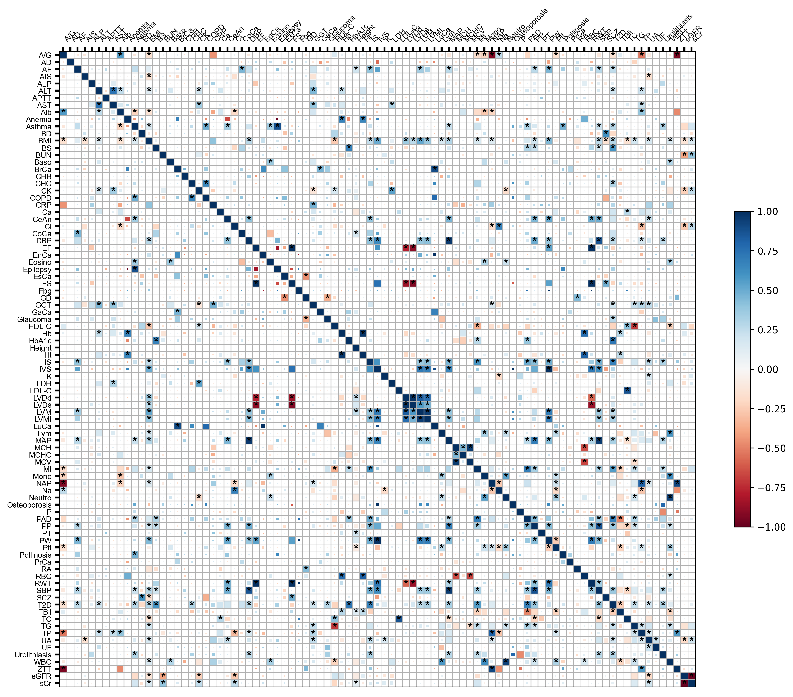
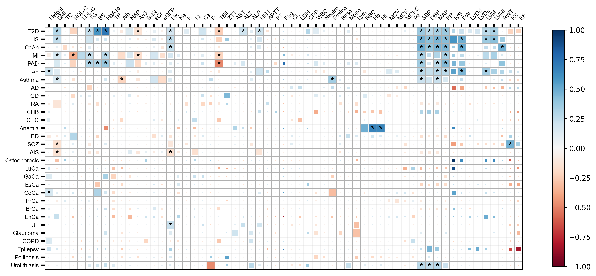

# Correlation heatmap

```python
import gwaslab as gl
import pandas as pd
```

```python
gl.show_version()
```

**stdout:**
```python
2024/12/23 12:20:37 GWASLab v3.5.4 https://cloufield.github.io/gwaslab/
2024/12/23 12:20:37 (C) 2022-2024, Yunye He, Kamatani Lab, MIT License, gwaslab@gmail.com
```

## Load sample data

Sample data source: 

- Kanai, M., Akiyama, M., Takahashi, A., Matoba, N., Momozawa, Y., Ikeda, M., ... & Kamatani, Y. (2018). Genetic analysis of quantitative traits in the Japanese population links cell types to complex human diseases. Nature genetics, 50(3), 390-400.

```python
ldsc = pd.read_csv("../0_sample_data/toy_data/input_rg.txt",sep="\t")
ldsc
```

```python
| p1_category | p1 | p2_category | p2 | rg | \ |
| --- | --- | --- | --- | --- | --- |
| 0 | Anthropometric | Height | Anthropometric | BMI -0.0587 |  |
| 1 | Anthropometric | Height | Metabolic | TC -0.0778 |  |
| 2 | Anthropometric | Height | Metabolic | HDL-C -0.0045 |  |
| 3 | Anthropometric | Height | Metabolic | LDL-C -0.1245 |  |
| 4 | Anthropometric | Height | Metabolic | TG -0.0426 |  |
| ... | ... | ... | ... | ... | ... |
| 3911 | 0.1433 | 2.2683 | 0.023300 | 0.187944 |  |
| 3912 | 0.1756 | 1.2315 | 0.218100 | 0.596616 |  |
| 3913 | 0.1794 | 0.3701 | 0.711300 | 0.903018 |  |
| 3914 | 0.1592 -0.5159 | 0.605890 | 0.863730 |  |  |
| 3915 | 0.1292 | 1.5324 | 0.125410 | 0.456418 |  |

*[3916 rows x 9 columns]*
```

## Full heatmap

```python
df = gl.plot_rg( ldsc,
            p="q",
            p1="p2",
            p2="p1", 
            sig_levels=[0.05],
            corrections =["non"],
            full_cell=("non",0.05),
            panno_texts=["*"],
            panno_args={"size":12,"c":"black"},
            fig_args={"figsize":(15,15),"dpi":300},
            colorbar_args={"shrink":0.4},
            fontsize=8
            )
```

**stdout:**
```python
2024/12/23 12:20:37 Start to create ldsc genetic correlation heatmap...
2024/12/23 12:20:37 Raw dataset records: 3916
2024/12/23 12:20:37  -Raw dataset non-NA records: 3916
2024/12/23 12:20:37 Filling diagnal line and duplicated pair for plotting...
2024/12/23 12:20:37  -Diagnal records: 89
2024/12/23 12:20:37 Valid unique trait pairs: 3916
2024/12/23 12:20:37  -Valid unique trait1: 88
2024/12/23 12:20:37  -Valid unique trait2: 88
2024/12/23 12:20:37  -Significant correlations with P < 0.05: 270
2024/12/23 12:20:37  -Significant correlations after Bonferroni correction: 81
2024/12/23 12:20:37  -Significant correlations with FDR <0.05: 127
2024/12/23 12:20:37 Plotting heatmap...
2024/12/23 12:20:37 Full cell : non-corrected P == 0.05
2024/12/23 12:20:42 P value annotation text (Order: Bon -> FDR -> Pnom): 
2024/12/23 12:20:42  -* : non-corrected P < 0.05 
2024/12/23 12:20:42 Start to save figure...
2024/12/23 12:20:42  -Skip saving figure!
2024/12/23 12:20:42 Finished saving figure...
2024/12/23 12:20:42 Finished creating ldsc genetic correlation heatmap!
```



## filter and order the data

```python
# Order the data
trait =  pd.read_csv("../0_sample_data/toy_data/trait_list.txt",sep="\t")
trait["order"] = range(len(trait))
trait

# These steps are just used to order the traits

order = trait["TRAIT"].values

trait_set1 = trait.loc[trait["order"]>=59,"TRAIT"].values
trait_set2 = trait.loc[trait["order"]<59,"TRAIT"].values

ldsc = ldsc.loc[((ldsc["p1"].isin(trait_set1))&(ldsc["p2"].isin(trait_set2))) | ((ldsc["p1"].isin(trait_set2))&(ldsc["p2"].isin(trait_set1))),:]

# key for sort
map_dic={order[i]:i+1 for i in range(len(order))}
key=lambda x:x.map(map_dic)
```

```python
print(map_dic)
```

**stdout:**
```python
{'Height': 1, 'BMI': 2, 'TC': 3, 'HDL-C': 4, 'LDL-C': 5, 'TG': 6, 'BS': 7, 'HbA1c': 8, 'TP': 9, 'Alb': 10, 'NAP': 11, 'A/G': 12, 'BUN': 13, 'sCr': 14, 'eGFR': 15, 'UA': 16, 'Na': 17, 'K': 18, 'Cl': 19, 'Ca': 20, 'P': 21, 'TBil': 22, 'ZTT': 23, 'AST': 24, 'ALT': 25, 'ALP': 26, 'GGT': 27, 'APTT': 28, 'PT': 29, 'Fbg': 30, 'CK': 31, 'LDH': 32, 'CRP': 33, 'WBC': 34, 'Neutro': 35, 'Eosino': 36, 'Baso': 37, 'Mono': 38, 'Lym': 39, 'RBC': 40, 'Hb': 41, 'Ht': 42, 'MCV': 43, 'MCH': 44, 'MCHC': 45, 'Plt': 46, 'SBP': 47, 'DBP': 48, 'MAP': 49, 'PP': 50, 'IVS': 51, 'PW': 52, 'LVDd': 53, 'LVDs': 54, 'LVM': 55, 'LVMI': 56, 'RWT': 57, 'FS': 58, 'EF': 59, 'T2D': 60, 'IS': 61, 'CeAn': 62, 'MI': 63, 'PAD': 64, 'AF': 65, 'Asthma': 66, 'AD': 67, 'GD': 68, 'RA': 69, 'CHB': 70, 'CHC': 71, 'Anemia': 72, 'BD': 73, 'SCZ': 74, 'AIS': 75, 'Osteoporosis': 76, 'LuCa': 77, 'GaCa': 78, 'EsCa': 79, 'CoCa': 80, 'PrCa': 81, 'BrCa': 82, 'EnCa': 83, 'UF': 84, 'Glaucoma': 85, 'COPD': 86, 'Epilepsy': 87, 'Pollinosis': 88, 'Urolithiasis': 89}
```

## Replicate heatmap in paper

```python
df = gl.plot_rg( ldsc,
            sig_levels=[0.05],
            corrections =["non"],
            p="q",
            p1="p2",
            p2="p1",
            full_cell=("non",0.05),
            panno_texts=["*"],
            fig_args={"figsize":(15,15),"dpi":300},
            colorbar_args={"shrink":0.4},
            panno_args={"size":12,"c":"black"},
            fontsize=8,
            sort_key=key
            )
```

**stdout:**
```python
2024/12/23 12:20:43 Start to create ldsc genetic correlation heatmap...
2024/12/23 12:20:43 Raw dataset records: 1770
2024/12/23 12:20:43  -Raw dataset non-NA records: 1770
2024/12/23 12:20:43 Filling diagnal line and duplicated pair for plotting...
2024/12/23 12:20:43 Valid unique trait pairs: 1770
2024/12/23 12:20:43  -Valid unique trait1: 59
2024/12/23 12:20:43  -Valid unique trait2: 30
2024/12/23 12:20:43  -Significant correlations with P < 0.05: 68
2024/12/23 12:20:43  -Significant correlations after Bonferroni correction: 13
2024/12/23 12:20:43  -Significant correlations with FDR <0.05: 20
2024/12/23 12:20:43 Plotting heatmap...
2024/12/23 12:20:43 Full cell : non-corrected P == 0.05
2024/12/23 12:20:44 P value annotation text (Order: Bon -> FDR -> Pnom): 
2024/12/23 12:20:44  -* : non-corrected P < 0.05 
2024/12/23 12:20:44 Start to save figure...
2024/12/23 12:20:44  -Skip saving figure!
2024/12/23 12:20:44 Finished saving figure...
2024/12/23 12:20:44 Finished creating ldsc genetic correlation heatmap!
```


