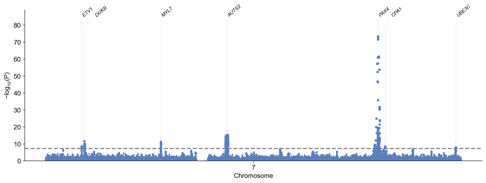
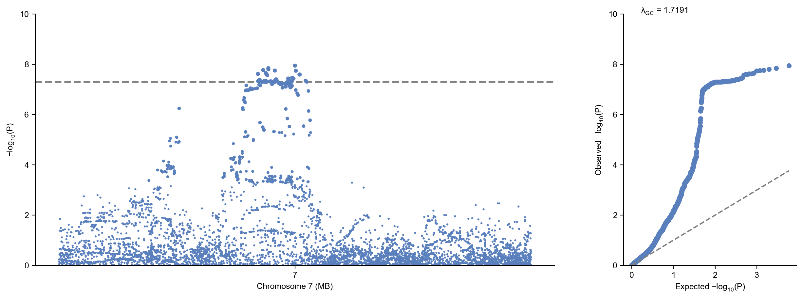
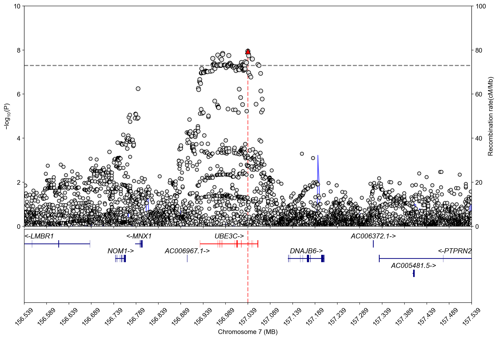
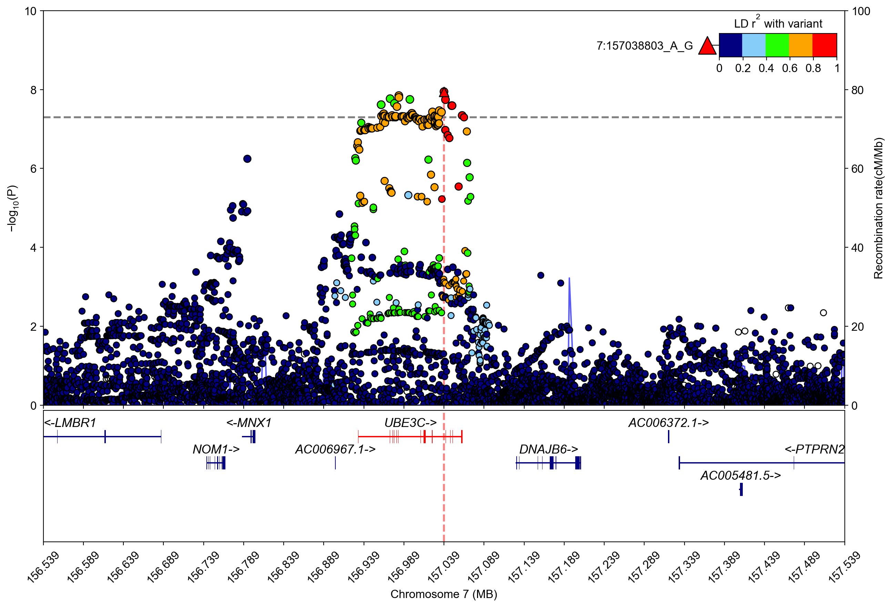
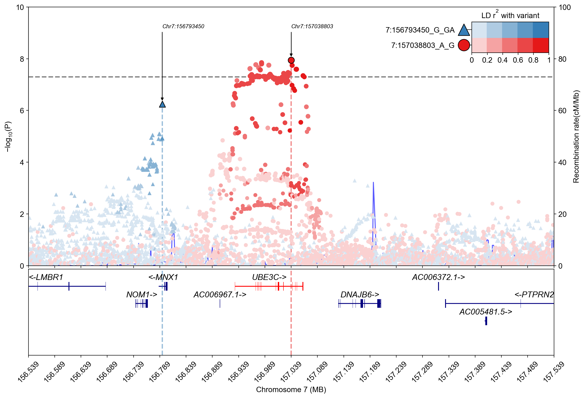
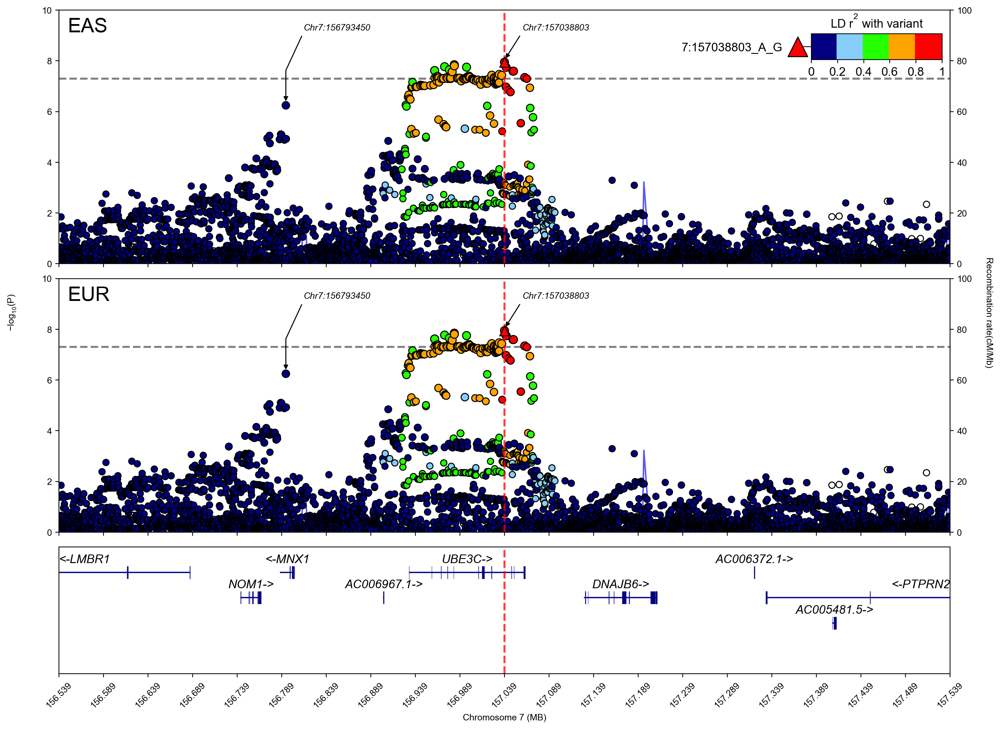

# Regional plot

## load gwaslab

```python
import gwaslab as gl
```

```python
gl.show_version()
```

**stdout:**
```
2025/12/26 00:07:33 GWASLab v4.0.0 https://cloufield.github.io/gwaslab/
2025/12/26 00:07:33 (C) 2022-2025, Yunye He, Kamatani Lab, GPL-3.0 license, gwaslab@gmail.com
2025/12/26 00:07:33 Python version: 3.12.0 | packaged by conda-forge | (main, Oct  3 2023, 08:43:22) [GCC 12.3.0]
```

## download sample data

```python
#!wget -O t2d_bbj.txt.gz http://jenger.riken.jp/14/
```

## load sumstats into gwaslab.Sumstats

```python
mysumstats = gl.Sumstats("../0_sample_data/t2d_bbj.txt.gz",
             snpid="SNP",
             chrom="CHR",
             pos="POS",
             ea="ALT",
             nea="REF",
             neaf="Frq",
             beta="BETA",
             se="SE",
             p="P",
             direction="Dir",
             build="19",
             chrom_pat="7",
             n="N")
mysumstats.basic_check(verbose = False)
```

**stdout:**
```
2025/12/26 00:07:33 GWASLab v4.0.0 https://cloufield.github.io/gwaslab/
2025/12/26 00:07:33 (C) 2022-2025, Yunye He, Kamatani Lab, GPL-3.0 license, gwaslab@gmail.com
2025/12/26 00:07:33 Python version: 3.12.0 | packaged by conda-forge | (main, Oct  3 2023, 08:43:22) [GCC 12.3.0]
2025/12/26 00:07:33 Start to initialize gl.Sumstats from file :../0_sample_data/t2d_bbj.txt.gz
2025/12/26 00:07:33  -Columns used to filter variants: CHR
2025/12/26 00:07:33  -Loading only variants on chromosome with pattern : 7 ...
2025/12/26 00:07:51  -Loaded 707780 variants on chromosome with pattern :7 ...
2025/12/26 00:07:51  -Reading columns          : N,SE,SNP,POS,CHR,ALT,P,REF,BETA,Dir,Frq
2025/12/26 00:07:51  -Renaming columns to      : N,SE,SNPID,POS,CHR,EA,P,NEA,BETA,DIRECTION,EAF
2025/12/26 00:07:51  -Current Dataframe shape : 707780  x  11
2025/12/26 00:07:52  -Initiating a status column: STATUS ...
2025/12/26 00:07:52  -Genomic coordinates are based on GRCh37/hg19...
2025/12/26 00:07:52  -NEAF is specified...
2025/12/26 00:07:52  -Checking if 0<= NEAF <=1 ...
2025/12/26 00:07:52  -Converted NEAF to EAF.
2025/12/26 00:07:52  -Removed 0 variants with bad NEAF.
2025/12/26 00:07:52 Start to reorder the columns ...(v4.0.0)
2025/12/26 00:07:52  -Reordering columns to    : SNPID,CHR,POS,EA,NEA,STATUS,EAF,BETA,SE,P,DIRECTION,N
2025/12/26 00:07:52 Finished reordering the columns.
2025/12/26 00:07:52  -Trying to convert datatype for CHR: string -> Int64...Success
2025/12/26 00:07:52  -Column  : SNPID  CHR   POS   EA       NEA      STATUS EAF     BETA    SE      P       DIRECTION N    
2025/12/26 00:07:52  -DType   : object Int64 int64 category category int64  float64 float64 float64 float64 object    int64
2025/12/26 00:07:52  -Verified: T      T     T     T        T        T      T       T       T       T       T         T    
2025/12/26 00:07:52  -Current Dataframe memory usage: 62.98 MB
2025/12/26 00:07:52 Finished loading data successfully!
```

| SNPID | CHR | POS | EA | NEA | STATUS | EAF | BETA | SE | P | DIRECTION | N |
| --- | --- | --- | --- | --- | --- | --- | --- | --- | --- | --- | --- |
| 7:40386_A_G | 7 | 40386 | G | A | 1960099 | 0.3325 | 0.0070 | 0.0167 | 0.6748 | ++-+ | 191764 |
| 7:40845_C_T | 7 | 40845 | C | T | 1960099 | 0.6646 | -0.0076 | 0.0167 | 0.6490 | --+- | 191764 |
| 7:42289_G_A | 7 | 42289 | G | A | 1960099 | 0.9559 | 0.0082 | 0.0290 | 0.7765 | +-+- | 191764 |
| 7:43050_A_C | 7 | 43050 | C | A | 1960099 | 0.0500 | -0.0092 | 0.0282 | 0.7451 | -+-- | 191764 |
| 7:44444_T_C | 7 | 44444 | C | T | 1960099 | 0.0483 | -0.0086 | 0.0276 | 0.7548 | -+-- | 191764 |
| ... | ... | ... | ... | ... | ... | ... | ... | ... | ... | ... | ... |
| 7:159122935_A_C | 7 | 159122935 | C | A | 1960099 | 0.2773 | -0.0023 | 0.0111 | 0.8376 | ++-- | 191764 |
| 7:159125187_G_C | 7 | 159125187 | G | C | 1960099 | 0.2430 | -0.0023 | 0.0111 | 0.8384 | ++-- | 191764 |
| 7:159126346_A_G | 7 | 159126346 | G | A | 1960099 | 0.0049 | -0.0246 | 0.0779 | 0.7524 | +-+- | 191764 |
| 7:159126810_G_A | 7 | 159126810 | G | A | 1960099 | 0.9951 | 0.0262 | 0.0784 | 0.7386 | -+-+ | 191764 |
| 7:159127586_T_G | 7 | 159127586 | G | T | 1960099 | 0.1087 | -0.0066 | 0.0193 | 0.7315 | +-+- | 191764 |

*[11 rows x 12 columns]*

## Create Manhattan plot with sumstats on a single chromosome

```python
mysumstats.plot_mqq(mode="m",anno="GENENAME",anno_source="ensembl")
```

**stdout:**
```
2025/12/26 00:07:56 Configured plot style for plot_mqq:m
2025/12/26 00:07:56  -QC is finished according to meta. Quick QC will be skipped.
2025/12/26 00:07:56 Starting Manhattan plot creation (Version v4.0.0)
2025/12/26 00:07:56  -Genomic coordinates are based on GRCh37/hg19...
2025/12/26 00:07:56  - Genomic coordinates version: 19 ...
2025/12/26 00:07:56  - Genome-wide significance level to plot is set to 5e-08 ...
2025/12/26 00:07:56  - Input sumstats contains 707780 variants...
2025/12/26 00:07:56  - Manhattan plot layout mode selected: m
2025/12/26 00:07:56  -POS data type is already numeric. Skipping conversion...
2025/12/26 00:07:56  -CHR data type is already numeric. Skipping conversion...
2025/12/26 00:07:56 Finished loading specified columns from the statistics
2025/12/26 00:07:56 Start data conversion and sanity check:
2025/12/26 00:07:56  -Sanity check will be skipped.
2025/12/26 00:07:56  -Sumstats P values are being converted to -log10(P)...
2025/12/26 00:07:56  -Converting data above cut line...
2025/12/26 00:07:56  -Maximum -log10(P) value is 73.38711023071251 .
2025/12/26 00:07:56 Finished data conversion and sanity check.
2025/12/26 00:07:56 Start to create Manhattan plot with 707780 variants...
2025/12/26 00:07:56  -Creating background plot...
2025/12/26 00:07:58 Finished creating Manhattan plot successfully
2025/12/26 00:07:58 Start to extract variants for annotation...
2025/12/26 00:07:58  -Found 7 significant variants with a sliding window size of 500 kb...
2025/12/26 00:07:58  -Genomic coordinates are based on GRCh37/hg19...
2025/12/26 00:07:58 Start to annotate variants with nearest gene name(s) ...(v4.0.0)
2025/12/26 00:07:58  -Current Dataframe shape : 7 x 10 ; Memory usage: 0.00 MB
2025/12/26 00:07:58  -Genomic coordinates are based on GRCh37/hg19...
2025/12/26 00:07:58  -Assigning Gene name using ensembl_hg19_gtf for protein coding genes
2025/12/26 00:07:58  -Loading and indexing GTF file...
2025/12/26 00:08:01  -Processing variants by chromosome...
2025/12/26 00:08:01 Finished annotating variants with nearest gene name(s) successfully!.
2025/12/26 00:08:01 Finished extracting variants for annotation...
2025/12/26 00:08:01  -Annotating using column GENENAME...
2025/12/26 00:08:01  -Adjusting text positions with repel_force=0.03...
2025/12/26 00:08:01 Finished creating plot successfully
```



## Check lead variants

```python
mysumstats.get_lead()
```

**stdout:**
```
2025/12/26 00:08:04  -Genomic coordinates are based on GRCh37/hg19...
2025/12/26 00:08:04 Start to extract lead variants ...(v4.0.0)
2025/12/26 00:08:04  -Processing 707780 variants...
2025/12/26 00:08:04  -Significance threshold : 5e-08
2025/12/26 00:08:04  -Sliding window size: 500  kb
2025/12/26 00:08:05  -Using P for extracting lead variants...
2025/12/26 00:08:05  -Found 1077 significant variants in total...
2025/12/26 00:08:05  -Identified 7 lead variants!
2025/12/26 00:08:05 Finished extracting lead variants.
```

| SNPID | CHR | POS | EA | NEA | STATUS | EAF | BETA | SE | P | DIRECTION | N |
| --- | --- | --- | --- | --- | --- | --- | --- | --- | --- | --- | --- |
| 7:13888699_G_C | 7 | 13888699 | G | C | 1960099 | 0.5680 | 0.0562 | 0.0094 | 2.507000e-09 | ++++ | 191764 |
| 7:14898282_C_T | 7 | 14898282 | C | T | 1960099 | 0.6012 | 0.0617 | 0.0088 | 2.336000e-12 | ++++ | 191764 |
| 7:44174857_T_G | 7 | 44174857 | G | T | 1960099 | 0.5985 | -0.0640 | 0.0093 | 5.325000e-12 | ---- | 191764 |
| 7:69406661_A_T | 7 | 69406661 | T | A | 1960099 | 0.1981 | -0.0900 | 0.0111 | 4.871000e-16 | ---- | 191764 |
| 7:127253550_C_T | 7 | 127253550 | C | T | 1960099 | 0.9081 | 0.2761 | 0.0152 | 4.101000e-74 | ++++ | 191764 |
| 7:130025713_G_A | 7 | 130025713 | G | A | 1960099 | 0.9530 | -0.1365 | 0.0230 | 3.068000e-09 | ---- | 191764 |
| 7:157038803_A_G | 7 | 157038803 | G | A | 1960099 | 0.4626 | -0.0502 | 0.0088 | 1.127000e-08 | ---- | 191764 |

*[7 rows x 12 columns]*

## Create a regional plot with no additional information

```python
mysumstats.plot_mqq(region=(7,156538803,157538803))
```

**stdout:**
```
2025/12/26 00:08:05 Configured plot style for plot_mqq:mqq
2025/12/26 00:08:05  -QC is finished according to meta. Quick QC will be skipped.
2025/12/26 00:08:05 Starting Manhattan-QQ plot creation (Version v4.0.0)
2025/12/26 00:08:05  -Genomic coordinates are based on GRCh37/hg19...
2025/12/26 00:08:05  - Genomic coordinates version: 19 ...
2025/12/26 00:08:05  - Genome-wide significance level to plot is set to 5e-08 ...
2025/12/26 00:08:05  - Input sumstats contains 707780 variants...
2025/12/26 00:08:05  - Manhattan-QQ plot layout mode selected: mqq
2025/12/26 00:08:05  -Region to plot : chr7:156538803-157538803.
2025/12/26 00:08:05  -POS data type is already numeric. Skipping conversion...
2025/12/26 00:08:05  -CHR data type is already numeric. Skipping conversion...
2025/12/26 00:08:05  -Normalized region: (CHR=7, START=156538803, END=157538803)
2025/12/26 00:08:05 Start to filter variants within a specific genomic region ...(v4.0.0)
2025/12/26 00:08:05  -Current Dataframe shape : 707780 x 5 ; Memory usage: 28.35 MB
2025/12/26 00:08:05  -Extract SNPs in region : chr7:156538803-157538803...
2025/12/26 00:08:05  -Extract SNPs in specified regions: 5831
2025/12/26 00:08:05  -Filtered out variants: 701949
2025/12/26 00:08:05  -Current Dataframe shape : 5831 x 5 ; Memory usage: 0.28 MB
2025/12/26 00:08:05 Finished filtering variants.
2025/12/26 00:08:05 Finished loading specified columns from the statistics
2025/12/26 00:08:05 Start data conversion and sanity check:
2025/12/26 00:08:05  -Sanity check will be skipped.
2025/12/26 00:08:05  -Sumstats P values are being converted to -log10(P)...
2025/12/26 00:08:05  -Converting data above cut line...
2025/12/26 00:08:05  -Maximum -log10(P) value is 7.948076083953893 .
2025/12/26 00:08:05 Finished data conversion and sanity check.
2025/12/26 00:08:05 Start to create Manhattan-QQ plot with 5831 variants...
2025/12/26 00:08:05  -Creating background plot...
2025/12/26 00:08:05 Finished creating Manhattan-QQ plot successfully
2025/12/26 00:08:05 Start to extract variants for annotation...
2025/12/26 00:08:05  -Found 1 significant variants with a sliding window size of 500 kb...
2025/12/26 00:08:05 Finished extracting variants for annotation...
2025/12/26 00:08:05 Start to create QQ plot with 5831 variants:
2025/12/26 00:08:05  -Plotting all variants...
2025/12/26 00:08:05  -Expected range of P: (0,1.0)
2025/12/26 00:08:05  -Lambda GC (MLOG10P mode) at 0.5 is   1.71914
2025/12/26 00:08:05 Finished creating QQ plot successfully!
2025/12/26 00:08:05 Finished creating plot successfully
```



## Create a regional plot with gene track

```python
mysumstats.plot_mqq(mode="r",region=(7,156538803,157538803))
```

**stdout:**
```
2025/12/26 00:08:05 Filtered out args for `plot_mqq`: highlight
2025/12/26 00:08:05 Configured plot style for plot_mqq:r
2025/12/26 00:08:05  -QC is finished according to meta. Quick QC will be skipped.
2025/12/26 00:08:05 Starting Region plot creation (Version v4.0.0)
2025/12/26 00:08:05  -Genomic coordinates are based on GRCh37/hg19...
2025/12/26 00:08:05  - Genomic coordinates version: 19 ...
2025/12/26 00:08:05  - Genome-wide significance level to plot is set to 5e-08 ...
2025/12/26 00:08:05  - Input sumstats contains 707780 variants...
2025/12/26 00:08:05  - Region plot layout mode selected: r
2025/12/26 00:08:05  -Region to plot : chr7:156538803-157538803.
2025/12/26 00:08:06  -POS data type is already numeric. Skipping conversion...
2025/12/26 00:08:06  -CHR data type is already numeric. Skipping conversion...
2025/12/26 00:08:06  -Normalized region: (CHR=7, START=156538803, END=157538803)
2025/12/26 00:08:06 Start to filter variants within a specific genomic region ...(v4.0.0)
2025/12/26 00:08:06  -Current Dataframe shape : 707780 x 7 ; Memory usage: 31.66 MB
2025/12/26 00:08:06  -Extract SNPs in region : chr7:156538803-157538803...
2025/12/26 00:08:06  -Extract SNPs in specified regions: 5831
2025/12/26 00:08:06  -Filtered out variants: 701949
2025/12/26 00:08:06  -Current Dataframe shape : 5831 x 7 ; Memory usage: 0.91 MB
2025/12/26 00:08:06 Finished filtering variants.
2025/12/26 00:08:06 Finished loading specified columns from the statistics
2025/12/26 00:08:06 Start data conversion and sanity check:
2025/12/26 00:08:06  -Sanity check will be skipped.
2025/12/26 00:08:06  -Sumstats P values are being converted to -log10(P)...
2025/12/26 00:08:06  -Converting data above cut line...
2025/12/26 00:08:06  -Maximum -log10(P) value is 7.948076083953893 .
2025/12/26 00:08:06 Finished data conversion and sanity check.
2025/12/26 00:08:06 Start to create Region plot with 5831 variants...
2025/12/26 00:08:06  -Creating background plot...
2025/12/26 00:08:06 Configured plot style for plot_region:r
2025/12/26 00:08:06  -Extracting lead variant...
2025/12/26 00:08:06  -Loading gtf files from:default
2025/12/26 00:08:10  -plotting gene track..
2025/12/26 00:08:10  -plotting genes: 9..
2025/12/26 00:08:10  -plotting exons: 391..
2025/12/26 00:08:10  -Finished plotting gene track..
2025/12/26 00:08:10 Finished creating Region plot successfully
2025/12/26 00:08:10 Start to extract variants for annotation...
2025/12/26 00:08:10  -Found 1 significant variants with a sliding window size of 500 kb...
2025/12/26 00:08:10 Finished extracting variants for annotation...
2025/12/26 00:08:10 Finished creating plot successfully
```



## Create regional plot with gene track and LD information

```python
mysumstats.plot_mqq(mode="r",
                    region=(7,156538803,157538803),                    
                    vcf_path=gl.get_path("1kg_eas_hg19")
                   )
```

**stdout:**
```
2025/12/26 00:08:11 Filtered out args for `plot_mqq`: highlight
2025/12/26 00:08:11 Configured plot style for plot_mqq:r
2025/12/26 00:08:11  -QC is finished according to meta. Quick QC will be skipped.
2025/12/26 00:08:11 Starting Region plot creation (Version v4.0.0)
2025/12/26 00:08:11  -Genomic coordinates are based on GRCh37/hg19...
2025/12/26 00:08:11  - Genomic coordinates version: 19 ...
2025/12/26 00:08:11  - Genome-wide significance level to plot is set to 5e-08 ...
2025/12/26 00:08:11  - Input sumstats contains 707780 variants...
2025/12/26 00:08:11  - Region plot layout mode selected: r
2025/12/26 00:08:11  -Region to plot : chr7:156538803-157538803.
2025/12/26 00:08:11  -POS data type is already numeric. Skipping conversion...
2025/12/26 00:08:11  -CHR data type is already numeric. Skipping conversion...
2025/12/26 00:08:11  -Normalized region: (CHR=7, START=156538803, END=157538803)
2025/12/26 00:08:11 Start to filter variants within a specific genomic region ...(v4.0.0)
2025/12/26 00:08:11  -Current Dataframe shape : 707780 x 7 ; Memory usage: 31.66 MB
2025/12/26 00:08:11  -Extract SNPs in region : chr7:156538803-157538803...
2025/12/26 00:08:11  -Extract SNPs in specified regions: 5831
2025/12/26 00:08:11  -Filtered out variants: 701949
2025/12/26 00:08:11  -Current Dataframe shape : 5831 x 7 ; Memory usage: 0.91 MB
2025/12/26 00:08:11 Finished filtering variants.
2025/12/26 00:08:11 Finished loading specified columns from the statistics
2025/12/26 00:08:11 Start data conversion and sanity check:
2025/12/26 00:08:11  -Sanity check will be skipped.
2025/12/26 00:08:11  -Sumstats P values are being converted to -log10(P)...
2025/12/26 00:08:11  -Converting data above cut line...
2025/12/26 00:08:11  -Maximum -log10(P) value is 7.948076083953893 .
2025/12/26 00:08:11 Finished data conversion and sanity check.
2025/12/26 00:08:11 Start to create Region plot with 5831 variants...
2025/12/26 00:08:11  -tabix will be used: /home/yunye/tools/bin/tabix
2025/12/26 00:08:11  -Checking chromosome notations in VCF/BCF files...
2025/12/26 00:08:11  -Checking prefix for chromosomes in VCF/BCF files...
2025/12/26 00:08:11  -No prefix for chromosomes in the VCF/BCF files.
2025/12/26 00:08:11 Start to load reference genotype...
2025/12/26 00:08:11  -reference vcf path : /home/yunye/.gwaslab/EAS.ALL.split_norm_af.1kgp3v5.hg19.vcf.gz
2025/12/26 00:08:14  -Retrieving index...
2025/12/26 00:08:14  -Ref variants in the region: 35278
2025/12/26 00:08:14  -Matching variants using POS, NEA, EA ...
2025/12/26 00:08:14  -Calculating Rsq...
2025/12/26 00:08:14 Finished loading reference genotype successfully!
2025/12/26 00:08:14  -Creating background plot...
2025/12/26 00:08:14 Configured plot style for plot_region:r
2025/12/26 00:08:14  -Extracting lead variant...
2025/12/26 00:08:14  -Loading gtf files from:default
2025/12/26 00:08:18  -plotting gene track..
2025/12/26 00:08:18  -plotting genes: 9..
2025/12/26 00:08:18  -plotting exons: 391..
2025/12/26 00:08:18  -Finished plotting gene track..
2025/12/26 00:08:18 Finished creating Region plot successfully
2025/12/26 00:08:18 Start to extract variants for annotation...
2025/12/26 00:08:18  -Found 1 significant variants with a sliding window size of 500 kb...
2025/12/26 00:08:18 Finished extracting variants for annotation...
2025/12/26 00:08:19 Finished creating plot successfully
```



## Create regional plot with two reference variants

```python
mysumstats.filter_flanking_by_chrpos((7,156738803),windowsizekb=100).get_lead(sig_level=1e-5)
```

**stdout:**
```
2025/12/26 00:08:19 Start to extract variants in the flanking regions using CHR and POS ...(v4.0.0)
2025/12/26 00:08:19  -Current Dataframe shape : 707780 x 12 ; Memory usage: 57.31 MB
2025/12/26 00:08:19  - Central positions: (7, 156738803)
2025/12/26 00:08:19  - Flanking windowsize in kb: 100
2025/12/26 00:08:19  - Variants in flanking region 7:156638803-156838803 : 1119
2025/12/26 00:08:19  - Extracted 1119 variants in the regions.
2025/12/26 00:08:19  -Filtered out variants: 706661
2025/12/26 00:08:19  -Current Dataframe shape : 1119 x 12 ; Memory usage: 0.70 MB
2025/12/26 00:08:19 Finished extracting variants in the flanking regions.
2025/12/26 00:08:19  -Genomic coordinates are based on GRCh37/hg19...
2025/12/26 00:08:19 Start to extract lead variants ...(v4.0.0)
2025/12/26 00:08:19  -Current Dataframe shape : 1119 x 12 ; Memory usage: 0.70 MB
2025/12/26 00:08:19  -Processing 1119 variants...
2025/12/26 00:08:19  -Significance threshold : 1e-05
2025/12/26 00:08:19  -Sliding window size: 500  kb
2025/12/26 00:08:19  -Using P for extracting lead variants...
2025/12/26 00:08:19  -Found 4 significant variants in total...
2025/12/26 00:08:19  -Identified 1 lead variants!
2025/12/26 00:08:19 Finished extracting lead variants.
```

| SNPID | CHR | POS | EA | NEA | STATUS | EAF | BETA | SE | P | DIRECTION | N |
| --- | --- | --- | --- | --- | --- | --- | --- | --- | --- | --- | --- |
| 7:156793450_G_GA | 7 | 156793450 | GA | G | 1960399 | 0.1168 | 0.0838 | 0.0167 | 5.686000e-07 | ++++ | 191764 |

*[1 rows x 12 columns]*

```python
mysumstats.plot_mqq(mode="r",
                    region=(7,156538803,157538803),      
                    region_ref_second = "7:156793450_G_GA", 
                    vcf_path=gl.get_path("1kg_eas_hg19"),
                    anno=True,
                    anno_set=["7:156793450_G_GA","7:157038803_A_G"],
                    anno_kwargs={"rotation":0}
                   )
```

**stdout:**
```
2025/12/26 00:08:19 Filtered out args for `plot_mqq`: highlight
2025/12/26 00:08:19 Configured plot style for plot_mqq:r
2025/12/26 00:08:19  -QC is finished according to meta. Quick QC will be skipped.
2025/12/26 00:08:19 Starting Region plot creation (Version v4.0.0)
2025/12/26 00:08:19  -Genomic coordinates are based on GRCh37/hg19...
2025/12/26 00:08:19  - Genomic coordinates version: 19 ...
2025/12/26 00:08:19  - Genome-wide significance level to plot is set to 5e-08 ...
2025/12/26 00:08:19  - Input sumstats contains 707780 variants...
2025/12/26 00:08:19  - Region plot layout mode selected: r
2025/12/26 00:08:19  -Region to plot : chr7:156538803-157538803.
2025/12/26 00:08:20  -POS data type is already numeric. Skipping conversion...
2025/12/26 00:08:20  -CHR data type is already numeric. Skipping conversion...
2025/12/26 00:08:20  -Normalized region: (CHR=7, START=156538803, END=157538803)
2025/12/26 00:08:20 Start to filter variants within a specific genomic region ...(v4.0.0)
2025/12/26 00:08:20  -Current Dataframe shape : 707780 x 7 ; Memory usage: 31.66 MB
2025/12/26 00:08:20  -Extract SNPs in region : chr7:156538803-157538803...
2025/12/26 00:08:20  -Extract SNPs in specified regions: 5831
2025/12/26 00:08:20  -Filtered out variants: 701949
2025/12/26 00:08:20  -Current Dataframe shape : 5831 x 7 ; Memory usage: 0.91 MB
2025/12/26 00:08:20 Finished filtering variants.
2025/12/26 00:08:20 Finished loading specified columns from the statistics
2025/12/26 00:08:20 Start data conversion and sanity check:
2025/12/26 00:08:20  -Sanity check will be skipped.
2025/12/26 00:08:20  -Sumstats P values are being converted to -log10(P)...
2025/12/26 00:08:20  -Converting data above cut line...
2025/12/26 00:08:20  -Maximum -log10(P) value is 7.948076083953893 .
2025/12/26 00:08:20 Finished data conversion and sanity check.
2025/12/26 00:08:20 Start to create Region plot with 5831 variants...
2025/12/26 00:08:20  -tabix will be used: /home/yunye/tools/bin/tabix
2025/12/26 00:08:20  -Checking chromosome notations in VCF/BCF files...
2025/12/26 00:08:20  -Checking prefix for chromosomes in VCF/BCF files...
2025/12/26 00:08:20  -No prefix for chromosomes in the VCF/BCF files.
2025/12/26 00:08:20 Start to load reference genotype...
2025/12/26 00:08:20  -reference vcf path : /home/yunye/.gwaslab/EAS.ALL.split_norm_af.1kgp3v5.hg19.vcf.gz
2025/12/26 00:08:22  -Retrieving index...
2025/12/26 00:08:22  -Ref variants in the region: 35278
2025/12/26 00:08:22  -Matching variants using POS, NEA, EA ...
2025/12/26 00:08:23  -Calculating Rsq...
2025/12/26 00:08:23  -Reference variant ID: 7:156793450_G_GA with Index 694190
2025/12/26 00:08:23  -Calculating Rsq...
2025/12/26 00:08:23 Finished loading reference genotype successfully!
2025/12/26 00:08:23  -Creating background plot...
2025/12/26 00:08:23 Configured plot style for plot_region:r
2025/12/26 00:08:23  -Extracting lead variant...
2025/12/26 00:08:23  -Reference variant ID: 7:156793450_G_GA with Index 1364
2025/12/26 00:08:23  -Loading gtf files from:default
2025/12/26 00:08:26  -plotting gene track..
2025/12/26 00:08:26  -plotting genes: 9..
2025/12/26 00:08:26  -plotting exons: 391..
2025/12/26 00:08:27  -Finished plotting gene track..
2025/12/26 00:08:27 Finished creating Region plot successfully
2025/12/26 00:08:27 Start to extract variants for annotation...
2025/12/26 00:08:27  -Found 2 specified variants to annotate...
2025/12/26 00:08:27 Finished extracting variants for annotation...
2025/12/26 00:08:27  -Annotating using column CHR:POS...
2025/12/26 00:08:27  -Adjusting text positions with repel_force=0.03...
2025/12/26 00:08:27 Finished creating plot successfully
```



## Create stacked regional plot

```python
gl.plot_stacked_mqq(objects=[mysumstats,mysumstats],
                    vcfs=[gl.get_path("1kg_eas_hg19"),gl.get_path("1kg_eas_hg19")],
                    region=(7,156538803,157538803), 
                    mode="r",
                    build="19",
                    anno=True,
                    anno_style="right",
                    anno_xshift=0.02,
                    anno_set=["7:156793450_G_GA","7:157038803_A_G"],
                    titles=["EAS","EUR"],
                    title_kwargs={"size":20},
                    anno_kwargs={"rotation":0})
```

**stdout:**
```
2025/12/26 00:08:27 Filtered out args for `plot_stacked_mqq`: region_ld_legend, region_lead_grid
2025/12/26 00:08:27 Start to create stacked mqq plot by iteratively calling plot_mqq:
2025/12/26 00:08:27  -Stacked plot mode:r...
2025/12/26 00:08:27  -Panel mode:['m', 'm']...
2025/12/26 00:08:27 Configured plot style for plot_stacked_mqq:None
2025/12/26 00:08:27  -VCFs:['/home/yunye/.gwaslab/EAS.ALL.split_norm_af.1kgp3v5.hg19.vcf.gz', '/home/yunye/.gwaslab/EAS.ALL.split_norm_af.1kgp3v5.hg19.vcf.gz']...
2025/12/26 00:08:28 Configured plot style for plot_mqq:r
2025/12/26 00:08:28 Starting Region plot creation (Version v4.0.0)
2025/12/26 00:08:28  -Genomic coordinates are based on GRCh37/hg19...
2025/12/26 00:08:28  - Genomic coordinates version: 19 ...
2025/12/26 00:08:28  - Genome-wide significance level to plot is set to 5e-08 ...
2025/12/26 00:08:28  - Input sumstats contains 707780 variants...
2025/12/26 00:08:28  - Region plot layout mode selected: r
2025/12/26 00:08:28  -Region to plot : chr7:156538803-157538803.
2025/12/26 00:08:28  -POS data type is already numeric. Skipping conversion...
2025/12/26 00:08:28  -CHR data type is already numeric. Skipping conversion...
2025/12/26 00:08:28  -Normalized region: (CHR=7, START=156538803, END=157538803)
2025/12/26 00:08:28 Start to filter variants within a specific genomic region ...(v4.0.0)
2025/12/26 00:08:28  -Current Dataframe shape : 707780 x 7 ; Memory usage: 31.66 MB
2025/12/26 00:08:28  -Extract SNPs in region : chr7:156538803-157538803...
2025/12/26 00:08:28  -Extract SNPs in specified regions: 5831
2025/12/26 00:08:28  -Filtered out variants: 701949
2025/12/26 00:08:28  -Current Dataframe shape : 5831 x 7 ; Memory usage: 0.91 MB
2025/12/26 00:08:28 Finished filtering variants.
2025/12/26 00:08:28 Finished loading specified columns from the statistics
2025/12/26 00:08:28 Start data conversion and sanity check:
2025/12/26 00:08:28  -Sanity check will be skipped.
2025/12/26 00:08:28  -Sumstats P values are being converted to -log10(P)...
2025/12/26 00:08:28  -Converting data above cut line...
2025/12/26 00:08:28  -Maximum -log10(P) value is 7.948076083953893 .
2025/12/26 00:08:28 Finished data conversion and sanity check.
2025/12/26 00:08:28 Start to create Region plot with 5831 variants...
2025/12/26 00:08:28  -tabix will be used: /home/yunye/tools/bin/tabix
2025/12/26 00:08:28  -Checking chromosome notations in VCF/BCF files...
2025/12/26 00:08:28  -Checking prefix for chromosomes in VCF/BCF files...
2025/12/26 00:08:28  -No prefix for chromosomes in the VCF/BCF files.
2025/12/26 00:08:28 Start to load reference genotype...
2025/12/26 00:08:28  -reference vcf path : /home/yunye/.gwaslab/EAS.ALL.split_norm_af.1kgp3v5.hg19.vcf.gz
2025/12/26 00:08:30  -Retrieving index...
2025/12/26 00:08:30  -Ref variants in the region: 35278
2025/12/26 00:08:30  -Matching variants using POS, NEA, EA ...
2025/12/26 00:08:31  -Calculating Rsq...
2025/12/26 00:08:31 Finished loading reference genotype successfully!
2025/12/26 00:08:31  -Creating background plot...
2025/12/26 00:08:31 Configured plot style for plot_region:r
2025/12/26 00:08:31  -Extracting lead variant...
2025/12/26 00:08:31  -Loading gtf files from:default
2025/12/26 00:08:34  -plotting gene track..
2025/12/26 00:08:34  -plotting genes: 9..
2025/12/26 00:08:34  -plotting exons: 391..
2025/12/26 00:08:34  -Finished plotting gene track..
2025/12/26 00:08:34 Finished creating Region plot successfully
2025/12/26 00:08:34 Start to extract variants for annotation...
2025/12/26 00:08:34  -Found 2 specified variants to annotate...
2025/12/26 00:08:34 Finished extracting variants for annotation...
2025/12/26 00:08:34  -Annotating using column CHR:POS...
2025/12/26 00:08:34  -Adjusting text positions with repel_force=0.03...
2025/12/26 00:08:35 Configured plot style for plot_mqq:r
2025/12/26 00:08:35 Starting Region plot creation (Version v4.0.0)
2025/12/26 00:08:35  -Genomic coordinates are based on GRCh37/hg19...
2025/12/26 00:08:35  - Genomic coordinates version: 19 ...
2025/12/26 00:08:35  - Genome-wide significance level to plot is set to 5e-08 ...
2025/12/26 00:08:35  - Input sumstats contains 707780 variants...
2025/12/26 00:08:35  - Region plot layout mode selected: r
2025/12/26 00:08:35  -Region to plot : chr7:156538803-157538803.
2025/12/26 00:08:35  -POS data type is already numeric. Skipping conversion...
2025/12/26 00:08:35  -CHR data type is already numeric. Skipping conversion...
2025/12/26 00:08:35  -Normalized region: (CHR=7, START=156538803, END=157538803)
2025/12/26 00:08:35 Start to filter variants within a specific genomic region ...(v4.0.0)
2025/12/26 00:08:35  -Current Dataframe shape : 707780 x 7 ; Memory usage: 31.66 MB
2025/12/26 00:08:35  -Extract SNPs in region : chr7:156538803-157538803...
2025/12/26 00:08:35  -Extract SNPs in specified regions: 5831
2025/12/26 00:08:35  -Filtered out variants: 701949
2025/12/26 00:08:35  -Current Dataframe shape : 5831 x 7 ; Memory usage: 0.91 MB
2025/12/26 00:08:35 Finished filtering variants.
2025/12/26 00:08:35 Finished loading specified columns from the statistics
2025/12/26 00:08:35 Start data conversion and sanity check:
2025/12/26 00:08:35  -Sanity check will be skipped.
2025/12/26 00:08:35  -Sumstats P values are being converted to -log10(P)...
2025/12/26 00:08:35  -Converting data above cut line...
2025/12/26 00:08:35  -Maximum -log10(P) value is 7.948076083953893 .
2025/12/26 00:08:35 Finished data conversion and sanity check.
2025/12/26 00:08:35 Start to create Region plot with 5831 variants...
2025/12/26 00:08:35  -tabix will be used: /home/yunye/tools/bin/tabix
2025/12/26 00:08:35  -Checking chromosome notations in VCF/BCF files...
2025/12/26 00:08:35  -Checking prefix for chromosomes in VCF/BCF files...
2025/12/26 00:08:35  -No prefix for chromosomes in the VCF/BCF files.
2025/12/26 00:08:35 Start to load reference genotype...
2025/12/26 00:08:35  -reference vcf path : /home/yunye/.gwaslab/EAS.ALL.split_norm_af.1kgp3v5.hg19.vcf.gz
2025/12/26 00:08:37  -Retrieving index...
2025/12/26 00:08:37  -Ref variants in the region: 35278
2025/12/26 00:08:37  -Matching variants using POS, NEA, EA ...
2025/12/26 00:08:38  -Calculating Rsq...
2025/12/26 00:08:38 Finished loading reference genotype successfully!
2025/12/26 00:08:38  -Creating background plot...
2025/12/26 00:08:38 Configured plot style for plot_region:r
2025/12/26 00:08:38  -Extracting lead variant...
2025/12/26 00:08:38 Finished creating Region plot successfully
2025/12/26 00:08:38 Start to extract variants for annotation...
2025/12/26 00:08:38  -Found 2 specified variants to annotate...
2025/12/26 00:08:38 Finished extracting variants for annotation...
2025/12/26 00:08:38  -Annotating using column CHR:POS...
2025/12/26 00:08:38  -Adjusting text positions with repel_force=0.03...
2025/12/26 00:08:38 Finished creating stacked mqq plot by iteratively calling plot_mqq.
```

```
(<Figure size 3200x2400 with 6 Axes>,
 <gwaslab.info.g_Log.Log at 0x7f1f7928a4e0>)
```



## Create regional plots with user-provided GTF files

Gene track can be customized using user-provided GTF files. 

- `gtf_path`: your GTF path
- `gtf_chr_dict`: a dictionary converting chr numbers in sumstats to chr strings in GTF
- `gtf_gene_name`: GTF field that will be used as names for genes

```python
#mysumstats.plot_mqq(mode="r",
#                    region=(7, 4534653 ,4734655), 
#                    vcf_path=gl.get_path("1kg_eas_hg19"),
#                    gtf_path="/home/yunye/.gwaslab/Canis_lupus_familiaris.ROS_Cfam_1.0.113.gtf.gz",
#                    gtf_chr_dict = gl.get_number_to_chr(),
#                    gtf_gene_name="gene_id",
#                    region_recombination=False
#                   )
```

## Create regional plots with user-provided recombination rate files

Use `rr_path` to specify recombination rate file in the following format:

```python
#genetic_map_GRCh37_chr7.txt.gz
#Chromosome      Position(bp)    Rate(cM/Mb)     Map(cM)
#chr7    35326   0.251801        0.000000
#chr7    35411   0.482009        0.000021
#chr7    40483   0.598191        0.002466
```

```python
#mysumstats.plot_mqq(mode="r",
#                    region=(7,156538803,157538803), 
#                    vcf_path=gl.get_path("1kg_eas_hg19"),
#                    rr_path="/home/yunye/.gwaslab/genetic_map_GRCh37_chr7.txt.gz"
#                   )
```
