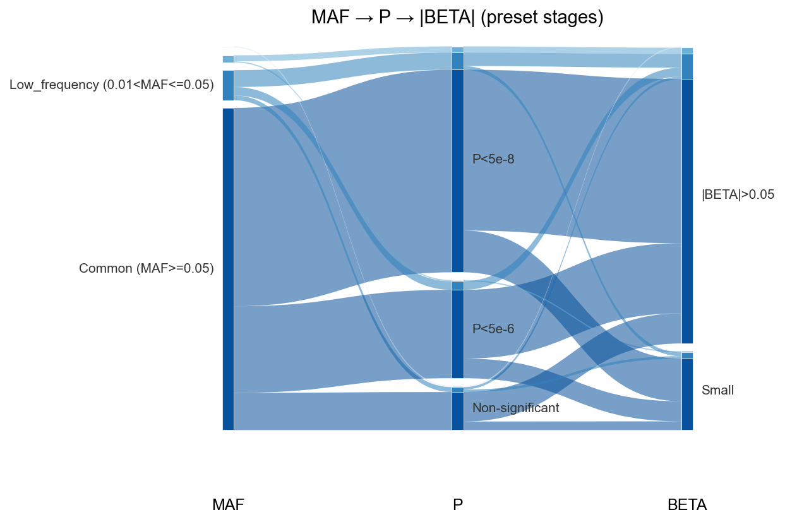
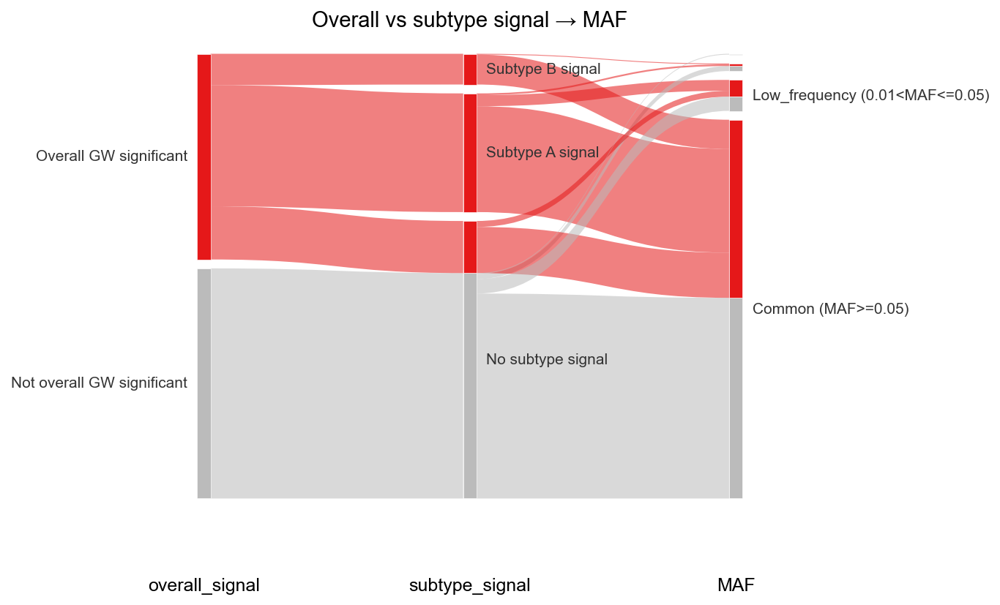

# Sankey plot

!!! example
    ```python
    import gwaslab as gl
    import numpy as np
    import pandas as pd
    ```

This tutorial shows preset-stage and custom-column Sankey plots. For the full parameter reference, see [Sankey Plot](SankeyPlot.md).

## Preset stages: MAF → P → BETA

Preset names `MAF`, `P`, and `BETA` auto-bin from `EAF`, `P`, and `BETA` columns.

!!! example
    ```python
    rng = np.random.default_rng(0)
    n = 300
    df = pd.DataFrame(
        {
            "EAF": rng.uniform(0.0005, 0.5, size=n),
            "P": 10 ** (-rng.uniform(4, 12, size=n)),
            "BETA": rng.normal(0, 0.2, size=n),
        }
    )

    fig, ax, tables = gl.plot_sankey(
        df,
        columns=["MAF", "P", "BETA"],
        title="MAF → P → |BETA| (preset stages)",
        verbose=False,
    )
    tables["links"].head()
    ```



## Custom stages: overall vs subtype signal

You can pass any categorical columns as stages. The example below simulates overall GWAS significance and subtype-specific signals, then flows into MAF bins.

!!! example
    ```python
    # Helper: test/fixtures/sankey_demo_data.py
    import sys
    sys.path.insert(0, "test/fixtures")
    from sankey_demo_data import overall_signal_colors, simulate_disease_subtype_sumstats

    df = simulate_disease_subtype_sumstats(n_variants=500, seed=0)

    fig, ax, tables = gl.plot_sankey(
        df,
        columns=["overall_signal", "subtype_signal", "MAF"],
        colors=overall_signal_colors(),
        title="Overall vs subtype signal → MAF",
        verbose=False,
    )
    ```



## Sumstats method

The same plot works on a loaded `Sumstats` object (uses `.data` internally):

!!! example
    ```python
    mysumstats = gl.Sumstats(sumstats=df, chrom="CHR", pos="POS", p="P", verbose=False)
    fig, ax, tables = mysumstats.plot_sankey(columns=["MAF", "P"], verbose=False)
    ```

