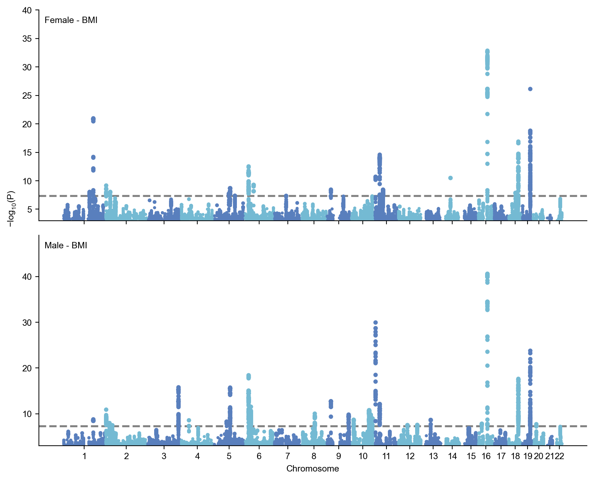
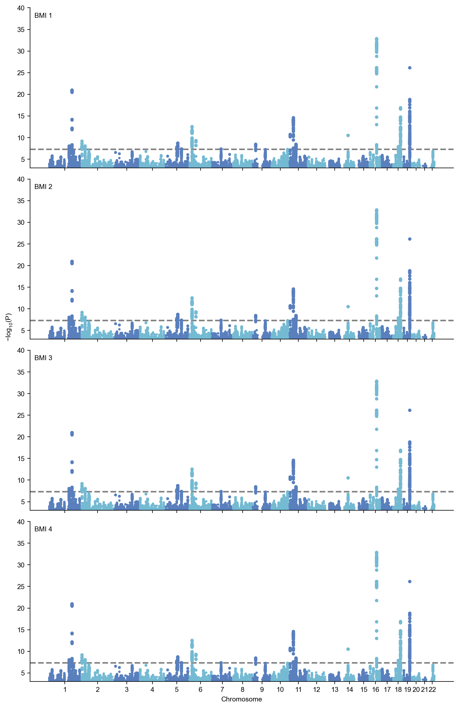
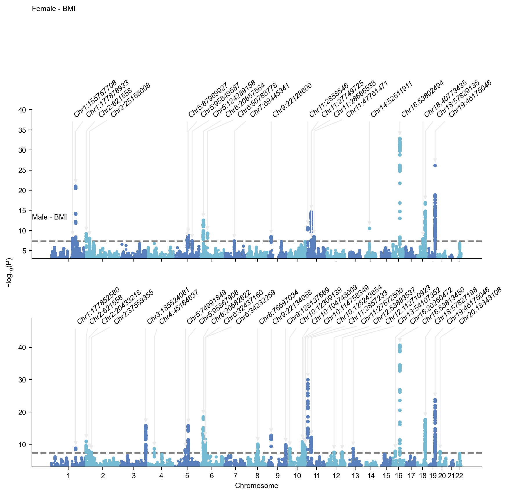
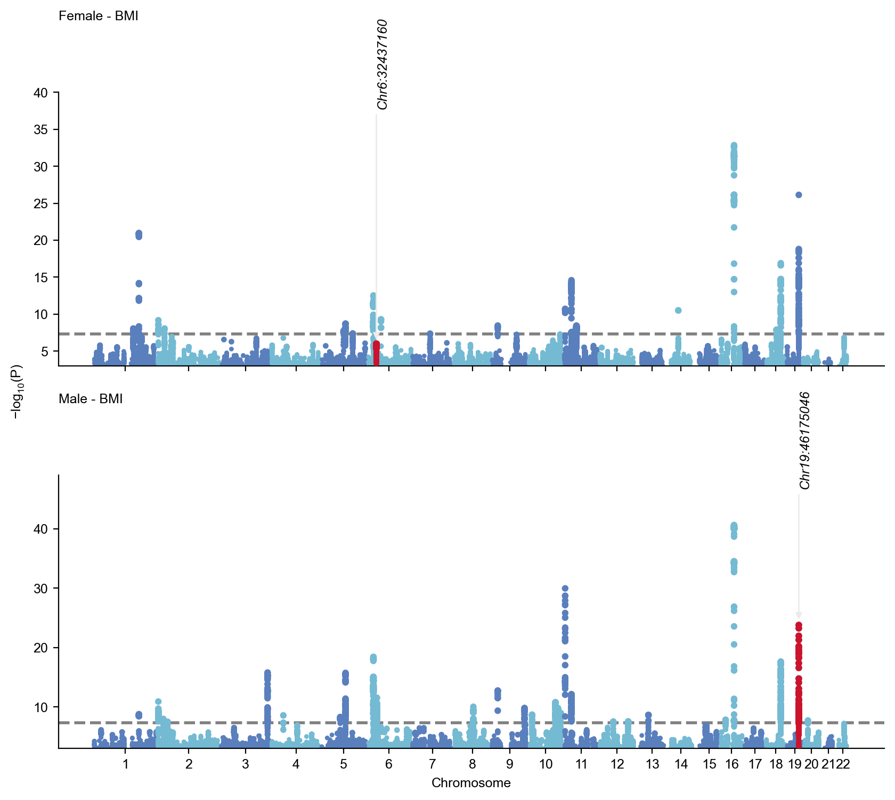
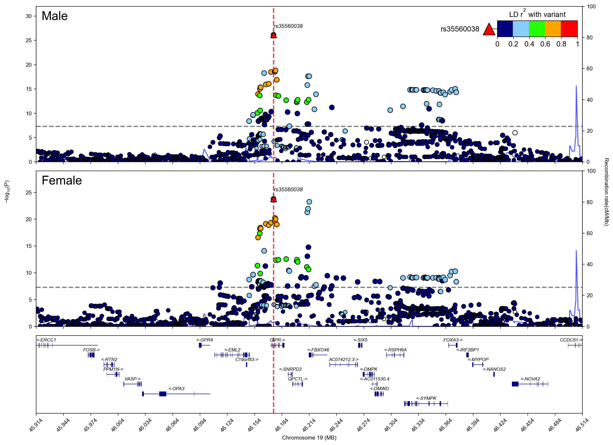
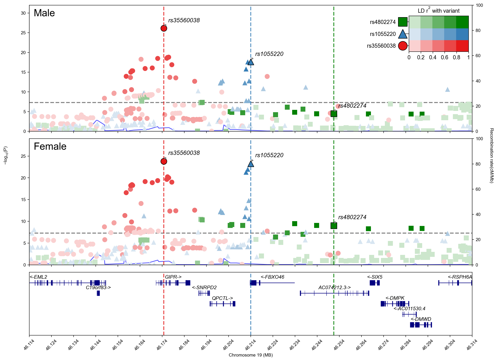
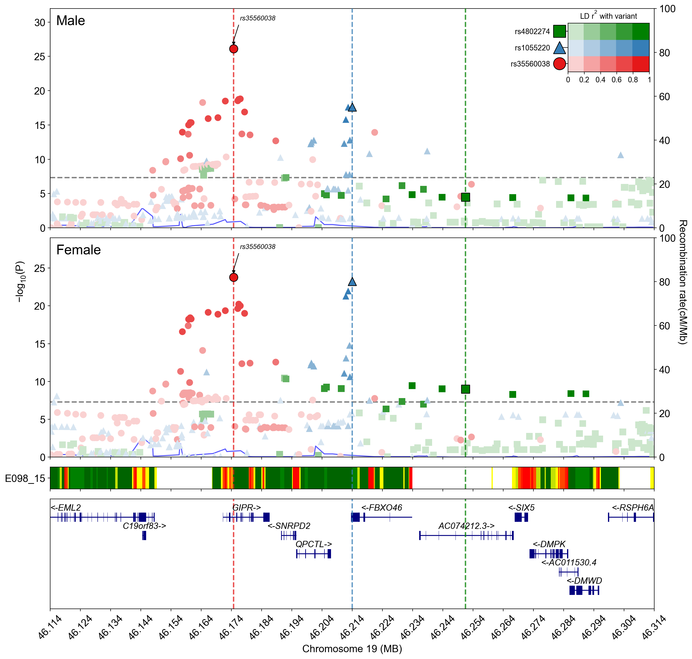

# Stacked Manhattan and regional plot

## Load gwaslab and sumstats

Note: For v3.5.3

```python
import sys
sys.path.insert(0,"/home/yunye/work/gwaslab/src")
import gwaslab as gl
```

```python
from gwaslab.extension.gwascatalog import GWASCatalogClient

# Initialize client
client = GWASCatalogClient()

# Get studies by EFO trait
studies = client.get_associations(rs_id="rs671")
```

**stdout:**
```python
2025/12/21 00:37:22 Requesting: https://www.ebi.ac.uk/gwas/rest/api/v2/associations
2025/12/21 00:37:22 Parameters: {'rs_id': 'rs671'}
2025/12/21 00:37:24 Status code: 200
```

```python
gl1 = gl.Sumstats("../0_sample_data/bbj_bmi_female.txt.gz",nrows=1000000,beta="BETA",se="SE",rsid="SNP",chrom="CHR",ea="ALT",nea="REF",pos="POS",p="P", build="19",sep="\t", verbose=False)
```

```python
gl1.basic_check()
```

**stdout:**
```python
2025/12/21 00:37:26 Start to check SNPID/rsID ...(v4.0.0)
2025/12/21 00:37:26  -Current Dataframe shape : 1000000 x 9 ; Memory usage: 56.27 MB
2025/12/21 00:37:26  -Checking rsID data type...
2025/12/21 00:37:26  -Converting rsID to pd.string data type...
2025/12/21 00:37:26  -Checking NA strings :na,NA,Na,Nan,NaN,<NA>,null,NULL,#N/A,#VALUE!,N/A,n/a,missing,
2025/12/21 00:37:26  -Checking if rsID contains NA strings...
2025/12/21 00:37:26  -Checking if rsID is rsxxxxxx...
2025/12/21 00:37:26  -Checking if CHR:POS:NEA:EA is mixed in rsID column ...
2025/12/21 00:37:26  -Number of CHR:POS:NEA:EA mixed in rsID column : 0
2025/12/21 00:37:26  -Number of Unrecognized rsID : 496
2025/12/21 00:37:26  -A look at the unrecognized rsID : {'chr10_103577643', 'chr10_119805686', 'chr10_106151962', 'chr10_104678841', 'chr10_111967649'} ...
2025/12/21 00:37:26 Finished checking SNPID/rsID.
2025/12/21 00:37:26 Start to fix chromosome notation (CHR) ...(v4.0.0)
2025/12/21 00:37:26  -Current Dataframe shape : 1000000 x 9 ; Memory usage: 56.27 MB
2025/12/21 00:37:26  -Checking CHR data type...
2025/12/21 00:37:27  -Variants with standardized chromosome notation: 1000000
2025/12/21 00:37:27  -All CHR are already fixed...
2025/12/21 00:37:27 Finished fixing chromosome notation (CHR).
2025/12/21 00:37:27 Start to fix basepair positions (POS) ...(v4.0.0)
2025/12/21 00:37:27  -Current Dataframe shape : 1000000 x 9 ; Memory usage: 56.27 MB
2025/12/21 00:37:27  -Converting to Int64 data type ...
2025/12/21 00:37:27  -Position bound:(0 , 250,000,000)
2025/12/21 00:37:27  -Removed outliers: 0
2025/12/21 00:37:27 Finished fixing basepair positions (POS).
2025/12/21 00:37:27 Start to fix alleles (EA and NEA) ...(v4.0.0)
2025/12/21 00:37:27  -Current Dataframe shape : 1000000 x 9 ; Memory usage: 64.85 MB
2025/12/21 00:37:27  -Converted all bases to string datatype and UPPERCASE.
2025/12/21 00:37:27  -Variants with bad EA  : 0
2025/12/21 00:37:27  -Variants with bad NEA : 0
2025/12/21 00:37:27  -Variants with NA for EA or NEA: 0
2025/12/21 00:37:27  -Variants with same EA and NEA: 0
2025/12/21 00:37:27  -Detected 0 variants with alleles that contain bases other than A/C/T/G .
2025/12/21 00:37:28 Finished fixing alleles (EA and NEA).
2025/12/21 00:37:28 Start to perform sanity check for statistics ...(v4.0.0)
2025/12/21 00:37:28  -Current Dataframe shape : 1000000 x 9 ; Memory usage: 64.85 MB
2025/12/21 00:37:28  -Comparison tolerance for floats: 1e-07
2025/12/21 00:37:28  -Checking if any columns are empty...
2025/12/21 00:37:28  -Checking if -1e-07 < P < 1.0000001 ...
2025/12/21 00:37:28  -Removed 0 variants with bad/na P.
2025/12/21 00:37:28  -Checking if -100.0000001 < BETA < 100.0000001 ...
2025/12/21 00:37:28  -Removed 0 variants with bad/na BETA.
2025/12/21 00:37:28  -Checking if -1e-07 < SE < inf ...
2025/12/21 00:37:28  -Removed 0 variants with bad/na SE.
2025/12/21 00:37:28  -Checking STATUS and converting STATUS to Int64....
2025/12/21 00:37:28  -Removed 0 variants with bad statistics in total.
2025/12/21 00:37:28  -Data types for each column:
2025/12/21 00:37:28 Finished sanity check for statistics.
2025/12/21 00:37:28 Start to check data consistency across columns ...(v4.0.0)
2025/12/21 00:37:28  -Current Dataframe shape : 1000000 x 9 ; Memory usage: 65.80 MB
2025/12/21 00:37:28  -Tolerance: 0.001 (Relative) and 0.001 (Absolute)
2025/12/21 00:37:28  -Checking if BETA/SE-derived-P is consistent with P...
2025/12/21 00:37:31   -Variants with inconsistent values were not detected.
2025/12/21 00:37:31  -Note: if the max difference is greater than expected, please check your original sumstats.
2025/12/21 00:37:31 Finished checking data consistency across columns.
2025/12/21 00:37:31 Start to normalize indels ...(v4.0.0)
2025/12/21 00:37:31  -Current Dataframe shape : 1000000 x 9 ; Memory usage: 65.80 MB
2025/12/21 00:37:31  -No available variants to normalize..
2025/12/21 00:37:31 Finished normalizing indels.
2025/12/21 00:37:31 Start to sort the genome coordinates ...(v4.0.0)
2025/12/21 00:37:31 Finished sorting coordinates.
2025/12/21 00:37:31 Start to reorder the columns ...(v4.0.0)
2025/12/21 00:37:31  -Reordering columns to    : rsID,CHR,POS,EA,NEA,BETA,SE,P,STATUS
2025/12/21 00:37:32 Finished reordering the columns.
```

```python
<gwaslab.g_Sumstats.Sumstats at 0x7f4852f4e8a0>
```

```python
gl1.liftover(from_build="19",to_build="38",threads=8)
```

**stdout:**
```python
2025/12/21 00:37:32 Start to perform liftover ...(v4.0.0)
2025/12/21 00:37:32  -Current Dataframe shape : 1000000 x 9 ; Memory usage: 58.17 MB
2025/12/21 00:37:32  -Creating converter using provided ChainFile: /home/yunye/.gwaslab/hg19ToHg38.over.chain.gz
2025/12/21 00:37:32  -Creating converter : 19 -> 38
2025/12/21 00:37:32  -Converting variants with status code xxx0xxx :1000000...
2025/12/21 00:38:33  -Removed unmapped variants: 152
2025/12/21 00:38:33 Start to fix chromosome notation (CHR) ...(v4.0.0)
2025/12/21 00:38:33  -Current Dataframe shape : 999848 x 9 ; Memory usage: 65.79 MB
2025/12/21 00:38:33  -Checking CHR data type...
2025/12/21 00:38:33  -Variants with standardized chromosome notation: 999848
2025/12/21 00:38:33  -All CHR are already fixed...
2025/12/21 00:38:33 Finished fixing chromosome notation (CHR).
2025/12/21 00:38:33 Start to fix basepair positions (POS) ...(v4.0.0)
2025/12/21 00:38:33  -Current Dataframe shape : 999848 x 9 ; Memory usage: 65.79 MB
2025/12/21 00:38:33  -Converting to Int64 data type ...
2025/12/21 00:38:33  -Position bound:(0 , 250,000,000)
2025/12/21 00:38:33  -Removed outliers: 0
2025/12/21 00:38:34  -Removed 0 variants with bad positions.
2025/12/21 00:38:34 Finished fixing basepair positions (POS).
2025/12/21 00:38:34 Finished liftover.
```

```python
gl1.to_pickle("test.pickle")
```

**stdout:**
```python
2025/12/21 00:38:38 Start to dump the Sumstats Object.
2025/12/21 00:38:38  -Dump the Sumstats Object to :  test.pickle
2025/12/21 00:38:39 Finished dumping.
```

```python
gl1 = gl.load_pickle("test.pickle")
```

**stdout:**
```python
2025/12/21 00:38:39 Loaded dumped Sumstats object created using gwaslab>=v3.4.32
2025/12/21 00:38:39 Loaded dumped Sumstats object from :  test.pickle
```

```python
gl1.get_novel(efo=["type 2 diabetes mellitus"])
```

**stdout:**
```python
2025/12/21 00:40:24  -Genomic coordinates are based on GRCh38/hg38...
2025/12/21 00:40:24 Start to check if lead variants are known ...(v4.0.0)
2025/12/21 00:40:24  -Current Dataframe shape : 999848 x 9 ; Memory usage: 65.79 MB
2025/12/21 00:40:24  -Genomic coordinates are based on GRCh38/hg38...
2025/12/21 00:40:24 Start to extract lead variants ...(v4.0.0)
2025/12/21 00:40:24  -Current Dataframe shape : 999848 x 9 ; Memory usage: 65.79 MB
2025/12/21 00:40:24  -Processing 999848 variants...
2025/12/21 00:40:24  -Significance threshold : 5e-08
2025/12/21 00:40:24  -Sliding window size: 500  kb
2025/12/21 00:40:24  -Using P for extracting lead variants...
2025/12/21 00:40:24  -Found 155 significant variants in total...
2025/12/21 00:40:24  -Identified 15 lead variants!
2025/12/21 00:40:24 Finished extracting lead variants.
2025/12/21 00:40:24  -Genomic coordinates are based on GRCh38/hg38...
2025/12/21 00:40:24  -Genomic coordinates are based on GRCh38/hg38...
2025/12/21 00:40:24  -Sumstats build matches target build
2025/12/21 00:40:24 Start to retrieve data using 1 EFOs: ['type 2 diabetes mellitus']...
2025/12/21 00:40:24  -Querying GWAS Catalog API v2 for trait: type 2 diabetes mellitus...
2025/12/21 00:40:24 Requesting: https://www.ebi.ac.uk/gwas/rest/api/v2/associations
2025/12/21 00:40:24 Parameters: {'efo_trait': 'type 2 diabetes mellitus', 'sort': 'p_value', 'direction': 'asc', 'size': 200, 'page': 0}
2025/12/21 00:40:31 Status code: 200
2025/12/21 00:40:31 Found 8794 total items across 44 pages
2025/12/21 00:40:31 Page 1/44 processed. Collected 200 items so far.
2025/12/21 00:40:31 Requesting: https://www.ebi.ac.uk/gwas/rest/api/v2/associations
2025/12/21 00:40:31 Parameters: {'efo_trait': 'type 2 diabetes mellitus', 'sort': 'p_value', 'direction': 'asc', 'size': 200, 'page': 1}
2025/12/21 00:40:38 Status code: 200
2025/12/21 00:40:38 Page 2/44 processed. Collected 400 items so far.
2025/12/21 00:40:38 Requesting: https://www.ebi.ac.uk/gwas/rest/api/v2/associations
2025/12/21 00:40:38 Parameters: {'efo_trait': 'type 2 diabetes mellitus', 'sort': 'p_value', 'direction': 'asc', 'size': 200, 'page': 2}
2025/12/21 00:40:43 Status code: 200
2025/12/21 00:40:43 Page 3/44 processed. Collected 600 items so far.
2025/12/21 00:40:44 Requesting: https://www.ebi.ac.uk/gwas/rest/api/v2/associations
2025/12/21 00:40:44 Parameters: {'efo_trait': 'type 2 diabetes mellitus', 'sort': 'p_value', 'direction': 'asc', 'size': 200, 'page': 3}
2025/12/21 00:40:49 Status code: 200
2025/12/21 00:40:49 Page 4/44 processed. Collected 800 items so far.
2025/12/21 00:40:50 Requesting: https://www.ebi.ac.uk/gwas/rest/api/v2/associations
2025/12/21 00:40:50 Parameters: {'efo_trait': 'type 2 diabetes mellitus', 'sort': 'p_value', 'direction': 'asc', 'size': 200, 'page': 4}
2025/12/21 00:40:55 Status code: 200
2025/12/21 00:40:55 Page 5/44 processed. Collected 1000 items so far.
2025/12/21 00:40:56 Requesting: https://www.ebi.ac.uk/gwas/rest/api/v2/associations
2025/12/21 00:40:56 Parameters: {'efo_trait': 'type 2 diabetes mellitus', 'sort': 'p_value', 'direction': 'asc', 'size': 200, 'page': 5}
2025/12/21 00:41:02 Status code: 200
2025/12/21 00:41:02 Page 6/44 processed. Collected 1200 items so far.
2025/12/21 00:41:02 Requesting: https://www.ebi.ac.uk/gwas/rest/api/v2/associations
2025/12/21 00:41:02 Parameters: {'efo_trait': 'type 2 diabetes mellitus', 'sort': 'p_value', 'direction': 'asc', 'size': 200, 'page': 6}
2025/12/21 00:41:08 Status code: 200
2025/12/21 00:41:08 Page 7/44 processed. Collected 1400 items so far.
2025/12/21 00:41:08 Requesting: https://www.ebi.ac.uk/gwas/rest/api/v2/associations
2025/12/21 00:41:08 Parameters: {'efo_trait': 'type 2 diabetes mellitus', 'sort': 'p_value', 'direction': 'asc', 'size': 200, 'page': 7}
2025/12/21 00:41:14 Status code: 200
2025/12/21 00:41:14 Page 8/44 processed. Collected 1600 items so far.
2025/12/21 00:41:14 Requesting: https://www.ebi.ac.uk/gwas/rest/api/v2/associations
2025/12/21 00:41:14 Parameters: {'efo_trait': 'type 2 diabetes mellitus', 'sort': 'p_value', 'direction': 'asc', 'size': 200, 'page': 8}
2025/12/21 00:41:20 Status code: 200
2025/12/21 00:41:20 Page 9/44 processed. Collected 1800 items so far.
2025/12/21 00:41:20 Requesting: https://www.ebi.ac.uk/gwas/rest/api/v2/associations
2025/12/21 00:41:20 Parameters: {'efo_trait': 'type 2 diabetes mellitus', 'sort': 'p_value', 'direction': 'asc', 'size': 200, 'page': 9}
2025/12/21 00:41:26 Status code: 200
2025/12/21 00:41:26 Page 10/44 processed. Collected 2000 items so far.
2025/12/21 00:41:26 Requesting: https://www.ebi.ac.uk/gwas/rest/api/v2/associations
2025/12/21 00:41:26 Parameters: {'efo_trait': 'type 2 diabetes mellitus', 'sort': 'p_value', 'direction': 'asc', 'size': 200, 'page': 10}
2025/12/21 00:41:32 Status code: 200
2025/12/21 00:41:32 Page 11/44 processed. Collected 2200 items so far.
2025/12/21 00:41:32 Requesting: https://www.ebi.ac.uk/gwas/rest/api/v2/associations
2025/12/21 00:41:32 Parameters: {'efo_trait': 'type 2 diabetes mellitus', 'sort': 'p_value', 'direction': 'asc', 'size': 200, 'page': 11}
2025/12/21 00:41:38 Status code: 200
2025/12/21 00:41:38 Page 12/44 processed. Collected 2400 items so far.
2025/12/21 00:41:38 Requesting: https://www.ebi.ac.uk/gwas/rest/api/v2/associations
2025/12/21 00:41:38 Parameters: {'efo_trait': 'type 2 diabetes mellitus', 'sort': 'p_value', 'direction': 'asc', 'size': 200, 'page': 12}
2025/12/21 00:41:44 Status code: 200
2025/12/21 00:41:44 Page 13/44 processed. Collected 2600 items so far.
2025/12/21 00:41:44 Requesting: https://www.ebi.ac.uk/gwas/rest/api/v2/associations
2025/12/21 00:41:44 Parameters: {'efo_trait': 'type 2 diabetes mellitus', 'sort': 'p_value', 'direction': 'asc', 'size': 200, 'page': 13}
2025/12/21 00:41:50 Status code: 200
2025/12/21 00:41:50 Page 14/44 processed. Collected 2800 items so far.
2025/12/21 00:41:50 Requesting: https://www.ebi.ac.uk/gwas/rest/api/v2/associations
2025/12/21 00:41:50 Parameters: {'efo_trait': 'type 2 diabetes mellitus', 'sort': 'p_value', 'direction': 'asc', 'size': 200, 'page': 14}
2025/12/21 00:41:56 Status code: 200
2025/12/21 00:41:56 Page 15/44 processed. Collected 3000 items so far.
2025/12/21 00:41:56 Requesting: https://www.ebi.ac.uk/gwas/rest/api/v2/associations
2025/12/21 00:41:56 Parameters: {'efo_trait': 'type 2 diabetes mellitus', 'sort': 'p_value', 'direction': 'asc', 'size': 200, 'page': 15}
2025/12/21 00:42:02 Status code: 200
2025/12/21 00:42:02 Page 16/44 processed. Collected 3200 items so far.
2025/12/21 00:42:02 Requesting: https://www.ebi.ac.uk/gwas/rest/api/v2/associations
2025/12/21 00:42:02 Parameters: {'efo_trait': 'type 2 diabetes mellitus', 'sort': 'p_value', 'direction': 'asc', 'size': 200, 'page': 16}
2025/12/21 00:42:08 Status code: 200
2025/12/21 00:42:08 Page 17/44 processed. Collected 3400 items so far.
2025/12/21 00:42:08 Requesting: https://www.ebi.ac.uk/gwas/rest/api/v2/associations
2025/12/21 00:42:08 Parameters: {'efo_trait': 'type 2 diabetes mellitus', 'sort': 'p_value', 'direction': 'asc', 'size': 200, 'page': 17}
2025/12/21 00:42:14 Status code: 200
2025/12/21 00:42:14 Page 18/44 processed. Collected 3600 items so far.
2025/12/21 00:42:14 Requesting: https://www.ebi.ac.uk/gwas/rest/api/v2/associations
2025/12/21 00:42:14 Parameters: {'efo_trait': 'type 2 diabetes mellitus', 'sort': 'p_value', 'direction': 'asc', 'size': 200, 'page': 18}
2025/12/21 00:42:20 Status code: 200
2025/12/21 00:42:20 Page 19/44 processed. Collected 3800 items so far.
2025/12/21 00:42:20 Requesting: https://www.ebi.ac.uk/gwas/rest/api/v2/associations
2025/12/21 00:42:20 Parameters: {'efo_trait': 'type 2 diabetes mellitus', 'sort': 'p_value', 'direction': 'asc', 'size': 200, 'page': 19}
2025/12/21 00:42:26 Status code: 200
2025/12/21 00:42:26 Page 20/44 processed. Collected 4000 items so far.
2025/12/21 00:42:26 Requesting: https://www.ebi.ac.uk/gwas/rest/api/v2/associations
2025/12/21 00:42:26 Parameters: {'efo_trait': 'type 2 diabetes mellitus', 'sort': 'p_value', 'direction': 'asc', 'size': 200, 'page': 20}
2025/12/21 00:42:32 Status code: 200
2025/12/21 00:42:32 Page 21/44 processed. Collected 4200 items so far.
2025/12/21 00:42:32 Requesting: https://www.ebi.ac.uk/gwas/rest/api/v2/associations
2025/12/21 00:42:32 Parameters: {'efo_trait': 'type 2 diabetes mellitus', 'sort': 'p_value', 'direction': 'asc', 'size': 200, 'page': 21}
2025/12/21 00:42:38 Status code: 200
2025/12/21 00:42:38 Page 22/44 processed. Collected 4400 items so far.
2025/12/21 00:42:38 Requesting: https://www.ebi.ac.uk/gwas/rest/api/v2/associations
2025/12/21 00:42:38 Parameters: {'efo_trait': 'type 2 diabetes mellitus', 'sort': 'p_value', 'direction': 'asc', 'size': 200, 'page': 22}
2025/12/21 00:42:44 Status code: 200
2025/12/21 00:42:44 Page 23/44 processed. Collected 4600 items so far.
2025/12/21 00:42:44 Requesting: https://www.ebi.ac.uk/gwas/rest/api/v2/associations
2025/12/21 00:42:44 Parameters: {'efo_trait': 'type 2 diabetes mellitus', 'sort': 'p_value', 'direction': 'asc', 'size': 200, 'page': 23}
2025/12/21 00:42:50 Status code: 200
2025/12/21 00:42:50 Page 24/44 processed. Collected 4800 items so far.
2025/12/21 00:42:50 Requesting: https://www.ebi.ac.uk/gwas/rest/api/v2/associations
2025/12/21 00:42:50 Parameters: {'efo_trait': 'type 2 diabetes mellitus', 'sort': 'p_value', 'direction': 'asc', 'size': 200, 'page': 24}
2025/12/21 00:42:56 Status code: 200
2025/12/21 00:42:56 Page 25/44 processed. Collected 5000 items so far.
2025/12/21 00:42:56 Requesting: https://www.ebi.ac.uk/gwas/rest/api/v2/associations
2025/12/21 00:42:56 Parameters: {'efo_trait': 'type 2 diabetes mellitus', 'sort': 'p_value', 'direction': 'asc', 'size': 200, 'page': 25}
2025/12/21 00:43:02 Status code: 200
2025/12/21 00:43:02 Page 26/44 processed. Collected 5200 items so far.
2025/12/21 00:43:02 Requesting: https://www.ebi.ac.uk/gwas/rest/api/v2/associations
2025/12/21 00:43:02 Parameters: {'efo_trait': 'type 2 diabetes mellitus', 'sort': 'p_value', 'direction': 'asc', 'size': 200, 'page': 26}
2025/12/21 00:43:08 Status code: 200
2025/12/21 00:43:08 Page 27/44 processed. Collected 5400 items so far.
2025/12/21 00:43:08 Requesting: https://www.ebi.ac.uk/gwas/rest/api/v2/associations
2025/12/21 00:43:08 Parameters: {'efo_trait': 'type 2 diabetes mellitus', 'sort': 'p_value', 'direction': 'asc', 'size': 200, 'page': 27}
2025/12/21 00:43:14 Status code: 200
2025/12/21 00:43:14 Page 28/44 processed. Collected 5600 items so far.
2025/12/21 00:43:14 Requesting: https://www.ebi.ac.uk/gwas/rest/api/v2/associations
2025/12/21 00:43:14 Parameters: {'efo_trait': 'type 2 diabetes mellitus', 'sort': 'p_value', 'direction': 'asc', 'size': 200, 'page': 28}
2025/12/21 00:43:20 Status code: 200
2025/12/21 00:43:20 Page 29/44 processed. Collected 5800 items so far.
2025/12/21 00:43:20 Requesting: https://www.ebi.ac.uk/gwas/rest/api/v2/associations
2025/12/21 00:43:20 Parameters: {'efo_trait': 'type 2 diabetes mellitus', 'sort': 'p_value', 'direction': 'asc', 'size': 200, 'page': 29}
2025/12/21 00:43:26 Status code: 200
2025/12/21 00:43:26 Page 30/44 processed. Collected 6000 items so far.
2025/12/21 00:43:26 Requesting: https://www.ebi.ac.uk/gwas/rest/api/v2/associations
2025/12/21 00:43:26 Parameters: {'efo_trait': 'type 2 diabetes mellitus', 'sort': 'p_value', 'direction': 'asc', 'size': 200, 'page': 30}
2025/12/21 00:43:32 Status code: 200
2025/12/21 00:43:32 Page 31/44 processed. Collected 6200 items so far.
2025/12/21 00:43:32 Requesting: https://www.ebi.ac.uk/gwas/rest/api/v2/associations
2025/12/21 00:43:32 Parameters: {'efo_trait': 'type 2 diabetes mellitus', 'sort': 'p_value', 'direction': 'asc', 'size': 200, 'page': 31}
2025/12/21 00:43:38 Status code: 200
2025/12/21 00:43:38 Page 32/44 processed. Collected 6400 items so far.
2025/12/21 00:43:38 Requesting: https://www.ebi.ac.uk/gwas/rest/api/v2/associations
2025/12/21 00:43:38 Parameters: {'efo_trait': 'type 2 diabetes mellitus', 'sort': 'p_value', 'direction': 'asc', 'size': 200, 'page': 32}
2025/12/21 00:43:44 Status code: 200
2025/12/21 00:43:44 Page 33/44 processed. Collected 6600 items so far.
2025/12/21 00:43:44 Requesting: https://www.ebi.ac.uk/gwas/rest/api/v2/associations
2025/12/21 00:43:44 Parameters: {'efo_trait': 'type 2 diabetes mellitus', 'sort': 'p_value', 'direction': 'asc', 'size': 200, 'page': 33}
2025/12/21 00:43:50 Status code: 200
2025/12/21 00:43:50 Page 34/44 processed. Collected 6800 items so far.
2025/12/21 00:43:50 Requesting: https://www.ebi.ac.uk/gwas/rest/api/v2/associations
2025/12/21 00:43:50 Parameters: {'efo_trait': 'type 2 diabetes mellitus', 'sort': 'p_value', 'direction': 'asc', 'size': 200, 'page': 34}
2025/12/21 00:43:56 Status code: 200
2025/12/21 00:43:56 Page 35/44 processed. Collected 7000 items so far.
2025/12/21 00:43:56 Requesting: https://www.ebi.ac.uk/gwas/rest/api/v2/associations
2025/12/21 00:43:56 Parameters: {'efo_trait': 'type 2 diabetes mellitus', 'sort': 'p_value', 'direction': 'asc', 'size': 200, 'page': 35}
2025/12/21 00:44:02 Status code: 200
2025/12/21 00:44:02 Page 36/44 processed. Collected 7200 items so far.
2025/12/21 00:44:02 Requesting: https://www.ebi.ac.uk/gwas/rest/api/v2/associations
2025/12/21 00:44:02 Parameters: {'efo_trait': 'type 2 diabetes mellitus', 'sort': 'p_value', 'direction': 'asc', 'size': 200, 'page': 36}
2025/12/21 00:44:08 Status code: 200
2025/12/21 00:44:08 Page 37/44 processed. Collected 7400 items so far.
2025/12/21 00:44:08 Requesting: https://www.ebi.ac.uk/gwas/rest/api/v2/associations
2025/12/21 00:44:08 Parameters: {'efo_trait': 'type 2 diabetes mellitus', 'sort': 'p_value', 'direction': 'asc', 'size': 200, 'page': 37}
2025/12/21 00:44:14 Status code: 200
2025/12/21 00:44:14 Page 38/44 processed. Collected 7600 items so far.
2025/12/21 00:44:14 Requesting: https://www.ebi.ac.uk/gwas/rest/api/v2/associations
2025/12/21 00:44:14 Parameters: {'efo_trait': 'type 2 diabetes mellitus', 'sort': 'p_value', 'direction': 'asc', 'size': 200, 'page': 38}
2025/12/21 00:44:19 Status code: 200
2025/12/21 00:44:19 Page 39/44 processed. Collected 7800 items so far.
2025/12/21 00:44:20 Requesting: https://www.ebi.ac.uk/gwas/rest/api/v2/associations
2025/12/21 00:44:20 Parameters: {'efo_trait': 'type 2 diabetes mellitus', 'sort': 'p_value', 'direction': 'asc', 'size': 200, 'page': 39}
2025/12/21 00:44:25 Status code: 200
2025/12/21 00:44:25 Page 40/44 processed. Collected 8000 items so far.
2025/12/21 00:44:25 Requesting: https://www.ebi.ac.uk/gwas/rest/api/v2/associations
2025/12/21 00:44:25 Parameters: {'efo_trait': 'type 2 diabetes mellitus', 'sort': 'p_value', 'direction': 'asc', 'size': 200, 'page': 40}
2025/12/21 00:44:31 Status code: 200
2025/12/21 00:44:31 Page 41/44 processed. Collected 8200 items so far.
2025/12/21 00:44:31 Requesting: https://www.ebi.ac.uk/gwas/rest/api/v2/associations
2025/12/21 00:44:31 Parameters: {'efo_trait': 'type 2 diabetes mellitus', 'sort': 'p_value', 'direction': 'asc', 'size': 200, 'page': 41}
2025/12/21 00:44:37 Status code: 200
2025/12/21 00:44:37 Page 42/44 processed. Collected 8400 items so far.
2025/12/21 00:44:37 Requesting: https://www.ebi.ac.uk/gwas/rest/api/v2/associations
2025/12/21 00:44:37 Parameters: {'efo_trait': 'type 2 diabetes mellitus', 'sort': 'p_value', 'direction': 'asc', 'size': 200, 'page': 42}
2025/12/21 00:44:43 Status code: 200
2025/12/21 00:44:43 Page 43/44 processed. Collected 8600 items so far.
2025/12/21 00:44:43 Requesting: https://www.ebi.ac.uk/gwas/rest/api/v2/associations
2025/12/21 00:44:43 Parameters: {'efo_trait': 'type 2 diabetes mellitus', 'sort': 'p_value', 'direction': 'asc', 'size': 200, 'page': 43}
2025/12/21 00:44:49 Status code: 200
2025/12/21 00:44:49 Page 44/44 processed. Collected 8794 items so far.
2025/12/21 00:44:49 Retrieved 8794 total items
2025/12/21 00:44:49  -Retrieved 8794 associations from API
2025/12/21 00:44:49  -Available columns: ['association_id', 'risk_frequency', 'pvalue_description', 'range', 'beta', 'p_value', 'efo_traits', 'reported_trait', 'accession_id', 'locations']
2025/12/21 00:44:49  -Filtered to 7508 associations with p < 5e-08 (from 8794)
2025/12/21 00:44:50  -Skipped 581 associations without valid CHR/POS
2025/12/21 00:44:50  -Successfully extracted 6927 variants with CHR/POS
2025/12/21 00:44:50  -Removed 3105 duplicate variants (kept 3822 unique)
2025/12/21 00:44:50  -Processed 3822 unique variants from GWAS Catalog
2025/12/21 00:44:50  -Retrieved 3822 associations from GWAS catalog.
2025/12/21 00:44:50  -Lead variants in known loci: 3822
2025/12/21 00:44:50  -Checking the minimum distance between identified lead variants and provided known variants...
2025/12/21 00:44:50  -Identified  14  known vairants in current sumstats...
2025/12/21 00:44:50  -Identified  1  novel vairants in current sumstats...
2025/12/21 00:44:50 Finished checking if lead variants are known.
```

```python
| rsID | CHR | POS EA NEA | BETA | SE | P | \ |
| --- | --- | --- | --- | --- | --- | --- |
| 0 | rs12040894 | 1 | 155791717 | G | A -0.03896 | 0.006888 |
| 1 | rs10913469 | 1 | 177944384 | C | T | 0.03554 |
| 2 | rs10188334 | 2 | 653874 | T | C -0.05428 | 0.009093 |
| 3 | rs10865322 | 2 | 24936989 | G | A | 0.03137 |
| 4 | rs10077823 | 5 | 96510626 | G | A -0.03214 | 0.005367 |
| 5 | rs10061263 | 5 | 124953465 | C | G | 0.02870 |
| 6 | rs10440833 | 6 | 20687890 | A | T -0.03819 | 0.005464 |
| 7 | rs11981973 | 7 | 69980355 | G | A | 0.03594 |
| 8 | rs10811658 | 9 | 22128601 | A | G | 0.03117 |
| 9 | rs11030100 | 11 | 27656039 | T | G -0.04178 | 0.005323 |
| 10 | rs10835389 | 11 | 28654958 | C | T -0.02929 | 0.005333 |
| 11 | rs11602339 | 11 | 47739919 | T | C | 0.03414 |
| 12 | rs11642015 | 16 | 53768582 | T | C | 0.07912 |
| 13 | rs11152213 | 18 | 60185715 | C | A | 0.04812 |
| 14 | rs11671664 | 19 | 45669020 | A | G -0.04724 | 0.005273 |
|  | STATUS | DISTANCE_TO_KNOWN | KNOWN_ID KNOWN_PUBMED_ID | KNOWN_AUTHOR | \ |  |
| 0 | 3850099 | -487639 | rs4971072 | 38374256 | Suzuki K |  |
| 1 | 3850099 | 2259 | rs74128490 | 38374256 | Suzuki K |  |
| 2 | 3850099 | 0 | rs10188334 | 32541925 | Vujkovic M |  |
| 3 | 3850099 | 373710 | rs55928417 | 35551307 | Mahajan A |  |
| 4 | 3850099 | 2173 | rs6556925 | 32499647 | Spracklen CN |  |
| 5 | 3850099 | 1484176 | rs75029938 | 31092297 | Guan M |  |
| 6 | 3850099 | 0 | rs10440833 | 32541925 | Vujkovic M |  |
| 7 | 3850099 | -19347 | rs6958981 | 38685053 | Elashi AA |  |
| 8 | 3850099 | 1302 | rs139149176 | 38374256 | Suzuki K |  |
| 9 | 3850099 | 6032 | rs4923464 | 35551307 | Mahajan A |  |
| 10 | 3850099 | 45151 | rs486129 | 38374256 | Suzuki K |  |
| 11 | 3850099 | 50462 | rs2125838 | 38374256 | Suzuki K |  |
| 12 | 3850099 | 0 | rs11642015 | 39024449 | Verma A |  |
| 13 | 3850099 | -361 | rs476828 | 32499647 | Spracklen CN |  |
| 14 | 3850099 | 0 | rs11671664 | 28869590 | Zhao W |  |
|  | KNOWN_EFOID | NOVEL LOCATION_OF_KNOWN |  |  |  |  |
| 0 | type 2 diabetes mellitus | False | Downstream |  |  |  |
| 1 | type 2 diabetes mellitus | False | Upstream |  |  |  |
| 2 | type 2 diabetes mellitus | False | Same |  |  |  |
| 3 | type 2 diabetes mellitus | False | Upstream |  |  |  |
| 4 | type 2 diabetes mellitus | False | Upstream |  |  |  |
| 5 | type 2 diabetes mellitus | True | Upstream |  |  |  |
| 6 | type 2 diabetes mellitus | False | Same |  |  |  |
| 7 | type 2 diabetes mellitus | False | Downstream |  |  |  |
| 8 | type 2 diabetes mellitus | False | Upstream |  |  |  |
| 9 | type 2 diabetes mellitus | False | Upstream |  |  |  |
| 10 | type 2 diabetes mellitus | False | Upstream |  |  |  |
| 11 | type 2 diabetes mellitus | False | Upstream |  |  |  |
| 12 | type 2 diabetes mellitus | False | Same |  |  |  |
| 13 | type 2 diabetes mellitus | False | Downstream |  |  |  |
| 14 | type 2 diabetes mellitus | False | Same |  |  |  |
```

```python
leads = gl1.get_lead(gls=True)
leads.get_associations()
```

**stdout:**
```python
2025/12/20 19:27:15  -Genomic coordinates are based on GRCh37/hg19...
2025/12/20 19:27:15 Start to extract lead variants ...(v4.0.0)
2025/12/20 19:27:15  -Current Dataframe shape : 1000000 x 9 ; Memory usage: 56.27 MB
2025/12/20 19:27:15  -Processing 1000000 variants...
2025/12/20 19:27:15  -Significance threshold : 5e-08
2025/12/20 19:27:15  -Sliding window size: 500  kb
2025/12/20 19:27:16  -Using P for extracting lead variants...
2025/12/20 19:27:16  -Found 155 significant variants in total...
2025/12/20 19:27:16  -Identified 15 lead variants!
2025/12/20 19:27:16 Finished extracting lead variants.
2025/12/20 19:27:16 Getting associations from GWAS Catalog for rs12040894...
2025/12/20 19:27:16 Requesting: https://www.ebi.ac.uk/gwas/rest/api/v2/associations
2025/12/20 19:27:16 Parameters: {'rs_id': 'rs12040894', 'size': 200, 'page': 0}
2025/12/20 19:27:17 Status code: 200
2025/12/20 19:27:17 #WARNING! No more data or an error occurred. Stopping.
2025/12/20 19:27:17 Retrieved 0 total items
2025/12/20 19:27:17 Getting associations from GWAS Catalog for rs10913469...
2025/12/20 19:27:17 Requesting: https://www.ebi.ac.uk/gwas/rest/api/v2/associations
2025/12/20 19:27:17 Parameters: {'rs_id': 'rs10913469', 'size': 200, 'page': 0}
2025/12/20 19:27:18 Status code: 200
2025/12/20 19:27:18 Found 9 total items across 1 pages
2025/12/20 19:27:18 Page 1/1 processed. Collected 9 items so far.
2025/12/20 19:27:18 Retrieved 9 total items

2025/12/20 19:27:18 Getting associations from GWAS Catalog for rs10188334...
2025/12/20 19:27:18 Requesting: https://www.ebi.ac.uk/gwas/rest/api/v2/associations
2025/12/20 19:27:18 Parameters: {'rs_id': 'rs10188334', 'size': 200, 'page': 0}
2025/12/20 19:27:19 Status code: 200
2025/12/20 19:27:19 Found 8 total items across 1 pages
2025/12/20 19:27:19 Page 1/1 processed. Collected 8 items so far.
2025/12/20 19:27:19 Retrieved 8 total items

2025/12/20 19:27:19 Getting associations from GWAS Catalog for rs10865322...
2025/12/20 19:27:19 Requesting: https://www.ebi.ac.uk/gwas/rest/api/v2/associations
2025/12/20 19:27:19 Parameters: {'rs_id': 'rs10865322', 'size': 200, 'page': 0}
2025/12/20 19:27:20 Status code: 200
2025/12/20 19:27:20 #WARNING! No more data or an error occurred. Stopping.
2025/12/20 19:27:20 Retrieved 0 total items
2025/12/20 19:27:20 Getting associations from GWAS Catalog for rs10077823...
2025/12/20 19:27:20 Requesting: https://www.ebi.ac.uk/gwas/rest/api/v2/associations
2025/12/20 19:27:20 Parameters: {'rs_id': 'rs10077823', 'size': 200, 'page': 0}
2025/12/20 19:27:20 Status code: 200
2025/12/20 19:27:20 #WARNING! No more data or an error occurred. Stopping.
2025/12/20 19:27:20 Retrieved 0 total items
2025/12/20 19:27:20 Getting associations from GWAS Catalog for rs10061263...
2025/12/20 19:27:20 Requesting: https://www.ebi.ac.uk/gwas/rest/api/v2/associations
2025/12/20 19:27:20 Parameters: {'rs_id': 'rs10061263', 'size': 200, 'page': 0}
2025/12/20 19:27:20 Status code: 200
2025/12/20 19:27:20 #WARNING! No more data or an error occurred. Stopping.
2025/12/20 19:27:20 Retrieved 0 total items
2025/12/20 19:27:20 Getting associations from GWAS Catalog for rs10440833...
2025/12/20 19:27:20 Requesting: https://www.ebi.ac.uk/gwas/rest/api/v2/associations
2025/12/20 19:27:20 Parameters: {'rs_id': 'rs10440833', 'size': 200, 'page': 0}
2025/12/20 19:27:22 Status code: 200
2025/12/20 19:27:22 Found 26 total items across 1 pages
2025/12/20 19:27:22 Page 1/1 processed. Collected 26 items so far.
2025/12/20 19:27:22 Retrieved 26 total items

2025/12/20 19:27:22 Getting associations from GWAS Catalog for rs11981973...
2025/12/20 19:27:22 Requesting: https://www.ebi.ac.uk/gwas/rest/api/v2/associations
2025/12/20 19:27:22 Parameters: {'rs_id': 'rs11981973', 'size': 200, 'page': 0}
2025/12/20 19:27:23 Status code: 200
2025/12/20 19:27:23 Found 3 total items across 1 pages
2025/12/20 19:27:23 Page 1/1 processed. Collected 3 items so far.
2025/12/20 19:27:23 Retrieved 3 total items

2025/12/20 19:27:23 Getting associations from GWAS Catalog for rs10811658...
2025/12/20 19:27:23 Requesting: https://www.ebi.ac.uk/gwas/rest/api/v2/associations
2025/12/20 19:27:23 Parameters: {'rs_id': 'rs10811658', 'size': 200, 'page': 0}
2025/12/20 19:27:23 Status code: 200
2025/12/20 19:27:23 #WARNING! No more data or an error occurred. Stopping.
2025/12/20 19:27:23 Retrieved 0 total items
2025/12/20 19:27:23 Getting associations from GWAS Catalog for rs11030100...
2025/12/20 19:27:23 Requesting: https://www.ebi.ac.uk/gwas/rest/api/v2/associations
2025/12/20 19:27:23 Parameters: {'rs_id': 'rs11030100', 'size': 200, 'page': 0}
2025/12/20 19:27:24 Status code: 200
2025/12/20 19:27:24 Found 3 total items across 1 pages
2025/12/20 19:27:24 Page 1/1 processed. Collected 3 items so far.
2025/12/20 19:27:24 Retrieved 3 total items

2025/12/20 19:27:24 Getting associations from GWAS Catalog for rs10835389...
2025/12/20 19:27:24 Requesting: https://www.ebi.ac.uk/gwas/rest/api/v2/associations
2025/12/20 19:27:24 Parameters: {'rs_id': 'rs10835389', 'size': 200, 'page': 0}
2025/12/20 19:27:25 Status code: 200
2025/12/20 19:27:25 Found 1 total items across 1 pages
2025/12/20 19:27:25 Page 1/1 processed. Collected 1 items so far.
2025/12/20 19:27:25 Retrieved 1 total items

2025/12/20 19:27:25 Getting associations from GWAS Catalog for rs11602339...
2025/12/20 19:27:25 Requesting: https://www.ebi.ac.uk/gwas/rest/api/v2/associations
2025/12/20 19:27:25 Parameters: {'rs_id': 'rs11602339', 'size': 200, 'page': 0}
2025/12/20 19:27:26 Status code: 200
2025/12/20 19:27:26 Found 1 total items across 1 pages
2025/12/20 19:27:26 Page 1/1 processed. Collected 1 items so far.
2025/12/20 19:27:26 Retrieved 1 total items

2025/12/20 19:27:26 Getting associations from GWAS Catalog for rs11642015...
2025/12/20 19:27:26 Requesting: https://www.ebi.ac.uk/gwas/rest/api/v2/associations
2025/12/20 19:27:26 Parameters: {'rs_id': 'rs11642015', 'size': 200, 'page': 0}
2025/12/20 19:27:29 Status code: 200
2025/12/20 19:27:29 Found 98 total items across 1 pages
2025/12/20 19:27:29 Page 1/1 processed. Collected 98 items so far.
2025/12/20 19:27:29 Retrieved 98 total items

2025/12/20 19:27:29 Getting associations from GWAS Catalog for rs11152213...
2025/12/20 19:27:29 Requesting: https://www.ebi.ac.uk/gwas/rest/api/v2/associations
2025/12/20 19:27:29 Parameters: {'rs_id': 'rs11152213', 'size': 200, 'page': 0}
2025/12/20 19:27:30 Status code: 200
2025/12/20 19:27:30 Found 9 total items across 1 pages
2025/12/20 19:27:30 Page 1/1 processed. Collected 9 items so far.
2025/12/20 19:27:30 Retrieved 9 total items

2025/12/20 19:27:30 Getting associations from GWAS Catalog for rs11671664...
2025/12/20 19:27:30 Requesting: https://www.ebi.ac.uk/gwas/rest/api/v2/associations
2025/12/20 19:27:30 Parameters: {'rs_id': 'rs11671664', 'size': 200, 'page': 0}
2025/12/20 19:27:31 Status code: 200
2025/12/20 19:27:31 Found 5 total items across 1 pages
2025/12/20 19:27:31 Page 1/1 processed. Collected 5 items so far.
2025/12/20 19:27:31 Retrieved 5 total items

2025/12/20 19:27:31 No associations found for 5 variants: ['rs12040894', 'rs10865322', 'rs10077823', 'rs10061263', 'rs10811658']...
2025/12/20 19:27:31 Retrieved 163 associations from GWAS Catalog
2025/12/20 19:27:31 Skipping metadata fetch (traits, studies, variants) as requested
2025/12/20 19:27:31 Transforming associations to GWASLab GCV2 format...
2025/12/20 19:27:31 Getting associations from GWAS Catalog for rs12040894...
2025/12/20 19:27:31 Requesting: https://www.ebi.ac.uk/gwas/rest/api/v2/associations
2025/12/20 19:27:31 Parameters: {'rs_id': 'rs12040894', 'size': 200, 'page': 0}
2025/12/20 19:27:32 Status code: 200
2025/12/20 19:27:32 #WARNING! No more data or an error occurred. Stopping.
2025/12/20 19:27:32 Retrieved 0 total items
2025/12/20 19:27:32 Getting associations from GWAS Catalog for rs10913469...
2025/12/20 19:27:32 Requesting: https://www.ebi.ac.uk/gwas/rest/api/v2/associations
2025/12/20 19:27:32 Parameters: {'rs_id': 'rs10913469', 'size': 200, 'page': 0}
2025/12/20 19:27:33 Status code: 200
2025/12/20 19:27:33 Found 9 total items across 1 pages
2025/12/20 19:27:33 Page 1/1 processed. Collected 9 items so far.
2025/12/20 19:27:33 Retrieved 9 total items

2025/12/20 19:27:33 Getting associations from GWAS Catalog for rs10188334...
2025/12/20 19:27:33 Requesting: https://www.ebi.ac.uk/gwas/rest/api/v2/associations
2025/12/20 19:27:33 Parameters: {'rs_id': 'rs10188334', 'size': 200, 'page': 0}
2025/12/20 19:27:34 Status code: 200
2025/12/20 19:27:34 Found 8 total items across 1 pages
2025/12/20 19:27:34 Page 1/1 processed. Collected 8 items so far.
2025/12/20 19:27:34 Retrieved 8 total items

2025/12/20 19:27:34 Getting associations from GWAS Catalog for rs10865322...
2025/12/20 19:27:34 Requesting: https://www.ebi.ac.uk/gwas/rest/api/v2/associations
2025/12/20 19:27:34 Parameters: {'rs_id': 'rs10865322', 'size': 200, 'page': 0}
2025/12/20 19:27:35 Status code: 200
2025/12/20 19:27:35 #WARNING! No more data or an error occurred. Stopping.
2025/12/20 19:27:35 Retrieved 0 total items
2025/12/20 19:27:35 Getting associations from GWAS Catalog for rs10077823...
2025/12/20 19:27:35 Requesting: https://www.ebi.ac.uk/gwas/rest/api/v2/associations
2025/12/20 19:27:35 Parameters: {'rs_id': 'rs10077823', 'size': 200, 'page': 0}
2025/12/20 19:27:35 Status code: 200
2025/12/20 19:27:35 #WARNING! No more data or an error occurred. Stopping.
2025/12/20 19:27:35 Retrieved 0 total items
2025/12/20 19:27:35 Getting associations from GWAS Catalog for rs10061263...
2025/12/20 19:27:35 Requesting: https://www.ebi.ac.uk/gwas/rest/api/v2/associations
2025/12/20 19:27:35 Parameters: {'rs_id': 'rs10061263', 'size': 200, 'page': 0}
2025/12/20 19:27:35 Status code: 200
2025/12/20 19:27:35 #WARNING! No more data or an error occurred. Stopping.
2025/12/20 19:27:35 Retrieved 0 total items
2025/12/20 19:27:35 Getting associations from GWAS Catalog for rs10440833...
2025/12/20 19:27:35 Requesting: https://www.ebi.ac.uk/gwas/rest/api/v2/associations
2025/12/20 19:27:35 Parameters: {'rs_id': 'rs10440833', 'size': 200, 'page': 0}
2025/12/20 19:27:37 Status code: 200
2025/12/20 19:27:37 Found 26 total items across 1 pages
2025/12/20 19:27:37 Page 1/1 processed. Collected 26 items so far.
2025/12/20 19:27:37 Retrieved 26 total items

2025/12/20 19:27:37 Getting associations from GWAS Catalog for rs11981973...
2025/12/20 19:27:37 Requesting: https://www.ebi.ac.uk/gwas/rest/api/v2/associations
2025/12/20 19:27:37 Parameters: {'rs_id': 'rs11981973', 'size': 200, 'page': 0}
2025/12/20 19:27:38 Status code: 200
2025/12/20 19:27:38 Found 3 total items across 1 pages
2025/12/20 19:27:38 Page 1/1 processed. Collected 3 items so far.
2025/12/20 19:27:38 Retrieved 3 total items

2025/12/20 19:27:38 Getting associations from GWAS Catalog for rs10811658...
2025/12/20 19:27:38 Requesting: https://www.ebi.ac.uk/gwas/rest/api/v2/associations
2025/12/20 19:27:38 Parameters: {'rs_id': 'rs10811658', 'size': 200, 'page': 0}
2025/12/20 19:27:38 Status code: 200
2025/12/20 19:27:38 #WARNING! No more data or an error occurred. Stopping.
2025/12/20 19:27:38 Retrieved 0 total items
2025/12/20 19:27:38 Getting associations from GWAS Catalog for rs11030100...
2025/12/20 19:27:38 Requesting: https://www.ebi.ac.uk/gwas/rest/api/v2/associations
2025/12/20 19:27:38 Parameters: {'rs_id': 'rs11030100', 'size': 200, 'page': 0}
2025/12/20 19:27:39 Status code: 200
2025/12/20 19:27:39 Found 3 total items across 1 pages
2025/12/20 19:27:39 Page 1/1 processed. Collected 3 items so far.
2025/12/20 19:27:39 Retrieved 3 total items

2025/12/20 19:27:39 Getting associations from GWAS Catalog for rs10835389...
2025/12/20 19:27:39 Requesting: https://www.ebi.ac.uk/gwas/rest/api/v2/associations
2025/12/20 19:27:39 Parameters: {'rs_id': 'rs10835389', 'size': 200, 'page': 0}
2025/12/20 19:27:40 Status code: 200
2025/12/20 19:27:40 Found 1 total items across 1 pages
2025/12/20 19:27:40 Page 1/1 processed. Collected 1 items so far.
2025/12/20 19:27:40 Retrieved 1 total items

2025/12/20 19:27:40 Getting associations from GWAS Catalog for rs11602339...
2025/12/20 19:27:40 Requesting: https://www.ebi.ac.uk/gwas/rest/api/v2/associations
2025/12/20 19:27:40 Parameters: {'rs_id': 'rs11602339', 'size': 200, 'page': 0}
2025/12/20 19:27:40 Status code: 200
2025/12/20 19:27:40 Found 1 total items across 1 pages
2025/12/20 19:27:40 Page 1/1 processed. Collected 1 items so far.
2025/12/20 19:27:40 Retrieved 1 total items

2025/12/20 19:27:40 Getting associations from GWAS Catalog for rs11642015...
2025/12/20 19:27:40 Requesting: https://www.ebi.ac.uk/gwas/rest/api/v2/associations
2025/12/20 19:27:40 Parameters: {'rs_id': 'rs11642015', 'size': 200, 'page': 0}
2025/12/20 19:27:44 Status code: 200
2025/12/20 19:27:44 Found 98 total items across 1 pages
2025/12/20 19:27:44 Page 1/1 processed. Collected 98 items so far.
2025/12/20 19:27:44 Retrieved 98 total items

2025/12/20 19:27:44 Getting associations from GWAS Catalog for rs11152213...
2025/12/20 19:27:44 Requesting: https://www.ebi.ac.uk/gwas/rest/api/v2/associations
2025/12/20 19:27:44 Parameters: {'rs_id': 'rs11152213', 'size': 200, 'page': 0}
2025/12/20 19:27:45 Status code: 200
2025/12/20 19:27:45 Found 9 total items across 1 pages
2025/12/20 19:27:45 Page 1/1 processed. Collected 9 items so far.
2025/12/20 19:27:45 Retrieved 9 total items

2025/12/20 19:27:45 Getting associations from GWAS Catalog for rs11671664...
2025/12/20 19:27:45 Requesting: https://www.ebi.ac.uk/gwas/rest/api/v2/associations
2025/12/20 19:27:45 Parameters: {'rs_id': 'rs11671664', 'size': 200, 'page': 0}
2025/12/20 19:27:46 Status code: 200
2025/12/20 19:27:46 Found 5 total items across 1 pages
2025/12/20 19:27:46 Page 1/1 processed. Collected 5 items so far.
2025/12/20 19:27:46 Retrieved 5 total items

2025/12/20 19:27:46 No associations found for 5 variants: ['rs12040894', 'rs10865322', 'rs10077823', 'rs10061263', 'rs10811658']...
2025/12/20 19:27:46 Retrieved 163 associations from GWAS Catalog
2025/12/20 19:27:46 Skipping metadata fetch (traits, studies, variants) as requested
2025/12/20 19:27:46 Merged 15 variants with GWAS Catalog associations
```

```python
| rsID | CHR | POS EA NEA | BETA | SE | P | \ |
| --- | --- | --- | --- | --- | --- | --- |
| 0 | rs12040894 | 1 | 155761508 | G | A -0.03896 | 0.006888 |
| 1 | rs10913469 | 1 | 177913519 | C | T | 0.03554 |
| 2 | rs10188334 | 2 | 653874 | T | C -0.05428 | 0.009093 |
| 3 | rs10865322 | 2 | 25159858 | G | A | 0.03137 |
| 4 | rs10077823 | 5 | 95846330 | G | A -0.03214 | 0.005367 |
| ... | ... | ... | ... | ... | ... | ... |
| 10 | [] | 11 | 28654958.0 |  |  |  |
| 11 | [] | 11 | 47739919.0 |  |  |  |
| 12 | [] | 16 | 53768582.0 |  |  |  |
| 13 | [] | 18 | 60185715.0 |  |  |  |
| 14 | [] | 19 | 45669020.0 |  |  |  |

*[15 rows x 30 columns]*
```

```python
leads.plot_associations()
```

**stdout:**
```python
2025/12/20 19:27:46 Start to create heatmap for associations...
2025/12/20 19:27:46  -Format: GCV2
2025/12/20 19:27:46  -Value to plot: BETA_GCV2
2025/12/20 19:27:46  -Total number of associations :15 
2025/12/20 19:27:46  -Sorting associations by :P_GCV2 
2025/12/20 19:27:46  -Keeping unique rsID-traits pairs :11 
2025/12/20 19:27:46  -Keeping associations without NA in BETA_GCV2 :10 
2025/12/20 19:27:46  -Total number of unique variants for plotting :10 
2025/12/20 19:27:46  -Total number of unique traits for plotting:8 
2025/12/20 19:27:46 Configured plot style for plot_associations:None
2025/12/20 19:27:46 Finished creating heatmap for associations.
```


```python
gl1.data.sort_values(["CHR","POS"])
```

```python
| SNPID | CHR | POS EA NEA | BETA | SE | P | \ |
| --- | --- | --- | --- | --- | --- | --- |
| 0 | chr10_103577643 | 10 | 103577643 | T | C | 0.001557 |
| 1 | chr10_104678841 | 10 | 104678841 | A | G -0.072030 | 0.02155 |
|  | STATUS |  |  |  |  |  |
| 0 | 1999999 |  |  |  |  |  |
| 1 | 1999999 |  |  |  |  |  |
```

```python
gl1.get_lead(sig_level=1, windowsizekb=1000000)
```

**stdout:**
```python
2025/12/20 16:38:11  -Genomic coordinates are based on GRCh37/hg19...
2025/12/20 16:38:11 Start to extract lead variants ...(v4.0.0)
2025/12/20 16:38:11  -Current Dataframe shape : 2 x 9 ; Memory usage: 0.00 MB
2025/12/20 16:38:11  -Processing 2 variants...
2025/12/20 16:38:11  -Significance threshold : 1
2025/12/20 16:38:11  -Sliding window size: 1000000  kb
2025/12/20 16:38:11  -Using P for extracting lead variants...
2025/12/20 16:38:11  -Found 2 significant variants in total...
2025/12/20 16:38:11  -Identified 1 lead variants!
2025/12/20 16:38:11 Finished extracting lead variants.
```

```python
| SNPID | CHR | POS EA NEA | BETA | SE | P | STATUS |
| --- | --- | --- | --- | --- | --- | --- |
| 1 | chr10_104678841 | 10 | 104678841 | A | G -0.07203 | 0.02155 |
```

```python
gl1.get_lead(sig_level=1, windowsizekb=0, anno=True)
```

**stdout:**
```python
2025/12/20 16:38:13  -Genomic coordinates are based on GRCh37/hg19...
2025/12/20 16:38:13 Start to extract lead variants ...(v4.0.0)
2025/12/20 16:38:13  -Current Dataframe shape : 2 x 9 ; Memory usage: 0.00 MB
2025/12/20 16:38:13  -Processing 2 variants...
2025/12/20 16:38:13  -Significance threshold : 1
2025/12/20 16:38:13  -Sliding window size: 0  kb
2025/12/20 16:38:13  -Using P for extracting lead variants...
2025/12/20 16:38:13  -Found 2 significant variants in total...
2025/12/20 16:38:13  -Identified 2 lead variants!
2025/12/20 16:38:13  -Annotating variants using references:ensembl
2025/12/20 16:38:13  -Annotating variants using references based on genome build:19
2025/12/20 16:38:13  -Genomic coordinates are based on GRCh37/hg19...
2025/12/20 16:38:13 Start to annotate variants with nearest gene name(s) ...(v4.0.0)
2025/12/20 16:38:13  -Current Dataframe shape : 2 x 10 ; Memory usage: 0.00 MB
2025/12/20 16:38:13  -Genomic coordinates are based on GRCh37/hg19...
2025/12/20 16:38:13  -Assigning Gene name using ensembl_hg19_gtf for protein coding genes
2025/12/20 16:38:13  -Loading and indexing GTF file...
2025/12/20 16:38:15  -Processing variants by chromosome...
2025/12/20 16:38:15 Finished annotating variants with nearest gene name(s) successfully!.
2025/12/20 16:38:15 Finished extracting lead variants.
```

```python
| SNPID | CHR | POS EA NEA | BETA | SE | P | \ |
| --- | --- | --- | --- | --- | --- | --- |
| 0 | chr10_103577643 | 10 | 103577643 | T | C | 0.001557 |
| 1 | chr10_104678841 | 10 | 104678841 | A | G -0.072030 | 0.02155 |
|  | STATUS | LOCATION | GENE |  |  |  |
| 0 | 1999999 | 0 | MGEA5 |  |  |  |
| 1 | 1999999 | 0 | CNNM2 |  |  |  |
```

```python
#
gl.plot_stacked_mqq(objects=[gl1,gl1],
                    vcfs=[gl.get_path("1kg_eas_hg19"), gl.get_path("1kg_eas_hg19")],
                    region=(19,46214297 - 300000, 46214297 + 300000),
                    build="19",
                    mode="r",
                    anno="SNPID",
                    anno_style="tight",
                    titles=["Male","Female"],fig_kwargs={"dpi":200},
                    title_kwargs={"size":20},
                    anno_kwargs={"rotation":0}, verbose=True, check=False)
```

**stdout:**
```python
2025/12/20 16:34:40 Filtered out args for `plot_stacked_mqq`: region_lead_grid, region_ld_legend
2025/12/20 16:34:40 Start to create stacked mqq plot by iteratively calling plot_mqq:
2025/12/20 16:34:40  -Stacked plot mode:r...
2025/12/20 16:34:40  -Panel mode:['m', 'm']...
2025/12/20 16:34:40 Configured plot style for plot_stacked_mqq:None
2025/12/20 16:34:40  -VCFs:['/home/yunye/.gwaslab/EAS.ALL.split_norm_af.1kgp3v5.hg19.vcf.gz', '/home/yunye/.gwaslab/EAS.ALL.split_norm_af.1kgp3v5.hg19.vcf.gz']...
2025/12/20 16:34:41 Configured plot style for plot_mqq:r
2025/12/20 16:34:41 Starting Region plot creation (Version v4.0.0)
2025/12/20 16:34:41  -Genomic coordinates are based on GRCh37/hg19...
2025/12/20 16:34:41  - Genomic coordinates version: 19 ...
2025/12/20 16:34:41  - Genome-wide significance level to plot is set to 5e-08 ...
2025/12/20 16:34:41  - Input sumstats contains 2 variants...
2025/12/20 16:34:41  - Region plot layout mode selected: r
2025/12/20 16:34:41  -Region to plot : chr19:45914297-46514297.
2025/12/20 16:34:41  -Normalized region: (CHR=19, START=45914297, END=46514297)
2025/12/20 16:34:41 Start to filter variants within a specific genomic region ...(v4.0.0)
2025/12/20 16:34:41  -Current Dataframe shape : 2 x 8 ; Memory usage: 0.00 MB
2025/12/20 16:34:41  -Extract SNPs in region : chr19:45914297-46514297...
2025/12/20 16:34:41  -Extract SNPs in specified regions: 0
2025/12/20 16:34:41  -Filtered out 2 variants
2025/12/20 16:34:41  -Current Dataframe shape : 0 x 8 ; Memory usage: 0.00 MB
2025/12/20 16:34:41 Finished filtering variants.
2025/12/20 16:34:41 #WARNING! No valid data! Please check the input.
```



```python
gl.show_version()
```

**stdout:**
```python
2025/12/20 15:12:02 GWASLab v4.0.0 https://cloufield.github.io/gwaslab/
2025/12/20 15:12:02 (C) 2022-2025, Yunye He, Kamatani Lab, GPL-3.0 license, gwaslab@gmail.com
2025/12/20 15:12:02 Python version: 3.12.0 | packaged by conda-forge | (main, Oct  3 2023, 08:43:22) [GCC 12.3.0]
```

```python
gl1 = gl.Sumstats("../0_sample_data/bbj_bmi_female.txt.gz",beta="BETA",se="SE",snpid="SNP",chrom="CHR",ea="ALT",nea="REF",pos="POS",p="P", build="19",sep="\t", verbose=False)
gl2 = gl.Sumstats("../0_sample_data/bbj_bmi_male.txt.gz",snpid="SNP",chrom="CHR",ea="ALT",nea="REF",pos="POS",p="P", build="19",sep="\t", verbose=False)

gl1.basic_check(verbose=False)
gl2.basic_check(verbose=False)
```

```python
gl1.infer_build()
```

**stdout:**
```python
2025/12/20 14:37:56  -Genomic coordinates are based on GRCh37/hg19...
2025/12/20 14:37:56 Start to infer genome build version using hapmap3 SNPs ...(v4.0.0)
2025/12/20 14:37:56  -Current Dataframe shape : 2572147 x 9 ; Memory usage: 164.35 MB
2025/12/20 14:37:56  -Loading Hapmap3 variants data...
2025/12/20 14:37:56  -CHR and POS will be used for matching...
2025/12/20 14:37:57  -Matching variants for hg19: num_hg19 =  457578
2025/12/20 14:37:57  -Matching variants for hg38: num_hg38 =  2684
2025/12/20 14:37:57  -Since num_hg19 >> num_hg38, set the genome build to hg19 for the STATUS code....
2025/12/20 14:37:58 Finished inferring genome build version using hapmap3 SNPs.
```

```python
gl1.infer_build()
```

**stdout:**
```python
2025/12/20 14:37:24  -Genomic coordinates are based on GRCh37/hg19...
2025/12/20 14:37:24 Start to infer genome build version using hapmap3 SNPs ...(v4.0.0)
2025/12/20 14:37:24  -Current Dataframe shape : 2572147 x 9 ; Memory usage: 164.35 MB
2025/12/20 14:37:24  -Loading Hapmap3 variants data...
2025/12/20 14:37:24  -CHR and POS will be used for matching...
2025/12/20 14:37:26  -Matching variants for hg19: num_hg19 =  457578
2025/12/20 14:37:26  -Matching variants for hg38: num_hg38 =  2684
2025/12/20 14:37:26  -Since num_hg19 >> num_hg38, set the genome build to hg19 for the STATUS code....
2025/12/20 14:37:27 Finished inferring genome build version using hapmap3 SNPs.
```

```python
gl1["N"] = 100000
```

```python
gl1 = gl.Sumstats("../0_sample_data/bbj_bmi_female.txt.gz",chrom_pat="1",beta="BETA",se="SE",snpid="SNP",chrom="CHR",ea="ALT",nea="REF",pos="POS",p="P", build="19",sep="\t", verbose=False)
gl1.basic_check(verbose=False)
gl1.run_prscs(ref_dir="/home/yunye/tools/PRScs/ldblk_1kg_eas",  n_gwas=100000,
              bim_prefix="/home/yunye/tools/PRScs/ldblk_1kg_eas/snpinfo_1kg_hm3")
```

**stdout:**
```python
2025/12/20 14:30:52  -Genomic coordinates are based on GRCh37/hg19...
2025/12/20 14:30:52 Start to extract HapMap3 SNPs ...(v4.0.0)
2025/12/20 14:30:52  -Current Dataframe shape : 2572147 x 9 ; Memory usage: 149.63 MB
2025/12/20 14:30:52  -Loading Hapmap3 variants from built-in datasets...
2025/12/20 14:30:53  -Since rsID not in sumstats, CHR:POS( build 19) will be used for matching...
2025/12/20 14:30:59  -Checking if alleles are same...
2025/12/20 14:30:59  -Variants with macthed alleles: 457578
2025/12/20 14:30:59  -Raw input contains 457578 Hapmap3 variants based on CHR:POS...
2025/12/20 14:30:59  -Current Dataframe shape : 2572147 x 10 ; Memory usage: 169.26 MB
2025/12/20 14:30:59 Finished extracting HapMap3 SNPs.
2025/12/20 14:30:59 Start to runnig PRScs...
2025/12/20 14:30:59 ##### process chromosome 1 #####
2025/12/20 14:31:01  -Number of common SNPs:79895
2025/12/20 14:31:01 ... parse reference LD on chromosome 1 ...
2025/12/20 14:31:55 ... MCMC ...
2025/12/20 14:32:07  -Estimated time: 200.15811125437418 mins
2025/12/20 14:32:07 --------------
```

**stderr:**
```python

KeyboardInterrupt
```

```python
gl.plot_stacked_mqq(objects=[gl1,gl1],
                    vcfs=[gl.get_path("1kg_eas_hg19"), gl.get_path("1kg_eas_hg19")],
                    region=(19,46214297 - 300000, 46214297 + 300000),
                    build="19",
                    mode="r",
                    anno="SNPID",
                    anno_style="tight",
                    titles=["Male","Female"],fig_kwargs={"dpi":200},
                    title_kwargs={"size":20},
                    anno_kwargs={"rotation":0}, verbose=True, check=False)
```

**stdout:**
```python
2025/12/20 15:08:27 Filtered out args for `plot_stacked_mqq`: region_lead_grid, region_ld_legend
2025/12/20 15:08:27 Start to create stacked mqq plot by iteratively calling plot_mqq:
2025/12/20 15:08:27  -Stacked plot mode:r...
2025/12/20 15:08:27  -Panel mode:['m', 'm']...
2025/12/20 15:08:27 Configured plot style for plot_stacked_mqq:None
2025/12/20 15:08:27  -VCFs:['/home/yunye/.gwaslab/EAS.ALL.split_norm_af.1kgp3v5.hg19.vcf.gz', '/home/yunye/.gwaslab/EAS.ALL.split_norm_af.1kgp3v5.hg19.vcf.gz']...
2025/12/20 15:08:27 Configured plot style for plot_mqq:r
2025/12/20 15:08:27 Starting Region plot creation (Version v4.0.0)
2025/12/20 15:08:27  -Genomic coordinates are based on GRCh37/hg19...
2025/12/20 15:08:27  - Genomic coordinates version: 19 ...
2025/12/20 15:08:27  - Genome-wide significance level to plot is set to 5e-08 ...
2025/12/20 15:08:27  - Input sumstats contains 2572147 variants...
2025/12/20 15:08:27  - Region plot layout mode selected: r
2025/12/20 15:08:27  -Region to plot : chr19:45914297-46514297.
2025/12/20 15:08:28  -Normalized region: (CHR=19, START=45914297, END=46514297)
2025/12/20 15:08:28 Start to filter variants within a specific genomic region ...(v4.0.0)
2025/12/20 15:08:28  -Current Dataframe shape : 2572147 x 8 ; Memory usage: 147.18 MB
2025/12/20 15:08:28  -Extract SNPs in region : chr19:45914297-46514297...
2025/12/20 15:08:28  -Extract SNPs in specified regions: 1392
2025/12/20 15:08:28  -Filtered out 2570755 variants
2025/12/20 15:08:28  -Current Dataframe shape : 1392 x 8 ; Memory usage: 0.08 MB
2025/12/20 15:08:28 Finished filtering variants.
2025/12/20 15:08:28 Finished loading specified columns from the statistics
2025/12/20 15:08:28 Start data conversion and sanity check:
2025/12/20 15:08:28  -Sanity check will be skipped.
2025/12/20 15:08:28  -Sanity check after conversion: 0 variants with P value outside of (0,1] will be removed...
2025/12/20 15:08:28  -Sumstats P values are being converted to -log10(P)...
2025/12/20 15:08:28  -Sanity check: 0 na/inf/-inf variants will be removed...
2025/12/20 15:08:28  -Converting data above cut line...
2025/12/20 15:08:28  -Maximum -log10(P) value is 26.12953756841108 .
2025/12/20 15:08:28 Finished data conversion and sanity check.
2025/12/20 15:08:28 Start to create Region plot with 1392 variants...
2025/12/20 15:08:28  -tabix will be used: /home/yunye/tools/bin/tabix
2025/12/20 15:08:28  -Checking chromosome notations in VCF/BCF files...
2025/12/20 15:08:28  -Checking prefix for chromosomes in VCF/BCF files...
2025/12/20 15:08:28  -No prefix for chromosomes in the VCF/BCF files.
2025/12/20 15:08:28 Start to load reference genotype...
2025/12/20 15:08:28  -reference vcf path : /home/yunye/.gwaslab/EAS.ALL.split_norm_af.1kgp3v5.hg19.vcf.gz
2025/12/20 15:08:30  -Retrieving index...
2025/12/20 15:08:30  -Ref variants in the region: 18328
2025/12/20 15:08:30  -Matching variants using POS, NEA, EA ...
2025/12/20 15:08:30  -Calculating Rsq...
2025/12/20 15:08:30 Finished loading reference genotype successfully!
2025/12/20 15:08:30  -Creating background plot...
2025/12/20 15:08:30 Configured plot style for plot_region:r
2025/12/20 15:08:30  -Extracting lead variant...
2025/12/20 15:08:30  -Loading gtf files from:default
2025/12/20 15:09:16  -plotting gene track..
2025/12/20 15:09:16  -plotting genes: 26..
2025/12/20 15:09:16  -plotting exons: 1190..
2025/12/20 15:09:16  -Finished plotting gene track..
2025/12/20 15:09:17 Finished creating Region plot successfully
2025/12/20 15:09:17 Start to extract variants for annotation...
2025/12/20 15:09:17  -Found 1 significant variants with a sliding window size of 500 kb...
2025/12/20 15:09:17 Finished extracting variants for annotation...
2025/12/20 15:09:17  -Processing X ticks...
2025/12/20 15:09:17  -Processing X labels...
2025/12/20 15:09:17  -Processing Y labels...
2025/12/20 15:09:17  -Processing Y tick lables...
2025/12/20 15:09:17  -Processing Y labels...
2025/12/20 15:09:17  -Processing color bar...
2025/12/20 15:09:17  -Processing lines...
2025/12/20 15:09:17  -Annotating using column SNPID...
2025/12/20 15:09:17  -Adjusting text positions with repel_force=0.03...
2025/12/20 15:09:17  -Auto-adjusting text positions...
2025/12/20 15:09:17 Start to save figure...
2025/12/20 15:09:17  -Skip saving figure!
2025/12/20 15:09:17 Finished saving figure...
2025/12/20 15:09:17 Configured plot style for plot_mqq:r
2025/12/20 15:09:17 Starting Region plot creation (Version v4.0.0)
2025/12/20 15:09:17  -Genomic coordinates are based on GRCh37/hg19...
2025/12/20 15:09:17  - Genomic coordinates version: 19 ...
2025/12/20 15:09:17  - Genome-wide significance level to plot is set to 5e-08 ...
2025/12/20 15:09:17  - Input sumstats contains 2572147 variants...
2025/12/20 15:09:17  - Region plot layout mode selected: r
2025/12/20 15:09:17  -Region to plot : chr19:45914297-46514297.
2025/12/20 15:09:18  -Normalized region: (CHR=19, START=45914297, END=46514297)
2025/12/20 15:09:18 Start to filter variants within a specific genomic region ...(v4.0.0)
2025/12/20 15:09:18  -Current Dataframe shape : 2572147 x 8 ; Memory usage: 147.18 MB
2025/12/20 15:09:18  -Extract SNPs in region : chr19:45914297-46514297...
2025/12/20 15:09:18  -Extract SNPs in specified regions: 1392
2025/12/20 15:09:18  -Filtered out 2570755 variants
2025/12/20 15:09:18  -Current Dataframe shape : 1392 x 8 ; Memory usage: 0.08 MB
2025/12/20 15:09:18 Finished filtering variants.
2025/12/20 15:09:19 Finished loading specified columns from the statistics
2025/12/20 15:09:19 Start data conversion and sanity check:
2025/12/20 15:09:19  -Sanity check will be skipped.
2025/12/20 15:09:19  -Sanity check after conversion: 0 variants with P value outside of (0,1] will be removed...
2025/12/20 15:09:19  -Sumstats P values are being converted to -log10(P)...
2025/12/20 15:09:19  -Sanity check: 0 na/inf/-inf variants will be removed...
2025/12/20 15:09:19  -Converting data above cut line...
2025/12/20 15:09:19  -Maximum -log10(P) value is 26.12953756841108 .
2025/12/20 15:09:19 Finished data conversion and sanity check.
2025/12/20 15:09:19 Start to create Region plot with 1392 variants...
2025/12/20 15:09:19  -tabix will be used: /home/yunye/tools/bin/tabix
2025/12/20 15:09:19  -Checking chromosome notations in VCF/BCF files...
2025/12/20 15:09:19  -Checking prefix for chromosomes in VCF/BCF files...
2025/12/20 15:09:19  -No prefix for chromosomes in the VCF/BCF files.
2025/12/20 15:09:19 Start to load reference genotype...
2025/12/20 15:09:19  -reference vcf path : /home/yunye/.gwaslab/EAS.ALL.split_norm_af.1kgp3v5.hg19.vcf.gz
2025/12/20 15:09:20  -Retrieving index...
2025/12/20 15:09:20  -Ref variants in the region: 18328
2025/12/20 15:09:20  -Matching variants using POS, NEA, EA ...
2025/12/20 15:09:20  -Calculating Rsq...
2025/12/20 15:09:20 Finished loading reference genotype successfully!
2025/12/20 15:09:20  -Creating background plot...
2025/12/20 15:09:21 Configured plot style for plot_region:r
2025/12/20 15:09:21  -Extracting lead variant...
2025/12/20 15:09:21 Finished creating Region plot successfully
2025/12/20 15:09:21 Start to extract variants for annotation...
2025/12/20 15:09:21  -Found 1 significant variants with a sliding window size of 500 kb...
2025/12/20 15:09:21 Finished extracting variants for annotation...
2025/12/20 15:09:21  -Processing X ticks...
2025/12/20 15:09:21  -Processing X labels...
2025/12/20 15:09:21  -Processing Y labels...
2025/12/20 15:09:21  -Processing Y tick lables...
2025/12/20 15:09:21  -Processing Y labels...
2025/12/20 15:09:21  -Processing lines...
2025/12/20 15:09:21  -Annotating using column SNPID...
2025/12/20 15:09:21  -Adjusting text positions with repel_force=0.03...
2025/12/20 15:09:21  -Auto-adjusting text positions...
2025/12/20 15:09:21 Start to save figure...
2025/12/20 15:09:21  -Skip saving figure!
2025/12/20 15:09:21 Finished saving figure...
2025/12/20 15:09:21 Start to save figure...
2025/12/20 15:09:21  -Skip saving figure!
2025/12/20 15:09:21 Finished saving figure...
2025/12/20 15:09:21 Finished creating stacked mqq plot by iteratively calling plot_mqq.
```

```python
(<Figure size 3200x2400 with 6 Axes>, <gwaslab.g_Log.Log at 0x7f909b5bd460>)
```



```python
gl.plot_stacked_mqq(objects=[gl1,gl2],
                    vcfs=[gl.get_path("1kg_eas_hg19"), gl.get_path("1kg_eas_hg19")],
                    region_legend_marker=False,
                    region=(19,46214297 - 100000, 46214297 + 100000),
                    region_ref =["rs35560038","rs1055220","rs4802274"],
                    build="19",
                    anno="SNPID",
                    fontsize=15,
                    mode="r",
                    region_chromatin_files=["../0_sample_data/E098_15_coreMarks_mnemonics.bed.gz"],
                    region_chromatin_labels=["E098_15"],
                    cbar_fontsize=11,
                    marker_size=(100,100),
                    titles=["Male","Female"],
                    title_kwargs={"size":20},
                    anno_kwargs={"rotation":0,"fontsize":10}, 
                    verbose=False, check=False)
```

**stderr:**
```python
INFO:root:Extracted GTF attributes: ['gene_id', 'gene_name', 'gene_biotype']
```

```python
(<Figure size 3200x3200 with 7 Axes>, <gwaslab.g_Log.Log at 0x7ff1848e8c50>)
```



## Stacked Manhattan plot

```python
gl.plot_stacked_mqq(objects=[gl1,gl2],
                    mode="m",
                    skip=3,
                    titles=["Female - BMI","Male - BMI"],
                    check=False,
                    verbose=False)
```

**stdout:**
```python
2025/12/20 13:38:29 Start to create stacked mqq plot by iteratively calling plot_mqq:
2025/12/20 13:38:29  -Stacked plot mode:m...
{'objects': [<gwaslab.g_Sumstats.Sumstats object at 0x7fd92bd25160>, <gwaslab.g_Sumstats.Sumstats object at 0x7fd921304f20>], 'vcfs': None, 'mode': 'm', 'mqqratio': 3, 'region': None, 'region_chromatin_height': 0.1, 'region_chromatin_files': None, 'region_chromatin_labels': None, 'titles': None, 'title_pos': None, 'title_kwargs': None, 'gtf': None, 'mqq_height': 1, 'cs_height': 0.5, 'gene_track_height': 0.5, 'fig_kwargs': None, 'region_hspace': 0.07, 'subplot_height': 5, 'region_lead_grids': None, 'region_ld_legends': None, 'fontsize': 9, 'font_family': 'Arial', 'common_ylabel': True, 'build': '99', 'save': None, 'save_kwargs': None, 'verbose': True, 'pm': None, 'log': <gwaslab.g_Log.Log object at 0x7fd92bdacf20>, 'mqq_kwargs': {'anno_adjust': False, 'anno_alias': {}, 'anno_d': {}, 'anno_fontsize': 9, 'anno_height': 1, 'anno_kwargs': {}, 'anno_kwargs_single': {}, 'anno_max_iter': 100, 'anno_set': [], 'anno_source': 'ensembl', 'anno_style': 'right', 'arm_scale': 1, 'arm_scale_d': {}, 'arrow_kwargs': {}, 'cbar_fontsize': 12, 'highlight': [], 'region_anno_bbox_kwargs': {'ec': 'None', 'fc': 'None'}, 'region_grid_line': {'linewidth': 2, 'linestyle': '--'}, 'region_ld_colors': ['#E4E4E4', '#020080', '#86CEF9', '#24FF02', '#FDA400', '#FF0000', '#FF0000'], 'region_ld_colors_m': ['#E51819', '#367EB7', 'green', '#F07818', '#AD5691', 'yellow', 'purple'], 'region_ld_threshold': [0.2, 0.4, 0.6, 0.8], 'region_lead_grid_line': {'alpha': 0.5, 'linewidth': 2, 'linestyle': '--', 'color': '#FF0000'}, 'region_legend_marker': True, 'region_marker_shapes': ['o', '^', 's', 'D', '*', 'P', 'X', 'h', '8'], 'region_protein_coding': True, 'region_recombination': True, 'region_title_kwargs': {'family': 'Arial', 'size': 12}}}
2025/12/20 13:38:29  -Panel mode:['m', 'm']...
2025/12/20 13:38:30 Configured plot style for plot_stacked_mqq:None
2025/12/20 13:38:30 Configured plot style for plot_mqq:m
2025/12/20 13:38:30 Starting Manhattan plot creation (Version v4.0.0)
2025/12/20 13:38:30 #WARNING! Version of genomic coordinates is unknown...
2025/12/20 13:38:30  - Genomic coordinates version: 99 ...
2025/12/20 13:38:30 #WARNING! Genomic coordinates version is unknown.
2025/12/20 13:38:30  - Genome-wide significance level to plot is set to 5e-08 ...
2025/12/20 13:38:30  - Input sumstats contains 5961600 variants...
2025/12/20 13:38:30  - Manhattan plot layout mode selected: m
2025/12/20 13:38:31 Finished loading specified columns from the statistics
2025/12/20 13:38:31 Start data conversion and sanity check:
2025/12/20 13:38:31  -Sanity check will be skipped.
2025/12/20 13:38:32  -Sanity check after conversion: 0 variants with P value outside of (0,1] will be removed...
2025/12/20 13:38:34  -Sumstats P values are being converted to -log10(P)...
2025/12/20 13:38:34  -Sanity check: 0 na/inf/-inf variants will be removed...
2025/12/20 13:38:36  -Converting data above cut line...
2025/12/20 13:38:37  -Maximum -log10(P) value is 32.86169730183372 .
2025/12/20 13:38:37 Finished data conversion and sanity check.
2025/12/20 13:38:37 Start to create Manhattan plot with 5961600 variants...
2025/12/20 13:38:44  -Creating background plot...
2025/12/20 13:38:59 Finished creating Manhattan plot successfully
2025/12/20 13:38:59 Start to extract variants for annotation...
2025/12/20 13:38:59  -Found 20 significant variants with a sliding window size of 500 kb...
2025/12/20 13:38:59 Finished extracting variants for annotation...
2025/12/20 13:38:59  -Processing X ticks...
2025/12/20 13:38:59  -Processing X labels...
2025/12/20 13:38:59  -Processing Y labels...
2025/12/20 13:38:59  -Processing Y tick lables...
2025/12/20 13:38:59  -Processing Y labels...
2025/12/20 13:38:59  -Processing lines...
2025/12/20 13:38:59 Start to save figure...
2025/12/20 13:38:59  -Skip saving figure!
2025/12/20 13:38:59 Finished saving figure...
2025/12/20 13:38:59 Configured plot style for plot_mqq:m
2025/12/20 13:38:59 Starting Manhattan plot creation (Version v4.0.0)
2025/12/20 13:38:59 #WARNING! Version of genomic coordinates is unknown...
2025/12/20 13:38:59  - Genomic coordinates version: 99 ...
2025/12/20 13:38:59 #WARNING! Genomic coordinates version is unknown.
2025/12/20 13:38:59  - Genome-wide significance level to plot is set to 5e-08 ...
2025/12/20 13:38:59  - Input sumstats contains 5961600 variants...
2025/12/20 13:38:59  - Manhattan plot layout mode selected: m
2025/12/20 13:39:01 Finished loading specified columns from the statistics
2025/12/20 13:39:01 Start data conversion and sanity check:
2025/12/20 13:39:01  -Sanity check will be skipped.
2025/12/20 13:39:01  -Sanity check after conversion: 0 variants with P value outside of (0,1] will be removed...
2025/12/20 13:39:03  -Sumstats P values are being converted to -log10(P)...
2025/12/20 13:39:03  -Sanity check: 0 na/inf/-inf variants will be removed...
2025/12/20 13:39:06  -Converting data above cut line...
2025/12/20 13:39:06  -Maximum -log10(P) value is 40.59842715432355 .
2025/12/20 13:39:06 Finished data conversion and sanity check.
2025/12/20 13:39:06 Start to create Manhattan plot with 5961600 variants...
2025/12/20 13:39:13  -Creating background plot...
2025/12/20 13:39:27 Finished creating Manhattan plot successfully
2025/12/20 13:39:27 Start to extract variants for annotation...
2025/12/20 13:39:27  -Found 28 significant variants with a sliding window size of 500 kb...
2025/12/20 13:39:27 Finished extracting variants for annotation...
2025/12/20 13:39:27  -Processing X ticks...
2025/12/20 13:39:27  -Processing X labels...
2025/12/20 13:39:27  -Processing Y labels...
2025/12/20 13:39:27  -Processing Y tick lables...
2025/12/20 13:39:27  -Processing Y labels...
2025/12/20 13:39:27  -Processing lines...
2025/12/20 13:39:27 Start to save figure...
2025/12/20 13:39:27  -Skip saving figure!
2025/12/20 13:39:27 Finished saving figure...
2025/12/20 13:39:27 Start to save figure...
2025/12/20 13:39:27  -Skip saving figure!
2025/12/20 13:39:27 Finished saving figure...
2025/12/20 13:39:27 Finished creating stacked mqq plot by iteratively calling plot_mqq.
```

```python
(<Figure size 3000x1000 with 2 Axes>, <gwaslab.g_Log.Log at 0x7fd92bdacf20>)
```



## Multiple stacked plots

```python
#gl.download_ref("1kg_eas_hg19")
```

```python
gl.plot_stacked_mqq(objects=[gl1,gl1,gl1,gl1],
                    mode="m",
                    skip=3,
                    titles=["BMI 1","BMI 2", "BMI 3", "BMI 4"],
                    check=False,
                    verbose=False)
```

**stdout:**
```python
2025/12/20 13:40:47 Start to create stacked mqq plot by iteratively calling plot_mqq:
2025/12/20 13:40:47  -Stacked plot mode:m...
{'objects': [<gwaslab.g_Sumstats.Sumstats object at 0x7fd92bd25160>, <gwaslab.g_Sumstats.Sumstats object at 0x7fd92bd25160>, <gwaslab.g_Sumstats.Sumstats object at 0x7fd92bd25160>, <gwaslab.g_Sumstats.Sumstats object at 0x7fd92bd25160>], 'vcfs': None, 'mode': 'm', 'mqqratio': 3, 'region': None, 'region_chromatin_height': 0.1, 'region_chromatin_files': None, 'region_chromatin_labels': None, 'titles': None, 'title_pos': None, 'title_kwargs': None, 'gtf': None, 'mqq_height': 1, 'cs_height': 0.5, 'gene_track_height': 0.5, 'fig_kwargs': None, 'region_hspace': 0.07, 'subplot_height': 5, 'region_lead_grids': None, 'region_ld_legends': None, 'fontsize': 9, 'font_family': 'Arial', 'common_ylabel': True, 'build': '99', 'save': None, 'save_kwargs': None, 'verbose': True, 'pm': None, 'log': <gwaslab.g_Log.Log object at 0x7fd92bdacf20>, 'mqq_kwargs': {'anno_adjust': False, 'anno_alias': {}, 'anno_d': {}, 'anno_fontsize': 9, 'anno_height': 1, 'anno_kwargs': {}, 'anno_kwargs_single': {}, 'anno_max_iter': 100, 'anno_set': [], 'anno_source': 'ensembl', 'anno_style': 'right', 'arm_scale': 1, 'arm_scale_d': {}, 'arrow_kwargs': {}, 'cbar_fontsize': 12, 'highlight': [], 'region_anno_bbox_kwargs': {'ec': 'None', 'fc': 'None'}, 'region_grid_line': {'linewidth': 2, 'linestyle': '--'}, 'region_ld_colors': ['#E4E4E4', '#020080', '#86CEF9', '#24FF02', '#FDA400', '#FF0000', '#FF0000'], 'region_ld_colors_m': ['#E51819', '#367EB7', 'green', '#F07818', '#AD5691', 'yellow', 'purple'], 'region_ld_threshold': [0.2, 0.4, 0.6, 0.8], 'region_lead_grid_line': {'alpha': 0.5, 'linewidth': 2, 'linestyle': '--', 'color': '#FF0000'}, 'region_legend_marker': True, 'region_marker_shapes': ['o', '^', 's', 'D', '*', 'P', 'X', 'h', '8'], 'region_protein_coding': True, 'region_recombination': True, 'region_title_kwargs': {'family': 'Arial', 'size': 12}}}
2025/12/20 13:40:47  -Panel mode:['m', 'm', 'm', 'm']...
2025/12/20 13:40:47 Configured plot style for plot_stacked_mqq:None
2025/12/20 13:40:48 Configured plot style for plot_mqq:m
2025/12/20 13:40:48 Starting Manhattan plot creation (Version v4.0.0)
2025/12/20 13:40:48 #WARNING! Version of genomic coordinates is unknown...
2025/12/20 13:40:48  - Genomic coordinates version: 99 ...
2025/12/20 13:40:48 #WARNING! Genomic coordinates version is unknown.
2025/12/20 13:40:48  - Genome-wide significance level to plot is set to 5e-08 ...
2025/12/20 13:40:48  - Input sumstats contains 5961600 variants...
2025/12/20 13:40:48  - Manhattan plot layout mode selected: m
2025/12/20 13:40:49 Finished loading specified columns from the statistics
2025/12/20 13:40:49 Start data conversion and sanity check:
2025/12/20 13:40:49  -Sanity check will be skipped.
2025/12/20 13:40:50  -Sanity check after conversion: 0 variants with P value outside of (0,1] will be removed...
2025/12/20 13:40:52  -Sumstats P values are being converted to -log10(P)...
2025/12/20 13:40:52  -Sanity check: 0 na/inf/-inf variants will be removed...
2025/12/20 13:40:54  -Converting data above cut line...
2025/12/20 13:40:54  -Maximum -log10(P) value is 32.86169730183372 .
2025/12/20 13:40:54 Finished data conversion and sanity check.
2025/12/20 13:40:54 Start to create Manhattan plot with 5961600 variants...
2025/12/20 13:41:02  -Creating background plot...
2025/12/20 13:41:15 Finished creating Manhattan plot successfully
2025/12/20 13:41:15 Start to extract variants for annotation...
2025/12/20 13:41:15  -Found 20 significant variants with a sliding window size of 500 kb...
2025/12/20 13:41:15 Finished extracting variants for annotation...
2025/12/20 13:41:15  -Processing X ticks...
2025/12/20 13:41:15  -Processing X labels...
2025/12/20 13:41:15  -Processing Y labels...
2025/12/20 13:41:15  -Processing Y tick lables...
2025/12/20 13:41:15  -Processing Y labels...
2025/12/20 13:41:15  -Processing lines...
2025/12/20 13:41:15 Start to save figure...
2025/12/20 13:41:15  -Skip saving figure!
2025/12/20 13:41:15 Finished saving figure...
2025/12/20 13:41:15 Configured plot style for plot_mqq:m
2025/12/20 13:41:15 Starting Manhattan plot creation (Version v4.0.0)
2025/12/20 13:41:15 #WARNING! Version of genomic coordinates is unknown...
2025/12/20 13:41:15  - Genomic coordinates version: 99 ...
2025/12/20 13:41:15 #WARNING! Genomic coordinates version is unknown.
2025/12/20 13:41:15  - Genome-wide significance level to plot is set to 5e-08 ...
2025/12/20 13:41:15  - Input sumstats contains 5961600 variants...
2025/12/20 13:41:15  - Manhattan plot layout mode selected: m
2025/12/20 13:41:17 Finished loading specified columns from the statistics
2025/12/20 13:41:17 Start data conversion and sanity check:
2025/12/20 13:41:17  -Sanity check will be skipped.
2025/12/20 13:41:17  -Sanity check after conversion: 0 variants with P value outside of (0,1] will be removed...
2025/12/20 13:41:19  -Sumstats P values are being converted to -log10(P)...
2025/12/20 13:41:20  -Sanity check: 0 na/inf/-inf variants will be removed...
2025/12/20 13:41:22  -Converting data above cut line...
2025/12/20 13:41:22  -Maximum -log10(P) value is 32.86169730183372 .
2025/12/20 13:41:22 Finished data conversion and sanity check.
2025/12/20 13:41:22 Start to create Manhattan plot with 5961600 variants...
2025/12/20 13:41:29  -Creating background plot...
2025/12/20 13:41:42 Finished creating Manhattan plot successfully
2025/12/20 13:41:42 Start to extract variants for annotation...
2025/12/20 13:41:42  -Found 20 significant variants with a sliding window size of 500 kb...
2025/12/20 13:41:42 Finished extracting variants for annotation...
2025/12/20 13:41:42  -Processing X ticks...
2025/12/20 13:41:42  -Processing X labels...
2025/12/20 13:41:42  -Processing Y labels...
2025/12/20 13:41:42  -Processing Y tick lables...
2025/12/20 13:41:42  -Processing Y labels...
2025/12/20 13:41:42  -Processing lines...
2025/12/20 13:41:42 Start to save figure...
2025/12/20 13:41:42  -Skip saving figure!
2025/12/20 13:41:42 Finished saving figure...
2025/12/20 13:41:42 Configured plot style for plot_mqq:m
2025/12/20 13:41:42 Starting Manhattan plot creation (Version v4.0.0)
2025/12/20 13:41:42 #WARNING! Version of genomic coordinates is unknown...
2025/12/20 13:41:42  - Genomic coordinates version: 99 ...
2025/12/20 13:41:42 #WARNING! Genomic coordinates version is unknown.
2025/12/20 13:41:42  - Genome-wide significance level to plot is set to 5e-08 ...
2025/12/20 13:41:42  - Input sumstats contains 5961600 variants...
2025/12/20 13:41:42  - Manhattan plot layout mode selected: m
2025/12/20 13:41:44 Finished loading specified columns from the statistics
2025/12/20 13:41:44 Start data conversion and sanity check:
2025/12/20 13:41:44  -Sanity check will be skipped.
2025/12/20 13:41:44  -Sanity check after conversion: 0 variants with P value outside of (0,1] will be removed...
2025/12/20 13:41:46  -Sumstats P values are being converted to -log10(P)...
2025/12/20 13:41:46  -Sanity check: 0 na/inf/-inf variants will be removed...
2025/12/20 13:41:49  -Converting data above cut line...
2025/12/20 13:41:49  -Maximum -log10(P) value is 32.86169730183372 .
2025/12/20 13:41:49 Finished data conversion and sanity check.
2025/12/20 13:41:49 Start to create Manhattan plot with 5961600 variants...
2025/12/20 13:41:56  -Creating background plot...
2025/12/20 13:42:09 Finished creating Manhattan plot successfully
2025/12/20 13:42:09 Start to extract variants for annotation...
2025/12/20 13:42:09  -Found 20 significant variants with a sliding window size of 500 kb...
2025/12/20 13:42:09 Finished extracting variants for annotation...
2025/12/20 13:42:09  -Processing X ticks...
2025/12/20 13:42:09  -Processing X labels...
2025/12/20 13:42:09  -Processing Y labels...
2025/12/20 13:42:09  -Processing Y tick lables...
2025/12/20 13:42:09  -Processing Y labels...
2025/12/20 13:42:09  -Processing lines...
2025/12/20 13:42:09 Start to save figure...
2025/12/20 13:42:09  -Skip saving figure!
2025/12/20 13:42:09 Finished saving figure...
2025/12/20 13:42:09 Configured plot style for plot_mqq:m
2025/12/20 13:42:09 Starting Manhattan plot creation (Version v4.0.0)
2025/12/20 13:42:09 #WARNING! Version of genomic coordinates is unknown...
2025/12/20 13:42:09  - Genomic coordinates version: 99 ...
2025/12/20 13:42:09 #WARNING! Genomic coordinates version is unknown.
2025/12/20 13:42:09  - Genome-wide significance level to plot is set to 5e-08 ...
2025/12/20 13:42:09  - Input sumstats contains 5961600 variants...
2025/12/20 13:42:09  - Manhattan plot layout mode selected: m
2025/12/20 13:42:11 Finished loading specified columns from the statistics
2025/12/20 13:42:11 Start data conversion and sanity check:
2025/12/20 13:42:11  -Sanity check will be skipped.
2025/12/20 13:42:11  -Sanity check after conversion: 0 variants with P value outside of (0,1] will be removed...
2025/12/20 13:42:13  -Sumstats P values are being converted to -log10(P)...
2025/12/20 13:42:13  -Sanity check: 0 na/inf/-inf variants will be removed...
2025/12/20 13:42:16  -Converting data above cut line...
2025/12/20 13:42:16  -Maximum -log10(P) value is 32.86169730183372 .
2025/12/20 13:42:16 Finished data conversion and sanity check.
2025/12/20 13:42:16 Start to create Manhattan plot with 5961600 variants...
2025/12/20 13:42:23  -Creating background plot...
2025/12/20 13:42:36 Finished creating Manhattan plot successfully
2025/12/20 13:42:36 Start to extract variants for annotation...
2025/12/20 13:42:36  -Found 20 significant variants with a sliding window size of 500 kb...
2025/12/20 13:42:36 Finished extracting variants for annotation...
2025/12/20 13:42:36  -Processing X ticks...
2025/12/20 13:42:36  -Processing X labels...
2025/12/20 13:42:36  -Processing Y labels...
2025/12/20 13:42:36  -Processing Y tick lables...
2025/12/20 13:42:36  -Processing Y labels...
2025/12/20 13:42:36  -Processing lines...
2025/12/20 13:42:36 Start to save figure...
2025/12/20 13:42:36  -Skip saving figure!
2025/12/20 13:42:36 Finished saving figure...
2025/12/20 13:42:36 Start to save figure...
2025/12/20 13:42:36  -Skip saving figure!
2025/12/20 13:42:36 Finished saving figure...
2025/12/20 13:42:36 Finished creating stacked mqq plot by iteratively calling plot_mqq.
```

```python
(<Figure size 3000x1000 with 4 Axes>, <gwaslab.g_Log.Log at 0x7fd92bdacf20>)
```



## Add title and annotation

```python
gl.plot_stacked_mqq(objects=[gl1,gl2],
                    mode="m",
                    skip=3,
                    anno=True,
                    anno_style="expand",
                    titles=["Female - BMI","Male - BMI"],
                    region_hspace=0.4,   # increase the space between each subplot
                    xpadl=0.05,          # increase left padding for X axis
                    title_pos=[0, 1.3],  # adjust title position
                    check=False,
                    verbose=False)
```

**stdout:**
```python
2025/12/20 13:45:13 Start to create stacked mqq plot by iteratively calling plot_mqq:
2025/12/20 13:45:13  -Stacked plot mode:m...
{'objects': [<gwaslab.g_Sumstats.Sumstats object at 0x7fd92bd25160>, <gwaslab.g_Sumstats.Sumstats object at 0x7fd921304f20>], 'vcfs': None, 'mode': 'm', 'mqqratio': 3, 'region': None, 'region_chromatin_height': 0.1, 'region_chromatin_files': None, 'region_chromatin_labels': None, 'titles': None, 'title_pos': None, 'title_kwargs': None, 'gtf': None, 'mqq_height': 1, 'cs_height': 0.5, 'gene_track_height': 0.5, 'fig_kwargs': None, 'region_hspace': 0.07, 'subplot_height': 5, 'region_lead_grids': None, 'region_ld_legends': None, 'fontsize': 9, 'font_family': 'Arial', 'common_ylabel': True, 'build': '99', 'save': None, 'save_kwargs': None, 'verbose': True, 'pm': None, 'log': <gwaslab.g_Log.Log object at 0x7fd92bdacf20>, 'mqq_kwargs': {'anno_adjust': False, 'anno_alias': {}, 'anno_d': {}, 'anno_fontsize': 9, 'anno_height': 1, 'anno_kwargs': {}, 'anno_kwargs_single': {}, 'anno_max_iter': 100, 'anno_set': [], 'anno_source': 'ensembl', 'anno_style': 'expand', 'arm_scale': 1, 'arm_scale_d': {}, 'arrow_kwargs': {}, 'cbar_fontsize': 12, 'highlight': [], 'region_anno_bbox_kwargs': {'ec': 'None', 'fc': 'None'}, 'region_grid_line': {'linewidth': 2, 'linestyle': '--'}, 'region_ld_colors': ['#E4E4E4', '#020080', '#86CEF9', '#24FF02', '#FDA400', '#FF0000', '#FF0000'], 'region_ld_colors_m': ['#E51819', '#367EB7', 'green', '#F07818', '#AD5691', 'yellow', 'purple'], 'region_ld_threshold': [0.2, 0.4, 0.6, 0.8], 'region_lead_grid_line': {'alpha': 0.5, 'linewidth': 2, 'linestyle': '--', 'color': '#FF0000'}, 'region_legend_marker': True, 'region_marker_shapes': ['o', '^', 's', 'D', '*', 'P', 'X', 'h', '8'], 'region_protein_coding': True, 'region_recombination': True, 'region_title_kwargs': {'family': 'Arial', 'size': 12}, 'anno': True}}
2025/12/20 13:45:13  -Panel mode:['m', 'm']...
2025/12/20 13:45:13 Configured plot style for plot_stacked_mqq:None
2025/12/20 13:45:13 Configured plot style for plot_mqq:m
2025/12/20 13:45:13 Starting Manhattan plot creation (Version v4.0.0)
2025/12/20 13:45:13 #WARNING! Version of genomic coordinates is unknown...
2025/12/20 13:45:13  - Genomic coordinates version: 99 ...
2025/12/20 13:45:13 #WARNING! Genomic coordinates version is unknown.
2025/12/20 13:45:13  - Genome-wide significance level to plot is set to 5e-08 ...
2025/12/20 13:45:13  - Input sumstats contains 5961600 variants...
2025/12/20 13:45:13  - Manhattan plot layout mode selected: m
2025/12/20 13:45:15 Finished loading specified columns from the statistics
2025/12/20 13:45:15 Start data conversion and sanity check:
2025/12/20 13:45:15  -Sanity check will be skipped.
2025/12/20 13:45:15  -Sanity check after conversion: 0 variants with P value outside of (0,1] will be removed...
2025/12/20 13:45:17  -Sumstats P values are being converted to -log10(P)...
2025/12/20 13:45:17  -Sanity check: 0 na/inf/-inf variants will be removed...
2025/12/20 13:45:20  -Converting data above cut line...
2025/12/20 13:45:20  -Maximum -log10(P) value is 32.86169730183372 .
2025/12/20 13:45:20 Finished data conversion and sanity check.
2025/12/20 13:45:20 Start to create Manhattan plot with 5961600 variants...
2025/12/20 13:45:27  -Creating background plot...
2025/12/20 13:45:41 Finished creating Manhattan plot successfully
2025/12/20 13:45:41 Start to extract variants for annotation...
2025/12/20 13:45:41  -Found 20 significant variants with a sliding window size of 500 kb...
2025/12/20 13:45:41 Finished extracting variants for annotation...
2025/12/20 13:45:41  -Processing X ticks...
2025/12/20 13:45:41  -Processing X labels...
2025/12/20 13:45:41  -Processing Y labels...
2025/12/20 13:45:41  -Processing Y tick lables...
2025/12/20 13:45:41  -Processing Y labels...
2025/12/20 13:45:41  -Processing lines...
2025/12/20 13:45:41  -Annotating using column CHR:POS...
2025/12/20 13:45:41  -Adjusting text positions with repel_force=0.03...
2025/12/20 13:45:41 Start to save figure...
2025/12/20 13:45:41  -Skip saving figure!
2025/12/20 13:45:41 Finished saving figure...
2025/12/20 13:45:42 Configured plot style for plot_mqq:m
2025/12/20 13:45:42 Starting Manhattan plot creation (Version v4.0.0)
2025/12/20 13:45:42 #WARNING! Version of genomic coordinates is unknown...
2025/12/20 13:45:42  - Genomic coordinates version: 99 ...
2025/12/20 13:45:42 #WARNING! Genomic coordinates version is unknown.
2025/12/20 13:45:42  - Genome-wide significance level to plot is set to 5e-08 ...
2025/12/20 13:45:42  - Input sumstats contains 5961600 variants...
2025/12/20 13:45:42  - Manhattan plot layout mode selected: m
2025/12/20 13:45:43 Finished loading specified columns from the statistics
2025/12/20 13:45:43 Start data conversion and sanity check:
2025/12/20 13:45:43  -Sanity check will be skipped.
2025/12/20 13:45:43  -Sanity check after conversion: 0 variants with P value outside of (0,1] will be removed...
2025/12/20 13:45:45  -Sumstats P values are being converted to -log10(P)...
2025/12/20 13:45:46  -Sanity check: 0 na/inf/-inf variants will be removed...
2025/12/20 13:45:48  -Converting data above cut line...
2025/12/20 13:45:48  -Maximum -log10(P) value is 40.59842715432355 .
2025/12/20 13:45:48 Finished data conversion and sanity check.
2025/12/20 13:45:48 Start to create Manhattan plot with 5961600 variants...
2025/12/20 13:45:55  -Creating background plot...
2025/12/20 13:46:09 Finished creating Manhattan plot successfully
2025/12/20 13:46:09 Start to extract variants for annotation...
2025/12/20 13:46:09  -Found 28 significant variants with a sliding window size of 500 kb...
2025/12/20 13:46:09 Finished extracting variants for annotation...
2025/12/20 13:46:09  -Processing X ticks...
2025/12/20 13:46:09  -Processing X labels...
2025/12/20 13:46:09  -Processing Y labels...
2025/12/20 13:46:09  -Processing Y tick lables...
2025/12/20 13:46:09  -Processing Y labels...
2025/12/20 13:46:09  -Processing lines...
2025/12/20 13:46:09  -Annotating using column CHR:POS...
2025/12/20 13:46:09  -Adjusting text positions with repel_force=0.03...
2025/12/20 13:46:09 Start to save figure...
2025/12/20 13:46:09  -Skip saving figure!
2025/12/20 13:46:09 Finished saving figure...
2025/12/20 13:46:09 Start to save figure...
2025/12/20 13:46:09  -Skip saving figure!
2025/12/20 13:46:09 Finished saving figure...
2025/12/20 13:46:09 Finished creating stacked mqq plot by iteratively calling plot_mqq.
```

```python
(<Figure size 3000x1000 with 2 Axes>, <gwaslab.g_Log.Log at 0x7fd92bdacf20>)
```



## Customization

You can customize each plot using options for plot_mqq() by adding a number to the end of the option like `highlight1` means `highlight` option for the first panel. if no number suffix was added, the option will be applied to all panels. 


```python
gl.plot_stacked_mqq(objects=[gl1,gl2],
                    mode="m",
                    skip=3,
                    anno=True,
                    anno_style="expand",
                    titles=["Female - BMI","Male - BMI"],
                    highlight1=["rs183975233"],
                    highlight2=["rs35560038"],
                    anno_set1=["rs183975233"],
                    anno_set2=["rs35560038"],
                    region_hspace=0.4,   # increase the space between each subplot
                    xpadl=0.05,          # increase left padding for X axis
                    title_pos=[0, 1.3],  # adjust title position
                    check=False,
                    verbose=False)
```

**stdout:**
```python
2025/12/20 13:47:29 Start to create stacked mqq plot by iteratively calling plot_mqq:
2025/12/20 13:47:29  -Stacked plot mode:m...
{'objects': [<gwaslab.g_Sumstats.Sumstats object at 0x7fd92bd25160>, <gwaslab.g_Sumstats.Sumstats object at 0x7fd921304f20>], 'vcfs': None, 'mode': 'm', 'mqqratio': 3, 'region': None, 'region_chromatin_height': 0.1, 'region_chromatin_files': None, 'region_chromatin_labels': None, 'titles': None, 'title_pos': None, 'title_kwargs': None, 'gtf': None, 'mqq_height': 1, 'cs_height': 0.5, 'gene_track_height': 0.5, 'fig_kwargs': None, 'region_hspace': 0.07, 'subplot_height': 5, 'region_lead_grids': None, 'region_ld_legends': None, 'fontsize': 9, 'font_family': 'Arial', 'common_ylabel': True, 'build': '99', 'save': None, 'save_kwargs': None, 'verbose': True, 'pm': None, 'log': <gwaslab.g_Log.Log object at 0x7fd92bdacf20>, 'mqq_kwargs': {'anno_adjust': False, 'anno_alias': {}, 'anno_d': {}, 'anno_fontsize': 9, 'anno_height': 1, 'anno_kwargs': {}, 'anno_kwargs_single': {}, 'anno_max_iter': 100, 'anno_set': [], 'anno_source': 'ensembl', 'anno_style': 'expand', 'arm_scale': 1, 'arm_scale_d': {}, 'arrow_kwargs': {}, 'cbar_fontsize': 12, 'highlight': [], 'region_anno_bbox_kwargs': {'ec': 'None', 'fc': 'None'}, 'region_grid_line': {'linewidth': 2, 'linestyle': '--'}, 'region_ld_colors': ['#E4E4E4', '#020080', '#86CEF9', '#24FF02', '#FDA400', '#FF0000', '#FF0000'], 'region_ld_colors_m': ['#E51819', '#367EB7', 'green', '#F07818', '#AD5691', 'yellow', 'purple'], 'region_ld_threshold': [0.2, 0.4, 0.6, 0.8], 'region_lead_grid_line': {'alpha': 0.5, 'linewidth': 2, 'linestyle': '--', 'color': '#FF0000'}, 'region_legend_marker': True, 'region_marker_shapes': ['o', '^', 's', 'D', '*', 'P', 'X', 'h', '8'], 'region_protein_coding': True, 'region_recombination': True, 'region_title_kwargs': {'family': 'Arial', 'size': 12}, 'anno': True, 'highlight1': ['rs183975233'], 'highlight2': ['rs35560038'], 'anno_set1': ['rs183975233'], 'anno_set2': ['rs35560038']}}
2025/12/20 13:47:29  -Panel mode:['m', 'm']...
2025/12/20 13:47:29 Configured plot style for plot_stacked_mqq:None
2025/12/20 13:47:29 Configured plot style for plot_mqq:m
2025/12/20 13:47:29 Starting Manhattan plot creation (Version v4.0.0)
2025/12/20 13:47:29 #WARNING! Version of genomic coordinates is unknown...
2025/12/20 13:47:29  - Genomic coordinates version: 99 ...
2025/12/20 13:47:29 #WARNING! Genomic coordinates version is unknown.
2025/12/20 13:47:29  - Genome-wide significance level to plot is set to 5e-08 ...
2025/12/20 13:47:29  - Input sumstats contains 5961600 variants...
2025/12/20 13:47:29  - Manhattan plot layout mode selected: m
2025/12/20 13:47:29  -Variants to annotate : rs183975233
2025/12/20 13:47:29  -Highlight locis (#CB132D): rs183975233
2025/12/20 13:47:29   -highlight_windowkb is set to: 500 kb
2025/12/20 13:47:31 Finished loading specified columns from the statistics
2025/12/20 13:47:31 Start data conversion and sanity check:
2025/12/20 13:47:31  -Sanity check will be skipped.
2025/12/20 13:47:32  -Sanity check after conversion: 0 variants with P value outside of (0,1] will be removed...
2025/12/20 13:47:33  -Sumstats P values are being converted to -log10(P)...
2025/12/20 13:47:34  -Sanity check: 0 na/inf/-inf variants will be removed...
2025/12/20 13:47:36  -Converting data above cut line...
2025/12/20 13:47:36  -Maximum -log10(P) value is 32.86169730183372 .
2025/12/20 13:47:36 Finished data conversion and sanity check.
2025/12/20 13:47:36 Start to create Manhattan plot with 5961600 variants...
2025/12/20 13:47:43  -Creating background plot...
2025/12/20 13:47:56  -Highlighting target loci...
2025/12/20 13:47:57 Finished creating Manhattan plot successfully
2025/12/20 13:47:57 Start to extract variants for annotation...
2025/12/20 13:47:57  -Found 1 specified variants to annotate...
2025/12/20 13:47:57 Finished extracting variants for annotation...
2025/12/20 13:47:57  -Processing X ticks...
2025/12/20 13:47:57  -Processing X labels...
2025/12/20 13:47:57  -Processing Y labels...
2025/12/20 13:47:57  -Processing Y tick lables...
2025/12/20 13:47:57  -Processing Y labels...
2025/12/20 13:47:57  -Processing lines...
2025/12/20 13:47:57  -Annotating using column CHR:POS...
2025/12/20 13:47:57  -Adjusting text positions with repel_force=0.03...
2025/12/20 13:47:57 Start to save figure...
2025/12/20 13:47:57  -Skip saving figure!
2025/12/20 13:47:57 Finished saving figure...
2025/12/20 13:47:58 Configured plot style for plot_mqq:m
2025/12/20 13:47:58 Starting Manhattan plot creation (Version v4.0.0)
2025/12/20 13:47:58 #WARNING! Version of genomic coordinates is unknown...
2025/12/20 13:47:58  - Genomic coordinates version: 99 ...
2025/12/20 13:47:58 #WARNING! Genomic coordinates version is unknown.
2025/12/20 13:47:58  - Genome-wide significance level to plot is set to 5e-08 ...
2025/12/20 13:47:58  - Input sumstats contains 5961600 variants...
2025/12/20 13:47:58  - Manhattan plot layout mode selected: m
2025/12/20 13:47:58  -Variants to annotate : rs35560038
2025/12/20 13:47:58  -Highlight locis (#CB132D): rs35560038
2025/12/20 13:47:58   -highlight_windowkb is set to: 500 kb
2025/12/20 13:48:00 Finished loading specified columns from the statistics
2025/12/20 13:48:00 Start data conversion and sanity check:
2025/12/20 13:48:00  -Sanity check will be skipped.
2025/12/20 13:48:01  -Sanity check after conversion: 0 variants with P value outside of (0,1] will be removed...
2025/12/20 13:48:02  -Sumstats P values are being converted to -log10(P)...
2025/12/20 13:48:03  -Sanity check: 0 na/inf/-inf variants will be removed...
2025/12/20 13:48:05  -Converting data above cut line...
2025/12/20 13:48:05  -Maximum -log10(P) value is 40.59842715432355 .
2025/12/20 13:48:05 Finished data conversion and sanity check.
2025/12/20 13:48:05 Start to create Manhattan plot with 5961600 variants...
2025/12/20 13:48:12  -Creating background plot...
2025/12/20 13:48:25  -Highlighting target loci...
2025/12/20 13:48:26 Finished creating Manhattan plot successfully
2025/12/20 13:48:26 Start to extract variants for annotation...
2025/12/20 13:48:26  -Found 1 specified variants to annotate...
2025/12/20 13:48:26 Finished extracting variants for annotation...
2025/12/20 13:48:26  -Processing X ticks...
2025/12/20 13:48:26  -Processing X labels...
2025/12/20 13:48:26  -Processing Y labels...
2025/12/20 13:48:26  -Processing Y tick lables...
2025/12/20 13:48:26  -Processing Y labels...
2025/12/20 13:48:26  -Processing lines...
2025/12/20 13:48:26  -Annotating using column CHR:POS...
2025/12/20 13:48:26  -Adjusting text positions with repel_force=0.03...
2025/12/20 13:48:26 Start to save figure...
2025/12/20 13:48:26  -Skip saving figure!
2025/12/20 13:48:26 Finished saving figure...
2025/12/20 13:48:27 Start to save figure...
2025/12/20 13:48:27  -Skip saving figure!
2025/12/20 13:48:27 Finished saving figure...
2025/12/20 13:48:27 Finished creating stacked mqq plot by iteratively calling plot_mqq.
```

```python
(<Figure size 3000x1000 with 2 Axes>, <gwaslab.g_Log.Log at 0x7fd92bdacf20>)
```



## Stacked regional plot

```python
gl2.filter_flanking_by_chrpos((19,46214297)).filter_value("P <1e-20").data
```

**stdout:**
```python
2025/12/20 13:49:52 Start to extract variants in the flanking regions using CHR and POS ...(v4.0.0)
2025/12/20 13:49:52  -Current Dataframe shape : 5961600 x 7 ; Memory usage: 255.84 MB
2025/12/20 13:49:52  - Central positions: (19, 46214297)
2025/12/20 13:49:52  - Flanking windowsize in kb: 500
2025/12/20 13:49:52  - Variants in flanking region 19:45714297-46714297 : 2137
2025/12/20 13:49:52  - Extracted 2137 variants in the regions.
2025/12/20 13:49:52  -Filtered out 5959463 variants
2025/12/20 13:49:52  -Current Dataframe shape : 2137 x 7 ; Memory usage: 0.11 MB
2025/12/20 13:49:52 Finished extracting variants in the flanking regions.
2025/12/20 13:49:52 Start to filter variants by condition... ...(v4.0.0)
2025/12/20 13:49:52  -Current Dataframe shape : 2137 x 7 ; Memory usage: 0.11 MB
2025/12/20 13:49:52  -Expression: P <1e-20
2025/12/20 13:49:53  -Filtered out 2131 variants
2025/12/20 13:49:53  -Current Dataframe shape : 6 x 7 ; Memory usage: 0.00 MB
2025/12/20 13:49:53 Finished filtering variants.
```

```python
| SNPID | CHR | POS EA NEA | P | STATUS |
| --- | --- | --- | --- | --- |
| 5648737 | rs35560038 | 19 | 46175046 | T |
| 5648740 | rs34089191 | 19 | 46176723 | C |
| 5648741 | rs55669001 | 19 | 46177235 | C |
| 5648808 | rs9676912 | 19 | 46212182 | T |
| 5648811 | rs8101428 | 19 | 46212952 | C |
| 5648816 | rs1055220 | 19 | 46214297 | T |
```

## stacked regional plots with single reference SNP

```python
gl.plot_stacked_mqq(objects=[gl1,gl2],
                    vcfs=[gl.get_path("1kg_eas_hg19"), gl.get_path("1kg_eas_hg19")],
                    region=(19,46214297 - 300000, 46214297 + 300000),
                    build="19",
                    mode="r",
                    anno="SNPID",
                    anno_style="tight",
                    titles=["Male","Female"],
                    title_kwargs={"size":20},
                    anno_kwargs={"rotation":0}, verbose=False, check=False)
```

**stdout:**
```python
2025/12/20 13:51:23 Start to create stacked mqq plot by iteratively calling plot_mqq:
2025/12/20 13:51:23  -Stacked plot mode:r...
{'objects': [<gwaslab.g_Sumstats.Sumstats object at 0x7fd92bd25160>, <gwaslab.g_Sumstats.Sumstats object at 0x7fd921304f20>], 'vcfs': None, 'mode': 'r', 'mqqratio': 3, 'region': None, 'region_chromatin_height': 0.1, 'region_chromatin_files': None, 'region_chromatin_labels': None, 'titles': None, 'title_pos': None, 'title_kwargs': None, 'gtf': None, 'mqq_height': 1, 'cs_height': 0.5, 'gene_track_height': 0.5, 'fig_kwargs': None, 'region_hspace': 0.07, 'subplot_height': 5, 'region_lead_grids': None, 'region_ld_legends': None, 'fontsize': 9, 'font_family': 'Arial', 'common_ylabel': True, 'build': '99', 'save': None, 'save_kwargs': None, 'verbose': True, 'pm': None, 'log': <gwaslab.g_Log.Log object at 0x7fd92bdacf20>, 'mqq_kwargs': {'anno_adjust': False, 'anno_alias': {}, 'anno_d': {}, 'anno_fontsize': 9, 'anno_height': 1, 'anno_kwargs': {'rotation': 0}, 'anno_kwargs_single': {}, 'anno_max_iter': 100, 'anno_set': [], 'anno_source': 'ensembl', 'anno_style': 'tight', 'arm_scale': 1, 'arm_scale_d': {}, 'arrow_kwargs': {}, 'cbar_fontsize': 12, 'highlight': [], 'region_anno_bbox_kwargs': {'ec': 'None', 'fc': 'None'}, 'region_grid_line': {'linewidth': 2, 'linestyle': '--'}, 'region_ld_colors': ['#E4E4E4', '#020080', '#86CEF9', '#24FF02', '#FDA400', '#FF0000', '#FF0000'], 'region_ld_colors_m': ['#E51819', '#367EB7', 'green', '#F07818', '#AD5691', 'yellow', 'purple'], 'region_ld_threshold': [0.2, 0.4, 0.6, 0.8], 'region_lead_grid_line': {'alpha': 0.5, 'linewidth': 2, 'linestyle': '--', 'color': '#FF0000'}, 'region_legend_marker': True, 'region_marker_shapes': ['o', '^', 's', 'D', '*', 'P', 'X', 'h', '8'], 'region_protein_coding': True, 'region_recombination': True, 'region_title_kwargs': {'family': 'Arial', 'size': 12}, 'anno': 'SNPID'}}
2025/12/20 13:51:23  -Panel mode:['m', 'm']...
2025/12/20 13:51:23 Configured plot style for plot_stacked_mqq:None
```

```python
gl.plot_stacked_mqq(objects=[gl1,gl2],
                    vcfs=[gl.get_path("1kg_eas_hg19"), gl.get_path("1kg_eas_hg19")],
                    region=(19,46214297 - 300000, 46214297 + 300000),
                    build="19",
                    region_ld_colors=["#E4E4E4","#020080","#86CEF9","#24FF02","#FDA400","#FF0000","#A034F0"], 
                    mode="r",
                    anno="SNPID",
                    anno_style="tight",
                    titles=["Male","Female"],
                    title_kwargs={"size":20},
                    anno_kwargs={"rotation":0}, verbose=False, check=False)
```

## stacked regional plots with multiple reference SNPs

```python
gl.plot_stacked_mqq(objects=[gl1,gl2],
                    vcfs=[gl.get_path("1kg_eas_hg19"), gl.get_path("1kg_eas_hg19")],
                    region=(19,46214297 - 100000, 46214297 + 100000),
                    region_ref =["rs35560038","rs1055220","rs4802274"],
                    build="19",
                    anno="SNPID",
                    anno_set =["rs35560038","rs1055220","rs4802274"],
                    mode="r",
                    anno_style="tight",anno_adjust=True,
                    cbar_fontsize=11,
                    anno_xshift=0.01,
                    marker_size=(100,100),
                    titles=["Male","Female"],
                    title_kwargs={"size":20},
                    anno_kwargs={"rotation":0,"fontsize":12}, verbose=False, check=False)
```

## Stacked regional plots with chromatin status

```python
gl.plot_stacked_mqq(objects=[gl1,gl2],
                    vcfs=[gl.get_path("1kg_eas_hg19"), gl.get_path("1kg_eas_hg19")],
                    region=(19,46214297 - 100000, 46214297 + 100000),
                    region_ref =["rs35560038","rs1055220","rs4802274"],
                    build="19",
                    anno="SNPID",
                    fontsize=15,
                    mode="r",
                    region_chromatin_files=["../0_sample_data/E098_15_coreMarks_mnemonics.bed.gz"],
                    region_chromatin_labels=["E098_15"],
                    cbar_fontsize=11,
                    anno_xshift=0.01,
                    marker_size=(100,100),
                    titles=["Male","Female"],
                    title_kwargs={"size":20},
                    anno_kwargs={"rotation":0,"fontsize":10}, 
                    verbose=False, check=False)
```

### turn off legend marker

```python
gl.plot_stacked_mqq(objects=[gl1,gl2],
                    vcfs=[gl.get_path("1kg_eas_hg19"), gl.get_path("1kg_eas_hg19")],
                    region_legend_marker=False,
                    region=(19,46214297 - 100000, 46214297 + 100000),
                    region_ref =["rs35560038","rs1055220","rs4802274"],
                    build="19",
                    anno="SNPID",
                    fontsize=15,
                    mode="r",
                    region_chromatin_files=["../0_sample_data/E098_15_coreMarks_mnemonics.bed.gz"],
                    region_chromatin_labels=["E098_15"],
                    cbar_fontsize=11,
                    marker_size=(100,100),
                    titles=["Male","Female"],
                    title_kwargs={"size":20},
                    anno_kwargs={"rotation":0,"fontsize":10}, 
                    verbose=False, check=False)
```
