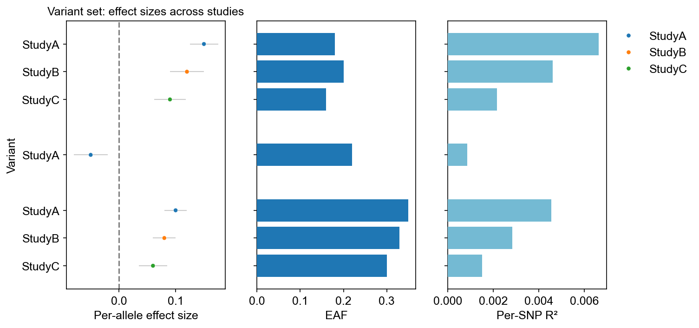
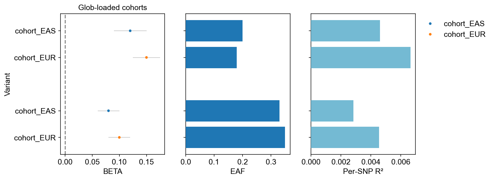

# Variant set plot

!!! example
    ```python
    import gwaslab as gl
    import pandas as pd
    ```

This tutorial shows how to compare **effect sizes for a fixed set of variants** across multiple GWAS studies using `gl.SumstatsSet` and `plot_effect()`. For the full parameter reference, see [Variant Set Plot](VariantSetPlot.md).

!!! note "In development"
    `SumstatsSet` and `plot_effect()` are under active development. The development notebook lives at `examples/_development/variant_set/visualization_variant_set.ipynb`.

## Basic variant set plot

Load two or more `Sumstats` objects, pass a list of variant IDs to `SumstatsSet`, then call `plot_effect()` to draw a forest-style panel grouped by variant.

!!! example
    ```python
    rows_a = [
        {"CHR": 1, "POS": 100, "EA": "A", "NEA": "G", "BETA": 0.10, "SE": 0.02, "P": 1e-6, "EAF": 0.35, "SNPID": "1:100:A:G"},
        {"CHR": 2, "POS": 200, "EA": "C", "NEA": "T", "BETA": -0.05, "SE": 0.03, "P": 1e-4, "EAF": 0.22, "SNPID": "2:200:C:T"},
        {"CHR": 7, "POS": 500000, "EA": "G", "NEA": "A", "BETA": 0.15, "SE": 0.025, "P": 1e-8, "EAF": 0.18, "SNPID": "rs7890"},
    ]
    rows_b = [
        {"CHR": 1, "POS": 100, "EA": "A", "NEA": "G", "BETA": 0.08, "SE": 0.02, "P": 5e-8, "EAF": 0.33, "SNPID": "1:100:A:G"},
        {"CHR": 7, "POS": 500000, "EA": "G", "NEA": "A", "BETA": 0.12, "SE": 0.03, "P": 1e-6, "EAF": 0.20, "SNPID": "rs7890"},
    ]
    rows_c = [
        {"CHR": 1, "POS": 100, "EA": "A", "NEA": "G", "BETA": 0.06, "SE": 0.025, "P": 1e-4, "EAF": 0.30, "SNPID": "1:100:A:G"},
        {"CHR": 7, "POS": 500000, "EA": "G", "NEA": "A", "BETA": 0.09, "SE": 0.028, "P": 1e-5, "EAF": 0.16, "SNPID": "rs7890"},
    ]

    def make_sumstats(rows):
        return gl.Sumstats(
            sumstats=pd.DataFrame(rows),
            chrom="CHR", pos="POS", ea="EA", nea="NEA",
            snpid="SNPID", beta="BETA", se="SE", p="P", eaf="EAF",
            verbose=False,
        )

    studies = {"StudyA": make_sumstats(rows_a), "StudyB": make_sumstats(rows_b), "StudyC": make_sumstats(rows_c)}
    variant_set = [[1, 100], "2:200:C:T", "rs7890"]

    sset = gl.SumstatsSet(studies, variant_set=variant_set, verbose=False)
    sset.data[["STUDY", "SNPID", "BETA", "SE", "EAF"]]
    ```

!!! example
    ```python
    sset.plot_effect(
        y="STUDY",
        group=["CHR", "POS"],
        y_sort=["CHR", "POS", "STUDY"],
        hue="STUDY",
        gap=1,
        title="Variant set: effect sizes across studies",
        effect_label="Per-allele effect size",
        save="variant_set_basic.png",
        verbose=False,
    )
    ```



## Variant ID formats

`variant_set` accepts several identifier styles. Matching uses `SNPID` for strings and `CHR` + `POS` for coordinate pairs.

| Format | Example | Matches by |
|--------|---------|------------|
| rsID | `"rs7890"` | Exact `SNPID` |
| CHR + POS | `[1, 100]` | `CHR` and `POS` |
| Variant ID string | `"1:100:A:G"` | Parsed `CHR` and `POS` |

!!! example
    ```python
    variant_set = ["rs7890", [1, 100], "2:200:C:T"]
    sset = gl.SumstatsSet(studies, variant_set=variant_set, verbose=False)
    ```

## Load studies from a glob pattern

When many cohort files share the same column layout, pass a glob pattern instead of a dictionary. Study names are derived from filenames (e.g. `cohort_EUR.txt` → `cohort_EUR`).

!!! example
    ```python
    sset = gl.SumstatsSet(
        "./data/cohort_*.txt",
        variant_set=["rs7890", [1, 100]],
        fmt="auto",
        build="19",
        verbose=False,
    )
    sset.plot_effect(
        y="STUDY",
        group=["CHR", "POS"],
        y_sort=["CHR", "POS", "STUDY"],
        hue="STUDY",
        eaf_panel=True,
        save="variant_set_glob.png",
        verbose=False,
    )
    ```



## Side panels: EAF and SNPR2

When **EAF** or **SNPR2** columns are present, `plot_effect()` adds optional horizontal bar panels beside the main effect panel. Panels are skipped automatically if the column is missing.

| Panel | Column | Description |
|-------|--------|-------------|
| EAF | `EAF` | Effect-allele frequency |
| SNPR2 | `SNPR2` | Per-variant R² (see [Per-SNP R2 and F](PerSNPh2.md)) |

Disable a panel with `eaf_panel=False` or `snpvar_panel=False`.

## Related plots

| Function | Use case |
|----------|----------|
| [`compare_effect()`](EffectSize.md) | Scatter comparing **two** studies (auto lead extraction) |
| [`plot_forest()`](ForestPlot.md) | Meta-analysis forest plot with combined estimate |
| [`plot_lead_overlap()`](LeadOverlapPlot.md) | Venn/UpSet of lead locus overlap across studies |
